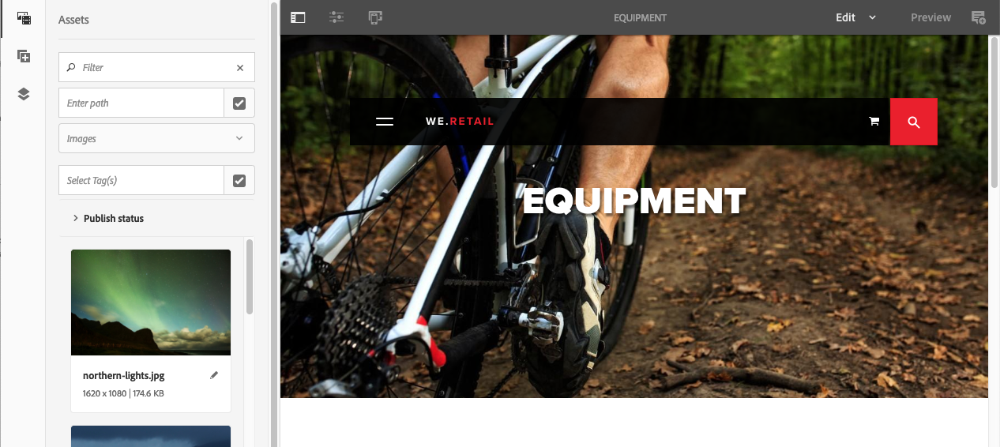

# Ambiente e strumenti di authoring{#authoring-the-environment-and-tools}

L’ambiente di authoring di AEM offre diversi metodi per organizzare e modificare i contenuti. Gli strumenti forniti sono accessibili dalle varie console ed editor di pagina.

## Gestione del sito {#managing-your-site}

La console **Sites** consente di navigare nel sito Web e di gestirlo utilizzando la barra dell’intestazione, la barra degli strumenti, le icone delle azioni (per la risorsa selezionata), le breadcrumb e, se selezionate, le barre laterali secondarie (ad esempio Timeline e Riferimenti).

Ad esempio, nella vista a colonne:

## Modifica del contenuto di una pagina {#editing-page-content}

Puoi modificare una pagina con l’editor di pagina. Esempio:

`https://localhost:4502/editor.html/content/we-retail/us/en/equipment.html`

>[!NOTE]
>
>La prima volta che apri una pagina per la modifica, una serie di diapositive illustra le funzioni disponibili.
>
>Puoi saltare questa presentazione introduttiva e richiamarla in qualsiasi momento dal menu **Informazioni pagina**.

## Accedere all’Aiuto {#accessing-help}

Durante la modifica di una pagina, l’**Aiuto** è accessibile dalle seguenti aree:

* il selettore [**Informazioni pagina**](/help/sites-authoring/editing-page-properties.md#page-properties), che mostrerà le diapositive introduttive (così come visualizzate al primo accesso all’editor);
* la finestra di dialogo di [configurazione](/help/sites-authoring/editing-content.md#edit-configure-copy-cut-delete-paste) per i componenti specifici (utilizzando l’icona ? nella barra degli strumenti della finestra di dialogo), che mostrerà le informazioni di aiuto specifiche per il contesto.

Ulteriori [risorse di aiuto sono disponibili dalle console](/help/sites-authoring/basic-handling.md#accessing-help).

## Browser Componenti   {#components-browser}

Il browser Componenti mostra tutti i componenti disponibili per la pagina corrente. Puoi trascinarli nella posizione desiderata, quindi modificarli per aggiungere i contenuti richiesti.

Il browser Componenti è una scheda che si trova nel pannello laterale, insieme al [browser Risorse](/help/sites-authoring/author-environment-tools.md#assets-browser) e alla [struttura dei contenuti](/help/sites-authoring/author-environment-tools.md#content-tree). Per aprire (o chiudere) il pannello laterale utilizza l’icona in alto a sinistra della barra degli strumenti:

All’apertura, il pannello laterale scivolerà in posizione da sinistra (se necessario seleziona la scheda **Componenti**). Quando la scheda è aperta, puoi passare ai componenti disponibili per la pagina.

L’aspetto effettivo e il comportamento dipendono dal tipo di dispositivo in uso:

>[!NOTE]
>
>Un dispositivo viene rilevato come mobile se la larghezza è inferiore a 1024 px. Ciò può applicarsi anche a una piccola finestra desktop.

* **Dispositivo mobile (ad es. iPad)**

   Il browser Componenti copre completamente la pagina in corso di modifica.

   Per aggiungere un componente alla pagina, tocca e tieni premuto il componente richiesto e spostalo verso destra: il browser Componenti si chiude e torna a essere visibile la pagina, dove potrai posizionare il componente.

   

* **Dispositivo desktop**

   Il browser Componenti si apre nella parte sinistra della finestra.

   Per aggiungere un componente alla pagina, fai clic sul componente richiesto e trascinalo nella posizione desiderata.

   

   I componenti sono rappresentati da

   * Nome componente
   * Gruppo di componenti (in grigio)
   * Icona o abbreviazione

      * Le icone dei componenti standard sono monocromatiche.
      * Le abbreviazioni sono sempre i primi due caratteri del nome del componente.

   Dalla barra degli strumenti nella parte superiore del browser **Componenti**, puoi effettuare le seguenti operazioni:

   * Filtrare i componenti per nome
   * Limitare la visualizzazione a uno specifico gruppo selezionandolo dall’elenco a discesa

   Per una descrizione più dettagliata del componente, tocca o fai clic sull’icona delle informazioni posta accanto al componente nel browser **Componenti** (se disponibile). Ad esempio, per **Contenitore di layout**:

   

   Per ulteriori informazioni sui componenti disponibili, consulta la sezione sulla [console Componenti](/help/sites-authoring/default-components-console.md).

## Browser Risorse {#assets-browser}

Il browser Risorse mostra tutte le [risorse](/help/assets/home.md) disponibili per la pagina corrente.

Il browser Risorse è una scheda che si trova nel pannello laterale, insieme al [browser Componenti](/help/sites-authoring/author-environment-tools.md#components-browser) e alla [struttura contenuto](/help/sites-authoring/author-environment-tools.md#content-tree). Per aprire o chiudere il pannello laterale utilizza l’icona in alto a sinistra della barra degli strumenti:

All’apertura, il pannello laterale scivolerà in posizione da sinistra. Se necessario seleziona la scheda **Risorse**.

Quando il browser Risorse è aperto, puoi sfogliare tutte le risorse disponibili per la pagina. Per espandere l’elenco, scorri in base alle necessità.

Per aggiungere una risorsa alla pagina, selezionala e trascinala nella posizione desiderata. Questa può essere:

* Un componente esistente del tipo appropriato.

   * Ad esempio, puoi trascinare una risorsa di tipo immagine su un componente Immagine.

* Un [segnaposto](/help/sites-authoring/editing-content.md#component-placeholder) nel sistema paragrafo per creare un nuovo componente di tipo appropriato.

   * Ad esempio, puoi trascinare una risorsa di tipo immagine nel sistema paragrafo per creare un componente Immagine.

>[!NOTE]
>
>Questo è disponibile per risorse e tipi di componenti specifici. Per ulteriori informazioni, consulta [Inserimento di un componente utilizzando il browser Risorse](/help/sites-authoring/editing-content.md#inserting-a-component-using-the-assets-browser).

Dalla barra degli strumenti nella parte superiore del browser Risorse è possibile filtrare le risorse in base ai seguenti criteri:

* Nome
* Percorso
* Tipo di risorsa, ad esempio immagini, manoscritti, documenti, video, pagine, paragrafi e prodotti
* Caratteristiche della risorsa, ad esempio Orientamento (Verticale, Orizzontale, Quadrato) e Stile (Colore, Monocromatico, Scala di grigio)

   * Disponibile solo per alcuni tipi di risorsa

L’aspetto effettivo e il comportamento dipendono dal tipo di dispositivo in uso:

>[!NOTE]
>
>Un dispositivo viene rilevato come mobile se la larghezza è inferiore a 1024 px (quindi anche una piccola finestra desktop).

* **Dispositivo mobile, ad esempio iPad**

   Il browser Risorse occupa completamente la pagina in corso di modifica.

   Per aggiungere una risorsa alla pagina, tocca e tieni premuto sulla risorsa richiesta e spostala verso destra: il browser Risorse si chiude e torna a essere visibile la pagina, dove potrai aggiungere la risorsa al componente richiesto.

   

* **Dispositivo desktop**

   Il browser Risorse si apre nella parte sinistra della finestra.

   Per aggiungere una risorsa alla pagina, fai clic sulla risorsa richiesta e trascinala sul componente o nella posizione desiderata.

   

Se devi apportare rapidamente una modifica a una risorsa, puoi avviare [l’editor risorse](/help/assets/manage-assets.md) direttamente dal browser Risorse facendo clic sull&#39;icona Modifica accanto al nome della risorsa.

## Struttura contenuto {#content-tree}

La scheda **Struttura contenuto** offre una panoramica di tutti i componenti nella pagina sotto forma di struttura gerarchica ad albero, che permette di vedere subito come è composta la pagina.

Struttura contenuto è una scheda che si trova nel pannello laterale, insieme ai browser Componenti e Risorse. Per aprire (o chiudere) il pannello laterale utilizza l’icona in alto a sinistra della barra degli strumenti:

Quando apri il pannello laterale, questo si apre scorrendo dal lato sinistro. Se necessario, seleziona la scheda **Struttura contenuto**. Una volta aperta è possibile visualizzare una struttura ad albero della pagina o del modello, che permette di capire come il contenuto è strutturato gerarchicamente. Inoltre, in una pagina complessa rende più facile passare tra i vari componenti della pagina.

Poiché una pagina può essere composta da numerosi componenti dello stesso tipo, la struttura del contenuto (componente) presenta un testo descrittivo (in grigio) dopo il nome del tipo di componente (in nero). Il testo descrittivo è composto dalle proprietà comuni del componente, come ad esempio il titolo o il testo.

I tipi di componente sono indicati nella lingua preferita dall&#39;utente, mentre il testo descrittivo del componente nella lingua della pagina.

Fai clic sulla freccia accanto a un componente per comprimere o espandere il livello.

>[!NOTE]
>
>La struttura del contenuto non è disponibile quando si modifica una pagina su un dispositivo mobile (se la larghezza del browser è inferiore a 1024 px).

Fai clic sul componente per evidenziarlo nell’editor di pagine. Le azioni disponibili dipendono dallo stato della pagina:

* Ad esempio, una pagina base:

   `https://localhost:4502/editor.html/content/we-retail/language-masters/en/equipment.html`

   

   Se il componente su cui fai clic nella struttura ad albero è modificabile, a destra del nome compare un’icona a forma di chiave inglese. Fai clic su questa icona per avviare direttamente la finestra di dialogo di modifica del componente.

   

* Oppure una pagina che fa parte di una [Live Copy](/help/sites-administering/msm.md), dove i componenti vengono ereditati da un’altra pagina, ad esempio:

   `https://localhost:4502/editor.html/content/we-retail/us/en/equipment.html`

   

## Frammenti - Browser Contenuto associato {#fragments-associated-content-browser}

Se la pagina contiene frammenti di contenuto, avrai accesso anche al [browser Contenuto associato](/help/sites-authoring/content-fragments.md#using-associated-content).

## Riferimenti {#references}

I **riferimenti** mostrano i collegamenti alla pagina selezionata:

* Blueprint
* Lanci
* Live Copy
* Copie per lingua
* Collegamenti in entrata
* Uso del componente di riferimento: contenuto prestato e preso in prestito
* Riferimenti alle pagine prodotto (dalla console Commerce - Prodotti)

Apri la console richiesta, quindi accedi alla risorsa desiderata e apri i **Riferimenti** utilizzando:

[Seleziona la risorsa richiesta](/help/sites-authoring/basic-handling.md#viewing-and-selecting-resources) per visualizzare un elenco dei tipi di riferimenti relativi a tale risorsa:

Seleziona il tipo di riferimento adeguato per ulteriori informazioni. In determinate situazioni sono disponibili azioni ulteriori quando viene selezionato un riferimento specifico, inclusi:

* **Collegamenti in entrata**: fornisce un elenco di pagine che fanno riferimento a una data pagina, insieme all’accesso diretto alla funzione di **Modifica** di una di queste pagine quando selezioni un collegamento specifico.

* Istanze di contenuto prestato o preso in prestito mediante il componente **Riferimento**: da qui puoi passare alla pagina di riferimento o a cui si fa riferimento.

* [Riferimenti alle pagine prodotto](/help/commerce/cif-classic/administering/generic.md#showing-product-references) (disponibili dalla console Commerce - Prodotti)
* [Lanci](/help/sites-authoring/launches.md): fornisce accesso ai lanci correlati.
* Live Copy visualizza i percorsi di tutte le Live Copy basate sulla risorsa selezionata.
* [Blueprint](/help/sites-administering/msm-best-practices.md), fornisce dettagli e varie azioni
* [Copie per lingua](/help/sites-administering/tc-manage.md#creating-translation-projects-using-the-references-panel): fornisce dettagli e varie azioni

Ad esempio, è possibile correggere un riferimento interrotto all’interno di un componente Riferimento:

## Eventi - Timeline {#events-timeline}

Per le risorse appropriate (ad esempio, pagine dalla console **Sites** o risorse dalla console **Risorse**) è possibile [utilizzare la timeline per visualizzare le attività recenti relative agli elementi selezionati](/help/sites-authoring/basic-handling.md#timeline).

Apri la console richiesta, quindi accedi alla risorsa desiderata e apri la **Timeline** utilizzando:

[Scegli la risorsa desiderata](/help/sites-authoring/basic-handling.md#viewing-and-selecting-resources), quindi seleziona **Mostra tutto** o **Attività** per ottenere un elenco delle azioni recenti relative alle risorse selezionate:

## Informazioni sulle pagine {#page-information}

Informazioni pagina (icona equalizzatore) mostra un menu che fornisce anche dettagli sull’ultima operazione di modifica e di pubblicazione. A seconda delle caratteristiche della pagina, del sito e delle istanze, potrebbero essere disponibili più o meno opzioni:

* [Apri proprietà](/help/sites-authoring/editing-page-properties.md)
* [Rollout pagina](/help/sites-administering/msm.md#msm-from-the-ui)
* [Avvia flusso di lavoro](/help/sites-authoring/workflows-applying.md#starting-a-workflow-from-the-page-editor)
* [Blocca pagina](/help/sites-authoring/editing-content.md#locking-a-page)
* [Pubblica pagina](/help/sites-authoring/publishing-pages.md#main-pars-title-10)
* [Annulla pubblicazione pagina](/help/sites-authoring/publishing-pages.md#main-pars-title-5)
* [Modifica modello](/help/sites-authoring/templates.md): se la pagina è basata su un [modello modificabile](/help/sites-authoring/templates.md#editable-and-static-templates)

* [Visualizza come pubblicato](/help/sites-authoring/editing-content.md#view-as-published)
* [Visualizza in Amministrazione](/help/sites-authoring/basic-handling.md#viewing-and-selecting-resources)
* [Aiuto](/help/sites-authoring/basic-handling.md#accessing-help)

Ad esempio, quando appropriato, da **Informazioni pagina** possono essere disponibili le funzioni seguenti:

* [Promuovi lancio](/help/sites-authoring/launches-promoting.md) se la pagina è un lancio.
* [Apri in ](/help/sites-authoring/select-ui.md#switching-to-classic-ui-when-editing-a-page) interfaccia classica se questa opzione è stata  [abilitata da un amministratore](/help/sites-administering/enable-classic-ui-editor.md)

Inoltre, da **Informazioni pagina** è possibile accedere ad analisi e consigli.

## Modalità pagina    {#page-modes}

Quando si modifica una pagina sono disponibili varie modalità che consentono di configurare diverse azioni:

* [Modifica](/help/sites-authoring/editing-content.md): modalità da utilizzare per modificare il contenuto della pagina.
* [Layout](/help/sites-authoring/responsive-layout.md): consente di creare e modificare il layout dinamico a seconda del dispositivo (se la pagina si basa su un contenitore di layout).

* [Scaffolding](/help/sites-authoring/scaffolding.md): consente di creare un insieme costituito da più pagine con la stessa struttura e contenuti diversi.
* [Sviluppatore](/help/sites-developing/developer-mode.md): consente di eseguire varie azioni (sono richiesti privilegi specifici), compresa l’analisi dei dettagli tecnici di una pagina e dei suoi componenti.

* [Progettazione](/help/sites-authoring/default-components-designmode.md): consente di abilitare o disabilitare i componenti da usare su una pagina e di configurare la struttura del componente (nel caso di una pagina basata su un [modello statico](/help/sites-authoring/templates.md#editable-and-static-templates)).

* [Impostazione destinazione](/help/sites-authoring/content-targeting-touch.md): consente di incrementare la rilevanza dei contenuti tramite il targeting e la misurazione su tutti i canali.
* [Mappa attività](/help/sites-authoring/page-analytics-using.md#analyticsvisiblefromthepageeditor): mostra i dati Analisi per la pagina.

* [Timewarp](/help/sites-authoring/working-with-page-versions.md#timewarp): consente di visualizzare lo stato delle pagine in un particolare momento.
* [Stato Live Copy](/help/sites-authoring/editing-content.md#live-copy-status): consente di visualizzare una panoramica rapida dello stato della live copy e dei componenti ereditati e non.
* [Anteprima](/help/sites-authoring/editing-content.md#previewing-pages): utilizzato per visualizzare l’aspetto che la pagina avrà nell’ambiente di pubblicazione o per spostarsi utilizzando i collegamenti presenti nel contenuto.

* [Annota](/help/sites-authoring/annotations.md): utilizzato per aggiungere o visualizzare annotazioni nella pagina.

Puoi accedere a questi elementi mediante l’icona nell’angolo in alto a destra, il cui aspetto dipende dalla modalità attualmente in uso:

>[!NOTE]
>
>* A seconda delle caratteristiche della pagina, alcune modalità possono non essere disponibili.
>* L’accesso ad alcune modalità richiede autorizzazioni o privilegi adeguati.
>* La modalità Sviluppatore non è disponibile su dispositivi mobili a causa di limitazioni di spazio.
>* La [scelta rapida da tastiera](/help/sites-authoring/page-authoring-keyboard-shortcuts.md) `Ctrl-Shift-M` consente di passare da **Anteprima** alla modalità attualmente selezionata (ad esempio **Modifica**, **Layout** e così via) e viceversa.

>

## Selezione del percorso {#path-selection}

Spesso per l’authoring è necessario selezionare un’altra risorsa, ad esempio quando si definisce un collegamento a un’altra pagina o risorsa o si seleziona un’immagine. Per selezionare facilmente un percorso, i [campi percorso](/help/sites-authoring/author-environment-tools.md#path-fields) offrono una funzione di auto-completamento e il [browser Percorsi](/help/sites-authoring/author-environment-tools.md#path-browser) consente una selezione più affidabile.

### Campi percorso    {#path-fields}

L’esempio utilizzato qui mostra il Componente immagine. Per ulteriori informazioni sull’utilizzo e la modifica dei componenti consulta [Componenti per l’authoring di pagine](/help/sites-authoring/default-components.md).

I campi percorso dispongono della funzione di completamento automatico e di look-ahead per rendere più facile individuare una risorsa.

Fai clic sul pulsante **Apri finestra di dialogo per selezione** nel campo percorso per aprire la finestra di dialogo del [browser Percorsi](/help/sites-authoring/author-environment-tools.md#path-browser) e utilizzare opzioni di selezione più dettagliate.

Oppure puoi iniziare a digitare nel campo percorso e AEM fornirà i percorsi corrispondenti mentre digiti.

### Browser Percorsi {#path-browser}

Il browser Percorsi è organizzato come la [vista a colonne](/help/sites-authoring/basic-handling.md#column-view) della console Sites e permette di selezionare le risorse in modo più dettagliato.

* Una volta che la risorsa è selezionata, il pulsante **Seleziona** in alto a destra nella finestra di dialogo diventa attivo. Tocca o fai clic su questo pulsante per confermare la selezione oppure su **Annulla** per annullare l’operazione.
* Se il contesto consente la selezione di più risorse, la scelta di una risorsa attiva anche il pulsante **Seleziona**, ma aggiunge anche un conteggio del numero di risorse selezionate nella parte superiore destra della finestra. Per deselezionare tutti gli elementi, fai clic sulla **X** accanto al numero.
* Quando navighi attraverso la struttura ad albero, la posizione viene riportata nelle breadcrumb nella parte superiore della finestra di dialogo. Le breadcrumb possono anche essere utilizzate per passare rapidamente alla gerarchia delle risorse.
* In qualsiasi momento puoi usare il campo di ricerca nella parte superiore della finestra di dialogo. Fai clic sulla **X** nel campo di ricerca per cancellare la ricerca.
* Per limitare l’ambito della ricerca, puoi visualizzare le opzioni filtro e filtrare il risultato in base a un determinato percorso.

   

## Scelte rapide da tastiera {#keyboard-shortcuts}

Sono disponibili alcune [scelte rapide da tastiera](/help/sites-authoring/page-authoring-keyboard-shortcuts.md).
