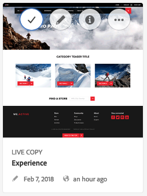
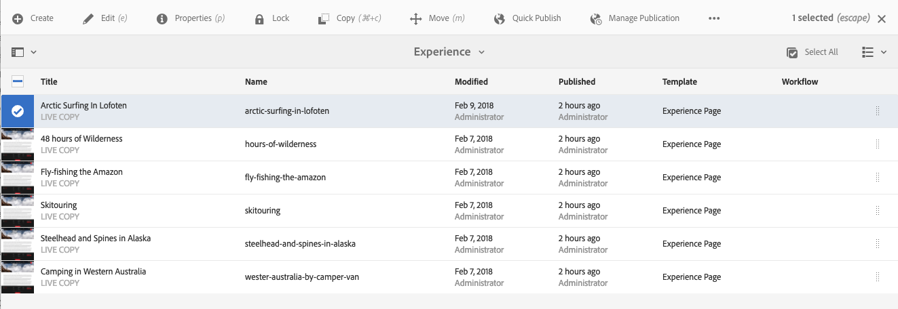

# Operazioni di base{#basic-handling}

>[!NOTE]
>
>* Questa pagina offre una panoramica delle operazioni di base nell’ambiente di authoring di AEM. Usa la console **Sites** come base.
>
>* Alcune funzionalità non sono disponibili in tutte le console e in alcune console potrebbero essere disponibili funzionalità aggiuntive. Informazioni specifiche sulle singole console e sulle relative funzionalità verranno trattate più dettagliatamente in altre pagine.
>* AEM supporta l’utilizzo di scelte rapide da tastiera in numerose aree, in particolare per l’[utilizzo delle console](/help/sites-authoring/keyboard-shortcuts.md) e la [modifica delle pagine](/help/sites-authoring/page-authoring-keyboard-shortcuts.md).
>

## Guida introduttiva {#getting-started}

### Interfaccia touch {#a-touch-enabled-ui}

AEM&#39;interfaccia utente è stata attivata per touch. Un’interfaccia touch consente di interagire con il software con azioni come toccare, tenere premuto e scorrere. Questa modalità di funzionamento è diversa da quella dell’interfaccia desktop tradizionale, con azioni del mouse quali clic, doppio clic, clic con il pulsante destro del mouse e passaggio del mouse.

Poiché l’interfaccia utente AEM è abilitata alle funzioni touch, puoi utilizzare i gesti touch sui dispositivi touch (ad esempio, dispositivi mobili o tablet) e le azioni del mouse su un dispositivo desktop tradizionale.

### Primi passi {#first-steps}

Immediatamente dopo aver effettuato l’accesso, si aprirà il pannello di [navigazione](#navigation-panel). Selezionando una delle opzioni si apre la rispettiva console.

>[!NOTE]
>
>Per illustrare l’utilizzo di base di AEM, in questo documento viene utilizzata la console **Sites.**
>
>Tocca o fai clic su **Sites** per iniziare.

### Navigazione nel prodotto  {#product-navigation}

Ogni volta che un utente accede per la prima volta a una console, viene avviata un’esercitazione sulla navigazione del prodotto. Dedica un minuto a fare clic o toccare con mano per ottenere una buona panoramica della gestione di base dei AEM.

Tocca o fai clic su **Avanti** per passare alla pagina successiva della panoramica. Tocca o fai clic su **Chiudi** oppure tocca o fai clic all’esterno della finestra di dialogo della panoramica per chiuderla.

La panoramica viene riavviata la prossima volta che accedi a una console a meno che tu non visualizzi tutte le diapositive o selezioni l’opzione **Non mostrare più**.

## Navigazione globale {#global-navigation}

Per spostarvi tra le diverse console, usate il pannello di navigazione globale. Questa azione viene attivata come elenco a discesa a schermo intero quando tocca o fai clic sul collegamento Adobe Experience Manager in alto a sinistra sullo schermo.

Per chiudere il pannello di navigazione globale e tornare alla posizione precedente, tocca o fai clic su **Chiudi**.

>[!NOTE]
>
>Al primo accesso hai presentato la **Navigazione** pannello.

La navigazione globale presenta due pannelli, rappresentati da icone sul lato sinistro dello schermo:

* **[Navigazione](/help/sites-authoring/basic-handling.md#navigation-panel)**: rappresentata da una bussola 
* **[Strumenti](/help/sites-authoring/basic-handling.md#tools-panel)** - Rappresentato da un martello

Le opzioni disponibili in questi pannelli sono descritte di seguito.

### Pannello di navigazione  {#navigation-panel}

Il pannello Navigazione consente di accedere alle console AEM:

Il titolo della scheda del browser si aggiorna per riflettere la posizione in cui ci si sposta nelle console e nel contenuto.

Nel pannello di navigazione sono disponibili le console seguenti:

<table>
 <tbody>
  <tr>
   <td><strong>Console</strong></td>
   <td><strong>Scopo</strong></td>
  </tr>
  <tr>
   <td>Assets  </td>
   <td>Queste console consentono di importare e <a href="/help/assets/home.md">gestire le risorse digitali</a> come immagini, video, documenti e file audio. Queste risorse possono quindi essere utilizzate da qualsiasi sito web in esecuzione sulla stessa istanza AEM. </td>
  </tr>
  <tr>
   <td>Communities</td>
   <td>Questa console consente di creare e gestire <a href="/help/communities/sites-console.md">siti della community</a> per <a href="/help/communities/overview.md#engagement-community">coinvolgimento</a> e <a href="/help/communities/overview.md#enablement-community">abilitazione</a>.</td>
  </tr>
  <tr>
   <td>Commerce</td>
   <td>Questo consente di gestire prodotti, cataloghi di prodotti e ordini relativi al tuo <a href="/help/commerce/cif-classic/administering/ecommerce.md">Commerce</a> siti.</td>
  </tr>
  <tr>
   <td>Frammenti di esperienza</td>
   <td>Un <a href="/help/sites-authoring/experience-fragments.md">frammento esperienza</a> è un’esperienza autonoma che può essere riutilizzata su più canali e presentare varianti, senza dover copiare e incollare esperienze o parti di esperienze.</td>
  </tr>
  <tr>
   <td>Forms</td>
   <td>Questa console consente di creare, gestire ed elaborare le <a href="/help/forms/home.md">moduli e documenti</a>.</td>
  </tr>
  <tr>
   <td>Personalizzazione</td>
   <td>Questa console fornisce <a href="/help/sites-authoring/personalization.md">framework di strumenti per la creazione di contenuti mirati e la presentazione di esperienze personalizzate</a>.</td>
  </tr>
  <tr>
   <td>Progetti</td>
   <td>La <a href="/help/sites-authoring/touch-ui-managing-projects.md">La console Progetti consente di accedere direttamente ai progetti</a>. I progetti sono dashboard virtuali. Possono essere utilizzati per creare un team di persone con obiettivi comuni e consentire al team di accedere a risorse, flussi di lavoro e attività.   </td>
  </tr>
  <tr>
   <td>Screens</td>
   <td><a href="https://experienceleague.adobe.com/docs/experience-manager-screens/user-guide/authoring/setting-up-projects/creating-a-screens-project.html">Schermi</a> consente di gestire tutti gli schermi, di qualsiasi dimensione, rivolti ai clienti in qualsiasi luogo.</td>
  </tr>
  <tr>
   <td>Sites</td>
   <td>Le console Sites consentono di: <a href="/help/sites-authoring/page-authoring.md">creare, visualizzare e gestire siti web</a> in esecuzione sull'istanza AEM. Da queste console puoi creare, modificare, copiare, spostare ed eliminare pagine di siti web, avviare flussi di lavoro e pubblicare pagine.  </td>
  </tr>
 </tbody>
</table>

### Pannello Strumenti {#tools-panel}

Nel pannello Strumenti, ogni opzione nel pannello laterale contiene una serie di sottomenu. La [Console strumenti](/help/sites-administering/tools-consoles.md) Qui puoi accedere a diversi strumenti e console specializzati per la gestione di siti web, risorse digitali e altri aspetti dell’archivio dei contenuti.

## Intestazione {#the-header}

L’intestazione di è sempre presente nella parte superiore dello schermo. Anche se la maggior parte delle opzioni nell’intestazione rimangono invariate indipendentemente da dove ti trovi nel sistema, alcune sono specifiche per il contesto.

* [Navigazione globale](#navigatingconsolesandtools)

   Seleziona il collegamento **Adobe Experience Manager** per spostarti tra le diverse console.

   

* [Ricerca](/help/sites-authoring/search.md)

   

   È anche possibile utilizzare il [tasto di scelta rapida](/help/sites-authoring/keyboard-shortcuts.md) `/` (barra obliqua) per richiamare la ricerca da qualsiasi console.

* [Soluzioni](https://www.adobe.com/it/experience-cloud.html)

   

* [Aiuto](#accessinghelptouchoptimizedui)

   

* [Notifiche](/help/sites-authoring/inbox.md)

   

   Questa icona viene contrassegnata con il numero di notifiche incomplete attualmente assegnate.

   >[!NOTE]
   >
   >Le AEM predefinite vengono precaricate con attività amministrative assegnate al gruppo di utenti amministratore. Vedi [Casella in entrata - Attività amministrative pronte all’uso](/help/sites-authoring/inbox.md#out-of-the-box-administrative-tasks) per i dettagli.

* [Proprietà utente](/help/sites-authoring/user-properties.md)

   

* [Selettore della barra](/help/sites-authoring/basic-handling.md#rail-selector)

   

   Le opzioni visualizzate dipendono dalla console corrente. Ad esempio, in **Sites** potete selezionare solo il contenuto (opzione predefinita), la timeline, i riferimenti o il pannello laterale del filtro.

   

* Breadcrumb

   

   Situate al centro della barra, le breadcrumb mostrano sempre la descrizione dell’elemento attualmente selezionato e consentono di spostarsi all’interno di una console specifica. Nella console Sites puoi spostarti tra i vari livelli del sito web.

   Fai clic sul testo della breadcrumb per visualizzare un elenco a discesa con i livelli della gerarchia dell’elemento attualmente selezionato. Fai clic su una voce per passare a tale posizione.

   

* Selezione del periodo di tempo di Analytics

   

   Questa funzione è disponibile solo nella vista a elenco. Vedi [vista a elenco](#list-view) per ulteriori informazioni.

* Pulsante **Crea**

   

   Dopo che hai fatto clic, le opzioni visualizzate sono adatte alla console/al contesto.

* [Viste](/help/sites-authoring/basic-handling.md#viewingandselectingyourresourcescardlistcolumn)

   L’icona di visualizzazione si trova all’estrema destra della barra degli strumenti AEM. Come indica anche la vista corrente, cambia. Ad esempio, la visualizzazione predefinita **Vista a colonne** presenta questa icona:

   

   È possibile passare dalla vista a colonne, a schede e a elenco; nella vista a elenco vengono visualizzate anche le impostazioni di visualizzazione.

   

* Navigazione tramite tastiera

   Potete navigare in un sito web utilizzando solo la tastiera. In questo modo viene utilizzata la funzionalità standard del browser **SCHEDA** key (o **OPT+TAB**) per spostarti tra gli elementi della pagina che sono *focalizzabile*.

   Nella console di **Sites** è stata aggiunta l’opzione per **passare al contenuto principale**. Questo diventa visibile come *scheda* attraverso le opzioni di intestazione e velocizza la navigazione consentendo di saltare gli elementi standard nella barra degli strumenti (prodotto) e di passare direttamente al contenuto principale.

   

## Accedere all’Aiuto   {#accessing-help}

Sono disponibili diverse risorse di Aiuto:

* **Barra degli strumenti della console**

   A seconda della posizione, la **Aiuto** l’icona apre le risorse appropriate:

   

* **Navigazione**

   La prima volta che accedi al sistema, compare [una serie di diapositive introduttive su come navigare in AEM](/help/sites-authoring/basic-handling.md#product-navigation).

* **Editor pagina**

   La prima volta che modifichi una pagina, compare una serie di diapositive introduttive sull’editor di pagine.

   

   Esamina questa panoramica come faresti con la [panoramica di navigazione del prodotto](/help/sites-authoring/basic-handling.md#product-navigation) la prima volta che accedi a una console.

   Dal menu [**Informazioni sulle pagine** puoi selezionare **Aiuto**](/help/sites-authoring/author-environment-tools.md#accessing-help) per accedervi di nuovo in un secondo tempo.

* **Console Strumenti**

   Da **Strumenti** è inoltre possibile accedere alla console esterna **Risorse**:

   * **Documentazione**
Visualizzare la documentazione di Gestione esperienza web

   * **Riferimenti per sviluppatori**
Risorse per sviluppatori e download
   >[!NOTE]
   >
   >Puoi accedere in qualsiasi momento ai tasti di scelta rapida, semplicemente utilizzando il tasto di scelta rapida `?` (punto interrogativo) all’interno della console.
   >
   >Per una panoramica di tutte le scelte rapide da tastiera, consulta la seguente documentazione:
   >
   >    * [Scelte rapide da tastiera per la modifica delle pagine](/help/sites-authoring/page-authoring-keyboard-shortcuts.md)
   >    * [Scelte rapide da tastiera per le console](/help/sites-authoring/keyboard-shortcuts.md)

## Barra delle azioni  {#actions-toolbar}

Ogni volta che selezioni una risorsa (ad esempio una pagina o una risorsa), le icone indicano diverse azioni, con testo esplicativo nella barra degli strumenti. Queste azioni dipendono da:

* La console corrente.
* Il contesto attuale.
* Se sei o meno in modalità [Selezione](#navigatingandselectionmode).

L’azione disponibile nella barra degli strumenti varia per riflettere le azioni che puoi eseguire sugli oggetti specifici selezionati.

La modalità di [selezione di una risorsa](/help/sites-authoring/basic-handling.md#viewing-and-selecting-resources) dipende dalla vista.

A causa del poco spazio disponibile in alcune finestre, la barra può facilmente superare lo spazio a disposizione. In questo caso compaiono altre opzioni. Tocca o fai clic sui tre puntini (**...**) per aprire un selettore a discesa contenente tutte le azioni che non rientrano nella barra. Ad esempio, dopo la selezione di una pagina nella console **Sites**:

>[!NOTE]
>
>Le singole icone disponibili sono documentate in relazione alla console, alla funzione o allo scenario appropriato.

## Azioni rapide  {#quick-actions}

In [Vista a schede](#cardviewquickactions) alcune azioni sono disponibili come icone delle azioni rapide e nella barra degli strumenti. Le icone delle azioni rapide sono disponibili per un singolo elemento alla volta ed evitano di dover preselezionare le opzioni.

La azioni rapide sono visibili con un tocco prolungato (su dispositivo touch) sulla scheda di una risorsa. Le azioni rapide disponibili possono dipendere dalla console e dal contesto. Ad esempio, di seguito sono riportate le azioni rapide per una pagina nel **Sites** console:

## Visualizzazione e selezione delle risorse {#viewing-and-selecting-resources}

In tutte le viste la visualizzazione, la navigazione e la selezione funzionano allo stesso modo, ma con lievi variazioni a seconda della vista attiva.

Puoi visualizzare, navigare e selezionare (per ulteriori azioni) le risorse in una qualsiasi delle viste disponibili, selezionabili dall’icona in alto a destra:

* [Vista a colonne](#column-view)
* [Vista a schede](#card-view)

* [Vista a elenco ](#list-view)

>[!NOTE]
>
>Per impostazione predefinita, AEM Assets non visualizza le rappresentazioni originali delle risorse nell’interfaccia utente come miniature in nessuna delle visualizzazioni. Gli amministratori possono utilizzare le sovrapposizioni per configurare AEM Assets in modo da visualizzare come miniature le rappresentazioni originali.

### Selezionare le risorse  {#selecting-resources}

La selezione di una specifica risorsa dipende dalla combinazione della vista e del dispositivo utilizzati:

<table>
 <tbody>
  <tr>
   <td> </td>
   <td>Seleziona</td>
   <td>Deseleziona</td>
  </tr>
  <tr>
   <td>Vista a colonne  </td>
   <td>
    <ul>
     <li>Desktop:  Fai clic sulla miniatura</li>
     <li>Dispositivo mobile:  Tocca la miniatura</li>
    </ul> </td>
   <td>
    <ul>
     <li>Desktop:  Fai clic sulla miniatura</li>
     <li>Dispositivo mobile:  Tocca la miniatura</li>
    </ul> </td>
  </tr>
  <tr>
   <td>Vista a schede  </td>
   <td>
    <ul>
     <li>Desktop:  Passa il mouse, quindi utilizza l’azione rapida con il segno di spunta</li>
     <li>Dispositivo mobile:  Tocca e tieni premuto sulla scheda</li>
    </ul> </td>
   <td>
    <ul>
     <li>Desktop:  Fai clic sulla scheda</li>
     <li>Dispositivo mobile:  Toccate la scheda</li>
    </ul> </td>
  </tr>
  <tr>
   <td>Vista a elenco </td>
   <td>
    <ul>
     <li>Desktop:  Fai clic sulla miniatura</li>
     <li>Dispositivo mobile:  Tocca la miniatura</li>
    </ul> </td>
   <td>
    <ul>
     <li>Desktop:  Fai clic sulla miniatura</li>
     <li>Dispositivo mobile:  Tocca la miniatura</li>
    </ul> </td>
  </tr>
 </tbody>
</table>

#### Seleziona tutto {#select-all}

Per selezionare tutti gli elementi in qualsiasi visualizzazione, fai clic sul pulsante **Seleziona tutto** nell’angolo in alto a destra della console.

* In **Vista a schede** vengono selezionate tutte le schede.
* In **Vista a elenco** vengono selezionati tutti gli elementi dell’elenco.
* Nella **Vista a colonne**, vengono selezionati tutti gli elementi nella colonna più a sinistra.

#### Deselezionare tutti gli elementi {#deselecting-all}

In tutti i casi in cui selezioni elementi, il numero degli elementi selezionati viene visualizzato in alto a destra nella barra degli strumenti.

Per deselezionare tutti gli elementi e uscire dalla modalità di selezione, scegli una delle seguenti opzioni:

* tocca o fai clic su **X** accanto al conteggio,

* o utilizzando **fuggire**.

In tutte le viste, tutti gli elementi possono essere deselezionati toccando escape sulla tastiera se si utilizza un dispositivo desktop.

#### Esempio di selezione {#selecting-example}

1. Ad esempio, nella vista a schede:

   

1. Dopo la selezione di una risorsa, l’intestazione superiore è coperta dalla [barra delle azioni](#actionstoolbar), che permette di accedere alle azioni applicabili alla risorsa selezionata.

   Per uscire dalla modalità di selezione, seleziona la **X** in alto a destra oppure premi **Esc**.

### Vista a colonne {#column-view}

La vista a colonne consente di navigare visivamente in una struttura di contenuti attraverso una serie di colonne a cascata. Questa visualizzazione consente di visualizzare e scorrere la struttura ad albero del sito web.

Quando si seleziona una risorsa nella colonna più a sinistra, vengono visualizzate le risorse secondarie in una colonna a destra. Quando si seleziona una risorsa nella colonna di destra, vengono visualizzate le risorse secondarie in un’altra colonna a destra e così via.

* Per spostarti in alto o in basso nella struttura, tocca o fai clic sul nome della risorsa o sulla freccia a destra del nome della risorsa.

   * Il nome della risorsa e la freccia vengono evidenziati quando tocchi o fai clic su di essi.

   

   * Gli elementi figlio della risorsa su cui hai fatto clic o che hai toccato vengono visualizzati nella colonna a destra della risorsa su cui hai fatto clic o su cui hai effettuato un tocco.
   * Se tocchi o fai clic sul nome di una risorsa priva di elementi secondari, i relativi dettagli verranno visualizzati nella colonna finale.

* Tocca o fai clic sulla miniatura per selezionare la risorsa.

   * Quando questa opzione è selezionata, compare un segno di spunta sulla miniatura e il nome della risorsa viene evidenziato.
   * I dettagli della risorsa selezionata sono visualizzati nella colonna finale.
   * La barra degli strumenti delle azioni diventerà disponibile.

   

   Quando una pagina è selezionata nella vista a colonne, la pagina selezionata viene visualizzata nella colonna finale insieme ai seguenti dettagli:

   * Titolo pagina
   * Nome pagina (parte dell’URL della pagina)
   * Modello su cui si basa la pagina
   * Dettagli sulle modifiche
   * Lingua della pagina
   * Dettagli di pubblicazione

### Vista a schede {#card-view}

* Nella vista a schede sono visualizzate schede informative per ogni elemento al livello corrente. Queste forniscono informazioni quali:

   * Una rappresentazione visiva del contenuto della pagina.
   * Il titolo della pagina.
   * Date importanti (ad esempio ultima modifica, ultima pubblicazione).
   * Se la pagina è bloccata, nascosta o fa parte di una Live Copy.
   * Se appropriato, quando devi eseguire un’azione nell’ambito di un flusso di lavoro.

      * I marcatori che indicano le azioni necessarie possono essere correlati alle voci nel [Inbox](/help/sites-authoring/inbox.md).

* [Azioni rapide](#quick-actions) sono disponibili anche in questa visualizzazione, ad esempio per selezionare e per eseguire azioni comuni come la modifica.

   

* Per spostarti verso il basso nella struttura, tocca o fai clic sulle schede (facendo attenzione a evitare le azioni rapide); per tornare verso l’alto utilizza le [breadcrumb nell’intestazione](/help/sites-authoring/basic-handling.md#the-header).

### Vista a elenco  {#list-view}

* Nella vista a elenco sono elencate le informazioni di ogni risorsa al livello corrente.
* Per spostarti verso il basso nella struttura, tocca o fai clic sul nome delle risorse; per tornare verso l’alto utilizza le [breadcrumb nell’intestazione](/help/sites-authoring/basic-handling.md#the-header).

* Per selezionare tutti gli elementi nell’elenco, utilizza la casella di selezione in alto a sinistra nell’elenco.

   

   * Quando tutti gli elementi dell’elenco sono selezionati, questa casella di controllo viene selezionata.

      * Tocca o fai clic sulla casella di controllo per deselezionare tutti gli elementi.
   * Se sono selezionati solo alcuni elementi, viene visualizzato il segno meno (-).

      * Tocca o fai clic sulla casella di controllo per selezionare tutti gli elementi.
      * Tocca o fai di nuovo clic sulla casella di controllo per deselezionare tutti gli elementi.

* Per seleziona le colonne da visualizzare utilizza l’opzione **Impostazioni vista** sotto il pulsante Viste. Per la visualizzazione sono disponibili le colonne seguenti:

   * **Nome** - Nome pagina, utile in un ambiente di authoring multilingue poiché fa parte dell’URL della pagina e non viene modificato indipendentemente dalla lingua
   * **Modificato** - Data dell’ultima modifica e data dell’utente
   * **Pubblicato** - Stato della pubblicazione
   * **Modello**: modello su cui si basa la pagina
   * **Flusso di lavoro** - Flusso di lavoro attualmente applicato alla pagina. Ulteriori informazioni sono disponibili quando passi sopra con il mouse o apri la Timeline.

   * **Analisi delle pagine**
   * **Visitatori unici**
   * **Tempo sulla pagina**

   

   Per impostazione predefinita, la colonna **Nome** è visualizzata e costituisce una porzione dell’URL della pagina. In alcuni casi, l’autore potrebbe avere bisogno di accedere a pagine in una lingua diversa e vedere il nome della pagina (che in genere non cambia) può essere di grande aiuto se l’autore non conosce la lingua della pagina.

* Cambia l’ordine degli elementi utilizzando la barra verticale punteggiata all’estrema destra di ciascun elemento dell’elenco.

   >[!NOTE]
   >
   >La modifica dell’ordine funziona solo all’interno di una cartella ordinata il cui valore `jcr:primaryType` è impostato su `sling:OrderedFolder`.

   

   Tocca o fai clic sulla barra di selezione verticale e trascina l’elemento in una nuova posizione nell’elenco.

   

* Puoi visualizzare i dati di Analytics visualizzando le colonne appropriate utilizzando **Visualizza impostazioni** finestra di dialogo.

   Puoi filtrare i dati di Analytics per gli ultimi 30, 90 o 365 giorni utilizzando le opzioni filtro sul lato destro dell’intestazione.

   

## Selettore della barra {#rail-selector}

Il **selettore della barra** è disponibile in alto a sinistra nella finestra e visualizza opzioni che dipendono dalle console correnti.

Ad esempio, in Sites puoi selezionare solo il contenuto (opzione predefinita), la struttura del contenuto, la timeline, i riferimenti o il pannello laterale del filtro.

Se selezioni solo il contenuto, appare solo l’icona della barra. Quando selezioni qualsiasi altra opzione, il nome è visualizzato accanto all’icona della barra.

>[!NOTE]
>
>Sono disponibili [scelte rapide da tastiera](/help/sites-authoring/keyboard-shortcuts.md) per passare rapidamente da un’opzione all’altra della barra.

### Struttura contenuto {#content-tree}

La struttura del contenuto può essere utilizzata per navigare rapidamente nella gerarchia del sito all’interno del pannello laterale e visualizzare molte informazioni sulle pagine presenti nella cartella corrente.

Utilizzando il pannello laterale della struttura del contenuto insieme a una vista a elenco o a schede, gli utenti possono vedere facilmente la struttura gerarchica del progetto e navigare facilmente nella struttura del contenuto tramite il pannello laterale della struttura del contenuto, nonché visualizzare informazioni dettagliate sulla pagina nella vista a elenco.

>[!NOTE]
>
>Una volta selezionata una voce nella visualizzazione gerarchica, è possibile utilizzare i tasti freccia per navigare rapidamente nella gerarchia.
>
>Fai riferimento a [scelte rapide da tastiera](/help/sites-authoring/keyboard-shortcuts.md) per ulteriori informazioni.

### Timeline  {#timeline}

La timeline può essere utilizzata per visualizzare e/o avviare gli eventi della risorsa selezionata. Per aprire la colonna della timeline, utilizza il selettore della barra a sinistra:

La colonna della timeline consente di effettuare le seguenti operazioni:

* [Visualizzare vari eventi relativi all’elemento selezionato.](#timelineviewevents)

   * I tipi di evento possono essere selezionati dall’elenco a discesa:

      * [Commenti](#timelineaddingandviewingcomments)
      * Annotazioni
      * Attività
      * [Lanci](/help/sites-authoring/launches.md)
      * [Versioni](/help/sites-authoring/working-with-page-versions.md)
      * [Flussi di lavoro](/help/sites-authoring/workflows-applying.md)

         * ad eccezione [flussi di lavoro transitori](/help/sites-developing/workflows.md#transient-workflows) poiché per queste informazioni non vengono salvate informazioni sulla cronologia
      * e Mostra tutto

* [Aggiungere o visualizzare commenti sulla voce selezionata. ](#timelineaddingandviewingcomments) La casella **Commento** è visualizzata in fondo all’elenco degli eventi. Per registrare un commento, digitalo e premi Invio. Il commento verrà visualizzato quando selezioni **Commenti** o **Mostra tutto**.

* Alcune console offrono funzionalità aggiuntive. Ad esempio, nella console Sites è possibile:

   * [Salvare una versione](/help/sites-authoring/working-with-page-versions.md#creatinganewversiontouchoptimizedui).
   * [Avviare un flusso di lavoro](/help/sites-authoring/workflows-applying.md#startingaworkflowfromtherail).

Queste opzioni sono accessibili tramite la freccia accanto al campo **Commento**.

### Riferimenti {#references}

**I riferimenti mostrano eventuali collegamenti alla risorsa selezionata.** Ad esempio, nella **Sites** console [riferimenti](/help/sites-authoring/author-environment-tools.md#showingpagereferences) per le pagine viene visualizzato:

* [Lanci](/help/sites-authoring/launches.md#launches-in-references-sites-console)
* [Live Copy](/help/sites-administering/msm-livecopy-overview.md#openingthelivecopyoverviewfromreferences)
* [Copie per lingua](/help/sites-administering/tc-prep.md#seeing-the-status-of-language-roots)
* Riferimenti ai contenuti:

   * collegamenti da altre pagine alla pagina selezionata
   * contenuto preso in prestito da e/o prestato alla pagina selezionata dal componente Riferimento

### Filtro {#filter}

Verrà aperto un pannello simile alla [Ricerca](/help/sites-authoring/search.md) con i filtri di posizione già impostati, che consentono di filtrare ulteriormente il contenuto da visualizzare.

