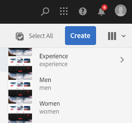
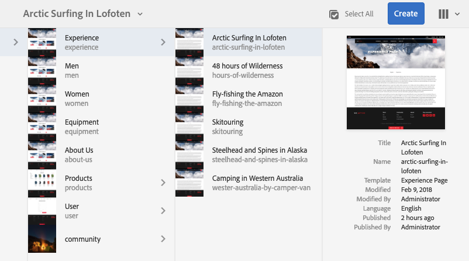

# Operazioni di base{#basic-handling}

>[!NOTE]
>
>* Questa pagina offre una panoramica delle operazioni di base nell’ambiente di authoring di Adobe Experience Manager (AEM). Usa la console **Sites** come base.
>
>* Alcune funzionalità non sono disponibili in tutte le console e in alcune console potrebbero essere disponibili funzionalità aggiuntive. Informazioni specifiche sulle singole console e sulle relative funzionalità sono descritte più dettagliatamente in altre pagine.
>* AEM supporta l’utilizzo di scelte rapide da tastiera in numerose aree, in particolare per l’[utilizzo delle console](/help/sites-authoring/keyboard-shortcuts.md) e la [modifica delle pagine](/help/sites-authoring/page-authoring-keyboard-shortcuts.md).
>

## Guida introduttiva {#getting-started}

### Interfaccia touch {#a-touch-enabled-ui}

L’interfaccia utente AEM è stata abilitata per il tocco. L&#39;interfaccia touch consente di interagire con il software tramite gesti quali toccare, tenere premuto e scorrere. Questo è in contrasto con il funzionamento di un&#39;interfaccia desktop tradizionale con azioni del mouse come clic, doppio clic, clic con il pulsante destro del mouse e passaggio del mouse.

Poiché l’interfaccia utente dell’AEM è dotata di funzionalità touch, puoi utilizzare i gesti touch sui dispositivi touch (ad esempio, dispositivi mobili o tablet) e le azioni del mouse su un dispositivo desktop tradizionale.

### Primi passi {#first-steps}

Immediatamente dopo aver effettuato l’accesso, si aprirà il pannello di [navigazione](#navigation-panel). Selezionando una delle opzioni, si apre la rispettiva console.

>[!NOTE]
>
>Per illustrare l’utilizzo di base di AEM, in questo documento viene utilizzata la console **Sites.**
>
>Per iniziare, tocca o fai clic su **Sites**.

### Navigazione nel prodotto  {#product-navigation}

Ogni volta che un utente accede per la prima volta a una console, viene avviato un tutorial relativo alla navigazione nel prodotto. Tocca o fai clic su per ottenere una buona panoramica delle operazioni di base dell’AEM.

Tocca o fai clic su **Avanti** per passare alla pagina successiva della panoramica. Tocca o fai clic su **Chiudi** oppure tocca o fai clic all’esterno della finestra di dialogo della panoramica per chiuderla.

La panoramica viene riavviata al successivo accesso a una console, a meno che non vengano visualizzate tutte le diapositive o non venga selezionata l’opzione **Non mostrare più**.

## Navigazione globale {#global-navigation}

Puoi spostarti tra le diverse console utilizzando il pannello di navigazione globale. Questo è attivato come elenco a discesa a schermo intero quando tocchi o fai clic sul collegamento Adobe Experience Manager in alto a sinistra dello schermo.

Per chiudere il pannello di navigazione globale e tornare alla posizione precedente, tocca o fai clic su **Chiudi**.

>[!NOTE]
>
>Al primo accesso viene visualizzato il file **Navigazione** pannello

La navigazione globale presenta due pannelli, rappresentati da icone sul lato sinistro dello schermo:

* **[Navigazione](/help/sites-authoring/basic-handling.md#navigation-panel)**: rappresentata da una bussola 
* **[Strumenti](/help/sites-authoring/basic-handling.md#tools-panel)**: rappresentati da un martello

Le opzioni disponibili in questi pannelli sono descritte di seguito.

### Pannello di navigazione  {#navigation-panel}

Il pannello di navigazione consente di accedere alle console AEM:

Il titolo della scheda del browser si aggiorna per riflettere la posizione in cui ci si sposta nelle console e nel contenuto.

Nel pannello di navigazione sono disponibili le console seguenti:

<table>
 <tbody>
  <tr>
   <td><strong>Console</strong></td>
   <td><strong>Scopo</strong></td>
  </tr>
  <tr>
   <td>Assets  </td>
   <td>Queste console consentono di importare e <a href="/help/assets/home.md">gestire le risorse digitali</a> ad esempio immagini, video, documenti e file audio. Queste risorse possono quindi essere utilizzate da qualsiasi sito web in esecuzione sulla stessa istanza AEM. </td>
  </tr>
  <tr>
   <td>Communities</td>
   <td>Questa console consente di creare e gestire <a href="/help/communities/sites-console.md">siti community</a> per <a href="/help/communities/overview.md#engagement-community">coinvolgimento</a> e <a href="/help/communities/overview.md#enablement-community">abilitazione</a>.</td>
  </tr>
  <tr>
   <td>Commerce</td>
   <td>Questo consente di gestire prodotti, cataloghi di prodotti e ordini relativi al <a href="/help/commerce/cif-classic/administering/ecommerce.md">Commerce</a> siti.</td>
  </tr>
  <tr>
   <td>Frammenti di esperienza</td>
   <td>Un <a href="/help/sites-authoring/experience-fragments.md">Frammento esperienza</a> è un’esperienza autonoma che può essere riutilizzata su tutti i canali, con varianti e senza dover copiare e incollare ripetutamente le esperienze o parti di esse.</td>
  </tr>
  <tr>
   <td>Forms</td>
   <td>Questa console consente di creare, gestire ed elaborare le <a href="/help/forms/home.md">moduli e documenti</a>.</td>
  </tr>
  <tr>
   <td>Personalizzazione</td>
   <td>Questa console fornisce <a href="/help/sites-authoring/personalization.md">framework di strumenti per la creazione di contenuti mirati e la presentazione di esperienze personalizzate</a>.</td>
  </tr>
  <tr>
   <td>Progetti</td>
   <td>Il <a href="/help/sites-authoring/touch-ui-managing-projects.md">La console Progetti consente di accedere direttamente ai progetti</a>. I progetti sono dashboard virtuali. Possono essere utilizzati per creare un team, quindi consentire a tale team di accedere a risorse, flussi di lavoro e attività, consentendo alle persone di lavorare su un obiettivo comune.   </td>
  </tr>
  <tr>
   <td>Screens</td>
   <td><a href="https://experienceleague.adobe.com/docs/experience-manager-screens/user-guide/authoring/setting-up-projects/creating-a-screens-project.html">Schermi</a> consente di gestire tutti gli schermi, di qualsiasi dimensione, che verranno visualizzati dai clienti ovunque si trovino.</td>
  </tr>
  <tr>
   <td>Sites</td>
   <td>Le console Sites consentono di: <a href="/help/sites-authoring/page-authoring.md">creare, visualizzare e gestire siti Web</a> in esecuzione sull’istanza AEM. Tramite queste console puoi creare, modificare, copiare, spostare ed eliminare pagine web, avviare flussi di lavoro e pubblicare pagine.  </td>
  </tr>
 </tbody>
</table>

### Pannello Strumenti {#tools-panel}

Nel pannello Strumenti, ogni opzione del pannello laterale contiene una serie di sottomenu. Il [Console Strumenti](/help/sites-administering/tools-consoles.md) qui puoi accedere a console e strumenti specifici per la gestione dei siti web, delle risorse digitali e di altri aspetti dell’archivio dei contenuti.

## Intestazione {#the-header}

L’intestazione di è sempre presente nella parte superiore dello schermo. Anche se la maggior parte delle opzioni presenti nell’intestazione rimangono invariate ovunque ti trovi nel sistema, alcune dipendono dal contesto.

* [Navigazione globale](#navigatingconsolesandtools)

  Seleziona la **Adobe Experience Manager** collegamento da cui spostarsi tra le diverse console.

  

* [Ricerca](/help/sites-authoring/search.md)

  

  È anche possibile utilizzare il [tasto di scelta rapida](/help/sites-authoring/keyboard-shortcuts.md) `/` (barra obliqua) per richiamare la ricerca da qualsiasi console.

* [Soluzioni](https://business.adobe.com/)

  

* [Aiuto](#accessinghelptouchoptimizedui)

  

* [Notifiche](/help/sites-authoring/inbox.md)

  

  Questa icona viene contrassegnata con il numero di notifiche incomplete attualmente assegnate.

  >[!NOTE]
  >
  >L’AEM preconfigurato viene precaricato con le attività amministrative assegnate al gruppo di utenti amministratori. Consulta [Casella in entrata - Attività amministrative predefinite](/help/sites-authoring/inbox.md#out-of-the-box-administrative-tasks) per i dettagli.

* [Proprietà utente](/help/sites-authoring/user-properties.md)

  

* [Selettore della barra](/help/sites-authoring/basic-handling.md#rail-selector)

  

  Le opzioni visualizzate dipendono dalla console corrente. Ad esempio, in **Sites** puoi selezionare solo il contenuto (opzione predefinita), la timeline, i riferimenti o il pannello laterale del filtro.

  

* Breadcrumb

  

  Viene visualizzato al centro della barra e mostra sempre la descrizione dell’elemento attualmente selezionato. Le breadcrumb consentono di spostarsi all’interno di una console specifica. Nella console Sites puoi spostarti tra i vari livelli del sito web.

  Facendo clic sul testo della breadcrumb viene aperto un elenco a discesa in cui sono elencati i livelli della gerarchia dell’elemento attualmente selezionato. Per passare a tale posizione, fare clic su una voce.

  

* Selezione del periodo di tempo di Analytics

  

  È disponibile solo nella vista a elenco. Per ulteriori informazioni, vedere [vista a elenco](#list-view).

* Pulsante **Crea**

  

  Dopo che hai fatto clic, le opzioni visualizzate sono adatte alla console/al contesto.

* [Viste](/help/sites-authoring/basic-handling.md#viewingandselectingyourresourcescardlistcolumn)

  L’icona di visualizzazione si trova all’estrema destra della barra degli strumenti di AEM. Inoltre, indica la vista corrente e ne consente la modifica. Ad esempio, la visualizzazione predefinita **Vista a colonne** presenta questa icona:

  

  Puoi passare dalla vista a colonne, alla vista a schede e alla vista a elenco. La vista a elenco mostra le impostazioni di visualizzazione.

  

* Navigazione tramite tastiera

  Potete navigare in un sito web utilizzando solo la tastiera. Questa utilizza la funzionalità standard del browser del **SCHEDA** chiave (o **OPZ+TAB**) per spostarti tra gli elementi della pagina che sono *focalizzabile*.

  In **Sites** nella console, è stata aggiunta l’opzione per  **Passa al contenuto principale**. Questo diventa visibile quando *scheda* tramite le opzioni di intestazione, e velocizza la navigazione consentendo di saltare gli elementi standard nella barra degli strumenti (prodotto) e di passare direttamente al contenuto principale.

  

## Accedere all’Aiuto   {#accessing-help}

Sono disponibili diverse risorse di Aiuto:

* **Barra degli strumenti della console**

  A seconda della posizione, il **Aiuto** apre le risorse appropriate:

  

* **Navigazione**

  La prima volta che accedi al sistema, [una serie di diapositive introduce la navigazione AEM](/help/sites-authoring/basic-handling.md#product-navigation).

* **Editor pagina**

  La prima volta che modifichi una pagina, compare una serie di diapositive introduttive sull’editor pagina.

  

  Esamina questa panoramica come faresti con la [panoramica di navigazione del prodotto](/help/sites-authoring/basic-handling.md#product-navigation) la prima volta che accedi a una console.

  Dalla sezione **Informazioni pagina** , è possibile selezionare [**Aiuto**](/help/sites-authoring/author-environment-tools.md#accessing-help) per visualizzarlo di nuovo in qualsiasi momento.

* **Console Strumenti**

  Dalla sezione **Strumenti** , è inoltre possibile accedere al **Risorse**:

   * **Documentazione**
Consulta la documentazione su Web Experience Management.

   * **Risorse per sviluppatori**
Risorse per sviluppatori e download

  >[!NOTE]
  >
  >Puoi accedere in qualsiasi momento ai tasti di scelta rapida, semplicemente utilizzando il tasto di scelta rapida `?` (punto interrogativo) all’interno della console.
  >
  >Per una panoramica di tutte le scelte rapide da tastiera, vedere:
  >
  >* [Scelte rapide da tastiera per la modifica delle pagine](/help/sites-authoring/page-authoring-keyboard-shortcuts.md)
  >* [Scelte rapide da tastiera per le console](/help/sites-authoring/keyboard-shortcuts.md)

## Barra delle azioni  {#actions-toolbar}

Ogni volta che viene selezionata una risorsa (ad esempio una pagina o una risorsa), le icone indicano diverse azioni, con testo descrittivo nella barra degli strumenti. Queste azioni dipendono da:

* La console corrente
* Il contesto attuale
* Se ti trovi in [modalità di selezione](#navigatingandselectionmode) o no

Le azioni disponibili nella barra degli strumenti cambiano per riflettere le azioni che puoi eseguire sugli elementi specifici selezionati.

La modalità di [selezione di una risorsa](/help/sites-authoring/basic-handling.md#viewing-and-selecting-resources) dipende dalla vista.

A causa del poco spazio disponibile in alcune finestre, la barra può facilmente superare lo spazio a disposizione. In questo caso, vengono visualizzate altre opzioni. Tocca o fai clic sui puntini di sospensione (i tre punti o **...**) apre un selettore a discesa contenente tutte le azioni rimanenti. Ad esempio, dopo la selezione di una pagina nella console **Sites**:

>[!NOTE]
>
>Le singole icone disponibili sono documentate in relazione alla console, alla funzione o allo scenario appropriato.

## Azioni rapide  {#quick-actions}

In entrata [Vista a schede](#cardviewquickactions), alcune azioni sono disponibili come icone di azione rapida e nella barra degli strumenti. Le icone delle azioni rapide sono disponibili per un singolo elemento alla volta ed evitano di dover preselezionare le opzioni.

Le azioni rapide sono visibili quando passi il mouse su una scheda delle risorse (dispositivo desktop). Le azioni rapide disponibili possono dipendere dalla console e dal contesto. Ad esempio, di seguito sono riportate le azioni rapide per una pagina nella console **Sites**:

## Visualizzazione e selezione delle risorse {#viewing-and-selecting-resources}

In tutte le viste la visualizzazione, la navigazione e la selezione funzionano allo stesso modo, ma con lievi variazioni a seconda della vista attiva.

Puoi visualizzare, navigare e selezionare (per ulteriori azioni) le risorse in una qualsiasi delle viste disponibili, selezionabili dall’icona in alto a destra:

* [Vista a colonne](#column-view)
* [Vista a schede](#card-view)

* [Vista a elenco ](#list-view)

>[!NOTE]
>
>Per impostazione predefinita, AEM Assets non visualizza le rappresentazioni originali delle risorse nell’interfaccia utente come miniature in nessuna delle viste. Se sei un amministratore, puoi utilizzare le sovrapposizioni per configurare AEM Assets in modo da visualizzare le rappresentazioni originali come miniature.

### Selezionare le risorse  {#selecting-resources}

La selezione di una risorsa specifica dipende dalla combinazione della vista e del dispositivo:

<table>
 <tbody>
  <tr>
   <td> </td>
   <td>Seleziona</td>
   <td>Deseleziona</td>
  </tr>
  <tr>
   <td>Vista a colonne  </td>
   <td>
    <ul>
     <li>Desktop:  Fai clic sulla miniatura</li>
     <li>Dispositivi mobili:  Tocca la miniatura</li>
    </ul> </td>
   <td>
    <ul>
     <li>Desktop:  Fai clic sulla miniatura</li>
     <li>Dispositivi mobili:  Tocca la miniatura</li>
    </ul> </td>
  </tr>
  <tr>
   <td>Vista a schede  </td>
   <td>
    <ul>
     <li>Desktop:  Passa il puntatore del mouse, quindi utilizza l’azione rapida con segno di spunta</li>
     <li>Dispositivi mobili:  Tocca e tieni premuto sulla scheda</li>
    </ul> </td>
   <td>
    <ul>
     <li>Desktop:  Fai clic sulla scheda</li>
     <li>Dispositivi mobili:  Tocca la scheda</li>
    </ul> </td>
  </tr>
  <tr>
   <td>Vista a elenco </td>
   <td>
    <ul>
     <li>Desktop:  Fai clic sulla miniatura</li>
     <li>Dispositivi mobili:  Tocca la miniatura</li>
    </ul> </td>
   <td>
    <ul>
     <li>Desktop:  Fai clic sulla miniatura</li>
     <li>Dispositivi mobili:  Tocca la miniatura</li>
    </ul> </td>
  </tr>
 </tbody>
</table>

#### Seleziona tutto {#select-all}

Per selezionare tutti gli elementi in qualsiasi vista, fai clic sull’opzione **Seleziona tutto** nell’angolo in alto a destra della console.

* In entrata **Vista a schede**, vengono selezionate tutte le schede.
* In entrata **Vista a elenco**, vengono selezionati tutti gli elementi dell’elenco.
* In entrata **Vista a colonne**, vengono selezionati tutti gli elementi nella colonna più a sinistra.

#### Deselezionare tutti gli elementi {#deselecting-all}

In tutti i casi in cui selezioni elementi, il numero degli elementi selezionati viene visualizzato in alto a destra nella barra degli strumenti.

Per deselezionare tutti gli elementi e uscire dalla modalità di selezione:

* tocca o fai clic sul pulsante **X** accanto al conteggio,

* o utilizzando **escape**.

In tutte le viste, tutti gli elementi possono essere deselezionati con il tasto Esc, se utilizzi un dispositivo desktop.

#### Esempio di selezione {#selecting-example}

1. Ad esempio, nella vista a schede:

   

1. Quando hai selezionato una risorsa, l’intestazione superiore è coperta dalla sezione [barra delle azioni](#actionstoolbar) consente di accedere alle azioni attualmente applicabili alla risorsa selezionata.

   Per uscire dalla modalità di selezione, selezionare **X** in alto a destra, oppure utilizza **escape**.

### Vista a colonne {#column-view}

La vista a colonne consente la navigazione visiva di una struttura di contenuti tramite una serie di colonne in cascata. Questa visualizzazione consente di visualizzare e scorrere la struttura ad albero del sito web.

Selezionando una risorsa nella colonna più a sinistra, le risorse figlie vengono visualizzate in una colonna a destra. Selezionando una risorsa nella colonna di destra, le risorse figlie vengono visualizzate in un’altra colonna a destra e così via.

* Per spostarti verso l’alto o il basso nella struttura, tocca o fai clic sul nome della risorsa o sulla freccia a destra del nome della risorsa.

   * Il nome e la freccia della risorsa vengono evidenziati quando tocca o fai clic su di essi.

     

   * Gli elementi secondari della risorsa che hai toccato o su cui hai fatto clic vengono visualizzati nella colonna a destra di tale risorsa.
   * Se tocchi o fai clic su un nome di risorsa senza elementi secondari, i relativi dettagli vengono visualizzati nella colonna finale.

* Toccando o facendo clic sulla miniatura viene selezionata la risorsa.

   * Se questa opzione è selezionata, sulla miniatura viene visualizzato un segno di spunta e viene evidenziato anche il nome della risorsa.
   * I dettagli della risorsa selezionata vengono visualizzati nella colonna finale.
   * La barra degli strumenti delle azioni diventa disponibile.

     

  Quando una pagina viene selezionata nella vista a colonne, la pagina selezionata viene visualizzata nella colonna finale insieme ai dettagli seguenti:

   * Titolo pagina
   * Nome pagina (parte dell’URL della pagina)
   * Modello su cui si basa la pagina
   * Dettagli di modifica
   * Lingua della pagina
   * Dettagli pubblicazione

### Vista a schede {#card-view}

* La vista a schede mostra le schede informative per ogni elemento al livello corrente, che forniscono informazioni quali:

   * Una rappresentazione visiva del contenuto della pagina.
   * Il titolo della pagina.
   * Date importanti (ad esempio ultima modifica, ultima pubblicazione).
   * La pagina è bloccata, nascosta o fa parte di una Live Copy.
   * Se appropriato, quando devi eseguire un’azione nell’ambito di un flusso di lavoro.

      * Alle voci della [Casella in entrata](/help/sites-authoring/inbox.md) possono essere correlati dei marcatori che indicano le azioni necessarie.

* In questa vista sono disponibili anche [azioni rapide](#quick-actions), per effettuare selezioni ed eseguire le operazioni più comuni, come la modifica.

  

* Per spostarti verso il basso nella struttura, tocca o fai clic sulle schede (facendo attenzione a evitare le azioni rapide); per tornare verso l’alto utilizza le [breadcrumb nell’intestazione](/help/sites-authoring/basic-handling.md#the-header).

### Vista a elenco  {#list-view}

* Nella vista a elenco sono elencate le informazioni di ogni risorsa al livello corrente.
* Per spostarti verso il basso nella struttura, tocca o fai clic sul nome della risorsa e sul backup utilizzando [breadcrumb nell’intestazione](/help/sites-authoring/basic-handling.md#the-header).

* Per selezionare tutti gli elementi nell’elenco, utilizza la casella di selezione in alto a sinistra nell’elenco.

  

   * Quando tutti gli elementi dell’elenco sono selezionati, viene selezionata la casella di controllo.

      * Per deselezionare tutto, tocca o fai clic sulla casella di controllo.

   * Se sono selezionati solo alcuni elementi, viene visualizzato un segno meno.

      * Per selezionare tutto, tocca o fai clic sulla casella di controllo.
      * Per deselezionare tutto, tocca o fai clic di nuovo sulla casella di controllo.

* Selezionare le colonne da visualizzare utilizzando **Impostazioni vista** sotto il pulsante Viste. È possibile visualizzare le colonne seguenti:

   * **Nome**: nome della pagina, utile in un ambiente di authoring multilingue poiché fa parte dell’URL della pagina e non viene modificato indipendentemente dalla lingua
   * **Modificato**: data dell’ultima modifica e dell’utente che l’ha eseguita
   * **Pubblicato**: stato della pubblicazione
   * **Modello**: modello su cui si basa la pagina
   * **Flusso di lavoro**: flusso di lavoro attualmente applicato alla pagina. Ulteriori informazioni sono disponibili quando passate il mouse o aprite la timeline.

   * **Dati analitici della pagina**
   * **Visitatori univoci**
   * **Tempo sulla pagina**

  

  Per impostazione predefinita, la colonna **Nome** è visualizzata e costituisce una porzione dell’URL della pagina. A volte l’autore deve accedere a pagine in una lingua diversa. Visualizzare il nome della pagina (che di solito è immutabile) può essere di grande aiuto se l’autore non conosce la lingua della pagina.

* Cambia l’ordine degli elementi utilizzando la barra verticale punteggiata all’estrema destra di ciascun elemento dell’elenco.

  >[!NOTE]
  >
  >La modifica dell’ordine funziona solo all’interno di una cartella ordinata il cui valore `jcr:primaryType` è impostato su `sling:OrderedFolder`.

  

  Tocca o fai clic sulla barra di selezione verticale e trascina l’elemento in una nuova posizione nell’elenco.

  

* Puoi visualizzare i dati di Analytics visualizzando le colonne appropriate utilizzando **Impostazioni vista** .

  Puoi filtrare i dati di Analytics per gli ultimi 30, 90 o 365 giorni utilizzando le opzioni di filtro sul lato destro dell’intestazione.

  

## Selettore della barra {#rail-selector}

Il **selettore della barra** è disponibile in alto a sinistra nella finestra e visualizza opzioni che dipendono dalle console correnti.

Ad esempio, in Sites puoi selezionare solo il contenuto (opzione predefinita), la struttura del contenuto, la timeline, i riferimenti o il pannello laterale del filtro.

Se selezioni solo il contenuto, appare solo l’icona della barra. Quando selezioni qualsiasi altra opzione, il nome è visualizzato accanto all’icona della barra.

>[!NOTE]
>
>Sono disponibili [scelte rapide da tastiera](/help/sites-authoring/keyboard-shortcuts.md) per passare rapidamente da un’opzione all’altra della barra.

### Struttura contenuto {#content-tree}

La struttura del contenuto può essere utilizzata per spostarsi rapidamente nella gerarchia del sito all’interno del pannello laterale e visualizzare molte informazioni sulle pagine nella cartella corrente.

Utilizzando il pannello laterale della struttura del contenuto con una vista a elenco o a schede, gli utenti possono vedere facilmente la struttura gerarchica del progetto. Possono navigare facilmente nella struttura del contenuto con il pannello laterale della struttura del contenuto e visualizzare informazioni di pagina dettagliate nella vista a elenco.

>[!NOTE]
>
>Una volta selezionata una voce nella visualizzazione gerarchica, puoi spostarti rapidamente nella gerarchia attraverso i tasti freccia.
>
>Consulta la sezione [scelte rapide da tastiera](/help/sites-authoring/keyboard-shortcuts.md) per ulteriori informazioni.

### Timeline {#timeline}

Con la timeline puoi visualizzare e/o attivare gli eventi della risorsa selezionata. Per aprire la colonna della timeline, utilizza il selettore della barra:

La colonna della timeline consente di:

* [Visualizzare vari eventi relativi all’elemento selezionato.](#timelineviewevents)

   * I tipi di evento possono essere selezionati dall’elenco a discesa:

      * [Commenti](#timelineaddingandviewingcomments)
      * Annotazioni
      * Attività
      * [Lanci](/help/sites-authoring/launches.md)
      * [Versioni](/help/sites-authoring/working-with-page-versions.md)
      * [Flussi di lavoro](/help/sites-authoring/workflows-applying.md)

         * eccetto per [flussi di lavoro transitori](/help/sites-developing/workflows.md#transient-workflows) perché non vengono salvate informazioni sulla cronologia per questi elementi

      * e Mostra tutto

* [Aggiungere o visualizzare commenti sulla voce selezionata. ](#timelineaddingandviewingcomments) La casella **Commento** è visualizzata in fondo all’elenco degli eventi. Se digiti un commento e premi Invio, il commento verrà registrato. Per visualizzarlo, basta selezionare **Commenti** o **Mostra tutti**.

* Alcune console offrono funzionalità aggiuntive. Ad esempio, nella console Sites puoi effettuare le seguenti operazioni:

   * [Salvare una versione](/help/sites-authoring/working-with-page-versions.md#creatinganewversiontouchoptimizedui).
   * [Avviare un flusso di lavoro](/help/sites-authoring/workflows-applying.md#startingaworkflowfromtherail).

Queste opzioni sono accessibili tramite la freccia accanto al **Commento** campo.

### Riferimenti {#references}

**Riferimenti** mostra eventuali connessioni alla risorsa selezionata. Ad esempio, nella console **Sites**, i [riferimenti](/help/sites-authoring/author-environment-tools.md#showingpagereferences) per le pagine mostrano:

* [Lanci](/help/sites-authoring/launches.md#launches-in-references-sites-console)
* [Live Copy](/help/sites-administering/msm-livecopy-overview.md#openingthelivecopyoverviewfromreferences)
* [Copie per lingua](/help/sites-administering/tc-prep.md#seeing-the-status-of-language-roots)
* Riferimenti ai contenuti:

   * collegamenti da altre pagine alla pagina selezionata
   * contenuto preso in prestito da, o prestato, o entrambi, alla pagina selezionata dal componente Riferimento

### Filtro {#filter}

Questo apre un pannello simile a [ricerca](/help/sites-authoring/search.md), con i filtri di posizione appropriati impostati, che consentono di filtrare ulteriormente il contenuto da visualizzare.

