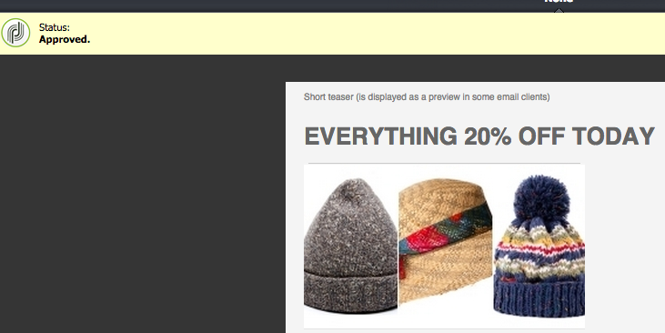
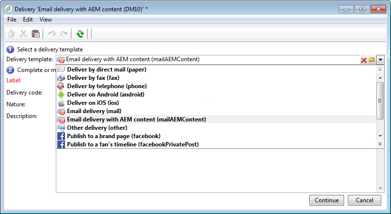

# Utilizzo di Adobe Campaign Classic e Adobe Campaign Standard{#working-with-adobe-campaign-classic-and-adobe-campaign-standard}

È possibile creare contenuti e-mail in AEM ed elaborarli nelle e-mail di Adobe Campaign. Per fare questo, devi effettuare le seguenti operazioni:

1. Crea una nuova newsletter in AEM da un modello specifico per Adobe Campaign.
1. Seleziona [un servizio Adobe Campaign](#selecting-the-adobe-campaign-cloud-service-and-template) prima di modificare il contenuto per accedere a tutte le funzionalità.
1. Modifica il contenuto.
1. Convalida il contenuto.

Puoi quindi sincronizzare i contenuti con una consegna in Adobe Campaign. Le istruzioni dettagliate sono descritte in questo documento.

Vedi anche [Creazione di moduli per Adobe Campaign in AEM](/help/sites-authoring/adobe-campaign-forms.md).

>[!NOTE]
>
>Prima di poter utilizzare questa funzionalità, devi configurare AEM per l’integrazione con [Adobe Campaign](/help/sites-administering/campaignonpremise.md) o [Adobe Campaign Standard](/help/sites-administering/campaignstandard.md).

## Invio di contenuti e-mail tramite Adobe Campaign {#sending-email-content-via-adobe-campaign}

Dopo aver configurato AEM e Adobe Campaign, puoi creare contenuti per l’invio di e-mail direttamente in AEM e quindi elaborarli in Adobe Campaign.

Quando crei contenuto Adobe Campaign in AEM, devi effettuare il collegamento a un servizio Adobe Campaign prima di modificare il contenuto per accedere a tutte le funzionalità.

Esistono due casi possibili:

* Puoi sincronizzare il contenuto con una consegna da Adobe Campaign. In questo modo puoi utilizzare i contenuti AEM in una consegna.
* (Solo Adobe Campaign Classic) Il contenuto può essere inviato direttamente ad Adobe Campaign, che genera in automatico una nuova e-mail di consegna. Questa modalità presenta alcune limitazioni.

Le istruzioni dettagliate sono descritte in questo documento.

### Creazione di nuovi contenuti e-mail {#creating-new-email-content}

>[!NOTE]
>
>Quando aggiungi modelli e-mail, assicurati di aggiungerli in **/content/campagne** per renderli disponibili.

#### Creazione di nuovi contenuti e-mail {#creating-new-email-content-1}

1. In AEM seleziona **Sites** then **Campagne**, quindi individua il punto in cui vengono gestite le campagne e-mail. Nell’esempio seguente, il percorso è **Sites** > **Campagne** > **Geometrixx Outdoors** > **Campagne e-mail**.

   >[!NOTE]
   >
   >[I modelli e-mail sono disponibili solo in Geometrixx](/help/sites-developing/we-retail.md). Scarica il contenuto di Geometrixx di esempio da Condivisione pacchetti.

   

1. Seleziona **Crea** poi **Crea pagina**.
1. Seleziona uno dei modelli disponibili specifico per la versione di Adobe Campaign a cui ti connetti, poi fai clic su **Avanti**. Per impostazione predefinita, sono disponibili tre modelli:

   * **E-mail Adobe Campaign Classic**: consente di aggiungere contenuti a un modello predefinito (due colonne) prima di inviarlo ad Adobe Campaign Classic per la consegna.
   * **E-mail Adobe Campaign Standard**: consente di aggiungere contenuti a un modello predefinito (due colonne) prima di inviarlo ad Adobe Campaign Standard per la consegna.

1. Compila il **Titolo** e facoltativamente **Descrizione** e fai clic su **Crea**. Il titolo viene utilizzato come oggetto della newsletter/e-mail a meno che tu non lo sovrascriva quando modifichi l’e-mail.

### Selezione del servizio cloud e del modello di Adobe Campaign {#selecting-the-adobe-campaign-cloud-service-and-template}

Per l’integrazione con Adobe Campaign, è necessario aggiungere alla pagina un servizio cloud Adobe Campaign. In questo modo si ha accesso alla personalizzazione e ad altre informazioni Adobe Campaign.

Inoltre, potrebbe essere necessario selezionare il modello di Adobe Campaign, modificare l’oggetto e aggiungere contenuto in testo non formattato per gli utenti che non visualizzano l’e-mail in HTML.

Puoi selezionare il servizio cloud dalla scheda **Sites** o dall’interno dell’e-mail/newsletter dopo averlo creato.

L’approccio consigliato è quello di selezionare il servizio cloud dalla scheda **Sites**. La selezione del servizio cloud dall’e-mail/newsletter richiede una soluzione alternativa.

Dalla pagina **Sites**:

1. In AEM seleziona la pagina e-mail e fai clic su **Visualizza proprietà**.

   

1. Seleziona **Modifica** e poi **Servizi cloud** , scorri verso il basso e fai clic sul segno + per aggiungere una configurazione, quindi seleziona **Adobe Campaign**.

   

1. Seleziona dall’elenco a discesa la configurazione che corrisponde alla tua istanza di Adobe Campaign, quindi conferma facendo clic su **Salva**.
1. Puoi visualizzare il modello applicato all’e-mail facendo clic sulla scheda **Adobe Campaign**. Se desideri selezionare un altro modello, puoi accedervi dall’interno dell’e-mail durante la modifica.

   Se desideri applicare un modello di consegna e-mail specifico (da Adobe Campaign), diverso dal modello di posta predefinito, in **Proprietà**, seleziona **Adobe Campaign** scheda . Immetti il nome interno del modello di consegna e-mail nell’istanza relativa di Adobe Campaign.

   Il modello selezionato determina i campi di personalizzazione disponibili per Adobe Campaign.

   

Dall’interno della newsletter/e-mail in autoring, potrebbe non essere possibile selezionare la configurazione del servizio cloud di Adobe Campaign in **Proprietà pagina** a causa di un problema di layout. Puoi utilizzare la procedura descritta di seguito:

1. In AEM seleziona la pagina e-mail e fai clic su **Modifica**. Fai clic su **Apri proprietà**.

   

1. Seleziona **Servizi cloud** e fai clic su **+** per aggiungere una configurazione. Seleziona una configurazione visibile (non importa quale). Fai clic o tocca il segno **+** per aggiungere un’altra configurazione e poi selezione **Adobe Campaign**.

   >[!NOTE]
   >
   >In alternativa, puoi selezionare i servizi cloud scegliendo **Visualizza proprietà** nella scheda **Siti**.

1. Seleziona dall’elenco a discesa la configurazione che corrisponde alla tua istanza di Adobe Campaign, elimina la prima configurazione creata che non era per Adobe Campaign, quindi conferma facendo clic sul segno di spunta.
1. Continua con il passaggio 4 della procedura precedente per selezionare i modelli e aggiungere testo normale.

### Modifica del contenuto dei messaggi e-mail {#editing-email-content}

Per modificare il contenuto dei messaggi e-mail:

1. Apri il messaggio e-mail e per impostazione predefinita sarai in modalità Modifica.

   

1. Se desideri modificare l’oggetto dell’e-mail o aggiungere testo normale per gli utenti che non visualizzano l’e-mail in HTML, seleziona **E-mail** e aggiungere un oggetto e un testo. Seleziona l’icona della pagina per generare automaticamente una versione di testo normale dall’HTML. Al termine, fai clic sul segno di spunta.

   Puoi personalizzare la newsletter utilizzando i campi di personalizzazione di Adobe Campaign. Per aggiungere un campo di personalizzazione, apri il selettore del campo di personalizzazione facendo clic sul pulsante del logo di Adobe Campaign. Puoi quindi scegliere tra tutti i campi disponibili per questa newsletter.

   >[!NOTE]
   >
   >Se i campi di personalizzazione delle proprietà all’interno dell’editor sono inattivi, rivedi la configurazione.

   

1. Apri il pannello dei componenti sul lato sinistro dello schermo e seleziona **Newsletter Adobe Campaign** dal menu a discesa per trovare tali componenti.

   

1. Trascina i componenti direttamente sulla pagina e modificali di conseguenza. Ad esempio, puoi trascinare un componente **Testo e personalizzazione (Campaign)** e aggiungere testo personalizzato.

   

   Vedi [Componenti di Adobe Campaign](/help/sites-authoring/adobe-campaign-components.md) per una descrizione dettagliata di ciascun componente.

   

### Inserimento di personalizzazioni {#inserting-personalization}

Quando modifichi i contenuti, puoi inserire:

* Campi di contesto di Adobe Campaign. Si tratta di campi che puoi inserire all’interno del testo e che si adattano in base ai dati del destinatario (ad esempio nome, cognome o qualsiasi dato della dimensione di destinazione).
* Blocchi di personalizzazione per Adobe Campaign. Si tratta di blocchi di contenuto predefinito non correlati ai dati del destinatario, ad esempio un logo del marchio, o collegati a una pagina speculare.

Per una descrizione dettagliata di ciascun componente, vedi [Componenti di Adobe Campaign](/help/sites-authoring/adobe-campaign-components.md).

>[!NOTE]
>
>* Vengono presi in considerazione solo i campi della dimensione di destinazione dei **Profili** di Adobe Campaign.
>* Quando visualizzi Proprietà da **Sites**, non puoi accedere ai campi di contesto di Adobe Campaign. È possibile accedere a tali informazioni direttamente dall’e-mail durante la modifica.

Per inserire la personalizzazione:

1. Inserisci un nuovo **Newsletter** > **Testo e personalizzazione (Campaign)** trascinandolo sulla pagina.

   

1. Apri il componente facendo clic sull’icona Matita. Si apre l’editor interno.

   

   >[!NOTE]
   >
   >**Per Adobe Campaign Standard:**
   >
   >* I campi di contesto disponibili corrispondono alla dimensione di targeting dei **Profili** in Adobe Campaign.
   >* Vedi [Collegamento di una pagina AEM a un’e-mail di Adobe Campaign](#linking-an-aem-page-to-an-adobe-campaign-email-adobe-campaign-standard).

   >
   >**Per Adobe Campaign Classic:**
   >
   >* I campi di contesto disponibili vengono recuperati dinamicamente da Adobe Campaign **nms:seedMember** schema. I dati di estensione del target vengono recuperati dinamicamente dal flusso di lavoro che contiene la consegna sincronizzata con il contenuto. (Vedi [Sincronizzazione del contenuto creato in AEM con una consegna da Adobe Campaign](#synchronizing-content-created-in-aem-with-a-delivery-from-adobe-campaign-classic) sezione).
   >
   >* Per aggiungere o nascondere elementi di personalizzazione, consulta [Gestione di campi e blocchi di personalizzazione](/help/sites-administering/campaignonpremise.md#managing-personalization-fields-and-blocks).
   >* **Importante**: tutti i campi della tabella seed devono trovarsi anche nella tabella dei destinatari (o nella corrispondente tabella dei contatti).

1. Inserisci il testo digitandolo. Inserisci campi di contesto o i blocchi di personalizzazione facendo clic sui componenti di Adobe Campaign e selezionandoli. Al termine, seleziona il segno di spunta.

   

   Dopo aver inserito campi di contesto o blocchi di personalizzazione, puoi visualizzare in anteprima la newsletter e testare i campi. Vedi [Anteprima di una newsletter](#previewing-a-newsletter).

### Anteprima di una newsletter {#previewing-a-newsletter}

Puoi visualizzare in anteprima l’aspetto della newsletter e la personalizzazione.

1. Con la newsletter aperta, fai clic su **Anteprima** nell’angolo in alto a destra di AEM. AEM mostra l’aspetto della newsletter quando gli utenti la ricevono.

   

   >[!NOTE]
   >
   >Se utilizzi Adobe Campaign Standard e il modello di esempio, due blocchi di personalizzazione che visualizzano il contenuto iniziale, **“&lt;%@ include view=&quot;MirrorPage&quot; %>”** e **“&lt;%@ include view=&quot;UnsubscriptionLink&quot; %>”**, produrranno errori al momento dell’importazione del contenuto durante la consegna. Puoi regolarli selezionando i blocchi corrispondenti mediante il selettore di blocchi di personalizzazione.

1. Per visualizzare in anteprima la personalizzazione, apri ContextHub, facendo clic o toccando l’icona corrispondente nella barra degli strumenti. I tag del campo di personalizzazione sono ora sostituiti dai dati seed della persona selezionata. Vedi il modo in cui le variabili si adattano al cambio della persona in ContextHub.

   

1. Puoi visualizzare i dati seed provenienti da Adobe Campaign associati alla persona attualmente selezionata. A questo scopo, fai clic o tocca il modulo Adobe Campaign nella barra di ContextHub. Si apre una finestra di dialogo che mostra tutti i dati seed del profilo corrente. Anche in questo caso, i dati si adattano quando si passa a un’altra persona.

   

### Approvazione dei contenuti in AEM {#approving-content-in-aem}

Una volta completato il contenuto, è possibile avviare il processo di approvazione. Vai a **Flusso di lavoro** scheda della casella degli strumenti e seleziona la **Approva per Adobe Campaign** workflow.

Questo flusso di lavoro preconfigurato si articola in due fasi: revisione e approvazione, oppure revisione e rifiuto. Tuttavia, può essere esteso e adattato a un processo più complesso.

Per approvare il contenuto per Adobe Campaign, applica il flusso di lavoro selezionando **Flusso di lavoro** e selezionando **Approva per Adobe Campaign** e fai clic su **Avvia flusso di lavoro**. Segui i passaggi e approva il contenuto. È inoltre possibile rifiutare i contenuti selezionando **Rifiuta** anziché **Approva** nell’ultimo passaggio del flusso di lavoro.

Dopo l’approvazione del contenuto, questo viene visualizzato come approvato in Adobe Campaign. L’e-mail può quindi essere inviata.

In Adobe Campaign Standard:

In Adobe Campaign Classic:

>[!NOTE]
I contenuti non approvati possono essere sincronizzati con una consegna in Adobe Campaign, ma la consegna non può essere eseguita. Solo i contenuti approvati possono essere inviati tramite le consegne di Campaign.

## Collegamento di AEM con Adobe Campaign Standard e Adobe Campaign Classic {#linking-aem-with-adobe-campaign-standard-and-adobe-campaign-classic}

Il collegamento o la sincronizzazione di AEM con Adobe Campaign cambia a seconda che utilizzi Adobe Campaign Standard su abbonamento o Adobe Campaign Classic locale.

Per le istruzioni basate sulla soluzione Adobe Campaign, vedi le istruzioni seguenti:

* [Collegamento di una pagina AEM a un’e-mail di Adobe Campaign (Adobe Campaign Standard)](#linking-an-aem-page-to-an-adobe-campaign-email-adobe-campaign-standard)
* [Sincronizzazione dei contenuti creati in AEM con una consegna da Adobe Campaign Classic](#synchronizing-content-created-in-aem-with-a-delivery-from-adobe-campaign-classic)

### Collegamento di una pagina AEM a un’e-mail di Adobe Campaign (Adobe Campaign Standard) {#linking-an-aem-page-to-an-adobe-campaign-email-adobe-campaign-standard}

Adobe Campaign Standard consente di recuperare e collegare i contenuti creati in AEM con:

* Un messaggio e-mail.
* Un modello e-mail.

In questo modo è possibile consegnare il contenuto. Puoi verificare se una newsletter è collegata a un’unica consegna dal codice visualizzato sulla pagina.

>[!NOTE]
Se una newsletter è collegata a più consegne, viene visualizzato il numero di consegne collegate (ma non tutti gli ID).

Per collegare una pagina creata in AEM a un’e-mail da Adobe Campaign:

1. Creazione di un nuovo messaggio e-mail basato su un modello e-mail specifico per AEM. Fai riferimento a [Creazione di e-mail in Adobe Campaign Standard](https://helpx.adobe.com/it/campaign/standard/channels/using/creating-an-email.html) per ulteriori informazioni.

   

1. Apri il blocco **Contenuto** dalla dashboard di consegna.

   

1. Seleziona **Collegamento a un contenuto Adobe Experience Manager** nella barra degli strumenti per accedere all’elenco dei contenuti disponibili in AEM.

   >[!NOTE]
   Se la **Collegamento con un Adobe Experience Manager** l&#39;opzione non viene visualizzata nella barra delle azioni, verifica che il **Modalità di modifica del contenuto** è configurato correttamente in **Adobe Experience Manager** nelle proprietà e-mail.

   

1. Seleziona il contenuto che desideri usare nell’e-mail.

   Questo elenco specifica:

   * L’etichetta del contenuto in AEM.
   * Lo stato di approvazione del contenuto in AEM. Se il contenuto non è approvato, è possibile sincronizzarlo, ma dovrà essere approvato prima dell’invio della consegna. Tuttavia, puoi eseguire alcune operazioni, come l’invio di una prova o il test di anteprima.
   * Data dell’ultima modifica del contenuto.
   * Qualsiasi contenuto già collegato a una consegna.

   >[!NOTE]
   Per impostazione predefinita, il contenuto già sincronizzato con una consegna è nascosto. Tuttavia, puoi visualizzarlo e utilizzarlo. Ad esempio, se desideri usare il contenuto come modello per più consegne.

   Quando l’indirizzo e-mail è associato a un contenuto AEM, il contenuto non può essere modificato in Adobe Campaign.

1. Specifica gli altri parametri della tua e-mail dalla dashboard (pubblico, pianificazione dell’esecuzione).
1. Esegui la consegna e-mail. Durante l’analisi di consegna, viene recuperata la versione più aggiornata del contenuto AEM.

   >[!NOTE]
   Se il contenuto viene aggiornato in AEM mentre è collegato a un’e-mail, viene automaticamente aggiornato in Adobe Campaign durante l’analisi. La sincronizzazione può anche essere eseguita manualmente utilizzando **Aggiorna il contenuto di Adobe Experience Manager** dalla barra delle azioni del contenuto.
   Puoi annullare il collegamento tra un’e-mail e un contenuto AEM con **Elimina il collegamento con i contenuti di Adobe Experience Manager** dalla barra delle azioni del contenuto. Questo pulsante è disponibile solo se un contenuto è già collegato alla consegna. Per collegare un contenuto diverso a una consegna, è necessario eliminare il collegamento del contenuto corrente prima di poterne creare uno nuovo.
   Quando il collegamento viene eliminato, il contenuto locale viene mantenuto e diventa modificabile in Adobe Campaign. Se colleghi nuovamente il contenuto dopo la modifica, tutte le modifiche andranno perse.

### Sincronizzazione dei contenuti creati in AEM con una consegna da Adobe Campaign Classic {#synchronizing-content-created-in-aem-with-a-delivery-from-adobe-campaign-classic}

Adobe Campaign consente di recuperare e sincronizzare i contenuti creati in AEM con:

* Una consegna della campagna
* Un’attività di consegna in un flusso di lavoro della campagna
* Una consegna ricorrente
* Una consegna continua
* Una consegna in un centro messaggi
* Un modello di consegna

In AEM, se una newsletter è collegata a una singola consegna, il codice di consegna è visualizzato nella pagina.

>[!NOTE]
Se la newsletter è collegata a diverse consegne, viene visualizzato il numero di consegne collegate (ma non tutti gli ID).
[!NOTE]
La fase del Flusso di lavoro **Pubblica su Adobe Campaign** è deprecata in AEM 6.1. Questa fase faceva parte dell’integrazione di AEM 6.0 con Adobe Campaign e non è più necessaria.

Per sincronizzare i contenuti creati in AEM con una consegna da Adobe Campaign:

1. Crea una consegna o aggiungi un’attività di consegna a un flusso di lavoro della campagna selezionando **Email delivery con contenuto AEM (mailAEMContent)** modello di consegna.

   

1. Seleziona **Sincronizza** nella barra degli strumenti per accedere all’elenco dei contenuti disponibili in AEM.

   >[!NOTE]
   Se la **Sincronizza** l’opzione non viene visualizzata nella barra degli strumenti della consegna, verifica che la **Modalità di modifica del contenuto** è configurato correttamente in **AEM** selezionando **Proprietà** > **Avanzate**.

   

1. Seleziona il contenuto da sincronizzare con la consegna.

   Questo elenco specifica:

   * L’etichetta del contenuto in AEM.
   * Lo stato di approvazione del contenuto in AEM. Se il contenuto non è approvato, è possibile sincronizzarlo, ma dovrà essere approvato prima dell’invio della consegna. Tuttavia, puoi eseguire alcune operazioni come l’invio di un BAT o il test di anteprima.
   * Data dell’ultima modifica apportata al contenuto.
   * Qualsiasi contenuto già collegato a una consegna.

   >[!NOTE]
   Per impostazione predefinita, il contenuto già sincronizzato con una consegna è nascosto. Tuttavia, puoi visualizzarlo e utilizzarlo. Ad esempio, se desideri usare il contenuto come modello per più consegne.

   

1. Specifica gli altri parametri della consegna (pubblico ecc.)
1. Se necessario, avvia il processo di approvazione della consegna in Adobe Campaign. L’approvazione dei contenuti in AEM è necessaria in aggiunta alle approvazioni configurate in Adobe Campaign (budget, pubblico, ecc.). L’approvazione dei contenuti in Adobe Campaign è possibile solo se i contenuti sono già approvati in AEM.
1. Esegui la consegna. Durante l’analisi di consegna, viene recuperata la versione più aggiornata del contenuto di AEM.

   >[!NOTE]
   * Dopo la sincronizzazione tra consegna e contenuto, il contenuto della consegna in Adobe Campaign diventa di sola lettura. L’oggetto dell’e-mail e il relativo contenuto non possono più essere modificati.
   * Se il contenuto viene aggiornato in AEM mentre è collegato a una consegna in Adobe Campaign, viene aggiornato automaticamente durante l’analisi della consegna. La sincronizzazione può anche essere eseguita manualmente utilizzando il **Aggiorna subito il contenuto** pulsante .
   * È possibile annullare la sincronizzazione tra una consegna e AEM contenuto utilizzando **Desincronizza** pulsante . Questa funzione è disponibile solo se un contenuto è già sincronizzato con la consegna. Per sincronizzare un contenuto diverso con una consegna, devi annullare la sincronizzazione del contenuto corrente prima di essere in grado di stabilire una nuova connessione.
   * Disattivata la sincronizzazione, il contenuto locale viene mantenuto e diventa modificabile in Adobe Campaign. Se sincronizzi nuovamente il contenuto dopo la modifica, perderai le modifiche successive.
   * In caso di consegne ricorrenti e continue, la sincronizzazione con il contenuto AEM viene interrotta ogni volta che viene eseguita la consegna.

