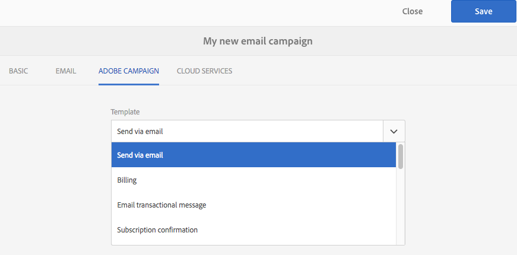

# Utilizzo di Adobe Campaign Classic e Adobe Campaign Standard{#working-with-adobe-campaign-classic-and-adobe-campaign-standard}

Puoi creare contenuti e-mail in AEM ed elaborarli nelle e-mail di Adobe Campaign. Per farlo, devi:

1. Crea una newsletter in AEM da un modello specifico di Adobe Campaign.
1. Seleziona [un servizio Adobe Campaign](#selecting-the-adobe-campaign-cloud-service-and-template) prima di modificare il contenuto per accedere a tutte le funzionalità.
1. Modifica il contenuto.
1. Convalida il contenuto.

Il contenuto può quindi essere sincronizzato con una consegna in Adobe Campaign. Istruzioni dettagliate sono descritte in questo documento.

Vedi anche [Creazione di Adobe Campaign Forms nell’AEM](/help/sites-authoring/adobe-campaign-forms.md).

>[!NOTE]
>
>Prima di poter utilizzare questa funzionalità, devi configurare AEM per l’integrazione con [Adobe Campaign](/help/sites-administering/campaignonpremise.md) o [Adobe Campaign Standard](/help/sites-administering/campaignstandard.md).

## Invio di contenuti e-mail tramite Adobe Campaign {#sending-email-content-via-adobe-campaign}

Dopo aver configurato AEM e Adobe Campaign, puoi creare i contenuti di consegna e-mail direttamente nell’AEM e quindi elaborarli in Adobe Campaign.

Quando crei contenuti Adobe Campaign nell’AEM, devi collegare un servizio Adobe Campaign prima di modificarli per accedere a tutte le funzionalità.

Esistono due casi possibili:

* Il contenuto può essere sincronizzato con una consegna da Adobe Campaign. Questo consente di utilizzare contenuti AEM in una consegna.
* (Solo per Adobe Campaign Classic) Il contenuto può essere inviato direttamente ad Adobe Campaign, che genera automaticamente una nuova consegna e-mail. Questa modalità presenta limitazioni.

Istruzioni dettagliate sono descritte in questo documento.

### Creazione di nuovi contenuti e-mail {#creating-new-email-content}

>[!NOTE]
>
>Quando aggiungi modelli e-mail, assicurati di aggiungerli in **/content/campaigns** per renderle disponibili.

#### Creazione di nuovi contenuti e-mail {#creating-new-email-content-1}

1. In AEM, seleziona **Sites** allora **Campagne**, quindi individua il punto in cui vengono gestite le campagne e-mail. Nell’esempio seguente, il percorso è **Sites** > **Campagne** > **Geometrixx Outdoors** > **Campagne e-mail**.

   >[!NOTE]
   >
   >[Gli esempi di e-mail sono disponibili solo in Geometrixx](/help/sites-developing/we-retail.md). Scarica il contenuto di esempio di un Geometrixx da Condivisione pacchetti.

   

1. Seleziona **Crea** allora **Crea pagina**.
1. Seleziona uno dei modelli disponibili specifici per la connessione a Adobe Campaign, quindi fai clic su **Successivo**. Per impostazione predefinita sono disponibili tre modelli:

   * **E-mail Adobe Campaign Classic**: consente di aggiungere contenuto a un modello predefinito (due colonne) prima di inviarlo a Adobe Campaign Classic per la consegna.
   * **E-mail Adobe Campaign Standard**: consente di aggiungere contenuto a un modello predefinito (due colonne) prima di inviarlo ad Adobe Campaign Standard per la consegna.

1. Compila il **Titolo** e facoltativamente **Descrizione** e fai clic su **Crea**. Il titolo viene utilizzato come oggetto della newsletter/e-mail a meno che non venga sovrascritto durante la modifica dell’e-mail.

### Selezione del servizio cloud Adobe Campaign e del modello {#selecting-the-adobe-campaign-cloud-service-and-template}

Per l’integrazione con Adobe Campaign, devi aggiungere alla pagina un servizio cloud Adobe Campaign. In questo modo puoi accedere alla personalizzazione e ad altre informazioni su Adobe Campaign.

Inoltre, potrebbe essere necessario selezionare il modello Adobe Campaign, modificare l’oggetto e aggiungere contenuto di testo normale per gli utenti che non visualizzeranno l’e-mail in HTML.

Puoi selezionare il servizio cloud dalla scheda **Sites** o dall’interno dell’e-mail/newsletter dopo averla creata.

Selezione del servizio cloud da **Sites** è l’approccio consigliato. La selezione del servizio cloud dall’e-mail/newsletter richiede una soluzione alternativa.

Dalla sezione **Sites** pagina:

1. In AEM seleziona la pagina e-mail e fai clic su **Visualizza proprietà**.

   

1. Seleziona **Modifica** e quindi il **Servizi cloud** , scorri verso il basso e fai clic sul segno + per aggiungere una configurazione, quindi seleziona **Adobe Campaign**.

   

1. Seleziona la configurazione che corrisponde alla tua istanza di Adobe Campaign dall’elenco a discesa, quindi conferma facendo clic su **Salva**.
1. Puoi visualizzare il modello applicato dall’e-mail facendo clic sul pulsante **Adobe Campaign** scheda. Se desideri selezionare un altro modello, puoi accedervi dall’interno dell’e-mail durante la modifica.

   Se desideri applicare un modello di consegna e-mail specifico (da Adobe Campaign), diverso dal modello e-mail predefinito, in **Proprietà**, seleziona la **Adobe Campaign** scheda. Immetti il nome interno del modello di consegna e-mail nell’istanza di Adobe Campaign correlata.

   Il modello selezionato determina i campi di personalizzazione disponibili da Adobe Campaign.

   

Nella newsletter/e-mail in authoring, potresti non essere in grado di selezionare la configurazione del servizio cloud Adobe Campaign in **Proprietà pagina** per un problema di layout. È possibile utilizzare la soluzione alternativa descritta di seguito:

1. In AEM seleziona la pagina e-mail e fai clic su **Modifica**. Clic **Apri proprietà**.

   

1. Seleziona **Servizi cloud** e fai clic su **+** per aggiungere una configurazione. Seleziona una configurazione visibile (non importa quale). Tocca o fai clic sul pulsante **+** accedi per aggiungere un&#39;altra configurazione, quindi seleziona **Adobe Campaign**.

   >[!NOTE]
   >
   >In alternativa, puoi selezionare i servizi cloud selezionando **Visualizza proprietà** nel **Sites** scheda.

1. Seleziona dall’elenco a discesa la configurazione che corrisponde all’istanza di Adobe Campaign in uso, elimina la prima configurazione creata che non era per Adobe Campaign, quindi conferma facendo clic sul segno di spunta.
1. Procedi con il passaggio 4 della procedura precedente per selezionare i modelli e aggiungere testo normale.

### Modifica del contenuto delle e-mail {#editing-email-content}

Per modificare il contenuto delle e-mail:

1. Apri l’e-mail e, per impostazione predefinita, entra in modalità Modifica.

   

1. Se desideri modificare l’oggetto dell’e-mail o aggiungere testo normale per gli utenti che non visualizzeranno l’e-mail in HTML, seleziona **E-mail** e aggiungi un oggetto e un testo. Seleziona l’icona della pagina per generare automaticamente una versione di testo normale da HTML. Al termine, fai clic sul segno di spunta.

   Puoi personalizzare la newsletter utilizzando i campi di personalizzazione di Adobe Campaign. Per aggiungere un campo di personalizzazione, apri il selettore dei campi di personalizzazione facendo clic sul pulsante con il logo Adobe Campaign. Potrai quindi scegliere tra tutti i campi disponibili per questa newsletter.

   >[!NOTE]
   >
   >Se i campi di personalizzazione nelle proprietà dall’interno dell’editor sono disattivati, riesamina la configurazione.

   

1. Apri il pannello dei componenti a sinistra dello schermo e seleziona **Newsletter Adobe Campaign** dal menu a discesa per trovare tali componenti.

   

1. Trascina i componenti direttamente nella pagina e modificali di conseguenza. Ad esempio, puoi trascinare una **Testo e personalizzazione (Campaign)** e aggiungere testo personalizzato.

   

   Consulta [Componenti di Adobe Campaign](/help/sites-authoring/adobe-campaign-components.md) per una descrizione dettagliata di ciascun componente.

   

### Inserimento della personalizzazione {#inserting-personalization}

Durante la modifica del contenuto, puoi inserire:

* Campi contestuali di Adobe Campaign. Si tratta di campi che puoi inserire all’interno del testo e che si adattano in base ai dati del destinatario (ad esempio, nome, cognome o qualsiasi dato della dimensione di destinazione).
* Blocchi di personalizzazione di Adobe Campaign. Si tratta di blocchi di contenuto predefinito non correlati ai dati del destinatario, ad esempio il logo di un brand o il collegamento a una pagina speculare.

Consulta [Componenti di Adobe Campaign](/help/sites-authoring/adobe-campaign-components.md) per una descrizione completa dei componenti di Campaign.

>[!NOTE]
>
>* Solo i campi di Adobe Campaign **Profili** viene presa in considerazione la dimensione di targeting.
>* Quando si visualizzano le proprietà da **Sites**, non hai accesso ai campi contestuali di Adobe Campaign. Puoi accedervi direttamente dall’e-mail durante la modifica.

Per inserire la personalizzazione:

1. Inserisci un nuovo **Newsletter** > **Testo e personalizzazione (Campaign)** trascinandolo sulla pagina.

   

1. Apri il componente facendo clic sull’icona della matita. Viene aperto l’editor locale.

   

   >[!NOTE]
   >
   >**Per Adobe Campaign Standard:**
   >
   >* I campi di contesto disponibili corrispondono ai **Profili** dimensione di targeting in Adobe Campaign.
   >* Consulta [Collegamento di una pagina AEM a un’e-mail di Adobe Campaign](#linking-an-aem-page-to-an-adobe-campaign-email-adobe-campaign-standard).
   >
   >**Per Adobe Campaign Classic:**
   >
   >* I campi di contesto disponibili vengono recuperati in modo dinamico da Adobe Campaign **nms:seedingMember** schema. I dati dell’estensione di Target vengono recuperati in modo dinamico dal flusso di lavoro che contiene la consegna sincronizzata con il contenuto. (consultare la [Sincronizzazione dei contenuti creati nell’AEM con una consegna da Adobe Campaign](#synchronizing-content-created-in-aem-with-a-delivery-from-adobe-campaign-classic) sezione ).
   >
   >* Per aggiungere o nascondere elementi di personalizzazione, consulta [Gestione di campi e blocchi di personalizzazione](/help/sites-administering/campaignonpremise.md#managing-personalization-fields-and-blocks).
   >* **Importante**: tutti i campi della tabella di seeding devono trovarsi anche nella tabella dei destinatari (o nella tabella dei contatti corrispondente).

1. Inserire il testo digitandolo. Per inserire campi di contesto o blocchi di personalizzazione, fai clic sui componenti di Adobe Campaign e selezionali. Al termine, seleziona il segno di spunta.

   

   Dopo aver inserito campi di contesto o blocchi di personalizzazione, puoi visualizzare in anteprima la newsletter e verificare i campi. Consulta [Anteprima di una newsletter](#previewing-a-newsletter).

### Anteprima di una newsletter {#previewing-a-newsletter}

Puoi visualizzare in anteprima come si presenterà la newsletter e la personalizzazione.

1. Con la newsletter aperta, fai clic su **Anteprima** nell’angolo superiore destro dell’AEM. AEM mostra l’aspetto della newsletter quando gli utenti la ricevono.

   

   >[!NOTE]
   >
   >Se utilizzi Adobe Campaign Standard e utilizzi il modello di esempio, due blocchi di personalizzazione visualizzano il contenuto iniziale: **&quot;&lt;%@ include view=&quot;MirrorPage&quot; %>&quot;** e **&quot;&lt;%@ include view=&quot;UnsubscriptionLink&quot; %>&quot;** : genera errori durante l’importazione del contenuto durante la consegna. Puoi regolarli selezionando i blocchi corrispondenti utilizzando il selettore dei blocchi di personalizzazione.

1. Per visualizzare in anteprima la personalizzazione, apri ContextHub facendo clic o toccando l’icona corrispondente nella barra degli strumenti. I tag dei campi di personalizzazione vengono ora sostituiti dai dati di seed dell’utente tipo selezionato. Scopri come le variabili si adattano quando si passa da un utente tipo a un altro in ContextHub.

   

1. Puoi visualizzare i dati di seed provenienti da Adobe Campaign e associati all’utente tipo attualmente selezionato. A questo scopo, tocca o fai clic sul modulo Adobe Campaign nella barra di ContextHub. Viene visualizzata una finestra di dialogo in cui vengono visualizzati tutti i dati di inizializzazione del profilo corrente. Anche in questo caso, i dati si adattano quando si passa a un utente tipo diverso.

   

### Approvazione di contenuti in AEM {#approving-content-in-aem}

Al termine del contenuto, puoi avviare il processo di approvazione. Vai a **Flusso di lavoro** della casella degli strumenti e selezionare **Approva per Adobe Campaign** flusso di lavoro.

Questo flusso di lavoro preconfigurato prevede due passaggi: revisione e quindi approvazione oppure revisione e infine rifiuto. Tuttavia, questo flusso di lavoro può essere esteso e adattato a un processo più complesso.

Per approvare il contenuto per Adobe Campaign, applica il flusso di lavoro selezionando **Flusso di lavoro** e selezione **Approva per Adobe Campaign** e fai clic su **Avvia flusso di lavoro**. Segui i passaggi e approva il contenuto. Puoi anche rifiutare il contenuto selezionando **Rifiuta** invece di **Approva** nell’ultimo passaggio del flusso di lavoro.

Dopo l’approvazione, il contenuto viene visualizzato come approvato in Adobe Campaign. L’e-mail può quindi essere inviata.

In Adobe Campaign Standard:

In Adobe Campaign Classic:

>[!NOTE]
>
Il contenuto non approvato può essere sincronizzato con una consegna in Adobe Campaign, ma la consegna non può essere eseguita. Solo i contenuti approvati possono essere inviati tramite le consegne di Campaign.

## Collegamento dell’AEM con Adobe Campaign Standard e Adobe Campaign Classic {#linking-aem-with-adobe-campaign-standard-and-adobe-campaign-classic}

Il modo in cui si collega o sincronizza l’AEM con Adobe Campaign dipende dal fatto che si utilizzi Adobe Campaign Standard basato su abbonamento o Adobe Campaign Classic basato su on-premise.

Per istruzioni basate sulla soluzione Adobe Campaign in uso, consulta le sezioni seguenti:

* [Collegamento di una pagina dell’AEM a un’e-mail di Adobe Campaign (Adobe Campaign Standard)](#linking-an-aem-page-to-an-adobe-campaign-email-adobe-campaign-standard)
* [Sincronizzazione dei contenuti creati nell’AEM con una consegna da Adobe Campaign Classic](#synchronizing-content-created-in-aem-with-a-delivery-from-adobe-campaign-classic)

### Collegamento di una pagina dell’AEM a un’e-mail di Adobe Campaign (Adobe Campaign Standard) {#linking-an-aem-page-to-an-adobe-campaign-email-adobe-campaign-standard}

Adobe Campaign Standard consente di recuperare e collegare i contenuti creati nell’AEM con:

* Un messaggio e-mail.
* Un modello e-mail.

In questo modo puoi distribuire i contenuti. Puoi vedere se una newsletter è collegata a una singola consegna dal codice visualizzato nella pagina.

>[!NOTE]
>
Se una newsletter è collegata a più consegne, indica il numero di consegne collegate (ma non ogni ID).

Per collegare una pagina creata in AEM con un messaggio e-mail di Adobe Campaign:

1. Crea un messaggio e-mail basato su un modello e-mail specifico per l’AEM. Fai riferimento a [Creazione di e-mail in Adobe Campaign Standard](https://helpx.adobe.com/campaign/standard/channels/using/creating-an-email.html) per ulteriori informazioni.

   

1. Apri **Contenuto** blocco dal dashboard di consegna.

   

1. Seleziona **Collegamento a un contenuto Adobe Experience Manager** nella barra degli strumenti per accedere all’elenco dei contenuti disponibili in AEM.

   >[!NOTE]
   >
   Se il **Collegamento con un Adobe Experience Manager** nella barra delle azioni, verificare che l&#39;opzione **Modalità di modifica dei contenuti** è configurato correttamente su **Adobe Experience Manager** nelle proprietà e-mail.

   

1. Seleziona il contenuto da utilizzare nell’e-mail.

   Questo elenco specifica:

   * Etichetta del contenuto nell’AEM.
   * Lo stato di approvazione del contenuto nell’AEM. Se il contenuto non è approvato, puoi sincronizzarlo ma dovrà essere approvato prima dell’invio della consegna. Tuttavia, puoi eseguire alcune operazioni, ad esempio l’invio di una bozza o il test di anteprima.
   * Data dell’ultima modifica del contenuto.
   * Eventuali contenuti già collegati a una consegna.

   >[!NOTE]
   >
   Per impostazione predefinita, il contenuto già sincronizzato con una consegna è nascosto. Tuttavia, puoi visualizzarlo e utilizzarlo. Ad esempio, se desideri utilizzare il contenuto come modello per diverse consegne.

   Quando l’e-mail è collegata a un contenuto AEM, il contenuto non può essere modificato in Adobe Campaign.

1. Specifica gli altri parametri del messaggio e-mail dal dashboard (pubblico, pianificazione dell’esecuzione).
1. Esegui la consegna e-mail. Durante l’analisi della consegna viene recuperata la versione più aggiornata del contenuto dell’AEM.

   >[!NOTE]
   >
   Se il contenuto viene aggiornato in AEM mentre è collegato a un’e-mail, viene automaticamente aggiornato in Adobe Campaign durante l’analisi. La sincronizzazione può anche essere eseguita manualmente utilizzando **Aggiorna contenuto Adobe Experience Manager** dalla barra delle azioni contenuto.
   >
   Puoi annullare il collegamento tra un’e-mail e il contenuto dell’AEM utilizzando **Eliminare il collegamento con il contenuto di Adobe Experience Manager** dalla barra delle azioni contenuto. Questo pulsante è disponibile solo se un contenuto è già collegato alla consegna. Per collegare un contenuto diverso a una consegna, è necessario eliminare il collegamento del contenuto corrente prima di poter stabilire un nuovo collegamento.
   >
   Quando il collegamento viene eliminato, il contenuto locale viene mantenuto e diventa modificabile in Adobe Campaign. Se colleghi nuovamente il contenuto dopo averlo modificato, tutte le modifiche andranno perse.

### Sincronizzazione dei contenuti creati nell’AEM con una consegna da Adobe Campaign Classic {#synchronizing-content-created-in-aem-with-a-delivery-from-adobe-campaign-classic}

Adobe Campaign consente di recuperare e sincronizzare i contenuti creati nell’AEM con:

* Una consegna di campagna
* Un’attività di consegna in un flusso di lavoro della campagna
* Una consegna ricorrente
* Una consegna continua
* Una consegna del Centro messaggi
* Un modello di consegna

In AEM, se una newsletter è collegata a una singola consegna, sulla pagina viene visualizzato il codice di consegna.

>[!NOTE]
>
Se la newsletter è collegata a più consegne, indica il numero di consegne collegate (ma non tutti gli ID).
>
[!NOTE]
>
Passaggio del flusso di lavoro **Pubblica su Adobe Campaign** è obsoleto in AEM 6.1. Questo passaggio faceva parte dell’integrazione di AEM 6.0 con Adobe Campaign e non è più necessario.

Per sincronizzare il contenuto creato in AEM con una consegna da Adobe Campaign:

1. Creare una consegna o aggiungere un’attività di consegna a un flusso di lavoro della campagna selezionando la **Consegna di e-mail con contenuti AEM (mailAEMContent)** modello di consegna.

   

1. Seleziona **Sincronizza** nella barra degli strumenti per accedere all’elenco dei contenuti disponibili in AEM.

   >[!NOTE]
   >
   Se il **Sincronizza** nella barra degli strumenti della consegna, verifica che l’opzione **Modalità di modifica dei contenuti** è configurato correttamente in **AEM** selezionando **Proprietà** > **Avanzate**.

   

1. Seleziona il contenuto da sincronizzare con la consegna.

   Questo elenco specifica:

   * Etichetta del contenuto nell’AEM.
   * Lo stato di approvazione del contenuto nell’AEM. Se il contenuto non è approvato, puoi sincronizzarlo ma dovrà essere approvato prima dell’invio della consegna. Tuttavia, è possibile eseguire determinate operazioni, ad esempio l&#39;invio di una BAT o il test di anteprima.
   * La data dell’ultima modifica apportata al contenuto.
   * Eventuali contenuti già collegati a una consegna.

   >[!NOTE]
   >
   Per impostazione predefinita, il contenuto già sincronizzato con una consegna è nascosto. Tuttavia, puoi visualizzarlo e utilizzarlo. Ad esempio, se desideri utilizzare il contenuto come modello per diverse consegne.

   

1. Specifica gli altri parametri della consegna (target e così via)
1. Se necessario, avvia il processo di approvazione della consegna in Adobe Campaign. L’approvazione dei contenuti in AEM è necessaria in aggiunta alle approvazioni configurate in Adobe Campaign (budget, target e così via). L’approvazione dei contenuti in Adobe Campaign è possibile solo se il contenuto è già approvato nell’AEM.
1. Esegui la consegna. Durante l’analisi della consegna viene recuperata la versione più aggiornata del contenuto dell’AEM.

   >[!NOTE]
   >
   * Dopo la sincronizzazione della consegna e del contenuto, il contenuto della consegna in Adobe Campaign diventa di sola lettura. L’oggetto e il contenuto dell’e-mail non possono più essere modificati.
   * Se il contenuto viene aggiornato nell’AEM mentre è collegato a una consegna in Adobe Campaign, viene automaticamente aggiornato nella consegna durante l’analisi della consegna. La sincronizzazione può anche essere eseguita manualmente utilizzando **Aggiorna contenuto ora** pulsante.
   * Puoi annullare la sincronizzazione tra una consegna e i contenuti AEM utilizzando **Desincronizza** pulsante. Questa opzione è disponibile solo se un contenuto è già sincronizzato con la consegna. Per sincronizzare un contenuto diverso con una consegna, è necessario annullare la sincronizzazione del contenuto corrente prima di poter stabilire un nuovo collegamento.
   * Se desincronizzato, il contenuto locale viene mantenuto e diventa modificabile in Adobe Campaign. Se sincronizzi nuovamente il contenuto dopo averlo modificato, tutte le modifiche andranno perse.
   * Per le consegne ricorrenti e continue, la sincronizzazione con il contenuto dell’AEM viene interrotta ogni volta che la consegna viene eseguita.
