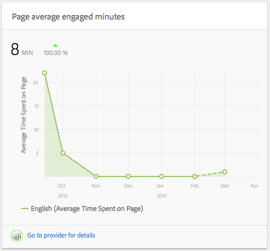

# Approfondimenti contenuto{#content-insight}

La funzione Approfondimenti contenuto fornisce informazioni sulle prestazioni della pagina tramite analisi web e consigli SEO. Utilizza Approfondimenti contenuto per prendere decisioni su come modificare le pagine o per scoprire come le modifiche precedenti hanno influito sulle prestazioni. Per ogni pagina creata, puoi aprire Approfondimenti contenuto per analizzarla.

Il layout della pagina Approfondimenti contenuto viene modificato in base alle dimensioni e all’orientamento dello schermo del dispositivo in uso.

## Dati rapporti

La pagina Approfondimenti contenuto include i rapporti che utilizzano i dati di Adobe SiteCatalyst, Adobe Target, Adobe Social e BrightEdge:

* SiteCatalyst: sono disponibili i rapporti per le seguenti metriche.

   * Visualizzazioni pagina
   * Tempo medio trascorso sulla pagina
   * Origini

* Target: rapporti sull’attività della campagna per cui la tua pagina include le offerte.
* BrightEdge: riporta le funzioni della pagina che ne migliorano la visibilità ai motori di ricerca, mostrando le funzioni da implementare.

Vedi [Apertura di Analytics e Consigli per una pagina](/help/sites-authoring/ci-analyze.md#opening-analytics-and-recommendations-for-a-page).

## Periodo di riferimento

I rapporti mostrano i dati relativi a un periodo di tempo controllato dall’utente. Quando regoli il periodo di riferimento, i rapporti vengono aggiornati automaticamente con i dati relativi a quel periodo. I segnali visivi indicano il momento in cui le versioni della pagina sono cambiate, in modo da poter confrontare le prestazioni di ogni versione.

Puoi anche specificare la granularità dei dati riportati, ad esempio puoi visualizzare dati giornalieri, settimanali, mensili o annuali.

Vedi [Modifica del periodo di riferimento](/help/sites-authoring/ci-analyze.md#changing-the-reporting-period).

>[!NOTE]
>
>I rapporti sugli Approfondimenti contenuto richiedono che l’amministratore abbia integrato AEM con SiteCatalyst, Target e BrightEdge. Vedi [Integrazione con SightCatalyst](/help/sites-administering/adobeanalytics.md), [Integrazione con Adobe Target](/help/sites-administering/target.md)e [Integrazione con BrightEdge](/help/sites-administering/brightedge.md).

## Il Rapporto delle visualizzazioni {#the-views-report}

Il Rapporto delle visualizzazioni include le seguenti funzioni per la valutazione del traffico della pagina:

* Il numero totale di visualizzazioni di una pagina per il periodo di reporting.
* Un grafico del numero di visualizzazioni per tutto il periodo di riferimento:

   * Visualizzazioni totali.
   * Visitatori univoci.

## Il Rapporto della media di interesse alla pagina {#the-page-average-engaged-report}

Il Rapporto della media di interesse alla pagina include le seguenti funzioni per la valutazione dell’efficacia della pagina:

* Il tempo medio in cui la pagina rimane aperta durante l’intero periodo di riferimento.
* Un grafico della lunghezza media di una vista alla pagina per tutto il periodo di riferimento.

## Il Rapporto origini {#the-sources-report}

Il Rapporto origini indica il modo in cui gli utenti sono arrivati alla pagina, ad esempio, dai risultati della ricerca o tramite l’URL noto.

## Il Rapporto non arrivate a destinazione {#the-bounces-report}

Il Rapporto non arrivate a destinazione include un grafico che mostra il numero di non arrivate a destinazione che si sono verificati per una pagina durante il periodo di riferimento selezionato.

## Il rapporto dell’attività della campagna {#the-campaign-activity-report}

Per ogni campagna per cui la pagina è attiva, viene visualizzato un rapporto denominato Attività *Nome campagna*. Il rapporto mostra le impression della pagina e le conversioni per ogni segmento per cui viene attivata un’offerta.

## Il Rapporto sui consigli SEO {#the-seo-recommendations-report}

Il Rapporto sui consigli SEO contiene i risultati dell’analisi BrightEdge per la pagina. Il rapporto è una lista di controllo delle funzioni della pagina che indica quali funzioni include o meno la pagina, per massimizzarne la possibilità di essere trovata dai motori di ricerca.

Il rapporto consente di creare attività in modo da apportare migliorie per migliorare la capacità della pagina di essere trovata. I consigli indicano che le attività sono state create per la loro attuazione. Vedi [Assegnazione delle attività per Consigli SEO](/help/sites-authoring/ci-analyze.md#assigning-tasks-for-seo-recommendations).

