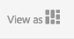

# Creazione di contenuti di destinazione utilizzando la modalità di targeting{#authoring-targeted-content-using-targeting-mode}

Puoi creare contenuti mirati (di destinazione) utilizzando la modalità di targeting di AEM. La modalità di targeting e il componente Target forniscono strumenti per la creazione di contenuti per esperienze:

* Facile riconoscimento del contenuto di destinazione presente sulla pagina. Tutti i contenuti di destinazione sono contrassegnati da un bordo tratteggiato.
* Selezione di un marchio e un’attività per vedere le esperienze.
* Aggiunta o rimozione di esperienze a un’attività.
* Esecuzione di test A/B e conversione dei vincitori (solo Adobe Target).
* Aggiunta di offerte a un’esperienza creando offerte o utilizzando offerte da una libreria.
* Configurazione di obiettivi e monitoraggio delle prestazioni.
* Simulazione dell’esperienza utente.
* Per ulteriori personalizzazioni, configura il componente Target.

Puoi utilizzare AEM o Adobe Target come motore di targeting (per utilizzare Adobe Target devi disporre di un account Adobe Target valido). Se utilizzi Adobe Target, devi prima di tutto configurare l’integrazione. Vedi [istruzioni per l’integrazione con Adobe Target](/help/sites-administering/target.md).

Le attività ed esperienze visualizzate in modalità Target riflettono la [console Attività](/help/sites-authoring/activitylib.md):

* Le modifiche apportate alle attività e alle esperienze utilizzando la modalità di targeting si riflettono nella console Attività.
* Le modifiche apportate nella console Attività vengono riflesse nella modalità di targeting.

>[!NOTE]
>
>Quando crei una campagna in Adobe Target, questo assegna una proprietà denominata `thirdPartyId` a ogni campagna. Quando elimini la campagna in Adobe Target, thirdPartyId non viene eliminato. Non è possibile riutilizzare `thirdPartyId` per campagne di tipo diverso (AB, XT) e non può essere rimosso manualmente. Per evitare questo problema, rinomina ogni campagna con un nome univoco; i nomi delle campagne non possono quindi essere riutilizzati in diversi tipi di campagne.
>
>Se utilizzi lo stesso nome nello stesso tipo di campagna, sovrascriverai la campagna esistente.
>
>Se durante la sincronizzazione si verifica l’errore “Richiesta non riuscita. `thirdPartyId` esiste già”, modifica il nome della campagna ed esegui di nuovo la sincronizzazione.

>[!NOTE]
>
>Nelle operazioni di targeting, la combinazione di branding e attività viene mantenuta a livello di utente non a livello di canale.

## Passaggio alla modalità di targeting {#switching-to-targeting-mode}

Passa alla modalità di targeting per accedere agli strumenti per la creazione di contenuti mirati.

Per passare alla modalità di targeting:

1. Apri la pagina per la quale desideri creare il targeting dei contenuti.
1. Nella barra degli strumenti nella parte superiore della pagina, fai clic o tocca il menu a comparsa delle modalità per visualizzare i tipi di modalità disponibili.

   

1. Tocca o fai clic su **Targeting**. Le opzioni di targeting vengono visualizzate nella parte superiore della pagina.

   

## Aggiunta di un’attività utilizzando la modalità di targeting {#adding-an-activity-using-targeting-mode}

Utilizza la modalità di targeting per aggiungere un’attività a un marchio. Quando aggiungi un’attività, questa contiene l’esperienza predefinita. Dopo aver aggiunto l’attività, puoi avviare il processo di targeting dei contenuti per l’attività.

Puoi inoltre creare e gestire attività di Adobe Target da AEM con la possibilità di selezionare il motore di targeting, AEM o Adobe Target, e il tipo di attività, targeting delle esperienze o test A/B.

Inoltre, puoi gestire gli obiettivi e le metriche per tutte le attività di Adobe Target e gestire il pubblico di Adobe Target. È incluso anche il reporting delle attività di Adobe Target, tra cui la conversione dei vincitori per i test A/B.

Quando aggiungi un’attività, questa viene visualizzata anche nella [console delle attività](/help/sites-authoring/activitylib.md).

Per aggiungere un’attività:

1. Usa il menu a comparsa **Marchio** per selezionare il marchio per il quale desideri creare l’attività.

   >[!NOTE]
   >
   >Si consiglia di [creare marchi mediante la console delle attività](/help/sites-authoring/activitylib.md#creating-a-brand-using-the-activities-console).
   >
   >
   >Se crei un marchio in un altro modo, assicurati che il nodo `/campaigns/<brand>/master` esista, per evitare errori quando tenterai di creare un’attività.

1. Tocca o fai clic su + accanto al menu a comparsa **Attività**.
1. Digita un nome per l’attività.

   >[!NOTE]
   >
   >Quando crei una nuova attività e disponi di una configurazione cloud di Adobe Target associata alla pagina o a una delle pagine principali, AEM assume automaticamente Adobe Target come motore.

1. Nel menu a comparsa del motore di **targeting**, seleziona il motore di targeting.

   * Se selezioni **ContextHub AEM**, i campi rimanenti vengono oscurati e non sono disponibili. Tocca o fai clic su **Crea**.

   * Se selezioni **Adobe Target**, puoi selezionare una configurazione (per impostazione predefinita, è quella fornita quando hai [configurato l’account](/help/sites-administering/opt-in.md)) e un tipo di attività.

   * Se utilizzi l’integrazione AEM/Adobe Campaign e invii contenuti mirati (newsletter), seleziona **Adobe Campaign**. Per maggiori informazioni, consulta [Integrazione con Adobe Campaign](/help/sites-administering/campaign.md).

1. Nel menu Attività, seleziona **Targeting delle esperienze** o **Test A/B**.

   * Targeting delle esperienze: gestione delle attività di Adobe Target da AEM.
   * Test A/B: creazione e gestione delle attività di test A/B in Adobe Target da AEM.

## Il processo di targeting: creazione, targeting e obiettivi e impostazioni {#the-targeting-process-create-target-and-goals-settings}

La modalità di targeting consente di configurare diversi aspetti di un’attività. Utilizza il seguente processo in tre fasi per creare contenuti mirati per un’attività del marchio:

1. [Creazione:](#create-authoring-the-experiences) consente di aggiungere o rimuovere le esperienze e di aggiungere le offerte a ogni esperienza.
1. [Targeting:](#diagramtargetconfiguringtheaudiences) consente di specificare i tipi di pubblico al quale è mirata ciascuna esperienza. Puoi eseguire il targeting a un pubblico specifico e, se utilizzi il test A/B decidere quale percentuale di traffico è riservata a quale esperienza.
1. [Obiettivi e impostazioni](#settingsgoalssettingsconfiguringtheactivityandsettinggoals): consente di programmare l’attività e impostare la priorità. Puoi anche definire gli obiettivi della metrica di successo.

Utilizza la seguente procedura per avviare il processo di targeting dei contenuti di un’attività.

>[!NOTE]
>
>Per utilizzare il processo di targeting, devi essere membro del gruppo utente Autori delle attività di Target.

Per aggiungere un’attività:

1. Nel menu a comparsa **Marchio**, seleziona il marchio che contiene l’attività su cui stai lavorando.
1. Nel menu a comparsa **Attività**, seleziona l’attività per la quale stai creando il targeting del contenuto.
1. Per visualizzare i controlli che guidano attraverso il processo di targeting, tocca o fai clic su **Avvia targeting**.

   

   >[!NOTE]
   >
   >Per modificare l’attività con cui stai lavorando, tocca o fai clic su **Indietro**.

## Creazione: creare esperienze {#create-authoring-the-experiences}

La fase di creazione del targeting del contenuto comporta la creazione di esperienze. Durante tale passaggio puoi creare o eliminare le esperienze nell’attività e aggiungere le offerte in ogni esperienza.

### Visualizzazione delle offerte di esperienza in modalità targeting {#seeing-experience-offers-in-targeting-mode}

Dopo aver [avviato il processo di targeting](/help/sites-authoring/content-targeting-touch.md#the-targeting-process-create-target-and-goals-settings), seleziona un’esperienza per visualizzare le offerte che sono fornite per questa specifica esperienza. Quando selezioni un’esperienza, i componenti soggetti a targeting nella pagina si modificano in modo da mostrare l’offerta per questa esperienza.

>[!CAUTION]
>
>Presta attenzione quando disattivi il targeting per un componente che è già assegnato nell’istanza di authoring. La rispettiva attività verrà automaticamente eliminata anche dall’istanza di pubblicazione.

>[!NOTE]
>
>Un’offerta è il contenuto di un componente di cui è stato eseguito il targeting.

Le esperienze vengono visualizzate nel riquadro Audiences. Nell’esempio seguente, le esperienze includono **Predefinita**, **Femmina**, **Femmina oltre 30** e **Femmina sotto 30**. Questo esempio mostra l’offerta Predefinita di un componente **Immagine** di destinazione.

Quando è selezionata un’esperienza diversa, il componente immagine mostra l’offerta per l’esperienza.

Quando un’esperienza è selezionata e il componente di destinazione non include un’offerta per tale esperienza, il componente visualizza la scritta **Aggiungi offerta** come sovrapposta all’offerta semitrasparente predefinita. Quando non è stata creata alcuna offerta per un’esperienza, l’offerta **Predefinita** viene visualizzata per il segmento mappato all’esperienza.

L’esperienza predefinita viene visualizzata anche quando le proprietà del visitatore non corrispondono a nessun segmento mappato per le esperienze. Consulta [Aggiunta di esperienze utilizzando la modalità di targeting](#adding-and-removing-experiences-using-targeting-mode).

### Offerte personalizzate e offerte dalla libreria {#custom-offers-and-library-offers}

Le offerte che [vengono create sulla pagina](/help/sites-authoring/content-targeting-touch.md#adding-a-custom-offer) e vengono utilizzate per una sola esperienza sono denominate offerte personalizzate. L’immagine seguente è sovrapposta al contenuto di un’offerta personalizzata:

Le offerte che vengono [aggiunte da una libreria di offerte](/help/sites-authoring/content-targeting-touch.md#adding-an-offer-from-an-offer-library) sono sovrapposte con l’immagine seguente:

Puoi salvare le offerte personalizzate in una libreria di offerte se decidi di riutilizzarle. Puoi anche convertire un’offerta dalla libreria in un’offerta personalizzata se desideri modificare il contenuto per un’esperienza. Dopo la modifica, puoi salvare nuovamente l’offerta nella libreria.

### Aggiunta e rimozione di esperienze con la modalità di targeting {#adding-and-removing-experiences-using-targeting-mode}

Utilizzando la fase Crea del [processo di targeting](/help/sites-authoring/content-targeting-touch.md#the-targeting-process-create-target-and-goals-settings), puoi aggiungere e rimuovere esperienze. Inoltre, puoi duplicare un’esperienza e rinominarla.

#### Aggiunta di esperienze con la modalità di targeting {#adding-experiences-using-targeting-mode}

Per aggiungere un’esperienza:

1. Per aggiungere un’esperienza, tocca o fai clic su **+** **Aggiungi targeting dell’esperienza** che viene visualizzato sotto le esperienze esistenti del riquadro **Pubblico**.
1. Seleziona un pubblico. Per impostazione predefinita, questo nome è il nome dell’esperienza. Puoi digitare un altro nome, se necessario. Tocca o fai clic su **OK**.

#### Rimozione di esperienze con la modalità di targeting {#removing-experiences-using-targeting-mode}

Per eliminare un’esperienza:

1. Tocca o fai clic sulla freccia accanto al nome dell’esperienza.

   

1. Fai clic su **Elimina**.

#### Rinominare esperienze con la modalità di targeting {#renaming-experiences-using-targeting-mode}

Per rinominare le esperienze con la modalità di targeting:

1. Tocca o fai clic sulla freccia accanto al nome dell’esperienza.
1. Fai clic su **Rinomina esperienza** e digita il nuovo nome.
1. Tocca o fai clic su un punto qualsiasi sullo schermo per salvare le modifiche.

#### Modifica del pubblico utilizzando la modalità di targeting {#editing-audiences-using-targeting-mode}

Per modificare il pubblico utilizzando la modalità di targeting:

1. Tocca o fai clic sulla freccia accanto al nome dell’esperienza.
1. Fai clic su **Modifica pubblico** e seleziona un nuovo pubblico.
1. Fai clic su **OK**.

#### Duplicazione delle esperienze con la modalità di targeting {#duplicating-experiences-using-targeting-mode}

Per copiare le esperienze con la modalità di targeting:

1. Tocca o fai clic sulla freccia accanto al nome dell’esperienza.
1. Fai clic su **Duplica** e scegli il pubblico.
1. Rinomina l’esperienza, se desiderato, e fai clic su **OK**.

### Creazione delle offerte che utilizzano la modalità di targeting {#creating-offers-using-targeting-mode}

Esegui il targeting di un componente per creare le offerte per le esperienze. I componenti di cui è stato eseguito il targeting forniscono il contenuto che viene utilizzato come offerte per le esperienze.

* [Esegui il targeting di un componente esistente](/help/sites-authoring/content-targeting-touch.md#creating-a-default-offer-by-targeting-an-existing-component). Il contenuto diventa l’offerta dell’esperienza predefinita.
* [Aggiungi un componente Target](/help/sites-authoring/content-targeting-touch.md#creating-an-offer-by-adding-a-target-component), quindi aggiungi il contenuto al componente.

Dopo che è stato eseguito il targeting di un componente, puoi aggiungere le offerte per ogni esperienza:

* [Aggiungi offerte personalizzate](/help/sites-authoring/content-targeting-touch.md#adding-a-custom-offer).
* [Aggiungi offerte da una libreria](/help/sites-authoring/content-targeting-touch.md#adding-an-offer-from-an-offer-library).

Sono disponibili i seguenti strumenti per lavorare con le offerte:

* [Aggiungi un’offerta personalizzato a una libreria di offerte](/help/sites-authoring/content-targeting-touch.md#adding-a-custom-offer-to-a-library).
* [Converti un’offerta dalla libreria in offerta personalizzata](/help/sites-authoring/content-targeting-touch.md#converting-a-library-offer-to-a-custom-library).
* [Apri un’offerta dalla libreria e modificane il contenuto](/help/sites-authoring/content-targeting-touch.md#editing-a-library-offer).

#### Creazione di un’offerta predefinita tramite targeting di un componente esistente {#creating-a-default-offer-by-targeting-an-existing-component}

Esegui il targeting di un componente sulla pagina per utilizzarlo come l’offerta per l’esperienza predefinita dell’attività. Quando si esegue il targeting di un componente, questo viene inviluppato in un componente Target e il suo contenuto diventa l’offerta per l’esperienza predefinita.

Quando si esegue il targeting di un componente, solo il componente può essere utilizzato nell’offerta. Non è possibile rimuovere il componente dall’offerta o aggiungere altri componenti all’offerta.

Esegui la seguente procedura dopo [aver avviato il processo di targeting](/help/sites-authoring/content-targeting-touch.md#the-targeting-process-create-target-and-goals-settings).

1. Tocca o fai clic sul componente di cui eseguire il targeting. Viene visualizzata la barra degli strumenti per il componente, come nell’esempio seguente.

   

1. Tocca o fai clic sull’icona Target.

   

   Il contenuto del componente è l’offerta dell’esperienza predefinita. Quando viene eseguito il targeting di un componente, il suo nodo predefinito sarà replicato per ogni esperienza. Questo è necessario per modificare il nodo del contenuto corretto durante la creazione specifica dell’esperienza. Per tali esperienze non predefinite, [aggiungi un’offerta personalizzata](/help/sites-authoring/content-targeting-touch.md#adding-a-custom-offer) oppure [aggiungi un’offerta dalla libreria](/help/sites-authoring/content-targeting-touch.md#adding-an-offer-from-an-offer-library).

#### Creazione di un’offerta aggiungendo un componente Target {#creating-an-offer-by-adding-a-target-component}

Aggiungi un componente Target per creare l’offerta per l’esperienza predefinita. Il componente Target è un contenitore per altri componenti e viene eseguito il targeting di componenti che si trovano al suo interno. Quando utilizzi il componente Target, puoi aggiungere numerosi componenti per creare un’offerta. Inoltre, puoi usare i diversi componenti in ogni esperienza per creare le diverse offerte.

Per ulteriori informazioni su come personalizzare questo componente, consulta [Configurazione delle opzioni dei componenti Target](/help/sites-authoring/content-targeting-touch.md#configuring-target-component-options).

>[!NOTE]
>
>Le offerte create mediante la [console delle offerte](/help/sites-authoring/offerlib.md) possono anche contenere diversi componenti. Queste offerte appartengono a una libreria di offerte e possono essere utilizzate per più esperienze.

Dato che il componente Target è un contenitore, viene visualizzato come area di rilascio per altri componenti.

In modalità Target, il componente Target ha un bordo blu e il messaggio a discesa indica la natura di targeting.

In modalità di modifica, il componente Target dispone di un’icona a forma di centro del bersaglio.

Quando trascini componenti nel componente Target, si tratta di componenti di cui è stato eseguito il targeting.

Quando aggiungi un componente al componente Target, questo fornisce il contenuto per un’esperienza specifica. Per specificare l’esperienza, seleziona l’esperienza prima di aggiungere i componenti.

È possibile aggiungere un componente Target alla pagina in modalità di modifica o in modalità targeting. Puoi aggiungere componenti al componente Target solo in modalità di targeting. Il componente Target appartiene a un gruppo di componenti di personalizzazione.

In caso di modifica del contenuto con targeting, devi toccare o fare clic su **Avvia targeting** prima di poter procedere.

1. Trascinare il componente Target alla pagina in cui desideri che venga visualizzata l’offerta.
1. Per impostazione predefinita, non è impostato alcun ID di posizione. Tocca o fai clic sull’ingranaggio di configurazione per impostare la posizione.

   >[!NOTE]
   >
   >Se configurato dall’amministratore, potrebbe essere necessario impostare esplicitamente la posizione.
   >
   >
   >Gli amministratori possono decidere se impostare questa configurazione sia necessario o meno per **https://&lt;host>:&lt;port>/system/console/configMgr/com.day.cq.personalization.impl.servlets.TargetingConfigurationServlet**
   Per richiedere agli utenti di inserire una posizione, seleziona la casella di controllo **Force location **(Forza posizione).

1. Seleziona l’esperienza per cui desideri creare l’offerta.
1. Creazione dell’offerta:

   * Per l’esperienza predefinita, trascina i componenti nell’area di rilascio desiderata e modificane le proprietà come di consueto per creare il contenuto dell’offerta.
   * Per esperienze non predefinite, [aggiungi un’offerta personalizzata](#adding-a-custom-offer) oppure [aggiungi un’offerta dalla libreria](/help/sites-authoring/content-targeting-touch.md#adding-an-offer-from-an-offer-library).

#### Aggiunta di un’offerta personalizzata {#adding-a-custom-offer}

Consente di realizzare un’offerta creando il contenuto di un componente con targeting per il targeting della modalità. Quando crei un’offerta personalizzata, viene utilizzata come offerta da un’unica esperienza.

Se decidi che l’offerta può essere utilizzata per altre esperienze, puoi creare un’offerta personalizzata e [aggiungerla alla libreria](/help/sites-authoring/content-targeting-touch.md#adding-a-custom-offer-to-a-library). Per ulteriori informazioni sull’uso della console delle offerte per creare un’offerta riutilizzabile, consulta [Aggiunta di un’offerta a una libreria di offerte](/help/sites-authoring/offerlib.md#add-an-offer-to-an-offer-library).

1. Seleziona l’esperienza a cui aggiungere l’offerta.
1. Per visualizzare il menu dei componenti, tocca o fai clic sul componente con targeting a cui aggiungere l’offerta.

   

1. Tocca o fai clic sull’icona +.

   Il contenuto dell’offerta predefinito viene utilizzato come offerta per l’esperienza corrente.

1. Tocca o fai clic sull’offerta per visualizzare il menu dell’offerta, quindi tocca o fai clic sull’icona di modifica.

   

1. Modifica il contenuto del componente.

#### Aggiunta di un’offerta da una libreria delle offerte {#adding-an-offer-from-an-offer-library}

Aggiungi un’offerta dalla [libreria di offerte](/help/sites-authoring/offerlib.md) a un’esperienza. Puoi aggiungere tutte le offerte dalla libreria del marchio di cui attualmente stai eseguendo il targeting.

Non puoi aggiungere offerte dalla libreria all’esperienza predefinita.

1. Seleziona l’esperienza a cui aggiungere l’offerta.
1. Per visualizzare il menu dei componenti, tocca o fai clic sul componente con targeting a cui aggiungere l’offerta.

   

1. Tocca o fai clic sull’icona della cartella.

   

1. Seleziona l’offerta dalla libreria, quindi tocca o fai clic sull’icona a forma di segno di spunta.

   

   Il selettore delle offerte consente di individuare o filtrare le offerte. Durante la navigazione o il filtraggio, è anche possibile ordinare le offerte e modificarne la modalità di visualizzazione. Il numero in alto a destra indica il numero di offerte disponibili nella libreria corrente.

   * Tocca o fai clic su **Sfoglia** per spostarti in un’altra cartella. Il pannello di navigazione si apre e puoi fare clic sulla freccia per analizzare in profondità le cartelle. Tocca o fai clic di nuovo su **Sfoglia** per chiudere il pannello di navigazione.

   

   * Tocca o fai clic su **Filtra** per filtrare le offerte in base a parole chiave o tag. Le parole chiave devono essere digitate, mentre i tag possono essere selezionati dal menu a comparsa. Tocca o fai clic di nuovo su **Filtra** per chiudere il pannello di filtraggio.

   

   * Puoi modificare l’ordine delle offerte toccando o facendo clic sulla freccia accanto a **Dal più recente al meno recente**. Le offerte possono essere ordinate dalla più recente alla meno recente o dalla meno recente alla più recente.

   

   Tocca o fai clic sull’icona accanto a **Visualizza** per visualizzare le offerte come miniature o come elenco.

   

#### Aggiunta di un’offerta personalizzata a una libreria {#adding-a-custom-offer-to-a-library}

Aggiungi un’offerta personalizzata alla [libreria delle offerte](/help/sites-authoring/offerlib.md) se desideri riutilizzarla come offerta da più esperienze. Puoi aggiungere offerte alla libreria del marchio corrente per i quali stai eseguendo il targeting.

Per ulteriori informazioni sull’uso della console delle offerte per creare un’offerta riutilizzabile, consulta [Aggiunta di un’offerta a una libreria di offerte](/help/sites-authoring/offerlib.md#add-an-offer-to-an-offer-library).

1. Seleziona l’esperienza per visualizzare l’offerta personalizzata.
1. Tocca o fai clic sull’offerta personalizzata per visualizzare il menu dell’offerta, quindi tocca o fai clic sull’icona **Salva offerta nella libreria delle offerte**.

   

1. Digita un nome per l’offerta e seleziona la libreria a cui aggiungere l’offerta, quindi tocca o fai clic sull’icona a forma di segno di spunta.

#### Convertire un’offerta dalla libreria in una libreria personalizzata {#converting-a-library-offer-to-a-custom-library}

Consente di convertire un’offerta dalla libreria in offerta personalizzata per modificare l’offerta per l’esperienza corrente e senza modificare l’offerta in altre esperienze.

1. Seleziona l’esperienza per visualizzare l’offerta dalla libreria.
1. Tocca o fai clic sull’offerta dalla libreria per visualizzare il menu dell’offerta, quindi tocca o fai clic sull’icona Converti in offerta in linea.

   

#### Modifica dell’offerta dalla libreria {#editing-a-library-offer}

Apri un’offerta dalla libreria da un’esperienza in modalità targeting per modificare l’offerta. Le modifiche apportate vengono visualizzate in tutte le esperienze che utilizzano l’offerta.

1. Seleziona l’esperienza per visualizzare l’offerta dalla libreria.
1. Converti l’offerta dalla libreria in offerta personalizzata/locale. Consulta [Convertire un’offerta dalla libreria in una libreria personalizzata](#converting-a-library-offer-to-a-custom-library).
1. Modifica il contenuto dell’offerta. 

1. Salvalo nuovamente nella libreria. Consulta [Aggiunta di un’offerta personalizzata a una libreria](#adding-a-custom-offer-to-a-library).

## Targeting: configurazione del pubblico {#target-configuring-the-audiences}

La fase di targeting del [processo di targeting](/help/sites-authoring/content-targeting-touch.md#the-targeting-process-create-target-and-goals-settings) comporta la mappatura del pubblico con le esperienze con cui hai lavorato nella fase di creazione. La pagina di targeting mostra il pubblico per ogni esperienza di cui stai eseguendo il targeting. Puoi specificare o modificare il pubblico per ogni esperienza. Se utilizzi Adobe Target, puoi anche creare test A/B che consentono di eseguire il targeting della percentuale del traffico per un pubblico per un’esperienza specifica.

### Se utilizzi il targeting AEM o Adobe Target (targeting delle esperienze) ... {#if-you-are-using-aem-targeting-or-adobe-target-experience-targeting}

Il pubblico viene visualizzato sul lato sinistro del diagramma di mappatura, mentre le esperienze vengono visualizzate sul lato destro.

Definisci un pubblico utilizzando un segmento. La configurazione cloud per i rilevatori di pagina determina i segmenti che sono a tua disposizione. Se la pagina non è associata a una configurazione cloud di Adobe Target, sono disponibili segmenti AEM per la definizione del pubblico. Se la pagina è associata a una configurazione cloud di Adobe Target, utilizza i segmenti Target.

Per informazioni sui motori di targeting, consulta [Motore di targeting](/help/sites-authoring/personalization.md#targeting-engine).

Un pubblico non deve essere utilizzato da più di un’esperienza. Un simbolo di avviso viene visualizzato accanto a un’esperienza quando viene mappata verso a un pubblico che viene associato a un’altra esperienza.

### Associazione delle esperienze con il pubblico (AEM o Adobe Target) {#associating-experiences-with-audiences-aem-or-adobe-target}

Segui la procedura seguente per associare un’esperienza a un pubblico quando utilizzi il targeting di AEM (o il targeting delle esperienze di Adobe Target):

1. Tocca o fai clic sulla freccia a discesa nella casella del pubblico mappata all’esperienza.
1. (Facoltativo) Tocca o fai clic su **Modifica**, quindi digita una parola chiave per la ricerca del segmento desiderato.
1. Nell’elenco del pubblico, seleziona il pubblico e tocca o fai clic su **OK**.

### Se utilizzi i test A/B (Adobe Target) ... {#if-you-are-using-a-b-testing-adobe-target}

Se disponi di un’attività di test A/B, il pubblico è alla tua sinistra, la percentuale di visualizzazione di ogni esperienza viene visualizzata è al centro e le esperienze sono a destra.

Le percentuali possono essere modificate fino a un massimo del 100 per cento. Un pubblico può essere utilizzato da più esperienze nei test A/B.

### Associazione di percentuali di pubblico e traffico con il test A/B {#associating-audiences-and-traffic-percentages-with-a-b-testing}

1. Tocca o fai clic sulla casella a discesa accanto al pubblico mappato all’esperienza.
1. (Facoltativo) Fai clic su **Modifica**, quindi scrivi una parola chiave per la ricerca del segmento desiderato.
1. Tocca o fai clic su **OK.**
1. Immetti le percentuali per configurare il modo in cui il traffico del pubblico viene instradato a ciascuna esperienza. Il numero totale deve essere uguale a 100.
1. (Facoltativo) Modifica il nome dell’esperienza facendo clic sul menu a discesa accanto al nome dell’esperienza.

## Obiettivi e impostazioni: configurazione dell’attività e definizione degli obiettivi {#goals-settings-configuring-the-activity-and-setting-goals}

La fase Obiettivi e impostazioni del [processo di targeting](/help/sites-authoring/content-targeting-touch.md#the-targeting-process-create-target-and-goals-settings) comporta la configurazione del comportamento dell’attività del marchio. Specifica quando l’attività inizia e finisce, come anche la priorità dell’attività. Inoltre, è anche possibile monitorare gli obiettivi. In particolare, puoi decidere cosa desideri misurare con le attività.

Le metriche degli obiettivi sono disponibili solo se usi Adobe Target per il motore di targeting. Devi specificare almeno una metrica di obiettivo. Se Adobe Analytics è stato configurato e disponi di una configurazione cloud A4T Analytics, puoi scegliere se l’origine per la generazione dei rapporti deve essere Adobe Target o Adobe Analytics.

Le metriche di obiettivo sono misurate solo per la campagna pubblicata.

Se utilizzi AEM come motore di targeting:

Se utilizzi Adobe Target come motore di targeting:

Se utilizzi Adobe Target come motore di targeting e disponi di A4T Analytics configurato per l’account, avrai accesso a un menu a discesa aggiuntivo **Origine per la generazione di rapporti**:

Sono disponibili le seguenti metriche di successo (utilizzate solo per la pubblicazione):

<table>
 <tbody>
  <tr>
   <td><strong>Conversione</strong></td>
   <td>
Percentuale di visitatori che hanno fatto clic su una qualsiasi parte dell’esperienza in fase di test. Una conversione può essere conteggiata una volta per ogni visitatore o ogni volta che un visitatore completa una conversione. La metrica di conversione è impostata su una delle seguenti opzioni:

    <ul>
     <li><strong>Visualizzazione di una pagina</strong> - Puoi definire la pagina visualizzata dal pubblico selezionandone una <strong>L'URL è</strong> e quindi definisci l’URL o più URL, oppure selezionando <strong>L'URL contiene</strong> e quindi aggiungere un percorso o una parola chiave.</li>
     <li><strong>Visualizzazione di una mbox</strong> - Puoi definire quale mbox ha visualizzato il tuo pubblico immettendo il nome della mbox. È possibile immettere più mbox facendo clic su <strong>Aggiungi una mbox</strong>.</li>
    </ul> </td>
  </tr>
  <tr>
   <td><strong>Ricavo</strong></td>
   <td>
Entrate generate dalla visita. Puoi scegliere tra le seguenti metriche di ricavi:

    <ul>
     <li>Ricavo per visitatore (RPV)</li>
     <li>Valore medio dell'ordine (AOV)</li>
     <li>Vendite totali </li>
     <li>Ordini</li>
    </ul> 
Per una qualsiasi di queste opzioni, se una mBox è stata visualizzata indica che l'obiettivo è stato raggiunto. Puoi definire la mbox o più mbox.
 </td>
  </tr>
  <tr>
   <td><strong>Coinvolgimento</strong></td>
   <td>
Puoi misurare tre tipi di coinvolgimento:

    <ul>
     <li>Visualizzazioni pagina</li>
     <li>Punteggio personalizzato</li>
     <li>Tempo sul sito</li>
    </ul> </td>
  </tr>
 </tbody>
</table>

Inoltre, esistono impostazioni avanzate che consentono di determinare come calcolare le metriche di successo. Le opzioni includono il conteggio della metrica per impression o una volta per ogni visitatore e la scelta se mantenere gli utenti nell’attività o rimuoverli.

Utilizza le impostazioni avanzate per determinare che cosa succede **dopo** che l’utente raggiunge la metrica di obiettivo. La tabella seguente mostra le opzioni disponibili.

<table>
 <tbody>
  <tr>
   <td><strong>Quando un utente si imbatte questa metrica di obiettivo...</strong></td>
   <td><strong>Seleziona l’azione seguente...</strong></td>
  </tr>
  <tr>
   <td><strong>Incrementa il conteggio e mantieni utente attivo</strong></td>
   <td>Specifica come viene incrementato il conteggio:
    <ul>
     <li>Una volta per partecipante</li>
     <li>A ogni impression, escluso l’aggiornamento della pagina</li>
     <li>A ogni impression</li>
    </ul> </td>
  </tr>
  <tr>
   <td><strong>Incrementa il conteggio, rilascia l'utente e consenti reinserimento</strong></td>
   <td>Seleziona l’esperienza che il visitatore vede se accede nuovamente all’attività:
    <ul>
     <li>Stessa esperienza</li>
     <li>Esperienza casuale</li>
     <li>Esperienza invisibile</li>
    </ul> </td>
  </tr>
  <tr>
   <td><strong>Incrementa il conteggio, rilascia l'utente e impedisci nuovo accesso</strong></td>
   <td>Determina cosa vede l’utente al posto del contenuto dell’attività:
    <ul>
     <li>Stessa esperienza, senza tracciamento</li>
     <li>Contenuto predefinito o altro contenuto dell’attività</li>
    </ul> </td>
  </tr>
 </tbody>
</table>

Consulta la [documentazione di Adobe Target](https://docs.adobe.com/content/help/en/target/using/activities/success-metrics/success-metrics.html) per ulteriori informazioni sulle metriche di successo.

### Impostazioni di configurazione (targeting di AEM) {#configuring-settings-aem-targeting}

Per configurare le impostazioni utilizzando il targeting di AEM:

1. Per specificare quando avviare l’attività, utilizza il menu a comparsa **Avvia** per selezionare uno dei seguenti valori:

   * **Quando viene attivato**: l’attività viene avviata quando la pagina contenente il contenuto di destinazione viene attivata.
   * **Data e ora specificate**: in un momento specifico. Quando selezioni questa opzione, fai clic o tocca l’icona del calendario, seleziona una data e specifica l’ora in cui avviare l’attività.

1. Per specificare quando l’attività termina, usa il menu a comparsa **Fine** per selezionare uno dei seguenti valori:

   * **Quando viene disattivato**: l’attività termina quando la pagina contenente il contenuto di destinazione viene disattivata.
   * **Data e ora specificata**: un tempo specifico. Quando selezioni questa opzione, tocca o fai clic sull’icona del calendario, seleziona una data e specifica l’ora di fine dell’attività.

1. Per specificare una priorità per l’attività, usa il cursore per selezionare un valore **Bassa**, **Media** o **Alta**.

### Configurazione di obiettivi e impostazioni (Adobe Target) {#configuring-goals-settings-adobe-target}

Per configurare obiettivi e impostazioni con Adobe Target:

1. Per specificare quando avviare l’attività, utilizza il menu a comparsa **Avvia** per selezionare uno dei seguenti valori:

   * **Quando viene attivato**: l’attività viene avviata quando la pagina contenente il contenuto di destinazione viene attivata.
   * **Data e ora specificate**: in un momento specifico. Quando selezioni questa opzione, fai clic o tocca l’icona del calendario, seleziona una data e specifica l’ora in cui avviare l’attività.

1. Per specificare quando l’attività termina, usa il menu a comparsa **Fine** per selezionare uno dei seguenti valori:

   * **Quando viene disattivato**: l’attività termina quando la pagina contenente il contenuto di destinazione viene disattivata.
   * **Data e ora specificata**: un tempo specifico. Quando selezioni questa opzione, tocca o fai clic sull’icona del calendario, seleziona una data e specifica l’ora di fine dell’attività.

1. Per specificare una priorità per l’attività, usa il cursore per selezionare un valore **Bassa**, **Media** o **Alta**.
1. Se hai configurato Adobe Analytics con il tuo account Adobe Target, viene visualizzato il menu a comparsa **Origine per la generazione dei rapporti**. Seleziona **Adobe Target** o **Adobe Analytics** come origine.

   Se selezioni **Adobe Analytics**, seleziona la società e la suite di rapporti. Se hai selezionato **Adobe Target**, non è necessaria alcuna azione.

   

1. Da **Obiettivo principale**, vai all’area **Metrica per obiettivo** e seleziona la metrica di successo che desideri monitorare: Conversione, Entrate, Coinvolgimento. Quindi inserisci come viene misurata la metrica (o quale azione intraprende l’audience per indicare che un obiettivo è stato raggiunto). Vedi la definizione delle metriche dell’obiettivo nella tabella precedente e consulta la [documentazione di Adobe Target](https://docs.adobe.com/content/help/en/target/using/activities/success-metrics/success-metrics.html) sulle metriche di successo.

   Per rinominare l’obiettivo, fai clic sui tre punti nell’angolo in alto a destra e seleziona **Rinomina**.

   Per cancellare tutti i campi, fai clic sui tre punti nell’angolo superiore destro e seleziona **Cancella tutti i campi**.

   Tutte le metriche hanno anche impostazioni avanzate che è possibile definire. Seleziona **Impostazioni avanzate** per accedere a queste impostazioni. Vedi la definizione del conteggio delle metriche di successo nella tabella precedente e consulta la [documentazione di Adobe Target](https://docs.adobe.com/content/help/en/target/using/activities/success-metrics/success-metrics.html).

   >[!NOTE]
   Devi avere almeno un obiettivo definito.

   

   >[!NOTE]
   Se mancano informazioni nella metrica, una linea rossa circonda la metrica.

1. Fai clic su **Aggiungi una nuova metrica** per configurare le metriche di successo aggiuntive.

   

   >[!NOTE]
   Puoi rimuovere gli obiettivi aggiuntivi toccando o facendo clic sui tre punti e toccando o facendo clic su **Elimina**. AEM richiede che sia impostata almeno un obiettivo.

1. Se desideri maggiore controllo sul conteggio delle metriche di successo, tocca o fai clic su **Impostazioni avanzate** per accedere a queste impostazioni.
1. Fai clic su **Salva**.

Dopo la configurazione, puoi [visualizzare le prestazioni delle attività](/help/sites-authoring/activitylib.md#viewing-performance-and-converting-winning-experiences-a-b-test) che utilizzano Adobe Target (sia il targeting di esperienza che del test A/B). Inoltre, con il targeting del test A/B, puoi [convertire i vincitori.](/help/sites-authoring/activitylib.md#viewing-performance-and-converting-winning-experiences-a-b-test) 

## Simulazione dell’esperienza {#simulating-an-experience}

Consente di simulare l’esperienza di un visitatore per verificare che il contenuto della pagina appaia come previsto in base al progetto del contenuto desiderato. Durante la simulazione, carica diversi profili utente e vedi il contenuto con targeting per quell’utente.

I seguenti criteri determinano il contenuto che appare quando si simula l’esperienza di un visitatore:

* I dati nell’archivio di sessione dell’utente (tramite Context Hub).
* Le [attività che sono in corso](/help/sites-authoring/activitylib.md).
* Le [regole che definiscono i segmenti](/help/sites-administering/campaign-segmentation.md).
* Il contenuto delle esperienze nel componente Target.
* La [configurazione del motore di targeting](/help/sites-authoring/activitylib.md).

Se nella pagina vengono visualizzati contenuti imprevisti quando si carica un profilo, controlla la configurazione di ogni elemento dell’elenco.

>[!NOTE]
Se utilizzi il test A/B, quando si simulano le esperienze, queste vengono mostrate in base alla percentuale di traffico. Questa funzionalità è controllata da Adobe Target, che può causare risultati imprevisti per gli autori. (L’attività _author è sincronizzata con le impostazioni specifiche che consentono una nuova valutazione durante la simulazione). Gli autori potrebbero dover aggiornare per vedere le altre esperienze in base alle impostazioni del traffico.

Per simulare l’esperienza del visitatore, utilizza i seguenti strumenti:

* L’attività di simulazione in modalità targeting: nella pagina vengono visualizzate le offerte per l’utente attualmente selezionato in Context Hub. È possibile modificare le offerte con targeting per l’utente.
* Modalità anteprima: utilizza Context Hub per selezionare gli utenti e le posizioni che soddisfano i criteri dei segmenti su cui si basa l’esperienza. Quando le selezioni di Context Hub cambiano, i contenuti con targeting cambiano di conseguenza.

1. Per passare alla modalità anteprima, sulla barra degli strumenti tocca o fai clic su **Anteprima**.
1. Nella barra degli strumenti, tocca o fai clic sull’icona centrale di Context Hub.

   

1. Usa Context Hub per modificare le proprietà di contesto. Ad esempio, tocca o fai clic su Proprietà personale per selezionare un utente diverso.

   

   La pagina viene modificata per visualizzare il contenuto a cui è destinato il contesto corrente.

1. Per apportare modifiche alle offerte visualizzate, passa alla modalità di targeting. Una volta selezionata l’attività di simulazione, modifica le offerte per il contesto configurato nella modalità di anteprima.

## Configurazione delle opzioni dei componenti Target {#configuring-target-component-options}

È possibile personalizzare il componente Target accedendo alle opzioni del componente in base a uno dei due modi seguenti:

1. Dopo aver eseguito il targeting del componente, nel componente Target, tocca o fai clic sul componente e quindi sull’icona delle impostazioni (ingranaggio).

   

   AEM mostra la finestra delle opzioni del componente Target.

   

1. In alternativa, per accedere a queste impostazioni in modalità a schermo intero, nella finestra delle opzioni del componente Target, tocca o fai clic sull’icona a schermo intero.

   

   AEM mostra la finestra delle opzioni del componente Target a schermo intero.

   

1. Configura le impostazioni del componente Target come descritto nelle tabelle seguenti.

<table>
 <tbody>
  <tr>
   <td><strong>Opzione</strong></td>
   <td><strong>Descrizione</strong></td>
  </tr>
  <tr>
   <td><strong>Dove si trova</strong></td>
   <td>
La posizione è una stringa che assegna un nome alla posizione del contenuto di destinazione e collega le offerte con i punti (o posizioni o componenti) della pagina in cui tali offerte devono essere posizionate.
 
Questo campo è un valore generico.
 
Se inserisci un’offerta in un componente, l’offerta ricorda l’ID della posizione. Quando la pagina viene eseguita, il motore valuta i segmenti dell’utente e in base a questo, risolve le esperienze dalle campagne attive che devono essere visualizzate. Quindi, controlla gli ID di posizione sulla pagina e cerca di far corrispondere le offerte con tali ID.
 </td>
  </tr>
  <tr>
   <td><strong>Motore</strong></td>
   <td>Seleziona tra <strong>Regole lato client (senza monitoraggio), Adobe Target, ContextHub, </strong>e<strong> Adobe Campaign </strong>a seconda del motore che si desidera utilizzare.</td>
  </tr>
 </tbody>
</table>

Se hai selezionato Adobe Target come motore:

<table>
 <tbody>
  <tr>
   <td><strong>Opzione</strong></td>
   <td><strong>Descrizione</strong></td>
  </tr>
  <tr>
   <td><strong>Impostazione destinazione precisa</strong></td>
   <td>
L’abilitazione di un targeting accurato indica al componente di attendere che i dati contestuali o del context hub siano disponibili prima di inviare la richiesta ad Adobe Target. Può aumentare il tempo di caricamento. Per la creazione, il targeting accurato è sempre abilitato.
 
Se selezioni la <strong>Targeting accurato</strong> casella di controllo, la mbox esegue un <code>mboxDefine</code> primo e un <code>mboxUpdate</code> in seguito si ottiene una richiesta Ajax una volta che i dati sono disponibili.
 
Se non selezioni la <strong>Targeting accurato</strong> casella di controllo, la mbox esegue un <code>mboxCreate</code> dando luogo immediatamente a una richiesta sincrona (in questo caso, non tutti i dati contestuali potrebbero essere ancora disponibili).
 
<strong>Nota:</strong> L’abilitazione o la disabilitazione del targeting accurato su un componente specifico non influisce sulle impostazioni impostate a livello globale. Puoi sempre ignorare le impostazioni globali selezionando Targeting accurato nel componente.
 </td>
  </tr>
  <tr>
   <td><strong>Includi segmenti risolti</strong></td>
   <td>
La selezione di questa casella di controllo include tutti i segmenti risolti nella chiamata mBox e tutti i parametri configurati nella pagina e nel framework.
 
Questo funziona solo in situazioni con API XML dove stai sincronizzando i segmenti AEM. Se disponi di segmenti in AEM che non vengono gestiti da Adobe Target (come i segmenti di script), questa opzione consente di risolvere il segmento in AEM e segnalare ad Adobe Target che il segmento è attivo.
 </td>
  </tr>
  <tr>
   <td><strong>Parametri di contesto ereditati</strong></td>
   <td>Elenca i parametri di contesto ereditati dal framework Adobe Target, se presenti, associati alla pagina selezionata.</td>
  </tr>
  <tr>
   <td><strong>Parametri di contesto</strong></td>
   <td>Tocca o fai clic su <strong>Aggiungi campo</strong> per configurare parametri di contesto aggiuntivi (come quelli disponibili nel framework di Target). Si applicano i parametri di contesto aggiunti al componente <i>only</i> al componente e non a un altro componente come accadrebbe se si aggiungessero parametri di contesto direttamente al framework.</td>
  </tr>
  <tr>
   <td><strong>Parametri statici</strong></td>
   <td>Tocca o fai clic su <strong>Aggiungi campo</strong> per configurare parametri statici aggiuntivi (come quelli disponibili nel framework di Target). I parametri statici aggiunti al componente si applicano <i>only</i> al componente e non a un altro componente come accadrebbe se si aggiungessero parametri statici direttamente al framework. I parametri statici non sono contenuti nel contesto (contesto cliente del Content Hub).</td>
  </tr>
 </tbody>
</table>

>[!NOTE]
Quando selezioni un componente e lo rendi idoneo per Target, AEM sostituisce anche il componente e integra in un componente di Adobe Target. (Il componente di Adobe Target non viene utilizzato solo quando lo aggiungi manualmente alla pagina, ma anche quando esegui il targeting di un componente esistente).

Se selezioni Contesto cliente (lato cliente) come motore:

<table>
 <tbody>
  <tr>
   <td><strong>Opzione</strong></td>
   <td><strong>Descrizione</strong></td>
  </tr>
  <tr>
   <td><strong>Opzioni per lato client - Strategia</strong></td>
   <td>
Seleziona una delle seguenti opzioni:

    <ul>
     <li><strong>Primo</strong>: L’esperienza più in alto nell’elenco, come ordinato nella campagna.</li>
     <li><strong>Casuale</strong>: Viene utilizzata qualsiasi esperienza.</li>
     <li><strong>Punteggio clickstream</strong>: Vengono utilizzati i tag e gli hit tag correlati tracciati nel contesto client. Vengono confrontate le frequenze dei tag definiti nella pagina teaser.</li>
    </ul> </td>
  </tr>
 </tbody>
</table>

Seleziona **Adobe Campaign** come motore se stai integrando AEM con Adobe Campaign. Consulta [Integrazione di AEM con Adobe Campaign](/help/sites-administering/campaign.md) per ulteriori informazioni.

Seleziona **ContextHub** come motore se stai utilizzando ContextHub per il targeting. Consulta [Configurazione di ContextHub.](/help/sites-developing/ch-configuring.md) 
