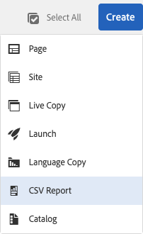

# Esportazione in formato CSV  {#export-to-csv}

**Crea rapporto CSV** consente di esportare le informazioni contenute nelle pagine in un file CSV nel sistema locale.

* Il nome del file scaricato è `export.csv`
* Il contenuto dipende dalle proprietà selezionate.
* Puoi definire il percorso e il livello di profondità dell’esportazione.

>[!NOTE]
>
>Vengono utilizzate la funzione di download e la destinazione predefinita del browser in uso.

La procedura guidata **Crea esportazione CSV** permette di selezionare:

* Proprietà da esportare
   * Metadati
      * Nome
      * Modificato
      * Pubblicato
      * Modello
      * Flusso di lavoro
   * Traduzione
      * Tradotto
   * Analytics
      * Visualizzazioni pagina
      * Visitatori univoci
      * Tempo sulla pagina
* Profondità
   * Percorso principale
   * Solo elementi figlio diretti
   * Livelli aggiuntivi di elementi figlio
   * Livelli

Il file `export.csv` risultante può essere aperto in Excel o in un’altra applicazione compatibile.

La creazione **Rapporto CSV** è disponibile quando esplori la pagina **Sites** console (nella vista a elenco): è un&#39;opzione del **Crea** menu a discesa:

Per creare un’esportazione CSV:

1. Apri la console **Sites** e passa alla posizione desiderata, se necessario.
1. Dalla barra degli strumenti, seleziona **Crea**, quindi **Rapporto CSV** per aprire la procedura guidata:

   

1. Seleziona le proprietà da esportare.
1. Seleziona **Crea**.
