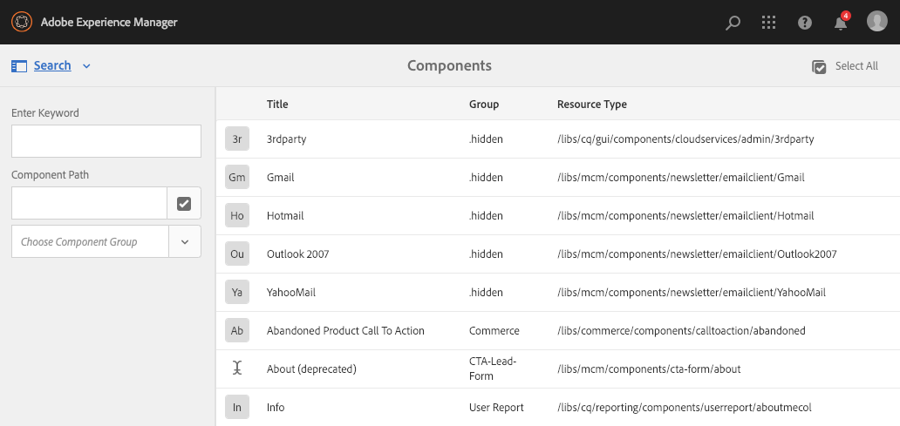

# Console Componenti{#components-console}

La console Componenti consente di sfogliare tutti i componenti definiti per l’istanza e visualizzare le informazioni chiave di ciascun componente.

È possibile accedervi da **Strumenti ->** **Generale ->** **Componenti**. Nella console sono disponibili le viste a schede e a elenco. Poiché non esiste una struttura ad albero per i componenti, la vista a colonne non è disponibile.

>[!NOTE]
>
>La console Componenti mostra tutti i componenti del sistema. Il [browser Componenti](/help/sites-authoring/author-environment-tools.md#components-browser) mostra i componenti disponibili per gli autori e nasconde eventuali gruppi di componenti che iniziano con un punto ( `.`).

## Ricerca {#searching}

L’icona **Solo contenuto** (in alto a sinistra) permette di aprire il pannello **Ricerca** per cercare e/o filtrare i componenti:

### Dettagli dei componenti {#component-details}

Per visualizzare i dettagli di un componente specifico, tocca o fai clic sulla risorsa richiesta. Tre schede forniscono:

* **Proprietà**

  

  Nella scheda Proprietà puoi:

   * Visualizzare le proprietà generali del componente.
   * Visualizza come [è stata definita un&#39;icona o un&#39;abbreviazione](/help/sites-developing/components-basics.md#component-icon-in-touch-ui) per il componente.

      * Facendo clic sull’origine dell’icona si aprirà quel componente.

   * Visualizza **Tipo di risorsa** e **Super Type risorsa** (se definito) per il componente.

      * Facendo clic sul Super Type della risorsa si aprirà quel componente.

  >[!NOTE]
  >
  >Poiché `/apps` non è modificabile in fase di esecuzione, la console Componenti è disponibile in sola lettura.

* **Criteri**

  

* **Utilizzo live**

  

  >[!CAUTION]
  >
  >A causa della natura delle informazioni raccolte, può essere necessario qualche momento per combinarle e visualizzarle.

* **Documentazione**

  Se lo sviluppatore ha fornito [documentazione del componente](/help/sites-developing/developing-components.md#documenting-your-component), apparirà sulla **Documentazione** scheda. Se la documentazione non è disponibile, la scheda **Documentazione** non verrà visualizzata.

  
