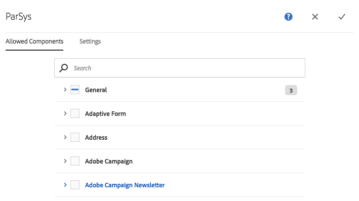
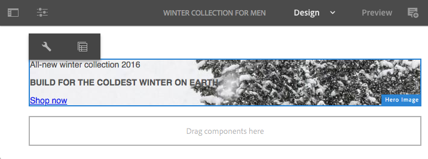

# Configurazione dei componenti predefiniti in modalità Progettazione{#configuring-components-in-design-mode}

Quando l’istanza AEM è installata come preconfigurata, una selezione di componenti è immediatamente disponibile nel browser Componenti.

Oltre a questi, sono disponibili vari altri componenti. È possibile utilizzare la modalità Progettazione per [attivare/disattivare tali componenti](#enable-disable-components). Se questa opzione è abilitata e si trova sulla pagina, è possibile utilizzare la modalità Progettazione per [configurare gli aspetti della progettazione del componente](#configuring-the-design-of-a-component) modificando i parametri degli attributi.

>[!NOTE]
>
>Presta attenzione quando modifichi questi componenti. Le impostazioni di progettazione sono spesso parte integrante della progettazione dell’intero sito web, pertanto devono essere modificate solo da un utente con i privilegi e l’esperienza appropriati, spesso un amministratore o uno sviluppatore. Consulta [Sviluppo di componenti](/help/sites-developing/components.md) per ulteriori informazioni.

>[!NOTE]
>
>La modalità Progettazione è disponibile solo per i modelli statici. I modelli creati con modelli modificabili devono essere modificati utilizzando [editor modelli](/help/sites-authoring/templates.md).

>[!NOTE]
>
>La modalità Progettazione è disponibile solo per le configurazioni di progettazione memorizzate come contenuto in ( `/etc`).
>
>A partire da AEM 6.4, si consiglia di memorizzare le progettazioni come dati di configurazione in `/apps` per supportare scenari di distribuzione continua. Progettazioni memorizzate in `/apps` non sono modificabili in fase di esecuzione e la modalità Progettazione non sarà disponibile per gli utenti non amministratori per tali modelli.

Ciò comporta l’aggiunta o la rimozione dei componenti consentiti nel sistema paragrafo per la pagina. Il sistema paragrafo ( `parsys`) è un componente composto che contiene tutti gli altri componenti paragrafo. Il sistema paragrafo consente agli autori di aggiungere a una pagina componenti di tipi diversi, in quanto contiene tutti gli altri componenti paragrafo. Ogni tipo di paragrafo è rappresentato come componente.

Ad esempio, il contenuto di una pagina di prodotto può contenere un sistema paragrafo con i seguenti elementi:

* Immagine del prodotto (sotto forma di immagine o paragrafo textimage)
* Descrizione del prodotto (come paragrafo di testo)
* Tabella con dati tecnici (come paragrafo di tabella)
* Compilazione di un modulo da parte degli utenti (come inizio del modulo, elemento del modulo e paragrafo finale del modulo)

>[!NOTE]
>
>Consulta [Sviluppo di componenti](/help/sites-developing/components.md) e [Linee guida per l’utilizzo di modelli e componenti](/help/sites-developing/dev-guidelines-bestpractices.md#guidelines-for-using-templates-and-components) per ulteriori informazioni su `parsys`.

>[!CAUTION]
>
>La modifica della progettazione utilizzando la modalità Progettazione come descritto in questo articolo è il metodo consigliato per definire le progettazioni di modelli statici
>
>La modifica dei progetti in CRX DE, ad esempio, non è una best practice e l’applicazione di tali progetti può variare rispetto al comportamento previsto. Consulta il documento per sviluppatori [Modelli di pagina - Statici](/help/sites-developing/page-templates-static.md#how-template-designs-are-applied) per ulteriori informazioni.

## Abilita/Disabilita componenti {#enable-disable-components}

Per attivare o disattivare un componente:

1. Seleziona la **Progettazione** modalità.

   

1. Fai clic su un componente. Se selezionato, il componente presenta un bordo blu.

   

1. Fai clic su **Elemento padre** icona.

   

   In questo modo viene selezionato il sistema paragrafo contenente il componente corrente.

1. Il **Configura** nella barra delle azioni dell&#39;elemento padre viene visualizzata l&#39;icona del sistema paragrafo.

   

   Seleziona questa opzione per visualizzare la finestra di dialogo.

1. Utilizza la finestra di dialogo per definire i componenti disponibili nel browser Componenti durante la modifica della pagina corrente.

   

   La finestra di dialogo ha due schede:

   * Componenti consentiti
   * Impostazioni

   **Componenti consentiti**

   Il giorno **Componenti consentiti** , puoi definire quali componenti sono disponibili per parsys.

   * I componenti sono raggruppati in base ai rispettivi gruppi di componenti, che possono essere espansi e compressi.
   * È possibile selezionare un intero gruppo selezionando il nome del gruppo e deselezionando tutti gli elementi.
   * Il segno meno significa che è stato selezionato almeno un elemento del gruppo, ma non tutti.
   * È disponibile una ricerca per filtrare un componente in base al nome.
   * I numeri elencati a destra del nome del gruppo di componenti rappresentano il numero totale di componenti selezionati in tale gruppo indipendentemente dal filtro.

   Puoi definire la configurazione per ogni componente pagina. Se le pagine figlie utilizzano lo stesso modello e/o componente pagina (solitamente allineato), la stessa configurazione verrà applicata al sistema paragrafo corrispondente.

   >[!NOTE]
   >
   >I componenti dei moduli adattivi sono progettati per funzionare all’interno del Contenitore di moduli adattivi e utilizzare l’ecosistema Forms. Pertanto, questi componenti devono essere utilizzati solo nell’editor di moduli adattivi e non funzioneranno nell’editor di pagine Sites.

   **Impostazioni**

   Il giorno **Impostazioni** scheda puoi definire opzioni aggiuntive, ad esempio per disegnare un ancoraggio per ciascun componente e per definire la spaziatura interna delle celle di ciascun contenitore.

1. Seleziona **Fine** per salvare la configurazione.

## Configurazione della progettazione di un componente {#configuring-the-design-of-a-component}

1. Seleziona la **Progettazione** modalità.

   

1. Fai clic su un componente con un bordo blu. In questo esempio, viene selezionato un componente immagine protagonista.

   

1. Utilizza il **Configura** per aprire la finestra di dialogo.

   

   Nella finestra di dialogo per progettazione puoi configurare il componente in base ai parametri di progettazione disponibili.

   

   La finestra di dialogo ha tre schede:

   * Principale
   * Funzioni
   * Stili

   **Proprietà**

   Il **Proprietà** Questa scheda ti consente di configurare i parametri di progettazione importanti del componente. Ad esempio, per un componente immagine puoi definire le dimensioni minima e massima consentite per l’immagine.

   **Funzioni**

   Il **Funzioni** Questa scheda ti consente di abilitare o disabilitare funzioni aggiuntive del componente. Ad esempio, per un componente immagine puoi definire l’orientamento dell’immagine, le opzioni di ritaglio disponibili e se è possibile caricare un’immagine.

   **Stili**

   Il **Stili** Questa scheda ti consente di definire le classi e gli stili CSS da utilizzare con il componente.

   

   Utilizza il **Aggiungi** per aggiungere altre voci a un elenco di finestre di dialogo a più voci.

   

   Utilizza il **Elimina** per rimuovere una voce da un elenco di finestre di dialogo a più voci.

   

   Utilizza il **Sposta** per modificare l&#39;ordine delle voci in un elenco di finestre di dialogo a più voci.

   

1. Fai clic su **Fine** per salvare e chiudere la finestra.
