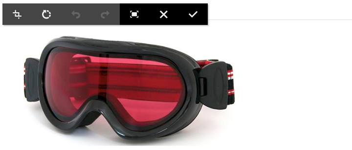
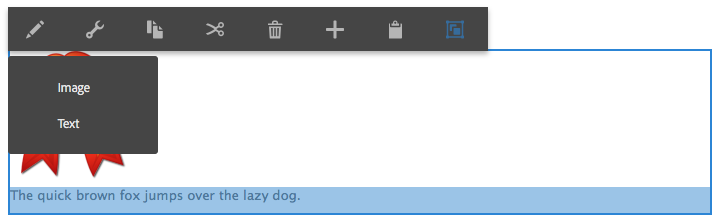
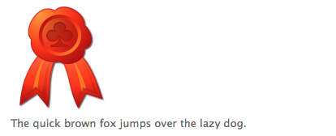

# Componenti di base {#foundation-components}

>[!CAUTION]
>
>La maggior parte dei componenti di base è ora obsoleta con AEM 6.5. Consulta la [note sulla versione](/help/release-notes/deprecated-removed-features.md) per ulteriori informazioni.
>
>L’Adobe consiglia di utilizzare il più moderno ed estensibile [Componenti core](https://experienceleague.adobe.com/docs/experience-manager-core-components/using/introduction.html?lang=it) nei progetti AEM. Questi componenti fanno parte di [Contenuto di esempio We.Retail](/help/sites-developing/we-retail.md) e possono anche essere [installato separatamente e utilizzato per lo sviluppo](https://experienceleague.adobe.com/docs/experience-manager-core-components/using/get-started/using.html) dall’amministratore.
>
>È possibile utilizzare [Suite di strumenti di modernizzazione AEM](https://opensource.adobe.com/aem-modernize-tools/) per eseguire il refactoring del sito basato su Componenti di base in modo da utilizzare i Componenti core.

I componenti di base sono stati progettati per l’utilizzo durante l’authoring di contenuti per una pagina web standard. Costituiscono un sottoinsieme dei componenti disponibili come standard per un’installazione standard dell’AEM.

Alcune sono immediatamente disponibili tramite il browser Componenti. Sono disponibili varie altre opzioni utilizzando [modalità progettazione](/help/sites-authoring/default-components-designmode.md) (se la pagina si basa su un modello statico) o da [modifica del modello](/help/sites-authoring/templates.md) (se la pagina è basata su un modello modificabile).

L’utilizzo dei componenti di base è supportato, ma nella maggior parte dei casi sono stati dichiarati obsoleti e sostituiti dai Componenti core, che offrono maggiore estensibilità e flessibilità.

>[!NOTE]
>
>In questa sezione vengono descritti solo i componenti disponibili come predefiniti in un’installazione standard per AEM.
>
>A seconda dell’istanza, è possibile che siano stati sviluppati in modo esplicito componenti personalizzati in base alle proprie esigenze. Questi componenti personalizzati possono anche avere lo stesso nome di alcuni dei componenti discussi qui.

I componenti sono disponibili nel **Componenti** del pannello laterale dell’editor di pagine quando [modifica di una pagina](/help/sites-authoring/editing-content.md).

Puoi selezionare un componente e trascinarlo nella posizione desiderata sulla pagina. Puoi quindi modificarlo utilizzando:

* [Configura proprietà](/help/sites-authoring/editing-page-properties.md)
* [Modifica contenuto](/help/sites-authoring/editing-content.md)

* [Modifica contenuto - Modalità a tutto schermo](/help/sites-authoring/editing-content.md#edit-content-full-screen-mode)

I componenti sono ordinati in base alle varie categorie, denominate gruppi di componenti, tra cui:

* [Generale](#general): include componenti di base quali testo, immagini, tabelle e grafici.
* [Colonne](#columns): include i componenti necessari per organizzare il layout del contenuto.
* [Modulo](#formgroup): include tutti i componenti necessari per creare un modulo.

## Generale {#general}

I componenti generali sono i componenti di base utilizzati per creare il contenuto.

### Elemento account {#account-item}

>[!CAUTION]
>
>Questo componente di base è obsoleto. L’Adobe consiglia di utilizzare [Componenti core](https://experienceleague.adobe.com/docs/experience-manager-core-components/using/introduction.html?lang=it) invece.

Puoi definire un collegamento con titolo e descrizione.


### Immagine adattiva {#adaptive-image}

>[!CAUTION]
>
>Questo componente di base è obsoleto. L’Adobe consiglia di utilizzare [Componente core immagine](https://experienceleague.adobe.com/docs/experience-manager-core-components/using/wcm-components/image.html?lang=it) invece.

Il componente Adaptive Image Foundation genera immagini di dimensioni adatte alla finestra in cui viene aperta la pagina web. Per utilizzare il componente, devi fornire una risorsa immagine dal file system o da DAM. Quando la pagina Web viene aperta, il browser scarica una copia dell&#39;immagine che è stata ridimensionata in modo che sia adatta alla finestra corrente.

Le seguenti caratteristiche possono determinare le dimensioni della finestra:

* Schermata del dispositivo: i dispositivi mobili in genere visualizzano pagine web in modo che si estendano sull’intero schermo.
* Dimensioni della finestra del browser Web: gli utenti di computer portatili e desktop possono ridimensionare le finestre del browser Web.

Ad esempio, il componente genera un’immagine piccola quando la pagina web viene aperta su un telefono cellulare e un’immagine di medie dimensioni quando viene aperta su un tablet. Su un laptop, il componente crea e distribuisce un’immagine di grandi dimensioni quando la pagina viene aperta in un browser web ingrandito. Quando il browser web viene ridimensionato per adattarsi a una parte dello schermo, il componente si adatta distribuendo un’immagine più piccola e aggiorna la visualizzazione.

#### Formati immagine supportati {#supported-image-formats}

Con il componente Immagine adattiva è possibile utilizzare i file immagine con le seguenti estensioni di file:

* .jpg
* .jpeg
* .png
* .gif &#42;&#42;

>[!CAUTION]
>
>I file GIF animati non sono supportati nell’AEM per le rappresentazioni adatte.

#### Dimensioni e qualità delle immagini {#images-sizes-and-quality}

Nella tabella seguente viene elencata la larghezza dell&#39;immagine generata per la larghezza del riquadro di visualizzazione specificata. L’altezza dell’immagine generata viene calcolata in modo da mantenere proporzioni costanti e non viene inserito alcuno spazio all’interno del bordo dell’immagine. Il ritaglio può essere utilizzato per evitare spazi vuoti.

Quando l&#39;immagine è un&#39;immagine JPEG, anche le dimensioni del riquadro di visualizzazione possono influenzare la qualità del JPEG. Sono possibili le seguenti qualità di JPEG:

* Bassa (0,42)
* Medio (0,82)
* Alta (1,00)

| **Intervallo larghezza riquadro di visualizzazione (pixel)** | **Larghezza immagine (pixel)** | **Qualità JPEG** | **Tipo di dispositivo di destinazione** |
|---|---|---|---|
| larghezza &lt;= 319 | 320 | bassa |  |
| larghezza = 320 | 320 | media | Telefono cellulare (verticale) |
| 320 &lt; larghezza &lt; 481 | 480 | media | Telefono cellulare (orizzontale) |
| 480 &lt; larghezza &lt; 769 | 476 | alta | Tablet (verticale) |
| 768 &lt; larghezza &lt; 1025 | 620 | alta | Tablet (orizzontale) |
| larghezza &lt;= 1025 | pieno (dimensioni originali) | alta | Desktop |

#### Proprietà {#properties}

La finestra di dialogo consente di modificare le proprietà dell’istanza del componente Immagine adattiva, molte delle quali sono comuni al componente Immagine su cui si basa. Le proprietà sono disponibili in due schede:

* **Immagine**

   * **Immagine**
Trascina un&#39;immagine dal Finder del contenuto o fai clic per aprire una finestra di navigazione in cui puoi caricare un&#39;immagine. Una volta caricata l&#39;immagine, è possibile ritagliarla, ruotarla o eliminarla. Per ingrandire e ridurre l&#39;immagine, utilizzare la barra di scorrimento sotto l&#39;immagine (sopra i pulsanti OK e Annulla)

   * **Ritaglio**
Ritaglia parte di un&#39;immagine. Trascinate il bordo per tagliare l&#39;immagine.

   * **Ruota**
Fare clic su Ruota ripetutamente fino a quando l&#39;immagine non viene ruotata come desiderato.

   * **Cancella**
Rimuove l&#39;immagine corrente.

* **Avanzate**

   * **Titolo**
Il componente Immagine adattiva non utilizza questa proprietà.

   * **Testo alternativo**
Testo alternativo da utilizzare per l&#39;immagine.

   * **Collega a**
Il componente Immagine adattiva non utilizza questa proprietà.

   * **Descrizione**
Il componente Immagine adattiva non utilizza questa proprietà.

#### Estensione del componente Immagine adattiva {#extending-the-adaptive-image-component}

Per informazioni sulla personalizzazione del componente Immagine adattiva, consulta [Informazioni sul componente Immagine adattiva](/help/sites-developing/responsive.md#using-adaptive-images).

### Carosello {#carousel}

>[!CAUTION]
>
>Questo componente di base è obsoleto. L’Adobe consiglia di utilizzare [Componente core Carosello](https://experienceleague.adobe.com/docs/experience-manager-core-components/using/wcm-components/carousel.html?lang=it) invece.

Il componente Carosello consente di visualizzare le immagini associate alle singole pagine:

* uno alla volta
* per un breve periodo
* in un ordine specificato
* con un ritardo di tempo specificato

I controlli selezionabili consentono inoltre all&#39;utente di scorrere le pagine visualizzate in tempo reale, su richiesta. Selezionando l’immagine della pagina attualmente visibile viene visualizzata la pagina corrispondente. In altre parole, il carosello funge da controllo di navigazione.

#### Proprietà {#properties-1}

Queste proprietà sono disponibili in due schede:

* **Carosello**
Qui puoi specificare come funziona il carosello:

   * Velocità di riproduzione Tempo in millisecondi prima della visualizzazione della diapositiva successiva.
   * Tempo di transizione Tempo in millisecondi per la transizione tra due diapositive.
   * Stile controlli Sono disponibili varie opzioni da un menu a discesa, ad esempio Pulsanti prec/succ e Opzioni in alto a destra.

* **Elenco**

   Qui puoi specificare in che modo le pagine vengono incluse nel carosello:

   * **Genera elenco con**
Esistono diversi modi per creare un elenco di pagine: pagine figlie, elenco fisso, ricerca o ricerca avanzata (tutti descritti di seguito).
Indipendentemente dal metodo scelto, le pagine incluse nell’elenco devono già avere un’immagine associata alla pagina. Questa immagine viene visualizzata nel carosello. Se non è presente alcuna immagine per una determinata pagina nelle Proprietà pagina di tale pagina, è necessario associare un’immagine alla pagina prima di iniziare. In caso contrario, nel carosello viene visualizzata una pagina vuota. Consulta [Modifica delle proprietà di una pagina](/help/sites-authoring/editing-page-properties.md).
A seconda dell’elemento scelto, viene visualizzato un nuovo pannello:

      * **Opzioni per le pagine secondarie**

         * **Pagina padre**
Specifica un percorso manualmente o utilizzando il selettore. Lascia vuoto per usare la pagina corrente come pagina padre.
      * **Opzioni per elenco fisso**

         * **Pagine**
Seleziona un elenco di pagine. Utilizzare 
`+` per aggiungere altre voci e i pulsanti su/giù per regolare l&#39;ordine.
      * **Opzioni per la ricerca**

         * **Inizia in**
Immetti un percorso iniziale, manualmente o utilizzando il selettore.

         * **Query di ricerca**
È possibile immettere una query di ricerca in testo normale.
      * **Opzioni di ricerca avanzata**

         * **Notazione predicato Querybuilder**
È possibile immettere una query di ricerca utilizzando la notazione del predicato Querybuilder. Ad esempio, puoi immettere &quot;fulltext=Marketing&quot; per far sì che tutte le pagine il cui contenuto contiene &quot;Marketing&quot; vengano visualizzate nel carosello.
Consulta [API QueryBuilder](/help/sites-developing/querybuilder-api.md) per una discussione completa delle espressioni di query e ulteriori esempi.
   * **Ordina per**
Seleziona 
`jcr:title`, `jcr:created`, `cq:lastModified`, o `cq:template` dal menu a discesa.

   * **Limite**
Facoltativo. Il numero massimo di elementi da utilizzare nel carosello.


>[!NOTE]
>
>Puoi creare un componente carosello personalizzato per Adobe Experience Manager che visualizzi le risorse digitali nel DAM AEM. Consulta [Creazione di componenti Carosello personalizzati per Adobe Experience Manager](https://experienceleague.adobe.com/docs/experience-manager-learn/getting-started-wknd-tutorial-develop/overview.html?lang=en).

### Grafico {#chart}

>[!CAUTION]
>
>Questo componente di base è obsoleto. L’Adobe consiglia di utilizzare [Componenti core](https://experienceleague.adobe.com/docs/experience-manager-core-components/using/introduction.html?lang=it) invece.

Il componente Grafico consente di aggiungere un grafico a barre, a linee o a torta. AEM crea un grafico a partire dai dati forniti. I dati vengono forniti digitandoli direttamente nella scheda Dati oppure copiando e incollando un foglio di calcolo.

* **Dati**

   * **Dati grafico**
Immetti i dati del grafico utilizzando il formato CSV; il formato Valori separati da virgole utilizza le virgole (&quot;,&quot;) come separatore di campo.

* **Avanzate**

   * **Tipo di grafico**
Selezionare Grafico a torta, Grafico a linee e Grafico a barre.

   * **Testo alternativo**
Visualizza testo alternativo anziché il grafico.

   * **Larghezza**
Larghezza del grafico in pixel.

   * **Altezza**
Altezza del grafico in pixel.

Di seguito è riportato un esempio di dati del grafico seguito dal grafico a barre risultante:

 

>[!NOTE]
>
>Puoi creare un controllo grafico dell’AEM personalizzato che visualizzi i dati nel JCR dell’AEM. Per informazioni, consulta [Visualizzazione dei dati di Adobe Experience Manager in un grafico](https://experienceleague.adobe.com/docs/experience-manager-learn/getting-started-wknd-tutorial-develop/overview.html?lang=en).

### Frammenti di contenuto {#content-fragment}

>[!CAUTION]
>
>Questo componente di base è obsoleto. L’Adobe consiglia di utilizzare [Componente core Frammento di contenuto](https://experienceleague.adobe.com/docs/experience-manager-core-components/using/wcm-components/content-fragment-component.html?lang=it) invece.

[Frammenti di contenuto](/help/sites-authoring/content-fragments.md) vengono create e gestite come risorse indipendenti dalla pagina. Puoi quindi utilizzare questi frammenti, con le relative varianti, durante l’authoring di pagine di contenuto.

### Importazione progettazione {#design-importer}

>[!CAUTION]
>
>Questo componente di base è obsoleto. L’Adobe consiglia di utilizzare [Componenti core](https://experienceleague.adobe.com/docs/experience-manager-core-components/using/introduction.html?lang=it) invece.

Questo componente consente di caricare un file zip contenente un pacchetto di progettazione.

### Scarica {#download}

>[!CAUTION]
>
>Questo componente di base è obsoleto. L’Adobe consiglia di utilizzare [Componenti core](https://experienceleague.adobe.com/docs/experience-manager-core-components/using/introduction.html?lang=it) invece.

Il componente Scarica crea un collegamento nella pagina web selezionata per scaricare un file specifico. Puoi trascinare una risorsa da Content Finder o caricare un file.

* **Download**

   * **Descrizione**
Breve descrizione visualizzata con il collegamento per il download.

   * **File**
Il file è disponibile per il download nella pagina Web risultante. Trascina una risorsa dal Finder del contenuto o seleziona l’area in modo da poter caricare il file da scaricare.

L’esempio seguente mostra il componente Scarica in Geometrixx:


### Esterno {#external}

>[!CAUTION]
>
>Questo componente di base è obsoleto. L’Adobe consiglia di utilizzare [Componenti core](https://experienceleague.adobe.com/docs/experience-manager-core-components/using/introduction.html?lang=it) invece.

Componente di integrazione dell&#39;applicazione esterna (**Esterno**) consente di incorporare applicazioni esterne nella pagina AEM utilizzando un iframe.

* **Esterno**

   * **Applicazione di destinazione**
Specifica l’URL dell’applicazione web da integrare, ad esempio:

      ```
      https://en.wikipedia.org/wiki/Main_Page
      ```

   * **Trasmettere i parametri**
Seleziona la casella per i parametri da trasmettere all&#39;applicazione quando necessario.

   * **Larghezza e altezza **definiscono le dimensioni dell’iframe

L’applicazione esterna è integrata nel sistema paragrafo della pagina AEM; ad esempio, quando si utilizza un’applicazione Target di `https://en.wikipedia.org/wiki/Main_Page`:


>[!NOTE]
>
>A seconda del caso d’uso, sono disponibili altre opzioni per l’integrazione di applicazioni esterne, ad esempio [Integrazione dei portlet](/help/sites-administering/aem-as-portal.md).

### Flash {#flash}

>[!CAUTION]
>
>Questo componente di base è obsoleto. L’Adobe consiglia di utilizzare [Componenti core](https://experienceleague.adobe.com/docs/experience-manager-core-components/using/introduction.html?lang=it) invece.

>[!CAUTION]
>
>Non è più previsto che questo componente funzioni come preconfigurato senza un’ampia personalizzazione a livello di progetto.

Il componente Flash consente di caricare un filmato del Flash. Puoi trascinare una risorsa flash dal Finder contenuto al componente, oppure puoi utilizzare la finestra di dialogo:

* **Flash**

   * **Filmato Flash**

      Il file del filmato flash. Trascina una risorsa da Content Finder oppure fai clic su per aprire una finestra.

   * **Dimensione**

      Dimension in pixel dell&#39;area di visualizzazione che contiene il filmato.

* **Immagine alternativa**

   Immagine alternativa da visualizzare

* **Avanzate**

   * **Menu di scelta rapida**

      Indica se visualizzare o nascondere il menu di scelta rapida.

   * **Modalità finestra**

      Modalità di visualizzazione della finestra, ad esempio opaca, trasparente o come finestra distinta (solida).

   * **Colore sfondo**

      Colore di sfondo selezionato dalla tabella colori fornita.

   * **Versione minima**

      La versione minima del Flash Player Adobe necessaria per eseguire il filmato. Il valore predefinito è 9.0.0.

   * **Attributi**

      Eventuali altri attributi richiesti.

### Immagine {#image}

>[!CAUTION]
>
>Questo componente di base è obsoleto. L’Adobe consiglia di utilizzare [Componente core immagine](https://experienceleague.adobe.com/docs/experience-manager-core-components/using/wcm-components/image.html?lang=it) invece.

Il componente Immagine visualizza un’immagine e il testo che la accompagna in base ai parametri specificati.

Puoi caricare un’immagine, quindi modificarla e manipolarla (ad esempio ritagliarla, ruotarla, aggiungere un collegamento/titolo/testo).

È possibile trascinare un&#39;immagine dalla [Browser risorse](/help/sites-authoring/author-environment-tools.md#assets-browser) direttamente sul componente o sui relativi [Finestra di dialogo per configurazione](/help/sites-authoring/editing-content.md#component-edit-dialog). Puoi anche caricare un’immagine dalla finestra di dialogo Configura, che controlla anche tutte le definizioni e le manipolazioni dell’immagine:


Dopo il caricamento dell’immagine (e non prima), puoi utilizzare [modifica diretta](/help/sites-authoring/editing-content.md#edit-content) per ritagliare/ruotare l&#39;immagine come richiesto:



>[!NOTE]
>
>L’editor locale utilizza le dimensioni e le proporzioni originali dell’immagine durante la modifica. È inoltre possibile specificare le proprietà relative all&#39;altezza e alla larghezza. Tutte le restrizioni relative a dimensioni e proporzioni definite nelle proprietà vengono applicate quando si salvano le modifiche.
>
>A seconda dell’istanza, è possibile che anche il numero minimo e massimo di [progettazione della pagina](/help/sites-developing/designer.md). Queste restrizioni vengono sviluppate durante l’implementazione del progetto.

Nella modalità di modifica a schermo intero sono disponibili diverse opzioni aggiuntive, ad esempio mappa e zoom:


>[!NOTE]
>
>Impossibile monitorare l’avanzamento del caricamento con Internet Explorer.
>
>Gli utenti di Internet Explorer devono caricare l&#39;immagine e fare clic su **Ok**, quindi riapri l’immagine per visualizzare il file caricato nell’anteprima e per poter eseguire le modifiche (ovvero, il ritaglio).
>
>Consulta la [Piattaforme certificate](/help/release-notes/release-notes.md#certifiedplatforms) per ulteriori informazioni sulle funzioni HTML5 utilizzate dall’AEM.

Quando viene caricata un’immagine, puoi configurare quanto segue:

* **Mappa**

   Per mappare un&#39;immagine, selezionare Mappa. È possibile specificare la modalità di creazione della mappa immagine (rettangolo, poligono e così via) e il punto a cui deve puntare l&#39;area.

* **Ritaglia**

   Per ritagliare una parte di un&#39;immagine, selezionate Ritaglia. Utilizzare il mouse per ritagliare l&#39;immagine.

* **Rotazione**

   Per ruotare un&#39;immagine, selezionare Ruota. Usare ripetutamente fino a quando l&#39;immagine non viene ruotata nel modo desiderato.

* **Cancella**

   Rimuove l&#39;immagine corrente.

* **Titolo**

   Titolo dell&#39;immagine.

* **Testo Alt**

   Testo alternativo da utilizzare per la creazione di contenuto accessibile.

* **Collega a**

   Crea un collegamento alle risorse o ad altre pagine del tuo sito web.

* **Descrizione**

   Descrizione dell&#39;immagine.

* **Dimensione**

   Imposta l&#39;altezza e la larghezza dell&#39;immagine.

>[!NOTE]
>
>Alcune opzioni sono disponibili solo nell’editor a schermo intero.

Immagine finale (con **Titolo** e **Descrizione**) può essere visualizzato come:


### Contenitore di layout {#layout-container}

Questo componente fornisce un sistema paragrafo a griglia che consente di aggiungere e posizionare componenti all&#39;interno di un [griglia reattiva](/help/sites-authoring/responsive-layout.md). È possibile definire layout di contenuto diversi in base alla larghezza dei dispositivi di destinazione, inclusi telefoni, tablet e desktop.


>[!NOTE]
>
>Questo componente è stato implementato con [HTL (HTML Template Language)](https://experienceleague.adobe.com/docs/experience-manager-htl/using/overview.html?lang=it).

### Elenco {#list}

>[!CAUTION]
>
>Questo componente di base è obsoleto. L’Adobe consiglia di utilizzare [Componente core elenco](https://experienceleague.adobe.com/docs/experience-manager-core-components/using/wcm-components/list.html) invece.

Il componente Elenco consente di configurare i criteri di ricerca per la visualizzazione di un elenco:

* **Elenco**

   * **Genera elenco con**

      Qui si specifica dove l’elenco recupera il contenuto. Esistono diversi metodi:

   * A seconda dell’elemento scelto, viene visualizzato un nuovo pannello:

      * **Opzioni per le pagine secondarie**

         * **Elementi figlio di** (Pagina padre)

            Specifica un percorso manualmente o utilizzando il selettore. Lascia vuoto per usare la pagina corrente come pagina padre.
      * **Opzioni per elenco fisso**

         * **Pagine**

            Seleziona un elenco di pagine. Utilizza + per aggiungere altre voci e i pulsanti Su/Giù per regolare l’ordine.
      * **Opzioni per la ricerca**

         * Inizia in

            Immetti un percorso iniziale, manualmente o utilizzando il selettore.

         * Query di ricerca

            È possibile immettere una query di ricerca in testo normale.
      * **Opzioni di ricerca avanzata**

         * **Notazione predicato Querybuilder**

            È possibile immettere una query di ricerca utilizzando la notazione del predicato Querybuilder. Ad esempio, puoi immettere &quot;fulltext=Marketing&quot; per far sì che tutte le pagine il cui contenuto contiene &quot;Marketing&quot; vengano visualizzate nel carosello.

            Consulta [API QueryBuilder](/help/sites-developing/querybuilder-api.md) per una discussione completa delle espressioni di query e ulteriori esempi.
      * **Tag**

         Specifica la **Pagina padre**, **Tag/Parole chiave** e i criteri di corrispondenza richiesti.
   * **Visualizza come**

      Come desideri che gli elementi vengano elencati; include collegamenti, teaser e notizie.

   * **Ordina per**

      Indica se l’elenco deve essere ordinato e, in tal caso, i criteri da utilizzare per l’ordinamento. Puoi inserire un criterio o selezionarne uno dall’elenco a discesa fornito.

   * **Limite**

      Specifica il numero massimo di elementi da visualizzare nell’elenco.

   * **Abilita feed**

      Indica se per l&#39;elenco deve essere attivato un feed RSS.

   * **Paginare dopo**

      Qui puoi specificare il numero di voci di elenco da visualizzare contemporaneamente. Un elenco con un numero di elementi superiore a quello specificato utilizza la paginazione per visualizzare l’elenco in diverse parti.


L’esempio seguente mostra una **Elenco** componenti il modo in cui può visualizzare un elenco di pagine figlie (la progettazione è controllata dalle definizioni CSS personalizzate di una progettazione del sito).


### Accesso {#login}

>[!CAUTION]
>
>Questo componente di base è obsoleto. L’Adobe consiglia di utilizzare [Componenti core](https://experienceleague.adobe.com/docs/experience-manager-core-components/using/introduction.html?lang=it) invece.

>[!CAUTION]
>
>Non è più previsto che questo componente funzioni come preconfigurato senza un’ampia personalizzazione a livello di progetto.

Fornisce i campi Nome utente e Password.


Puoi configurare:

* Accesso

   * Etichetta sezione

      Testo lead-in per i campi di input.

   * Etichetta nome utente

      Testo per etichettare il campo del nome utente.

   * Etichetta password

      Testo per etichettare il campo password.

   * Etichetta pulsante Accesso

      Testo per il pulsante di accesso.

   * Reindirizza a

      Puoi specificare la pagina del tuo sito web che deve essere aperta una volta che l’utente ha effettuato l’accesso.

* Accesso già effettuato

   * Etichetta pulsante Continua

      Testo per indicare che l&#39;utente ha già eseguito l&#39;accesso.

### Stato ordine {#order-status}

>[!CAUTION]
>
>Non è più previsto che questo componente funzioni come preconfigurato senza un’ampia personalizzazione a livello di progetto.

* **Titolo**

   * **Titolo**

      Specificare il testo del titolo da visualizzare.

   * **Collegamento**

      Specifica la pagina (prodotto) per la quale visualizzare lo stato dell’ordine.

   * **Tipo/Dimensione**

      Seleziona dalla selezione fornita.


### Riferimento {#reference}

>[!CAUTION]
>
>Questo componente di base è obsoleto. L’Adobe consiglia di utilizzare [Componente core Frammento di contenuto](https://experienceleague.adobe.com/docs/experience-manager-core-components/using/wcm-components/content-fragment-component.html?lang=it) invece.

Il **Riferimento** consente di fare riferimento al testo da un’altra pagina del sito web AEM (nell’istanza corrente). Il contenuto del paragrafo a cui si fa riferimento viene quindi visualizzato come se si trovasse nella pagina corrente. Il contenuto viene aggiornato quando il paragrafo sorgente cambia (potrebbe essere necessario aggiornare la pagina).

* **Riferimento paragrafo**

   * **Riferimento**

      Specifica il percorso della pagina e del paragrafo a cui desideri fare riferimento (includi contenuto).

Per specificare il percorso di un paragrafo, è necessario aggiungere al percorso (della pagina) il suffisso:

`.../jcr:content/par/<paragraph-ID>`

Ad esempio:

`/content/geometrixx-outdoors/en/equipment/biking/cajamara/jcr:content/par/similar-products`

Oltre a fare riferimento a un paragrafo specifico, il percorso può anche essere modificato per specificare un intero par-system. A tale scopo, aggiungete al percorso i seguenti suffissi:

`/jcr:content/par`

Ad esempio:

`/content/geometrixx-outdoors/en/equipment/biking/cajamara/jcr:content/par`

Dopo la configurazione, il contenuto viene visualizzato esattamente come nella pagina sorgente. Il fatto che si tratti di un riferimento viene visualizzato solo quando apri il componente per la modifica:


### Ricerca {#searching}

>[!CAUTION]
>
>Questo componente di base è obsoleto. L’Adobe consiglia di utilizzare [Componente core Ricerca rapida](https://experienceleague.adobe.com/docs/experience-manager-core-components/using/wcm-components/quick-search.html) invece.

Il componente Ricerca aggiunge la funzionalità di ricerca alla pagina.

Puoi configurare:

* Ricerca

   * **Tipi di nodo**

      Se la ricerca deve essere limitata a un tipo di nodo specifico, elencali qui; ad esempio, `cq:Page`.

   * **Percorso di ricerca**

      Specifica la pagina principale del ramo in cui desideri eseguire la ricerca.

   * **Testo pulsante Cerca**

      Il nome visualizzato sul pulsante di ricerca effettivo.

   * **Testo statistiche**

      Testo visualizzato sopra i risultati della ricerca.

   * **Testo Nessun risultato**

      Se non sono presenti risultati, viene visualizzato il testo immesso.

   * **Controllo ortografia del testo**

      Se qualcuno immette un termine simile, questo testo viene visualizzato prima del termine.
Ad esempio, se si digita `Geometrixxe`, il sistema visualizza la scritta &quot;Si intendeva? Geometrixx&quot;.

   * **Testo per pagine simili**

      Testo visualizzato accanto a un risultato per pagine simili. Per visualizzare pagine con contenuto simile, fare clic su questo collegamento.

   * **Testo ricerche correlate**

      Testo visualizzato accanto alla ricerca di termini e argomenti correlati.

   * **Testo tendenze ricerca**

      Il titolo sopra i termini di ricerca immessi da un utente.

   * **Etichetta pagine risultati**

      Testo visualizzato in fondo all&#39;elenco con collegamenti ad altre pagine dei risultati.

   * **Etichetta precedente**

      Il nome visualizzato sul collegamento alle pagine di ricerca precedenti.

   * **Etichetta successiva**

      Nome visualizzato sul collegamento alle pagine di ricerca successive.

L’esempio seguente mostra il componente Ricerca dopo aver cercato la parola *`geometrixx`* dalla directory principale di un&#39;installazione standard. Illustra inoltre l’impaginazione dei risultati:


L’esempio seguente mostra un termine di ricerca errato e non disponibile:


### Sitemap {#sitemap}

>[!CAUTION]
>
>Questo componente di base è obsoleto. L’Adobe consiglia di utilizzare [Navigazione](https://experienceleague.adobe.com/docs/experience-manager-core-components/using/wcm-components/navigation.html), [Navigazione lingua](https://experienceleague.adobe.com/docs/experience-manager-core-components/using/wcm-components/language-navigation.html), e [Componenti core Breadcrumb](https://experienceleague.adobe.com/docs/experience-manager-core-components/using/wcm-components/breadcrumb.html) invece.

Un elenco automatico di sitemap, che (con le impostazioni predefinite) elenca tutte le pagine (come collegamenti attivi) nel sito web corrente. Ad esempio, un estratto mostra:


Se necessario, puoi configurare quanto segue:

* **Sitemap**

   * **Percorso directory principale**

      Percorso da cui deve iniziare l’inserzione.

### Presentazione {#slideshow}

>[!CAUTION]
>
>Questo componente di base è obsoleto. L’Adobe consiglia di utilizzare [Componente core Carosello](https://experienceleague.adobe.com/docs/experience-manager-core-components/using/wcm-components/carousel.html?lang=it) invece.

>[!CAUTION]
>
>Non è più previsto che questo componente funzioni come preconfigurato senza un’ampia personalizzazione a livello di progetto.

Questo componente consente di caricare una serie di immagini da visualizzare come presentazione sulla pagina. È possibile aggiungere o rimuovere immagini e assegnarvi un titolo. In Avanzate è inoltre possibile specificare le dimensioni dell&#39;area di visualizzazione.

Puoi configurare:

* **Diapositive**

   * **Nuova diapositiva**

      È possibile specificare una selezione di diapositive utilizzando **Aggiungi** (e **Rimuovi**).

   * **Titolo**

      Se necessario, specifica un titolo. Il titolo viene sovrapposto sulla diapositiva appropriata.

* **Avanzate**

   * **Dimensione**

      Specifica la larghezza e l&#39;altezza in pixel.

Il componente Presentazione visualizza ripetutamente ogni diapositiva in sequenza, per un breve periodo di tempo, prima di passare alla diapositiva successiva:


### Tabella {#table}

>[!CAUTION]
>
>Questo componente di base è obsoleto. L’Adobe consiglia di utilizzare [Componente core testo](https://experienceleague.adobe.com/docs/experience-manager-core-components/using/wcm-components/text.html) invece.

>[!NOTE]
>
>Il **Tabella** Il componente di base è basato su [Editor Rich Text](/help/sites-authoring/rich-text-editor.md), così come lo è il **[Testo](#text)** Componente di base.

Il **Tabella** Il componente è preconfigurato per consentire la costruzione, il riempimento e la formattazione di una tabella. La finestra di dialogo consente di configurare la tabella e crearne il contenuto in uno dei modi seguenti:

* da zero
* copiare e incollare un foglio di calcolo o una tabella da un editor esterno, ad esempio Excel, OpenOffice e Blocco note.

Puoi apportare modifiche di base al contenuto utilizzando l’editor in linea:


In modalità a tutto schermo è possibile configurare il layout della tabella:


La schermata seguente mostra un esempio del componente tabella; la progettazione è determinata dal CSS specifico per il sito:


### Tag cloud {#tag-cloud}

Una nuvola di tag mostra una selezione presentata graficamente dei tag applicati al contenuto del sito web:


Durante la configurazione del componente Tag cloud, puoi specificare:

* **Tag da visualizzare**

   Da dove vengono raccolti i tag da visualizzare. Seleziona da una pagina, una pagina con tutti i tag secondari o tutti i tag.

* **Pagina**

   Seleziona la pagina a cui fare riferimento.

* **Nessun collegamento sui tag**

   Indica se i tag visualizzati devono fungere da collegamenti.

Per ulteriori informazioni sull’applicazione dei tag, visita [Utilizzo dei tag](/help/sites-authoring/tags.md).

### Testo {#text}

>[!CAUTION]
>
>Questo componente di base è obsoleto. L’Adobe consiglia di utilizzare [Componente core testo](https://experienceleague.adobe.com/docs/experience-manager-core-components/using/wcm-components/text.html) invece.

>[!NOTE]
>
>Il **Testo** Il componente di base è basato su [Editor Rich Text](/help/sites-authoring/rich-text-editor.md), così come lo è il **Tabella** Componente di base.

Il componente Testo consente di inserire un blocco di testo utilizzando un editor WYSIWYG, con la funzionalità fornita da [Editor Rich Text](/help/sites-authoring/rich-text-editor.md). Una selezione di icone consente di formattare il testo, incluse le caratteristiche dei caratteri, l&#39;allineamento, i collegamenti, gli elenchi e i rientri.


All&#39;apertura di **Configura** , puoi anche impostare:

* **Spaziatore**
* **Stile di testo**

Il testo formattato viene visualizzato nella pagina. La progettazione effettiva dipende dal CSS del sito:


Per informazioni più dettagliate sul componente Testo e sulle funzionalità fornite dall’editor Rich Text, vedi [Editor Rich Text](/help/sites-authoring/rich-text-editor.md) pagina.

#### Modifica diretta {#inplace-editing}

Oltre alla modalità di modifica Rich Text basata su finestre di dialogo, l’AEM fornisce anche [Modifica diretta](/help/sites-authoring/editing-content.md), che consente la modifica diretta del testo così come viene visualizzato nel layout della pagina.

### Testo e immagine {#text-image}

>[!CAUTION]
>
>Questo componente di base è obsoleto. L’Adobe consiglia di utilizzare [Immagine](https://experienceleague.adobe.com/docs/experience-manager-core-components/using/wcm-components/image.html?lang=it) e [Componente core testo](https://experienceleague.adobe.com/docs/experience-manager-core-components/using/wcm-components/text.html) invece.

Il componente Testo e immagine aggiunge un blocco di testo e un’immagine. È inoltre possibile aggiungere e modificare testo e immagini separatamente. Consulta la [Testo](#text) e [Immagine](#image) componenti per i dettagli.



Puoi configurare:

* **Stili componente** (**Stili**)

   Qui è possibile allineare l&#39;immagine a sinistra o a destra. Il valore predefinito è **Sinistra** allineato con l&#39;immagine a sinistra.

* **Proprietà immagine** (**Proprietà immagine avanzate**)

   Consente di specificare quanto segue:

   * **Risorsa immagine**

      Carica l’immagine richiesta.

   * **Titolo**

      Titolo del blocco, visualizzato a comparsa.

   * **Testo Alt**

      Testo alternativo da visualizzare se l’immagine non può essere visualizzata. Se lasciato vuoto, viene utilizzato il titolo.

   * **Collega a**

      Specifica un percorso di destinazione.

   * **Descrizione**

      Descrizione dell&#39;immagine.

   * **Dimensione**

      Imposta l&#39;altezza e la larghezza dell&#39;immagine.

L’esempio seguente mostra un componente Immagine di testo che mostra l’immagine allineata a sinistra:



### Titolo {#title}

>[!CAUTION]
>
>Questo componente di base è obsoleto. L’Adobe consiglia di utilizzare [Componente core Titolo](https://experienceleague.adobe.com/docs/experience-manager-core-components/using/wcm-components/list.html?lang=en) invece.

Il componente Titolo può effettuare le seguenti operazioni:

* Visualizzare il nome della pagina corrente lasciando vuoto il campo Titolo.
* Visualizzare un testo specificato nel campo Titolo.

Puoi configurare:

* **Titolo**

   Se si desidera utilizzare un nome diverso dal titolo della pagina, immetterlo qui.

* **Collegamento**

   URI se il titolo deve fungere da collegamento.

* **Tipo/Dimensione**

   Seleziona Piccolo o Grande dall’elenco a discesa. Piccolo viene generato come immagine. Il testo grande viene generato come testo.

L’esempio seguente mostra una **Titolo** componente visualizzato; la progettazione è determinata dal CSS specifico per il sito.


### Video {#video}

>[!CAUTION]
>
>Questo componente di base è obsoleto. L’Adobe consiglia di utilizzare [Componente core Incorpora](https://experienceleague.adobe.com/docs/experience-manager-core-components/using/wcm-components/embed.html) invece.

>[!CAUTION]
>
>Non è più previsto che questo componente funzioni come preconfigurato senza un’ampia personalizzazione a livello di progetto.

Il **Video** consente di inserire in una pagina un elemento video predefinito e pronto all’uso.

Vedi anche [Configurare i profili video](/help/sites-administering/config-video.md#configuringvideoprofiles) da utilizzare con elementi HTML5.

Dopo aver inserito un’istanza del componente nella pagina, puoi configurare quanto segue:

* Video

   * **Risorsa video**

      Carica o rilascia la risorsa video.

   * **Dimensione**

      Le dimensioni native del video (larghezza x altezza in pixel) vengono visualizzate nelle caselle accanto a Dimensioni (vedi sopra). Immetti manualmente le dimensioni di larghezza e altezza qui se desideri ignorare le dimensioni native del video. Selezione **OK** chiude la finestra di dialogo.

>[!NOTE]
>
>I formati supportati includono:
>
>* `.mp4`
>* `Ogg`
>* `FLV` (video Flash)


## Colonne {#columns}

Le colonne sono un meccanismo per controllare il layout dei contenuti in AEM. In un’installazione standard, vengono forniti i componenti per la creazione di due o tre colonne.

L’esempio seguente mostra il componente Due colonne in uso. Puoi utilizzare i segnaposto per i nuovi componenti:


### 2 Colonne {#columns-1}

Componente Controllo colonna il cui valore predefinito è due colonne uguali.

### 3 Colonne {#columns-2}

Un componente Controllo colonna il cui valore predefinito è tre colonne uguali.

### Controllo colonna {#column-control}

Il componente Controllo colonna consente agli utenti di selezionare la modalità di suddivisione del contenuto nel pannello principale della pagina web in più colonne. Gli utenti possono selezionare il numero di colonne richieste (da un elenco predefinito) e quindi creare, eliminare o spostare contenuto all’interno di ciascuna colonna.

* **Controllo colonna**

   * **Layout colonna**

      Selezionare il numero di colonne di cui si desidera eseguire il rendering. Una volta creata, ogni colonna ha il proprio collegamento per trascinare componenti o risorse quando si aggiunge contenuto.

## Modulo {#form}

>[!CAUTION]
>
>Il componente di base è obsoleto. L’Adobe consiglia di utilizzare [Componenti core](https://experienceleague.adobe.com/docs/experience-manager-core-components/using/introduction.html?lang=it) invece.

I componenti modulo vengono utilizzati per creare moduli con cui i visitatori possono inviare input. Forms e i componenti del modulo possono essere utilizzati per raccogliere informazioni, tra cui il feedback degli utenti (ad esempio, un questionario sulla soddisfazione del cliente) e informazioni sugli utenti (ad esempio, la registrazione degli utenti).

>[!NOTE]
>
>Consulta [Guida di AEM Forms](/help/forms/home.md) per informazioni su AEM Forms.

Forms è costituito da diversi componenti:

* **Modulo**

   Il componente Modulo definisce l’inizio e la fine di un nuovo modulo su una pagina. Altri componenti possono quindi essere posizionati tra questi elementi, come tabelle e download.

* **Campi ed elementi del modulo**

   I campi e gli elementi del modulo possono includere caselle di testo, pulsanti di scelta e immagini. L’utente spesso completa un’azione in un campo modulo, ad esempio digitando del testo. Per ulteriori informazioni, vedi singoli elementi del modulo.

* **Componenti del profilo**

   I componenti profilo si riferiscono ai profili dei visitatori utilizzati per la collaborazione social e altre aree in cui è richiesta la personalizzazione del visitatore.

Di seguito è riportato un modulo di esempio. È composto da **Modulo** componente (inizio e fine), con due **Modulo** **Testo** campi utilizzati per l’input, un **Generale** **Testo** campo utilizzato per il testo di introduzione e un **Invia** pulsante.


>[!NOTE]
>
>Le informazioni sullo sviluppo e la personalizzazione dei moduli sono disponibili sul sito [Pagina Sviluppo Forms](/help/sites-developing/developing-forms.md). Questa capacità include, tra l’altro, l’aggiunta di azioni, vincoli, campi di precaricamento e l’utilizzo di script per richiamare un servizio all’azione.

### Impostazioni comuni a (molti) componenti modulo {#settings-common-to-many-form-components}

Sebbene ciascuno dei componenti del modulo abbia uno scopo diverso, molti sono composti da opzioni e parametri simili.

Durante la configurazione di uno dei componenti del modulo, nella finestra di dialogo sono disponibili le seguenti schede:

* **Titolo e testo**

   È necessario specificare le informazioni di base, ad esempio il titolo del modulo e il testo allegato. Se appropriato, consente anche di definire altre informazioni chiave, ad esempio se il campo è multiselettibile e gli elementi disponibili per la selezione.

* **Valori iniziali**

   Consente di specificare un valore predefinito.

* **Vincoli**

   Qui puoi specificare se un campo è obbligatorio e inserire vincoli su quel campo (ad esempio, deve essere numerico).

* **Attribuzione stile**

   Indica le dimensioni e lo stile dei campi.

>[!NOTE]
>
>I campi visualizzati variano in modo significativo a seconda del singolo componente.

Queste schede forniscono i parametri necessari. Le schede possono dipendere dal singolo tipo di componente, ma possono includere quanto segue:

* **Titolo e testo**

   * **Nome elemento**

      Nome dell’elemento modulo. Indica dove vengono memorizzati i dati nell’archivio.
Questo campo è obbligatorio e deve contenere solo i seguenti caratteri:

      * caratteri alfanumerici
      * `_ . / : -`
   * **Titolo**

      Titolo visualizzato con il campo. Se questo campo viene lasciato vuoto, viene visualizzato il titolo predefinito.

   * **Descrizione**

      Consente di fornire ulteriori informazioni all’utente, se necessario. Nel modulo viene visualizzato sotto il campo, con un carattere più piccolo del titolo.

   * **Mostra/Nascondi**

      Determina quando il campo è visibile.


* **Valori iniziali**

   * **Valore predefinito**

      Valore visualizzato nel campo all&#39;apertura del modulo. In altre parole, prima che l’utente abbia fornito qualsiasi input.

* **Vincoli**

   * **Obbligatorio**

      I vincoli dipendono dal tipo di componente del modulo, ma fornisce una o più caselle di clic per indicare che questo campo è obbligatorio o che alcune parti di esso sono obbligatorie.

   * **Messaggio richiesto**

      Un messaggio per informare gli utenti che questo campo è obbligatorio. Anche un campo obbligatorio è contrassegnato da un asterisco.

   * **Vincolo**

      I vincoli disponibili per la selezione dipendono dal tipo di componente modulo.

   * **Messaggio vincolo**

      Un messaggio per informare gli utenti di ciò che è necessario.

* **Attribuzione stile**

   * **Dimensione**

      In righe e colonne.

   * **Larghezza**

      In pixel.

   * **CSS**

### Modulo (componente) {#form-component}

>[!CAUTION]
>
>Questo componente di base è obsoleto. L’Adobe consiglia di utilizzare [Componente core contenitore modulo](https://experienceleague.adobe.com/docs/experience-manager-core-components/using/wcm-components/forms/form-container.html) invece.

Il componente Modulo definisce sia l’inizio che la fine di un modulo utilizzando **Inizio modulo** e **Fine modulo** elementi. L’inizio e la fine vengono sempre associati per garantire che il modulo sia definito correttamente.


Tra l&#39;inizio e la fine di un modulo è possibile aggiungere componenti modulo che definiscono i campi di input effettivi per gli utenti.

>[!NOTE]
>
>Il componente Modulo componenti base supporta solo l’utilizzo di altri componenti Modulo base (pulsante, testo, nascosto e così via). Utilizzo di [Componenti core](https://experienceleague.adobe.com/docs/experience-manager-core-components/using/introduction.html?lang=it) i componenti modulo all’interno di un modulo componente di base (e viceversa) non sono supportati.

#### Inizio del modulo {#start-of-form}

Questo componente definisce l’inizio di un nuovo modulo su una pagina. Puoi configurare:

* **Modulo**

   * **Pagina di ringraziamento**

      La pagina a cui fare riferimento per ringraziare i visitatori che hanno fornito il loro contributo. Se non specificato, il modulo viene visualizzato nuovamente dopo l&#39;invio.

   * **Avvia flusso di lavoro**

      Determina quale flusso di lavoro viene attivato dopo l&#39;invio di un modulo.

* **Avanzate**

   * **Tipo di azione**

      Un modulo richiede un&#39;azione. L’azione definisce l’operazione attivata per l’esecuzione con i dati inviati dall’utente (in modo simile a action= in HTML). Alcuni hanno bisogno di un **Configurazione azione**.
Una selezione di tipi di azione è inclusa in un impianto AEM standard:

      * **Richiesta account**
      * **Crea contenuto**
      * **Crea lead**
      * **Crea e aggiorna account**
      * **Servizio e-mail: crea utente con sottoscrizione e aggiungi all&#39;elenco**
      * **Servizio e-mail: invia messaggio di risposta automatica**
      * **Servizio e-mail: annulla sottoscrizione a mailing list**
      * **Modifica community**
      * **Modifica risorse**
      * **Modifica risorse controllate da flusso di lavoro**
      * **Mail**
      * **Dettagli ordine inoltrato**
      * **Aggiornamento profilo**
      * **Ripristina password**
      * **Imposta password**
      * **Contenuto store**

         Tipo di azione predefinito.

      * **Contenuto store con caricamenti**
      * **Invia ordine**
      * **Annulla sottoscrizione utente**
      * **Aggiorna ordine**
   * **Identificatore modulo**

      L’identificatore del modulo identifica il modulo in modo univoco. Utilizza l’identificatore del modulo se in una singola pagina sono presenti più moduli; assicurati che abbiano identificatori diversi.

   * **Percorso di caricamento**

      Percorso delle proprietà del nodo utilizzato per caricare valori predefiniti nei campi modulo.

      Campo facoltativo che specifica il percorso di un nodo nell&#39;archivio. Se le proprietà di questo nodo corrispondono ai nomi dei campi, i campi appropriati del modulo vengono precaricati con il valore di tali proprietà. Se non esiste alcuna corrispondenza, il campo contiene il valore predefinito.

      Utilizzo di **Percorso di caricamento** è possibile precaricare il modulo con i valori contenuti nei campi obbligatori. Consulta [Precaricamento dei valori modulo](/help/sites-developing/developing-forms.md#preloading-form-values).

   * **Convalida client**

      Indica se per questo modulo è necessaria la convalida client (convalida server) *sempre* ). La convalida del client può essere eseguita con **Forms Captcha** componente.

   * **Tipo risorsa validazione**

      Definisce il tipo di risorsa di convalida del modulo se si desidera convalidare l&#39;intero modulo (anziché i singoli campi). Se si convalida il modulo completo, includere anche uno dei seguenti elementi:

      * Uno script per la convalida del client:

         `/apps/<*myApp*>/form/<*myValidation*>/formclientvalidation.jsp`

      * Uno script per la convalida sul lato server:

         `/apps/<*myApp*>/form/<*myValidation*>/formservervalidation.jsp`
   * **Configurazione azione**

      Le opzioni disponibili in **Configurazione azione** dipende dalla selezione **Tipo di azione**:

      * **Richiesta account**

         * **Pagina di creazione account**

            Pagina utilizzata per la creazione di un account.
      * **Crea contenuto**

         * Percorso contenuto

            Percorso del contenuto per qualsiasi contenuto sottoposto a dump dal modulo. Inserisci un percorso che termina con una barra `/`. La barra indica che per ogni porta del modulo viene creato un nuovo nodo nella posizione specificata, ad esempio:

            `/forms/feedback/`

         * **Tipo**

            Seleziona il tipo richiesto.

         * **Modulo**

            Specifica il modulo.

         * **Rendering con**

            Seleziona l’opzione desiderata dall’elenco.

         * **Tipo risorsa**

            Se questa opzione è impostata, viene aggiunta a ciascun commento come `sling:resourceType`

         * **Selettore vista**
      * **Crea lead**

         * **Il lead viene aggiunto a questo elenco**

            Specifica l’elenco di lead richiesto.
      * **Crea e aggiorna account**

         * **Gruppo iniziale**

            Gruppo a cui assegnare il nuovo utente.

         * **Pagina principale**

            Pagina da visualizzare dopo l’accesso riuscito.

         * **Percorso**

            Percorso (relativo) in cui viene creato e memorizzato il nuovo account.

         * **Visualizza dati...**

            Selezionando questo pulsante si accede alle informazioni sui risultati del modulo nell’Editor collettivo. Da qui, puoi esportare le informazioni in una `.tsv` (separato da tabulazioni), ad esempio in un foglio di calcolo Excel.
      * **Mail**

         * **Da**

            Immetti l’indirizzo e-mail da cui deve provenire l’e-mail.

         * **Invia a**

            Immetti uno o più indirizzi e-mail a cui viene inviato il modulo.

         * **CC**

            Immetti uno o più indirizzi e-mail CC.

         * **CCN**

            Immettere uno o più indirizzi e-mail Ccn.

         * **Oggetto**

            Immetti un oggetto per l’e-mail.
      * **Ripristina password**

         * **Pagina modifica password**

            Pagina utilizzata per modificare la password.
      * **Contenuto store**

         * **Percorso contenuto**

            Percorso del contenuto per qualsiasi contenuto sottoposto a dump dal modulo. Inserisci un percorso che termina con una barra `/`. La barra indica che per ogni porta del modulo viene creato un nuovo nodo nella posizione specificata, ad esempio:
            `/forms/feedback/`

         * **Visualizza dati...**

            Fare clic su questo pulsante per accedere alle informazioni sui risultati del modulo nell&#39;Editor collettivo. Da qui è possibile esportare le informazioni in un file .tsv (separato da tabulazioni), ad esempio in un foglio di calcolo Excel.
      * **Contenuto store con caricamenti**

         Ha le stesse opzioni di **Contenuto store**.

      * **Annulla sottoscrizione utente**

         * **Il lead viene eliminato da questo elenco**

            Specifica l’elenco di lead richiesto.


#### Fine del modulo {#end-of-form}

Contrassegna la fine del modulo. Puoi configurare quanto segue:

* **Fine modulo**

   * **Mostra pulsante Invia**

      Indica se deve essere visualizzato o meno un pulsante Invia.

   * **Nome invio**

      Un identificatore se in un modulo si utilizzano più pulsanti di invio.

   * **Titolo invio**

      Nome visualizzato sul pulsante, ad esempio Invia o Invia.

   * **Mostra pulsante Ripristina**

      Selezionando la casella di controllo, il pulsante Reimposta diventa visibile.

   * **Titolo ripristino**

      Il nome visualizzato sul pulsante Reimposta.

   * **Descrizione**

      Informazioni visualizzate sotto il pulsante.

### Nome account {#account-name}

>[!CAUTION]
>
>Questo componente di base è obsoleto. L’Adobe consiglia di utilizzare [Componente core Testo modulo](https://experienceleague.adobe.com/docs/experience-manager-core-components/using/wcm-components/forms/form-text.html) invece.

Consente all&#39;utente di immettere un nome account:


### Indirizzo {#address}

>[!CAUTION]
>
>Questo componente di base è obsoleto. L’Adobe consiglia di utilizzare [Componente core Testo modulo](https://experienceleague.adobe.com/docs/experience-manager-core-components/using/wcm-components/forms/form-text.html) invece.

Consente di aggiungere un campo indirizzo internazionale con il seguente formato:


Il componente è configurato per l’uso immediato, ma puoi modificare la configurazione, se necessario. Ad esempio, è possibile aggiungere vincoli per i singoli elementi dell&#39;indirizzo. Lasciare vuoti i campi significa che vengono utilizzate le impostazioni predefinite.

### Captcha {#captcha}

>[!CAUTION]
>
>Questo componente di base è obsoleto. L’Adobe consiglia di utilizzare [Componenti core](https://experienceleague.adobe.com/docs/experience-manager-core-components/using/introduction.html?lang=it) invece.

>[!CAUTION]
>
>Non è più previsto che questo componente funzioni come preconfigurato senza un’ampia personalizzazione a livello di progetto.

Il componente Captcha richiede che l’utente digiti una stringa alfanumerica come visualizzato sullo schermo. La stringa cambia con ogni aggiornamento.


Puoi configurare vari parametri per questo componente, tra cui un messaggio da visualizzare quando la stringa captcha non è valida.

### Gruppo di caselle di controllo {#checkbox-group}

>[!CAUTION]
>
>Questo componente di base è obsoleto. L’Adobe consiglia di utilizzare [Componente core Opzioni modulo](https://experienceleague.adobe.com/docs/experience-manager-core-components/using/wcm-components/forms/form-options.html) invece.

Una casella di controllo consente di creare un elenco di una o più caselle di controllo, alcune delle quali possono essere selezionate contemporaneamente.


Puoi specificare vari parametri, tra cui titolo, descrizione e nome dell’elemento. Utilizzando i pulsanti + e - è possibile aggiungere o rimuovere elementi, quindi posizionarli con le frecce su e giù.

>[!NOTE]
>
>Utilizzo di **Percorso di caricamento elementi** è possibile precaricare l&#39;elenco dei gruppi di caselle di controllo con i valori.
>
>Consulta [Precaricamento dei campi modulo con più valori](/help/sites-developing/developing-forms.md#preloading-form-fields-with-multiple-values).

### Dati carta di credito {#credit-card-details}

>[!CAUTION]
>
>Questo componente di base è obsoleto. L’Adobe consiglia di utilizzare [Componenti core](https://experienceleague.adobe.com/docs/experience-manager-core-components/using/introduction.html?lang=it) invece.

Consente di specificare i campi necessari per l&#39;immissione dei dettagli della carta di credito. È possibile configurarlo in modo da specificare i tipi di scheda accettati e le informazioni richieste (ad esempio, il codice di sicurezza).


### Elenco a discesa {#dropdown-list}

>[!CAUTION]
>
>Questo componente di base è obsoleto. L’Adobe consiglia di utilizzare [Componente core Opzioni modulo](https://experienceleague.adobe.com/docs/experience-manager-core-components/using/wcm-components/forms/form-options.html) invece.

È possibile configurare un elenco a discesa per fornire all’utente un intervallo di valori da selezionare:


È possibile specificare un titolo e gli elementi da visualizzare nell&#39;elenco. Utilizzando i pulsanti + e - è possibile aggiungere o rimuovere le voci di elenco, quindi posizionarle con i pulsanti Su e Giù. È possibile specificare se agli utenti è consentito selezionare più elementi dall&#39;elenco ed eventuali elementi che devono essere selezionati automaticamente la prima volta che aprono l&#39;elenco (valori iniziali).

>[!NOTE]
>
>Utilizzo di **Percorso di caricamento elementi** puoi precaricare l’elenco a discesa con i valori.
>
>Consulta [Precaricamento dei campi modulo con più valori](/help/sites-developing/developing-forms.md#preloading-form-fields-with-multiple-values).

### Caricamento di file {#file-upload}

>[!CAUTION]
>
>Questo componente di base è obsoleto. L’Adobe consiglia di utilizzare [Componenti core](https://experienceleague.adobe.com/docs/experience-manager-core-components/using/introduction.html?lang=it) invece.

Il componente Caricamento file offre all’utente un meccanismo per selezionare e caricare un file.


>[!NOTE]
>
>Puoi creare un componente di caricamento personalizzato per caricare i file in un servlet Sling. Per informazioni, consulta [Caricamento di file in Adobe Experience Manager](https://experienceleaguecommunities.adobe.com/t5/adobe-experience-manager/aem-cloud-service-create-asset-servlet-for-uploading-small-files/td-p/404276).

### Campo nascosto {#hidden-field}

>[!CAUTION]
>
>Questo componente di base è obsoleto. L’Adobe consiglia di utilizzare [Componente core Campo nascosto modulo](https://experienceleague.adobe.com/docs/experience-manager-core-components/using/wcm-components/forms/form-hidden.html) invece.

Consente di creare un campo nascosto. Questi campi nascosti possono essere utilizzati per vari scopi. Ad esempio, quando è necessario eseguire un&#39;azione dopo l&#39;invio del modulo o quando sono necessari dati nascosti nella fase di post-elaborazione.


>[!NOTE]
>
>È inoltre possibile personalizzare il modulo per mostrare o nascondere componenti specifici del modulo in base al valore di altri campi del modulo. La modifica della visibilità di un campo modulo è utile quando il campo è necessario solo in determinate condizioni.
>
>Consulta [Mostrare e nascondere i componenti del modulo](/help/sites-developing/developing-forms.md#showing-and-hiding-form-components).

### Pulsante immagine {#image-button}

>[!CAUTION]
>
>Questo componente di base è obsoleto. L’Adobe consiglia di utilizzare [Componente core pulsante modulo](https://experienceleague.adobe.com/docs/experience-manager-core-components/using/wcm-components/forms/form-button.html) invece.

Un pulsante immagine consente di creare un pulsante con un’immagine e un testo personalizzati:


### Caricamento immagine {#image-upload}

>[!CAUTION]
>
>Questo componente di base è obsoleto. L’Adobe consiglia di utilizzare [Componenti core](https://experienceleague.adobe.com/docs/experience-manager-core-components/using/introduction.html?lang=it) invece.

Il componente Caricamento immagine fornisce all’utente un meccanismo per selezionare e caricare un file di immagine.


### Campo collegamento {#link-field}

>[!CAUTION]
>
>Questo componente di base è obsoleto. L’Adobe consiglia di utilizzare [Componenti core](https://experienceleague.adobe.com/docs/experience-manager-core-components/using/introduction.html?lang=it) invece.

Il campo del collegamento consente all’utente di specificare un URL:


Più comunemente utilizzato per il modulo evento calendario, in cui viene utilizzato per il campo URL/collegamento di un evento.

### Campo password {#password-field}

>[!CAUTION]
>
>Questo componente di base è obsoleto. L’Adobe consiglia di utilizzare [Componenti core](https://experienceleague.adobe.com/docs/experience-manager-core-components/using/introduction.html?lang=it) invece.

Consente all&#39;utente di inserire la propria password:


### Reimpostazione password {#password-reset}

>[!CAUTION]
>
>Questo componente di base è obsoleto. L’Adobe consiglia di utilizzare [Componenti core](https://experienceleague.adobe.com/docs/experience-manager-core-components/using/introduction.html?lang=it) invece.

Questo componente fornisce all’utente due campi per:

* inserimento di una password
* inserimento ripetuto della password da verificare per verificare che l&#39;input sia corretto.

Con le impostazioni predefinite, il componente viene visualizzato come segue:


### Gruppo pulsanti di scelta {#radio-group}

>[!CAUTION]
>
>Questo componente di base è obsoleto. L’Adobe consiglia di utilizzare [Componente core Opzioni modulo](https://experienceleague.adobe.com/docs/experience-manager-core-components/using/wcm-components/forms/form-options.html) invece.

Un gruppo di pulsanti di scelta fornisce un elenco di una o più caselle di controllo radio, di cui è possibile selezionare solo una alla volta.

Puoi specificare il nome dell’elemento con un titolo e una descrizione. Utilizzando i pulsanti + e - è possibile aggiungere o rimuovere elementi, posizionarli con le frecce su e giù e specificare un valore predefinito, se necessario:


>[!NOTE]
>
>Utilizzo di **Percorso di caricamento elementi** è possibile precaricare il gruppo radio con i valori.
>
>Consulta [Precaricamento dei campi modulo con più valori](/help/sites-developing/developing-forms.md#preloading-form-fields-with-multiple-values).

### Pulsante Invia {#submit-button}

>[!CAUTION]
>
>Questo componente di base è obsoleto. L’Adobe consiglia di utilizzare [Componente core pulsante modulo](https://experienceleague.adobe.com/docs/experience-manager-core-components/using/wcm-components/forms/form-button.html) invece.

Questo componente consente di creare un pulsante di invio con il testo predefinito:


Oppure con il tuo testo:


### Campo tag {#tags-field}

>[!CAUTION]
>
>Questo componente di base è obsoleto. L’Adobe consiglia di utilizzare [Componenti core](https://experienceleague.adobe.com/docs/experience-manager-core-components/using/introduction.html?lang=it) invece.

Questo campo consente di selezionare i tag:


Puoi specificare vari parametri, tra cui gli spazi dei nomi, utilizzando la scheda specializzata:

* **Campo tag**

   * **Namespace consentiti**

      * **Geometrixx Outdoors**
      * **Flusso di lavoro**
      * **Forum**
      * **Foto d&#39;archivio**
      * **Geometrixx Media**
      * **Tag standard**
      * **Marketing**
      * **Proprietà risorsa**
      * **Larghezza in pixel**
      * **Dimensione popup**

### Campo testo {#text-field}

>[!CAUTION]
>
>Questo componente di base è obsoleto. L’Adobe consiglia di utilizzare [Componente core Testo modulo](https://experienceleague.adobe.com/docs/experience-manager-core-components/using/wcm-components/forms/form-text.html) invece.

Il campo di testo standard può essere configurato secondo le dimensioni richieste e con il tuo lead nel messaggio:


### Pulsanti invio flusso di lavoro {#workflow-submit-button-s}

>[!CAUTION]
>
>Questo componente di base è obsoleto. L’Adobe consiglia di utilizzare [Componente core pulsante modulo](https://experienceleague.adobe.com/docs/experience-manager-core-components/using/wcm-components/forms/form-button.html) invece.

Consente di creare un pulsante Invia da utilizzare in un flusso di lavoro.


