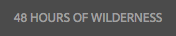

# Modifica del contenuto di una pagina{#editing-page-content}

Dopo aver creato la pagina (nuova o come parte di un lancio o di una Live Copy), puoi modificare il contenuto per apportare gli aggiornamenti necessari.

Per aggiungere i contenuti si trascinano sulla pagina specifici [componenti](/help/sites-authoring/default-components-console.md), in base al tipo di contenuto, che possono quindi essere modificati, spostati o eliminati.

>[!NOTE]
>
>Il tuo account necessita dei [diritti di accesso appropriati](/help/sites-administering/security.md) e delle [autorizzazioni](/help/sites-administering/security.md#permissions) per modificare le pagine.
>
>In caso di problemi, si consiglia di contattare l&#39;amministratore di Adobe.

>[!NOTE]
>
>Se la pagina, il modello o entrambi sono impostati in modo appropriato, è possibile utilizzare un [layout reattivo](/help/sites-authoring/responsive-layout.md) durante la modifica.

>[!NOTE]
>
>In modalità **Modifica**, i collegamenti presenti nel contenuto sono visibili, ma **non accessibili**. Utilizza la modalità [Anteprima](#previewingpagestouchoptimizedui) se desideri navigare utilizzando i collegamenti presenti nel tuo contenuto.

## Barra degli strumenti della pagina {#page-toolbar}

Dalla barra degli strumenti della pagina è possibile accedere alle funzionalità appropriate, a seconda della configurazione della pagina.

La barra degli strumenti permette di accedere a numerose opzioni. A seconda del contesto e della configurazione correnti, alcune opzioni potrebbero non essere disponibili.

* **Attiva/Disattiva pannello laterale**

  Apre o chiude il pannello laterale, che contiene il [browser Risorse](/help/sites-authoring/author-environment-tools.md#assets-browser), il [browser Componenti](/help/sites-authoring/author-environment-tools.md#components-browser) e la [Struttura contenuti](/help/sites-authoring/author-environment-tools.md#content-tree).

  

* **Informazioni sulle pagine**

  Consente di accedere al menu [Informazioni pagina](/help/sites-authoring/author-environment-tools.md#page-information), inclusi i dettagli della pagina e le azioni che è possibile eseguire sulla pagina, tra cui la visualizzazione e la modifica delle informazioni della pagina, la visualizzazione delle proprietà della pagina e la pubblicazione/annullamento della pubblicazione della pagina.

  

* **Emulatore**

  Attiva o disattiva la [barra degli strumenti dell’emulatore](/help/sites-authoring/responsive-layout.md#selecting-a-device-to-emulate), che permette di simulare l’aspetto che avrà la pagina su un altro dispositivo. Questa barra è automaticamente attivata in modalità di layout.

  

* **ContextHub**

  Apre [context hub](/help/sites-authoring/ch-previewing.md). Disponibile solo in modalità Anteprima.

  

* **Titolo pagina**

  Questa sezione è solo a scopo informativo.

  

* **Selettore modalità**

  Visualizza la [modalità](/help/sites-authoring/author-environment-tools.md#page-modes) corrente e consente di selezionare un&#39;altra modalità, ad esempio modifica, layout, timewarp o targeting.

  

* **Anteprima**

  Abilita la [modalità Anteprima](/help/sites-authoring/editing-content.md#preview-mode). In questo modo la pagina viene visualizzata così come appare al momento della pubblicazione.

  

* **Annotazioni**

  Ti consente di aggiungere [annotazioni](/help/sites-authoring/annotations.md) alla pagina durante la revisione. Dopo la prima annotazione, l’icona passa a un numero che indica il numero di annotazioni sulla pagina.

  

### Notifica di stato {#status-notification}

Se una pagina fa parte di uno o più [flussi di lavoro](/help/sites-authoring/workflows.md), queste informazioni vengono visualizzate in una barra di notifica nella parte superiore dello schermo durante la modifica della pagina.

>[!NOTE]
>
>La barra di stato è visibile solo per gli account utente che dispongono dei diritti appropriati.

La notifica riporta il flusso di lavoro in esecuzione per la pagina. Se l’utente è coinvolto nella fase attuale del flusso di lavoro, sono anche disponibili opzioni per [modificare lo stato del flusso di lavoro](/help/sites-authoring/workflows-participating.md) e ottenere ulteriori informazioni sul flusso di lavoro, ad esempio:

* **Complete** - Apre la finestra di dialogo **Complete Workitem**

* **Delega** - Apre la finestra di dialogo **Completa elemento di lavoro**

* **Visualizza dettagli**: apre la finestra **Dettagli** del flusso di lavoro

Il completamento e la delega dei passaggi del flusso di lavoro tramite la barra delle notifiche funzionano come quando [partecipa ai flussi di lavoro](/help/sites-authoring/workflows-participating.md) dalla casella in entrata delle notifiche.

Se la pagina è soggetta a più flussi di lavoro, il numero di flussi di lavoro viene visualizzato all’estremità destra della notifica, insieme ai pulsanti freccia che consentono di scorrere i flussi di lavoro.

## Segnaposto Componente {#component-placeholder}

Il segnaposto del componente è un indicatore che mostra dove è posizionato un componente quando lo rilasci, sopra il componente su cui stai passando con il puntatore del mouse.

* Quando aggiungi un componente alla pagina (trascinandolo dal browser dei componenti):

  

* Quando si sposta un componente esistente:

  

## Inserimento di un componente {#inserting-a-component}

### Inserire un componente dal Browser Componenti {#inserting-a-component-from-the-components-browser}

È possibile aggiungere un componente utilizzando il browser [componenti](/help/sites-authoring/author-environment-tools.md#components-browser). Il [segnaposto componente](#component-placeholder) mostra dove è posizionato il componente:

1. Assicurati che la pagina sia in [**modalità Modifica**.](/help/sites-authoring/author-environment-tools.md#page-modes)
1. Apri il [browser Componenti](/help/sites-authoring/author-environment-tools.md#components-browser).
1. Trascina il componente di cui hai bisogno nella [posizione desiderata](#component-placeholder).

1. [Modifica](#editmovecopypastedelete) il componente.

>[!NOTE]
>
>Su un dispositivo mobile, il browser Componenti riempie l’intero schermo. Una volta iniziato a trascinare un componente, il browser si chiude per mostrare nuovamente la pagina e inserire il componente.

### Inserimento di un Componente dal Sistema Paragrafo   {#inserting-a-component-from-the-paragraph-system}

Puoi aggiungere un componente utilizzando la casella **Trascina qui i componenti** del sistema paragrafo:

1. Assicurati che la pagina sia in [**modalità Modifica**.](/help/sites-authoring/author-environment-tools.md#page-modes)
1. Esistono due modi per selezionare e aggiungere un componente dal sistema paragrafo:

   * Seleziona l’opzione **Inserisci componente** (+) dalla barra degli strumenti di un componente esistente o dalla casella **Trascina qui i componenti**.

   

   * Se utilizzi un dispositivo desktop, puoi fare doppio clic sulla casella **Trascina qui i componenti**.

   Viene visualizzata la finestra di dialogo **Inserisci nuovo componente** che consente di selezionare il componente richiesto:

   

1. Il componente selezionato viene aggiunto nella parte inferiore della pagina. Se necessario, [Modifica](#editmovecopypastedelete) il componente.

### Inserimento di un componente utilizzando il browser Risorse {#inserting-a-component-using-the-assets-browser}

Puoi anche aggiungere un componente alla pagina trascinando una risorsa dal browser [risorse](/help/sites-authoring/author-environment-tools.md#assets-browser). Questo crea automaticamente un componente del tipo appropriato (e che contiene la risorsa).

Questa opzione è valida per i seguenti tipi di risorse (alcuni dipendono dal sistema pagina/paragrafo):

<table>
 <tbody>
  <tr>
   <th><strong>Tipo risorsa</strong></th>
   <th><strong>Tipo di componente risultante</strong></th>
  </tr>
  <tr>
   <td>Immagine</td>
   <td>Immagine</td>
  </tr>
  <tr>
   <td>Documento</td>
   <td>Scarica</td>
  </tr>
  <tr>
   <td>Prodotto</td>
   <td>Prodotto</td>
  </tr>
  <tr>
   <td>Video</td>
   <td>Flash</td>
  </tr>
  <tr>
   <td>Frammenti di contenuto</td>
   <td>Frammento di contenuto  </td>
  </tr>
 </tbody>
</table>

>[!NOTE]
>
>Puoi configurare questo comportamento per l’installazione in uso. Per ulteriori dettagli, consulta [Configurazione di un sistema di paragrafi in modo che il trascinamento di una risorsa crei un&#39;istanza del componente](/help/sites-developing/developing-components.md#configuring-a-paragraph-system-so-that-dragging-an-asset-creates-a-component-instance).

Per creare un componente trascinando uno dei tipi di risorsa indicati sopra:

1. Assicurati che la pagina sia in [**modalità Modifica**.](/help/sites-authoring/author-environment-tools.md#page-modes)
1. Apri il [browser Risorse](/help/sites-authoring/author-environment-tools.md#assets-browser).
1. Trascina la risorsa richiesta nella posizione desiderata. Il segnaposto [componente](#component-placeholder) mostra dove è posizionato il componente.

   Un componente, appropriato per il tipo di risorsa, viene creato nella posizione desiderata e include la risorsa selezionata.

1. [Modificare](#editmovecopypastedelete) il componente, se necessario.

>[!NOTE]
>
>Su un dispositivo mobile, il browser risorse riempie l’intero schermo. Quando inizi a trascinare una risorsa, il browser si chiude per mostrare nuovamente la pagina in modo da poter posizionare la risorsa.

Quando esplori le risorse, se riscontri che devi apportare una rapida modifica a una risorsa, fai clic sull&#39;icona di modifica accanto al nome della risorsa per avviare [Editor risorse](/help/assets/manage-assets.md).

## Modifica/Configura/Copia/Taglia/Elimina/Incolla {#edit-configure-copy-cut-delete-paste}

Selezionando un componente si apre la barra degli strumenti. Consente di accedere a varie azioni che possono essere eseguite sul componente.

Le azioni disponibili dipendono dal contesto; in questa sezione ne vengono descritte solo alcune.

* **Modifica**

  [In base al tipo di componente](/help/sites-authoring/default-components.md), questa azione consente di [modificare il contenuto del componente](#edit-content). Spesso è disponibile una barra degli strumenti.

  

* **Configura**

  [Dipendente dal tipo di componente](/help/sites-authoring/default-components.md), consente di modificare e configurare le proprietà del componente. Spesso viene aperta una finestra di dialogo.

  

* **Copia**

  Il componente viene copiato negli Appunti. Il componente originale rimane dopo un&#39;operazione Incolla.

  

* **Taglia**

  Il componente viene copiato negli Appunti. Dopo che il componente è stato incollato, quello originale viene rimosso.

  

* **Elimina**

  Questo elimina il componente dalla pagina con la tua conferma.

  

* **Inserisci componente**

  Verrà aperta la finestra di dialogo per [aggiungere un componente](/help/sites-authoring/editing-content.md#inserting-a-component-from-the-paragraph-system).

  

* **Incolla**

  Incolla il componente dagli Appunti alla pagina. Se l&#39;originale rimane o meno dipende dal fatto che sia stata utilizzata la copia o il taglio.

   * È possibile utilizzare Incolla per collocare i componenti sulla stessa pagina o su una pagina diversa.
   * L’elemento viene incollato sopra l’elemento in cui selezioni l’azione Incolla.
   * L’azione Incolla viene visualizzata solo se negli Appunti è presente del contenuto.

  

  >[!NOTE]
  >
  >Se si incolla in un’altra pagina che era già aperta prima dell’operazione Taglia/Copia, per visualizzare il contenuto incollato è necessario aggiornare la pagina.

* **Gruppo**

  Questo consente di selezionare più componenti contemporaneamente. È possibile eseguire la stessa azione su un dispositivo desktop tramite **Ctrl+clic** o **Comando+clic**.

  

* **Elemento padre**

  Questo consente di selezionare il componente principale del componente selezionato.

  

* **Layout**

  Ciò ti consente di modificare il [layout](/help/sites-authoring/editing-content.md#edit-component-layout) del componente selezionato. Ciò vale solo per il componente selezionato e non attiva la [Modalità di layout](/help/sites-authoring/author-environment-tools.md#page-modes) per l’intera pagina.

  

* **Converti in variante di frammento esperienza**

  In questo modo puoi creare un [frammento di esperienza](/help/sites-authoring/experience-fragments.md) dal componente selezionato o aggiungerlo a un frammento di esperienza esistente.

  

## Modifica (contenuto) {#edit-content}

Esistono due metodi per aggiungere o modificare contenuti nei componenti:

* Aprire la [finestra di dialogo del componente per la modifica](#component-edit-dialog).
* [Trascinare una risorsa](#draganddropintocomponent) dal browser Risorse per aggiungere direttamente il contenuto.

### Finestra di dialogo di modifica del componente   {#component-edit-dialog}

Per aprire un componente e modificarne il contenuto, utilizza l’icona [Modifica (a forma di matita) nella barra degli strumenti del componente](#edit-configure-copy-cut-delete-paste).

Le opzioni di modifica effettive dipendono dal componente. Per alcuni componenti, [tutte le azioni sono disponibili solo in modalità a schermo intero](#edit-content-full-screen-mode). Esempio:

* [Componente testo](/help/sites-authoring/rich-text-editor.md#main-pars-title-24)

  

* Componente immagine

  

  >[!NOTE]
  >
  >La modifica non funziona su un componente immagine vuoto.
  >
  >
  >[Trascina o carica un&#39;immagine (mediante Configura)](/help/sites-authoring/default-components-foundation.md#image) prima di iniziare a modificarla.

* Componente immagine: a schermo intero

  [L’accesso alla modalità a schermo intero](/help/sites-authoring/editing-content.md#edit-content-full-screen-mode) per il componente immagine consente di avere più spazio per modificare l’immagine oltre che per visualizzare opzioni di modifica aggiuntive, ad esempio **Launch Map (Avvia mappa)** e **Ripristina zoom**. Inoltre, la modalità a schermo intero consente di selezionare i predefiniti di ritaglio.

  

* Per componenti composti da più componenti di base, ad esempio [Text &amp; Image foundation component](/help/sites-authoring/default-components-foundation.md#text-image), è innanzitutto necessario confermare il set di opzioni di modifica desiderato:

  

### Trascinare risorse nel componente {#drag-and-drop-assets-into-component}

Per tipi di componenti specifici puoi trascinare e rilasciare le risorse dal browser Risorse direttamente nel componente per aggiornare il contenuto:

| **Tipo risorsa** | **Tipo di componente** |
|---|---|
| Immagine | Immagine |
| Documento | Scarica |
| Prodotto | Prodotto |
| Video | Flash |
| Frammenti di contenuto | Frammenti di contenuto |

## Modifica (Contenuto) Modalità a tutto schermo {#edit-content-full-screen-mode}

Per tutti i componenti è possibile accedere alla (e uscire dalla) modalità a tutto tramite:

Per esempio, il componente **Testo**:

>[!NOTE]
>
>Per alcuni componenti, la modalità a tutto schermo dispone di più opzioni rispetto all’editor locale di base.

## Spostamento di un componente {#moving-a-component}

Per spostare un componente paragrafo:

1. Selezionare il paragrafo da spostare con la selezione o il clic e la conservazione.
1. Trascina il paragrafo nella nuova posizione. In AEM viene indicato dove è possibile rilasciare il paragrafo. Rilascialo nella posizione desiderata.

   

1. Il paragrafo è stato spostato.

>[!NOTE]
>
>Per spostare un componente puoi anche utilizzare [Taglia e Incolla](/help/sites-authoring/editing-content.md#edit-configure-copy-cut-delete-paste).

## Modificare il layout del componente {#edit-component-layout}

Invece di passare più volte dalla modalità di modifica alla modalità [layout](/help/sites-authoring/responsive-layout.md) per modificare un componente, è possibile selezionare l&#39;azione **Layout** per un componente per modificarne il layout. In questo modo si risparmia tempo, non dovendo uscire dalla modalità di modifica.

1. Nella modalità **Modifica** della console Sites, quando si seleziona un componente viene visualizzata la barra degli strumenti del componente.

   

   Fai clic sull&#39;azione **Layout** per modificare il layout del componente.

   

1. Una volta selezionata l’azione Layout:

   * Vengono visualizzate le maniglie di ridimensionamento del componente.
   * La barra degli strumenti dell’emulatore viene visualizzata nella parte superiore dello schermo.
   * La barra degli strumenti del componente presenta le azioni di layout al posto delle azioni di modifica standard.

   

   Ora puoi modificare il layout del componente, in modo analogo a come lo si modifica nella [modalità di layout](/help/sites-authoring/responsive-layout.md#defining-layouts-layout-mode).

1. Dopo aver apportato le modifiche necessarie, fare clic su **Chiudi** nel menu Azioni del componente per interrompere la modifica del layout del componente. La barra degli strumenti del componente torna al normale stato di modifica.

   

>[!NOTE]
>
>L’azione Layout è limitata al componente selezionato. Ad esempio, se stai modificando il layout di un componente e successivamente selezioni un altro componente, per il componente appena selezionato viene visualizzata la barra degli strumenti di modifica standard (non la barra degli strumenti di layout). I quadratini di ridimensionamento e la barra degli strumenti dell’emulatore scompaiono.
>
>Se è necessario modificare il layout generale della pagina, con effetti su più componenti, passare alla [modalità layout](/help/sites-authoring/responsive-layout.md).

## Componenti ereditati {#inherited-components}

I componenti ereditati possono essere il risultato di vari scenari, tra cui:

* [Gestione multisito](/help/sites-administering/msm.md)
* [Lanci](/help/sites-authoring/launches.md) (se basati su Live Copy).
* Componenti specifici, ad esempio il sistema di paragrafi ereditati all’interno di Geometrixx.

È possibile annullare l’ereditarietà, quindi riabilitarla. A seconda del componente, questo può essere disponibile da:

* **Live Copy**

  La barra degli strumenti del componente, se il componente si trova su una pagina che fa parte di una Live Copy o di un lancio (basato su una Live Copy). Ad esempio:

  

  L’opzione Annulla ereditarietà è disponibile:

  

  In alternativa, se l’operazione è già stata annullata, riattiva l’ereditarietà:

  

  L’azione Rollout è disponibile anche nel blueprint o nella sorgente Live Copy:

  

* **Un Sistema Di Paragrafi Ereditato**

  Finestra di dialogo di configurazione. Ad esempio, come con il sistema paragrafo ereditato:

  

## Modificare il modello di pagina {#editing-the-page-template}

Se la pagina è basata su un [modello modificabile](/help/sites-authoring/templates.md#editable-and-static-templates), è possibile passare facilmente all&#39;[editor modelli](/help/sites-authoring/templates.md#editing-templates-template-authors) selezionando **Modifica modello** nel [menu Informazioni pagina](/help/sites-authoring/author-environment-tools.md#page-information).

Se la pagina è basata su un [modello statico](/help/sites-authoring/templates.md#editable-and-static-templates), è possibile passare alla [modalità Progettazione](/help/sites-authoring/default-components-designmode.md) utilizzando il [selettore modalità pagina](/help/sites-authoring/author-environment-tools.md#page-modes) nella barra degli strumenti per abilitare/disabilitare i componenti da utilizzare nella pagina.

Puoi vedere facilmente su quale modello si basa la pagina quando la selezioni in [Vista a colonne](/help/sites-authoring/basic-handling.md#column-view) o [Vista a elenco](/help/sites-authoring/basic-handling.md#list-view).

## Stato della Live Copy   {#live-copy-status}

La [modalità di pagina Stato Live Copy](/help/sites-authoring/author-environment-tools.md#page-modes) consente di avere una rapida panoramica dello stato della Live Copy e di sapere quali componenti vengono ereditati e quali no:

* Bordo verde: ereditato
* Bordo rosa: ereditarietà annullata

Ad esempio:

## Aggiunta di annotazioni {#adding-annotations}

Le [Annotazioni](/help/sites-authoring/annotations.md) consentono a revisori e altri autori di fornire un feedback sui contenuti. Vengono spesso utilizzate a scopo di revisione e convalida.

## Anteprima delle pagine {#previewing-pages}

Esistono due opzioni per visualizzare in anteprima una pagina:

* [Modalità Anteprima](#preview-mode): un’anteprima rapida disponibile dalla stessa posizione

* [Visualizza come pubblicato](#view-as-published): anteprima completa che apre la pagina in una nuova scheda

>[!NOTE]
>
>* In modalità Modifica, i collegamenti nel contenuto sono visibili, ma non accessibili.
>* Per effettuare la navigazione tramite i collegamenti, utilizza una delle opzioni di anteprima.
>* Utilizza la [scelta rapida da tastiera](/help/sites-authoring/keyboard-shortcuts.md) `Ctrl-Shift-M` per passare dall’anteprima all’ultima modalità selezionata.
>

>[!NOTE]
>
>Il cookie della modalità WCM è impostato per entrambe le opzioni.

### Modalità Anteprima {#preview-mode}

Durante la modifica del contenuto, puoi visualizzare in anteprima la pagina utilizzando la modalità di anteprima [1}. ](/help/sites-authoring/author-environment-tools.md#page-modes) Questa modalità consente di effettuare le seguenti operazioni:

* Nascondi vari meccanismi di modifica per avere una visualizzazione rapida della pagina quando viene pubblicata.
* Utilizza i collegamenti per navigare.
* **non** aggiorna il contenuto della pagina.

Durante l’authoring, la modalità di anteprima è disponibile utilizzando l’icona in alto a destra dell’Editor pagina:

### Visualizza come pubblicato {#view-as-published}

L’opzione **Visualizza come pubblicato**, è disponibile nel menu [Informazioni pagina](/help/sites-authoring/author-environment-tools.md#page-information). In questo modo la pagina viene aperta in una nuova scheda, il contenuto viene aggiornato e la pagina viene visualizzata esattamente come appare quando viene pubblicata.

## Blocco di una pagina   {#locking-a-page}

AEM consente di bloccare una pagina in modo che nessun altro possa modificarne il contenuto. Questa funzione è utile quando si apportano numerose modifiche a una pagina specifica o quando è necessario bloccarla per un breve periodo.

Per bloccare una pagina è possibile utilizzare:

* La console **Sites**

   1. Seleziona la pagina con [modalità di selezione](/help/sites-authoring/basic-handling.md#viewing-and-selecting-resources).
   1. Seleziona l’icona del lucchetto.

  

* **Editor pagina**

   1. Per aprire il menu, seleziona l&#39;icona **Informazioni pagina**.
   1. Seleziona l’opzione **Blocca pagina**.

Una volta eseguito il blocco le informazioni di visualizzazione della console vengono aggiornate e, durante la modifica, un simbolo a forma di lucchetto viene visualizzato nella barra degli strumenti.

>[!CAUTION]
>
>Il blocco di una pagina può essere eseguito quando [si impersona un utente](/help/sites-administering/security.md#impersonating-another-user). Tuttavia, una pagina bloccata in questo modo può essere sbloccata solo dall’utente impersonato o dall’utente amministratore.
>
>Non è consentito sbloccare le pagine bloccate impersonando l’utente che le ha boccate.

## Sblocco di una pagina {#unlocking-a-page}

Lo sblocco di una pagina è simile al [blocco della pagina](#locking-a-page). Quando la pagina è bloccata, le opzioni di blocco vengono sostituite dalle azioni di sblocco.

Nel menu Informazioni pagina è presente l’opzione **Sblocca** e l’icona Blocca nella console Sites viene sostituita dall’icona **Sblocca**.

>[!CAUTION]
>
>Il blocco di una pagina può essere eseguito quando [si impersona un utente](/help/sites-administering/security.md#impersonating-another-user). Tuttavia, una pagina bloccata in questo modo può essere sbloccata solo dall’utente impersonato o dall’utente amministratore.
>
>Non è consentito sbloccare le pagine bloccate impersonando l’utente che le ha boccate.

## Annullamento e ripristino di operazioni di modifica delle pagine {#undoing-and-redoing-page-edits}

Le icone seguenti consentono di annullare o ripristinare un’azione. Questi sono visualizzati nella barra degli strumenti quando appropriato:

>[!NOTE]
>
>Per annullare le azioni di modifica della pagina è anche disponibile la [scelta rapida da tastiera](/help/sites-authoring/page-authoring-keyboard-shortcuts.md) `Ctrl-Z`.
>
>Per ripristinare le azioni di modifica della pagina è anche disponibile la scelta rapida da tastiera `Ctrl-Y`.

>[!NOTE]
>
>Per informazioni sulle possibilità di annullare e ripristinare le modifiche apportate a una pagina, consulta [Annullamento e ripristino di operazioni di modifica delle pagine - La teoria](#undoing-and-redoing-page-edits-the-theory).

## Annullamento e ripristino di operazioni di modifica delle pagine - La teoria {#undoing-and-redoing-page-edits-the-theory}

>[!NOTE]
>
>L&#39;amministratore di sistema può [configurare vari aspetti delle funzioni Annulla/Ripristina](/help/sites-administering/config-undo.md) in base ai requisiti dell&#39;istanza.

AEM memorizza una cronologia delle azioni eseguite e la sequenza in cui sono state eseguite. Questa funzionalità consente di annullare più azioni nell&#39;ordine in cui sono state eseguite e di rieseguirle per riapplicare una o più azioni, se necessario.

Se è selezionato un elemento nella pagina del contenuto (ad esempio un componente di testo) il comando Annulla o Ripristina si riferisce all’elemento selezionato.

Il comportamento dei comandi Annulla e Ripristina è simile a quello di altri programmi software. Utilizza i comandi per ripristinare lo stato recente della pagina web quando decidi del contenuto. Se ad esempio si sposta un paragrafo di testo altrove nella pagina, è possibile ricorrere al comando Annulla per riportarlo nella posizione originale. Se successivamente constati che la posizione precedente era migliore, utilizza il comando Ripristina per “annullare l’annullamento”.

>[!NOTE]
>
>Operazioni disponibili:
>
>* Puoi ripristinare le azioni solo se dopo l’annullamento non sono state apportate altre modifiche alla pagina.
>* Per impostazione predefinita, è possibile annullare fino a 20 azioni di modifica.
>* Per annullare e ripristinare le azioni è possibile anche utilizzare le [scelte rapide da tastiera](/help/sites-authoring/page-authoring-keyboard-shortcuts.md).
>

Potete utilizzare le opzioni Annulla (Undo) e Ripeti (Redo) per i seguenti tipi di modifiche di pagina:

* Aggiunta, modifica, rimozione e spostamento di paragrafi
* Modifica locale del contenuto dei paragrafi
* Operazioni Copia, Taglia e Incolla per elementi all’interno di una pagina

I campi modulo di cui viene eseguito il rendering dei componenti modulo non devono avere valori specificati durante l’authoring delle pagine. Pertanto, i comandi Annulla e Ripristina non influiscono sulle modifiche apportate ai valori di questi tipi di componenti. Ad esempio, non è possibile annullare la selezione di un valore in un elenco a discesa.

>[!NOTE]
>
>Per annullare e ripristinare le modifiche apportate a file e immagini sono necessarie autorizzazioni speciali.

>[!NOTE]
>
>La cronologia delle modifiche apportate ai file e alle immagini viene conservata per almeno dieci ore. Al di là di questo lasso di tempo, tuttavia, non è garantita l&#39;inversione delle variazioni. L’amministratore può cambiare il tempo predefinito di dieci ore.
