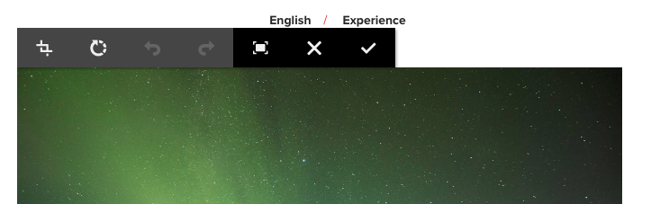

# Modifica del contenuto di una pagina{#editing-page-content}

Una volta creata la pagina (nuova o come parte di un lancio o di una Live Copy), puoi modificare il contenuto per apportare gli aggiornamenti necessari.

Il contenuto viene aggiunto tramite [componenti](/help/sites-authoring/default-components-console.md) (in base al tipo di contenuto) che possono essere trascinati sulla pagina. che possono quindi essere modificati, spostati o eliminati.

>[!NOTE]
>
>Il tuo account ha bisogno di [diritti di accesso appropriati](/help/sites-administering/security.md) e [autorizzazioni](/help/sites-administering/security.md#permissions) per modificare le pagine.
>
>Nell’eventualità di problemi, rivolgiti al tuo amministratore di sistema.

>[!NOTE]
>
>Se la pagina e/o il modello sono stati impostati in modo appropriato, è possibile utilizzare il [layout dinamico](/help/sites-authoring/responsive-layout.md) durante la modifica.

>[!NOTE]
>
>In modalità **Modifica**, i collegamenti presenti nel contenuto sono visibili, ma **non accessibili**. Utilizza la modalità [Anteprima](#previewingpagestouchoptimizedui) se desideri navigare utilizzando i collegamenti presenti nel tuo contenuto.

## Barra degli strumenti della pagina {#page-toolbar}

Dalla barra degli strumenti della pagina è possibile accedere alle funzionalità appropriate, a seconda della configurazione della pagina.

La barra degli strumenti offre l’accesso a numerose opzioni. A seconda del contesto e della configurazione correnti, alcune opzioni potrebbero non essere disponibili.

* **Attiva/Disattiva pannello laterale**

  Questo apre/chiude il pannello laterale, che contiene [Browser risorse](/help/sites-authoring/author-environment-tools.md#assets-browser), [Browser componenti](/help/sites-authoring/author-environment-tools.md#components-browser), e [Struttura contenuto](/help/sites-authoring/author-environment-tools.md#content-tree).

  

* **Informazioni sulle pagine**

  Fornisce l&#39;accesso a [Informazioni pagina](/help/sites-authoring/author-environment-tools.md#page-information) menu che include i dettagli e le azioni che possono essere eseguite sulla pagina, tra cui la visualizzazione e la modifica delle informazioni sulla pagina, la visualizzazione delle proprietà della pagina e la pubblicazione/annullamento della pubblicazione della pagina.

  

* **Emulatore**

  Attiva/disattiva [barra degli strumenti emulatore](/help/sites-authoring/responsive-layout.md#selecting-a-device-to-emulate), utilizzato per emulare l’aspetto della pagina su un altro dispositivo. Questa funzione viene attivata automaticamente in modalità layout.

  

* **ContextHub**

  Apre il [context hub](/help/sites-authoring/ch-previewing.md). Disponibile solo in modalità Anteprima.

  

* **Titolo pagina**

  Questo è puramente informativo.

  

* **Selettore modalità**

  Visualizza il [modalità](/help/sites-authoring/author-environment-tools.md#page-modes) e consente di selezionare un’altra modalità, ad esempio modifica, layout, timewarp o targeting.

  

* **Anteprima**

  Abilita [modalità anteprima](/help/sites-authoring/editing-content.md#preview-mode). In questo modo la pagina viene visualizzata così come verrà visualizzata al momento della pubblicazione.

  

* **Annotazioni**

  Consente di aggiungere [annotazioni](/help/sites-authoring/annotations.md) alla pagina durante la revisione. Dopo la prima annotazione, l’icona passa a un numero che indica il numero di annotazioni sulla pagina.

  

### Notifica di stato {#status-notification}

Se una pagina fa parte di uno o più [flussi di lavoro](/help/sites-authoring/workflows.md), queste informazioni vengono visualizzate in una barra di notifica nella parte superiore dello schermo durante la modifica della pagina.

>[!NOTE]
>
>La barra di stato è visibile solo agli account utente con i privilegi appropriati.

La notifica elenca il flusso di lavoro in esecuzione sulla pagina. Se l’utente è coinvolto nel passaggio del flusso di lavoro corrente, le opzioni per [influenzare lo stato del flusso di lavoro](/help/sites-authoring/workflows-participating.md) e sono disponibili anche ulteriori informazioni sul flusso di lavoro, ad esempio:

* **Completa** - Apre il **Elemento di lavoro completato** finestra di dialogo

* **Delega** - Apre il **Elemento di lavoro completato** finestra di dialogo

* **Visualizza dettagli**: apre la finestra **Dettagli** del flusso di lavoro

Il completamento e la delega delle fasi del flusso di lavoro a partire dalla barra delle notifiche funzionano in modo analogo alla [partecipazione ai flussi di lavoro](/help/sites-authoring/workflows-participating.md) a partire dalla casella in entrata delle Notifiche.

Se la pagina è soggetta a più flussi di lavoro, il numero di flussi di lavoro viene visualizzato all’estremità destra della notifica, insieme ai pulsanti freccia che consentono di scorrere i flussi di lavoro.

## Segnaposto Componente {#component-placeholder}

Il segnaposto del componente è un indicatore che mostra dove verrà posizionato un componente quando lo rilasci, sopra il componente che si sta passando con il mouse.

* Quando aggiungi un nuovo componente alla pagina (trascinandolo dal browser dei componenti):

  

* Quando si sposta un componente esistente:

  

## Inserimento di un componente {#inserting-a-component}

### Inserire un componente dal Browser Componenti {#inserting-a-component-from-the-components-browser}

È possibile aggiungere un nuovo componente utilizzando il [browser componenti](/help/sites-authoring/author-environment-tools.md#components-browser). Il [segnaposto componente](#component-placeholder) mostra dove sarà posizionato il componente:

1. Assicurati che la pagina sia in [**modalità Modifica**.](/help/sites-authoring/author-environment-tools.md#page-modes)
1. Apri il [browser Componenti](/help/sites-authoring/author-environment-tools.md#components-browser).
1. Trascina il componente di cui hai bisogno nella [posizione desiderata](#component-placeholder).

1. [Modifica](#editmovecopypastedelete) il componente.

>[!NOTE]
>
>Su un dispositivo mobile, il browser componenti occupa l’intera schermata. Dopo aver iniziato a trascinare un componente, il browser si chiude per mostrare nuovamente la pagina e inserire il componente.

### Inserimento di un Componente dal Sistema Paragrafo   {#inserting-a-component-from-the-paragraph-system}

È possibile aggiungere un nuovo componente utilizzando la casella **Trascina qui i componenti** del sistema paragrafo:

1. Assicurati che la pagina sia in [**modalità Modifica**.](/help/sites-authoring/author-environment-tools.md#page-modes)
1. Esistono due modi per selezionare e aggiungere un nuovo componente dal sistema paragrafo:

   * Seleziona la **Inserisci componente** nella barra degli strumenti di un componente esistente o nella scheda **Trascina qui i componenti** casella.

   

   * Se utilizzi un dispositivo desktop, puoi fare doppio clic sulla casella **Trascina qui i componenti**.

   Il **Inserisci nuovo componente** viene visualizzata una finestra di dialogo che consente di selezionare il componente richiesto:

   

1. Il componente selezionato verrà aggiunto nella parte inferiore della pagina. [Modifica](#editmovecopypastedelete) il componente, se necessario.

### Inserimento di un componente utilizzando il browser Risorse   {#inserting-a-component-using-the-assets-browser}

È possibile aggiungere un nuovo componente alla pagina anche trascinando una risorsa dal [browser Risorse](/help/sites-authoring/author-environment-tools.md#assets-browser). Questo determina la creazione automatica di un nuovo componente del tipo appropriato (e che include la risorsa).

Questa opzione è valida per i seguenti tipi di risorse (alcune dipenderanno dal sistema pagina/paragrafo):

<table>
 <tbody>
  <tr>
   <th><strong>Tipo risorsa</strong></th>
   <th><strong>Tipo di componente risultante</strong></th>
  </tr>
  <tr>
   <td>Immagine</td>
   <td>Immagine</td>
  </tr>
  <tr>
   <td>Documento</td>
   <td>Scarica</td>
  </tr>
  <tr>
   <td>Prodotto</td>
   <td>Prodotto</td>
  </tr>
  <tr>
   <td>Video</td>
   <td>Flash</td>
  </tr>
  <tr>
   <td>Frammenti di contenuto</td>
   <td>Frammenti di contenuto  </td>
  </tr>
 </tbody>
</table>

>[!NOTE]
>
>Puoi configurare questo comportamento per l’installazione in uso. Consulta [Configurazione di un sistema di paragrafi in modo che il trascinamento di una risorsa crei un’istanza di componente](/help/sites-developing/developing-components.md#configuring-a-paragraph-system-so-that-dragging-an-asset-creates-a-component-instance) per ulteriori dettagli.

Per creare un componente trascinando uno dei tipi di risorsa indicati sopra:

1. Assicurati che la pagina sia in [**modalità Modifica**.](/help/sites-authoring/author-environment-tools.md#page-modes)
1. Apri [browser risorse](/help/sites-authoring/author-environment-tools.md#assets-browser).
1. Trascina la risorsa richiesta nella posizione desiderata. Il [segnaposto componente](#component-placeholder) mostra dove verrà posizionato il componente.

   Nella posizione richiesta verrà creato un componente appropriato per il tipo di risorsa, che conterrà la risorsa selezionata.

1. [Modifica](#editmovecopypastedelete) il componente, se necessario.

>[!NOTE]
>
>Su un dispositivo mobile, il browser risorse occupa l’intera schermata. Dopo aver iniziato a trascinare una risorsa, il browser si chiude per mostrare nuovamente la pagina e inserire la risorsa.

Se sfogliando le risorse disponibili scopri che è necessario apportare una rapida modifica a una risorsa, puoi avviare il [editor risorse](/help/assets/manage-assets.md) direttamente dal browser, facendo clic sull’icona di modifica accanto al nome della risorsa.

## Modifica/Configura/Copia/Taglia/Elimina/Incolla {#edit-configure-copy-cut-delete-paste}

Selezionando un componente si aprirà la barra degli strumenti, che consente di accedere alle azioni disponibili per tale componente.

Le azioni disponibili dipendono dal contesto; in questa sezione ne vengono descritte solo alcune.

* **Modifica**

  [Dipende dal tipo di componente](/help/sites-authoring/default-components.md) questo ti consentirà di [modificare il contenuto del componente](#edit-content). Spesso è disponibile una barra degli strumenti.

  

* **Configura**

  [Dipende dal tipo di componente](/help/sites-authoring/default-components.md) questo ti consente di modificare e configurare le proprietà del componente. In genere presenta una finestra di dialogo.

  

* **Copia**

  Il componente verrà copiato negli Appunti. Dopo l’azione Incolla, il componente originale rimane.

  

* **Taglia**

  Il componente verrà copiato negli Appunti. Dopo l’azione Incolla, il componente originale verrà rimosso.

  

* **Eliminare**

  Il componente verrà eliminato dalla pagina con la tua conferma.

  

* **Inserisci componente**

  Verrà aperta la finestra di dialogo per [aggiungi un nuovo componente](/help/sites-authoring/editing-content.md#inserting-a-component-from-the-paragraph-system).

  

* **Incolla**

  Il componente verrà incollato dagli Appunti alla pagina. Se l&#39;originale rimane, dipende dal fatto se avete usato la copia o il taglio.

   * È possibile incollare nella stessa pagina o in una pagina diversa.
   * L’elemento incollato verrà incollato sopra l’elemento in cui hai selezionato l’azione Incolla.
   * L&#39;azione Incolla viene visualizzata solo se negli Appunti è presente del contenuto.

  

  >[!NOTE]
  >
  >Se si incolla in un&#39;altra pagina già aperta prima dell&#39;operazione Taglia/Copia, è necessario aggiornare la pagina per visualizzare il contenuto incollato.

* **Gruppo**

  Questo consente di selezionare più componenti contemporaneamente. Lo stesso può essere ottenuto su un dispositivo desktop da un **Ctrl+clic** o **Comando+clic**.

  

* **Elemento padre**

  Consente di selezionare il componente principale del componente selezionato.

  

* **Layout**

  Questo ti consente di modificare [layout](/help/sites-authoring/editing-content.md#edit-component-layout) del componente selezionato. Questo si applica solo al componente selezionato e non attiva il [Modalità Layout](/help/sites-authoring/author-environment-tools.md#page-modes) per l’intera pagina.

  

* **Converti in variante di frammento di esperienza**

  Questo ti consente di creare un nuovo [frammento esperienza](/help/sites-authoring/experience-fragments.md) dal componente selezionato o aggiungilo a un frammento di esperienza esistente.

  

## Modifica (contenuto) {#edit-content}

Esistono due metodi per aggiungere e/o modificare contenuti nei componenti:

* Apri [finestra di dialogo del componente per la modifica](#component-edit-dialog).
* [Trascinare una risorsa](#draganddropintocomponent) dal browser risorse per aggiungere direttamente il contenuto.

### Finestra di dialogo di modifica del componente   {#component-edit-dialog}

Per aprire un componente e modificarne il contenuto, utilizza l’icona [Modifica (a forma di matita) nella barra degli strumenti del componente](#edit-configure-copy-cut-delete-paste).

Le opzioni di modifica effettive dipendono dal componente. Per alcuni componenti [tutte le azioni sono disponibili solo in modalità a schermo intero](#edit-content-full-screen-mode). Esempio:

* [Componente testo](/help/sites-authoring/rich-text-editor.md#main-pars-title-24)

  

* Componente immagine

  

  >[!NOTE]
  >
  >La modifica non funziona su un componente immagine vuoto.
  >
  >
  >Devi [trascinare o caricare un’immagine (mediante Configura)](/help/sites-authoring/default-components-foundation.md#image) prima di iniziare a modificarlo.

* Componente immagine - schermo intero

  [L’accesso alla modalità a tutto schermo](/help/sites-authoring/editing-content.md#edit-content-full-screen-mode) per il componente immagine consente di avere più spazio per modificare l’immagine oltre che per visualizzare opzioni di modifica aggiuntive, ad esempio **Launch Map (Avvia mappa)** e **Ripristina zoom**. Inoltre, lo schermo intero consente di selezionare i predefiniti di ritaglio.

  

* Componenti costituiti da più componenti di base, ad esempio [Componente base testo e immagine](/help/sites-authoring/default-components-foundation.md#text-image), per prima cosa chiedi di confermare quale insieme di opzioni di modifica desideri:

  

### Trascinare risorse nel componente {#drag-and-drop-assets-into-component}

Per tipi di componenti specifici puoi trascinare e rilasciare le risorse dal browser Risorse direttamente nel componente per aggiornare il contenuto:

| **Tipo risorsa** | **Tipo componente** |
|---|---|
| Immagine | Immagine |
| Documento | Scarica |
| Prodotto | Prodotto |
| Video | Flash |
| Frammenti di contenuto | Frammenti di contenuto |

## Modifica (Contenuto) Modalità a tutto schermo {#edit-content-full-screen-mode}

Per tutti i componenti è possibile accedere alla (e uscire dalla) modalità a tutto tramite:

Per esempio, il componente **Testo**:

>[!NOTE]
>
>Per alcuni componenti, la modalità a tutto schermo avrà a disposizione più opzioni rispetto all’editor locale di base.

## Spostamento di un componente {#moving-a-component}

Per spostare un componente paragrafo:

1. Seleziona il paragrafo da spostare con la pressione del tasto e del tasto o con il tasto e il tasto.
1. Trascinare il paragrafo nella nuova posizione. L&#39;AEM indica dove il paragrafo può essere depositato. Rilascialo nella posizione desiderata.

   

1. Il paragrafo è stato spostato.

>[!NOTE]
>
>Per spostare un componente puoi anche utilizzare [Taglia e Incolla](/help/sites-authoring/editing-content.md#edit-configure-copy-cut-delete-paste).

## Modificare il layout del componente {#edit-component-layout}

Invece di passare più volte dalla modalità di modifica alla [modalità di layout](/help/sites-authoring/responsive-layout.md) per regolare le impostazioni di un componente, è possibile selezionare l’azione **Layout**. Questo permette di modificare rapidamente il layout di quello specifico componente, senza uscire dalla modalità di modifica.

1. In modalità **Modifica** nella console Sites, quando si seleziona un componente viene visualizzata la sua barra degli strumenti.

   

   Tocca o fai clic sull’azione **Layout** per modificare il layout del componente.

   

1. Una volta selezionata l’azione Layout:

   * Vengono visualizzati i quadratini di ridimensionamento per il componente.
   * La barra degli strumenti dell’emulatore viene visualizzata nella parte superiore dello schermo.
   * Le azioni Layout invece delle azioni di modifica standard vengono visualizzate nella barra degli strumenti del componente.

   

   Ora puoi modificare il layout del componente, in modo analogo a come lo si modifica nella [modalità di layout](/help/sites-authoring/responsive-layout.md#defining-layouts-layout-mode).

1. Dopo aver apportato le modifiche necessarie, fai clic sul pulsante **Chiudi** nel menu Azioni del componente per interrompere la modifica del layout del componente. La barra degli strumenti del componente torna al normale stato di modifica.

   

>[!NOTE]
>
>L’azione Layout è limitata al componente selezionato. Ad esempio, se stai modificando il layout di un componente e fai clic su un altro componente, per il componente appena selezionato viene visualizzata la barra degli strumenti di modifica standard (non quella di layout), mentre i quadratini di ridimensionamento e la barra degli strumenti dell’emulatore scompaiono.
>
>Se devi modificare il layout generale della pagina, influenzando più componenti, passa a [modalità di layout](/help/sites-authoring/responsive-layout.md).

## Componenti ereditati {#inherited-components}

I componenti ereditati possono essere il risultato di vari scenari, tra cui:

* [Gestione multisito](/help/sites-administering/msm.md)
* [Lanci](/help/sites-authoring/launches.md) (se basati su Live Copy).
* Componenti specifici, ad esempio il sistema di paragrafi ereditati all’interno di Geometrixx.

È possibile annullare l’ereditarietà, quindi riabilitarla. A seconda del componente, questo può essere disponibile da:

* **Live Copy**

  La barra degli strumenti del componente, se il componente si trova su una pagina che fa parte di una Live Copy o di un lancio (basato su una Live Copy). Ad esempio:

  

  L’opzione Annulla ereditarietà è disponibile:

  

  Oppure riabilita l&#39;ereditarietà se è già stata annullata:

  

  L’azione Rollout è disponibile anche nel blueprint o nella sorgente Live Copy:

  

* **Un sistema di paragrafi ereditato**

  La finestra di dialogo di configurazione. Ad esempio, come con il sistema paragrafo ereditato:

  

## Modificare il modello di pagina {#editing-the-page-template}

Se la pagina si basa su un [modello modificabile](/help/sites-authoring/templates.md#editable-and-static-templates), è possibile passare facilmente al [editor modelli](/help/sites-authoring/templates.md#editing-templates-template-authors) selezionando **Modifica modello** nel [Menu Informazioni pagina](/help/sites-authoring/author-environment-tools.md#page-information).

Se la pagina si basa su un [modello statico](/help/sites-authoring/templates.md#editable-and-static-templates), è possibile passare a [Modalità progettazione](/help/sites-authoring/default-components-designmode.md) utilizzando [selettore modalità pagina](/help/sites-authoring/author-environment-tools.md#page-modes) sulla barra degli strumenti per abilitare/disabilitare i componenti da utilizzare sulla pagina.

Puoi vedere facilmente su quale modello si basa la pagina quando la selezioni in [Vista a colonne](/help/sites-authoring/basic-handling.md#column-view) o [Vista a elenco](/help/sites-authoring/basic-handling.md#list-view).

## Stato della Live Copy   {#live-copy-status}

Il [Modalità pagina Stato Live Copy](/help/sites-authoring/author-environment-tools.md#page-modes) consente di avere una rapida panoramica dello stato live copy e di sapere quali componenti vengono/non vengono ereditati:

* Bordo verde: ereditato
* Bordo rosa: ereditarietà annullata

Esempio:

## Aggiunta di annotazioni {#adding-annotations}

[Annotazioni](/help/sites-authoring/annotations.md) consenti ai revisori e ad altri autori di fornire feedback sui contenuti. Vengono spesso utilizzati a scopo di revisione e convalida.

## Anteprima delle pagine   {#previewing-pages}

Esistono due opzioni per visualizzare in anteprima una pagina:

* [Modalità Anteprima](#preview-mode): un’anteprima rapida disponibile dalla stessa posizione

* [Visualizza come pubblicato](#view-as-published) - anteprima completa che apre la pagina in una nuova scheda

>[!NOTE]
>
>* I collegamenti nel contenuto sono visibili, ma non accessibili in modalità di modifica.
>* Per effettuare la navigazione tramite i collegamenti, utilizza una delle opzioni di anteprima.
>* Utilizza la [scelta rapida da tastiera](/help/sites-authoring/keyboard-shortcuts.md) `Ctrl-Shift-M` per passare dall’anteprima all’ultima modalità selezionata.
>

>[!NOTE]
>
>Il cookie della modalità WCM è impostato per entrambe le opzioni.

### Modalità Anteprima {#preview-mode}

Durante la modifica del contenuto è possibile visualizzare l’anteprima della pagina utilizzando [modalità](/help/sites-authoring/author-environment-tools.md#page-modes). Questa modalità:

* Nasconde vari meccanismi di modifica per fornire un’indicazione rapida di come apparirà la pagina una volta pubblicata.
* Consente di utilizzare i collegamenti per navigare.
* Does **non** aggiorna il contenuto della pagina.

Durante l’authoring, la modalità di anteprima è disponibile utilizzando l’icona in alto a destra nell’editor di pagine:

### Visualizza come pubblicato {#view-as-published}

L’opzione **Visualizza come pubblicato**, è disponibile nel menu [Informazioni pagina](/help/sites-authoring/author-environment-tools.md#page-information). La pagina viene aperta in una nuova scheda, il contenuto viene aggiornato e la pagina viene visualizzata esattamente come apparirà nell’ambiente di pubblicazione.

## Blocco di una pagina   {#locking-a-page}

AEM consente di bloccare una pagina in modo che nessun altro possa modificarne il contenuto. Questa funzione è utile quando si devono apportare numerose modifiche a una pagina oppure se occorre bloccarla per un breve periodo di tempo.

Una pagina può essere bloccata da:

* **Sites** console

   1. Seleziona la pagina con [modalità di selezione](/help/sites-authoring/basic-handling.md#viewing-and-selecting-resources).
   1. Seleziona l’icona del lucchetto.

  

* **Editor pagina**

   1. Seleziona la **Informazioni pagina** per aprire il menu.
   1. Seleziona la **Blocca pagina** opzione.

Una volta eseguito il blocco le informazioni di visualizzazione della console vengono aggiornate e, durante la modifica, un simbolo a forma di lucchetto viene visualizzato nella barra degli strumenti.

>[!CAUTION]
>
>Il blocco di una pagina può essere eseguito quando [rappresentazione di un utente](/help/sites-administering/security.md#impersonating-another-user). Tuttavia, una pagina bloccata in questo modo può essere sbloccata solo dall’utente impersonato o dall’utente amministratore.
>
>Non è possibile sbloccare le pagine impersonando l’utente che le ha bloccate.

## Sblocco di una pagina {#unlocking-a-page}

La procedura di sblocco di una pagina è molto simile a quella di [blocco](#locking-a-page): una volta che la pagina è bloccata, le opzioni di blocco vengono sostituite da quelle di sblocco.

Nel menu Informazioni pagina è presente l’opzione **Sblocca** e l’icona Blocca nella console Sites viene sostituita dall’icona **Sblocca**.

>[!CAUTION]
>
>Il blocco di una pagina può essere eseguito quando [rappresentazione di un utente](/help/sites-administering/security.md#impersonating-another-user). Tuttavia, una pagina bloccata in questo modo può essere sbloccata solo dall’utente impersonato o dall’utente amministratore.
>
>Non è possibile sbloccare le pagine impersonando l’utente che le ha bloccate.

## Annullamento e ripristino di operazioni di modifica delle pagine {#undoing-and-redoing-page-edits}

Le icone seguenti consentono di annullare o ripristinare un’azione. Questi sono visualizzati nella barra degli strumenti quando appropriato:

>[!NOTE]
>
>Il [scelta rapida da tastiera](/help/sites-authoring/page-authoring-keyboard-shortcuts.md) `Ctrl-Z` è disponibile anche per annullare le azioni di modifica della pagina.
>
>Scelta rapida da tastiera `Ctrl-Y` è disponibile anche per ripristinare le azioni di modifica della pagina.

>[!NOTE]
>
>Per informazioni sulle possibilità di annullare e ripristinare le modifiche apportate a una pagina, consulta [Annullamento e ripristino di operazioni di modifica delle pagine - La teoria](#undoing-and-redoing-page-edits-the-theory).

## Annullamento e ripristino di operazioni di modifica delle pagine - La teoria {#undoing-and-redoing-page-edits-the-theory}

>[!NOTE]
>
>L&#39;amministratore di sistema può [configurare vari aspetti delle funzioni Annulla/Ripristina](/help/sites-administering/config-undo.md) in base ai requisiti della tua istanza.

In AEM vengono memorizzate una cronologia delle azioni eseguite e la relativa sequenza, in modo che le varie azioni possano essere annullate nell’ordine di esecuzione; inoltre è possibile utilizzare l’opzione Ripristina per riapplicare una o più azioni annullate.

Se è selezionato un elemento nella pagina del contenuto (ad esempio un componente di testo) il comando Annulla o Ripristina si riferisce all’elemento selezionato.

Il comportamento dei comandi Annulla e Ripristina è simile a quello di altri programmi software. Utilizza i comandi per ripristinare lo stato recente della pagina web mentre prendi decisioni sul contenuto. Se ad esempio si sposta un paragrafo di testo altrove nella pagina, è possibile ricorrere al comando Annulla per riportarlo nella posizione originale. Se in seguito si decide che la posizione precedente è migliore, utilizzare il comando Ripeti per annullare l&#39;operazione Annulla.

>[!NOTE]
>
>Operazioni disponibili:
>
>* Ripeti le azioni se non hai apportato alcuna modifica alla pagina da quando hai utilizzato Annulla.
>* Annulla un massimo di 20 azioni di modifica (impostazione predefinita).
>* Utilizza anche [Scelte rapide da tastiera](/help/sites-authoring/page-authoring-keyboard-shortcuts.md) per annullare e ripetere.
>

Potete utilizzare le opzioni Annulla (Undo) e Ripristina (Redo) per i seguenti tipi di modifiche di pagina:

* Aggiunta, modifica, rimozione e spostamento di paragrafi
* Modifica diretta del contenuto dei paragrafi
* Copiare, tagliare e incollare elementi in una pagina

I campi modulo di cui viene eseguito il rendering dei componenti modulo non devono avere valori specificati durante l’authoring delle pagine. Pertanto, i comandi Annulla e Ripristina non influiscono sulle modifiche apportate ai valori di questi tipi di componenti. Ad esempio, non è possibile annullare la selezione di un valore in un elenco a discesa.

>[!NOTE]
>
>Per annullare e ripristinare le modifiche apportate a file e immagini sono necessarie autorizzazioni speciali.

>[!NOTE]
>
>La cronologia delle modifiche apportate a file e immagini dura almeno dieci ore. Oltre tale limite, la possibilità di annullare le modifiche non è garantita. L’amministratore può modificare l’ora predefinita di dieci ore.
