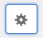
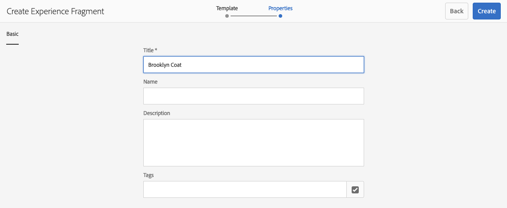
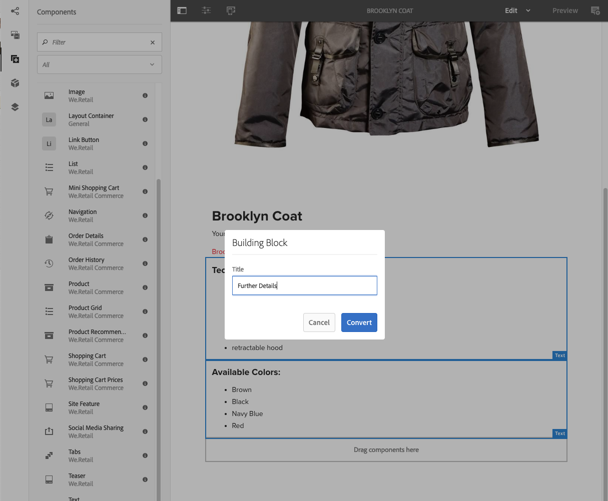

# Frammenti di esperienza{#experience-fragments}

Un frammento di esperienza è un gruppo di uno o più componenti, inclusi il contenuto e il layout, a cui è possibile fare riferimento all’interno delle pagine. Possono contenere qualsiasi componente.

Un frammento di esperienza:

* è parte di un’esperienza (pagina).
* Può essere utilizzato su più pagine.
* Si basa su un modello (solo modificabile) che ne definisce struttura e componenti.
* Questo modello viene utilizzato per creare la *pagina root* del frammento di esperienza.
* È costituito da uno o più componenti, con layout, in un sistema paragrafo.
* Può contenere altri frammenti di esperienza.
* Può essere combinato con altri componenti (inclusi altri frammenti esperienza) per formare una pagina completa (esperienza).
* Puoi creare una o più varianti in base alla pagina root.
* Queste varianti possono condividere contenuti e/o componenti.
* Può essere suddiviso in blocchi predefiniti che possono essere utilizzati in più varianti del frammento.

Puoi utilizzare Frammenti esperienza:

* Se un autore desidera riutilizzare parti (un frammento di un’esperienza) di una pagina, deve copiare e incollare tale frammento. Creare e gestire queste esperienze di copia/incolla richiede tempo e può essere fonte di errori da parte dell’utente. Grazie a Frammenti esperienza non è più necessario eseguire operazioni di copia/incolla.
* Per supportare il caso d’uso del CMS headless. Gli autori intendono utilizzare AEM solo per l’authoring, ma non per la distribuzione al cliente. Un sistema o punto di contatto di terze parti potrebbe prendere in carico questa particolare esperienza e in seguito trasmetterla all’utente finale.

>[!NOTE]
>
>Per poter accedere in scrittura ai frammenti esperienza, l’account utente deve essere registrato nel gruppo:
>
>    `experience-fragments-editors`
>
In caso di problemi, contatta l’amministratore di sistema.

## Quando utilizzare i frammenti esperienza?   {#when-should-you-use-experience-fragments}

I Frammenti di esperienza sono indicati nei seguenti casi:

* Quando desideri riutilizzare le esperienze.

   * Per esperienze che riutilizzerai con contenuti simili o uguali. 

* Quando utilizzi AEM come piattaforma di distribuzione di contenuti per terze parti.

   * Per qualsiasi soluzione che utilizza AEM come piattaforma di distribuzione di contenuti. 
   * Per incorporare contenuti nei punti di contatto di terze parti

* Se usi un’esperienza con diverse varianti o rappresentazioni.

   * Varianti per un canale o per un contesto specifico. 
   * Esperienze che è utile raggruppare (ad esempio una campagna con esperienze diverse per i diversi canali)

* Quando utilizzi Commerce omnichannel.

   * Per condividere contenuti commerciali sui canali di [social media](/help/sites-developing/experience-fragments.md#social-variations) su larga scala
   * Per assegnare funzioni transazionali ai punti di contatto

## Organizzazione dei frammenti esperienza {#organizing-your-experience-fragments}

È consigliabile:
* organizzare i frammenti esperienza in cartelle;

* [configurare i modelli consentiti in queste cartelle](#configure-allowed-templates-folder).

La creazione di cartelle consente di:

* creare una struttura significativa per i frammenti esperienza, ad esempio, in base alla classificazione

  >[!NOTE]
  >
  Non è necessario allineare la struttura dei frammenti esperienza alla struttura delle pagine del sito.

* [allocare i modelli consentiti a livello di cartella](#configure-allowed-templates-folder)

  >[!NOTE]
  >
  Per creare un modello personalizzato, puoi utilizzare [l’editor modelli](/help/sites-authoring/templates.md).

Nel progetto WKND alcuni frammenti esperienza vengono strutturati in base a `Contributors`. La struttura utilizzata illustra anche come utilizzare altre funzioni, come la gestione multisito (incluse le copie per lingua).

Consulta:

`http://localhost:4502/aem/experience-fragments.html/content/experience-fragments/wknd/language-masters/en/contributors/kumar-selveraj/master`

## Creazione e configurazione di una cartella per i frammenti esperienza {#creating-and-configuring-a-folder-for-your-experience-fragments}

Per creare e configurare una cartella per i frammenti esperienza, è consigliabile:

1. [Creare una cartella](/help/sites-authoring/managing-pages.md#creating-a-new-folder).

1. [Configurare i modelli di frammento esperienza consentiti per la cartella](#configure-allowed-templates-folder).

>[!NOTE]
>
È anche possibile configurare i [modelli consentiti per l’istanza](#configure-allowed-templates-instance), ma questo metodo **non** è consigliato in quanto i valori possono essere sovrascritti in seguito a un aggiornamento.

### Configurare i modelli consentiti per la cartella {#configure-allowed-templates-folder}

>[!NOTE]
>
Si tratta del metodo consigliato per specificare i **modelli consentiti**, poiché i valori non verranno sovrascritti in seguito a un aggiornamento.

1. Individua la cartella **Frammenti esperienza** necessaria.

1. Seleziona la cartella e quindi **Proprietà**.

1. Specifica l’espressione regolare per recuperare i modelli richiesti nel campo **Modelli consentiti**.

   Esempio:
   `/conf/(.*)/settings/wcm/templates/experience-fragment(.*)?`

   Consulta:
   `http://localhost:4502/mnt/overlay/cq/experience-fragments/content/experience-fragments/folderproperties.html/content/experience-fragments/wknd`

   

   >[!NOTE]
   >
   Per ulteriori informazioni, consulta [Modelli per frammenti esperienza](/help/sites-developing/experience-fragments.md#templates-for-experience-fragments).

1. Seleziona **Salva e chiudi**.

### Configurare i modelli consentiti per l’istanza {#configure-allowed-templates-instance}

>[!CAUTION]
>
È consigliabile non utilizzare questo metodo per modificare i **modelli consentiti**, in quanto i modelli specificati possono essere sovrascritti in seguito a un aggiornamento.
>
Utilizza questa finestra di dialogo solo a scopo informativo.

1. Individua la console **Frammenti esperienza** necessaria.

1. Seleziona le **opzioni di configurazione**:

   

1. Specifica i modelli richiesti nella finestra di dialogo **Configura frammenti esperienza**:

   

   >[!NOTE]
   >
   Per ulteriori informazioni, consulta [Modelli per frammenti esperienza](/help/sites-developing/experience-fragments.md#templates-for-experience-fragments).

1. Seleziona **Salva**.

## Creazione di un frammento esperienza {#creating-an-experience-fragment}

Per creare un frammento esperienza:

1. Seleziona Frammenti esperienza nel pannello di navigazione globale.

   

1. Individua la cartella desiderata e seleziona **Crea**.

   

1. Seleziona **Frammento esperienza** per aprire la procedura guidata **Crea frammento esperienza**.

   Seleziona il **modello** appropriato, quindi **Avanti**:

   

1. Inserisci le **proprietà** per il **frammento esperienza**.

   È obbligatorio un **Titolo**. Se il **Nome** viene lasciato vuoto, verrà derivato dal valore **Titolo**.

   

   >[!NOTE]
   >
   I tag del modello Frammento di esperienza non verranno uniti ai tag presenti nella pagina root Frammento di esperienza.
   >
   Sono completamente separati.

1. Fai clic su **Crea**.

   Verrà visualizzato un messaggio. Seleziona:

   * **Fine** per tornare alla console

   * **Apri** per aprire l’editor frammenti

## Modifica del frammento esperienza {#editing-your-experience-fragment}

L’editor dei frammenti esperienza offre funzionalità simili al normale editor di pagina.

>[!NOTE]
>
Consulta [Modifica del contenuto di una pagina](/help/sites-authoring/editing-content.md) per ulteriori informazioni su come utilizzare l’editor pagina.

La procedura di esempio seguente illustra come creare un teaser per un prodotto:

1. Trascina una **Teaser** dal [Browser Componenti](/help/sites-authoring/author-environment-tools.md#components-browser).

   

1. Seleziona **[Configura](/help/sites-authoring/editing-content.md#edit-configure-copy-cut-delete-paste)** dalla barra degli strumenti del componente.
1. Aggiungi la **Risorsa** e definisci le **Proprietà** secondo le esigenze.
1. Conferma le definizioni con **Fine** (icona di spunta).
1. Aggiungi altri componenti in base alle esigenze.

## Creazione di una variante del frammento esperienza {#creating-an-experience-fragment-variation}

Puoi creare varianti del frammento di esperienza, in base alle tue esigenze:

1. Apri la pagina per la [modifica](/help/sites-authoring/experience-fragments.md#editing-your-experience-fragment).
1. Apri la scheda **Varianti**.

   

1. **Crea** consente di creare:

   * **Variazione**
   * **[Variante come Live Copy](/help/sites-administering/msm.md#live-copies)**.

1. Definisci le proprietà richieste:

   * **Modello**
   * **Titolo**
   * **Nome**; se lasciato vuoto, verrà derivato dal campo Titolo
   * **Descrizione**
   * **Tag varianti**

   

1. Conferma con **Fine** (icona di spunta), la nuova variante viene visualizzata nel pannello:

   

## Utilizzo del frammento esperienza {#using-your-experience-fragment}

Ora puoi utilizzare il frammento di esperienza durante l’authoring delle pagine:

1. Apri la pagina da modificare.

   Ad esempio: [https://localhost:4502/editor.html/content/we-retail/language-masters/en/products/men.html](https://localhost:4502/editor.html/content/we-retail/language-masters/en/products/men.html)

1. Crea un’istanza del componente Frammento esperienza trascinando il componente dal browser Componenti al sistema di paragrafi della pagina:

   

1. Aggiungi il frammento esperienza effettivo all’istanza del componente, eseguendo una delle seguenti operazioni:

   * Trascina il frammento richiesto dal browser Risorse e rilascialo nel componente
   * Seleziona **Configura** dalla barra degli strumenti del componente e specifica il frammento da utilizzare, conferma con **Fine** (segno di spunta)

   

   >[!NOTE]
   >
   L’opzione Modifica, nella barra degli strumenti del componente, funziona come una scelta rapida per aprire il frammento nell’editor frammenti.

## Blocchi predefiniti {#building-blocks}

Puoi selezionare uno o più componenti per creare un blocco predefinito da riutilizzare nel frammento:

### Creazione di un blocco predefinito {#creating-a-building-block}

Per creare un nuovo blocco predefinito:

1. Nell’editor Frammento di esperienza, seleziona i componenti da riutilizzare:

   

1. Dalla barra degli strumenti Componenti, seleziona **Converti in blocco predefinito**:

   

1. Inserisci il nome del **blocco predefinito** e conferma con **Converti**:

   

1. Il **Blocco predefinito** viene visualizzato nella scheda e può essere selezionato nel sistema paragrafo:

   

#### Gestione di un blocco predefinito {#managing-a-building-block}

Il blocco predefinito è visibile nella scheda **Blocchi predefiniti**. Per ciascun blocco sono disponibili le seguenti azioni:

* Vai a master: apri la variante della pagina root in una nuova scheda
* Rinomina
* Eliminare

#### Utilizzo di un blocco predefinito {#using-a-building-block}

Puoi trascinare il blocco predefinito nel sistema di paragrafi di qualsiasi frammento, come un qualsiasi altro componente.

## Dettagli del frammento esperienza {#details-of-your-experience-fragment}

I dettagli del frammento vengono visualizzati in diverse posizioni:

1. I dettagli vengono visualizzati in tutte le viste della console **Frammenti esperienza**. Nella **vista a elenco** sono visualizzati i dettagli di un’[esportazione in Target](/help/sites-administering/experience-fragments-target.md):

   

1. Quando apri le **proprietà** del frammento esperienza:

   

   Le proprietà sono disponibili in diverse schede:

   >[!CAUTION]
   >
   Queste schede vengono visualizzate quando apri **Proprietà** dalla console Frammenti esperienza.
   >
   >
   Se scegli **Apri proprietà** durante la modifica di un frammento esperienza, vengono visualizzate le [proprietà di pagina](/help/sites-authoring/editing-page-properties.md) appropriate.

   

   * **Base**

      * **Titolo** - obbligatorio

      * **Descrizione**
      * **Tag**
      * **Numero totale di varianti** - solo informativo

      * **Numero di varianti web** - solo informativo
      * **Numero di varianti non web** - inf **Solo informazioni**

      * **Numero di pagine che utilizzano questo frammento** - solo informazioni

   * **Servizi cloud**

      * **Configurazione cloud**
      * **Configurazioni Cloud Service**
      * **ID pagina Facebook**
      * **Bacheca Pinterest**

   * **Riferimenti**

      * Un elenco di riferimenti.

   * **Stato social media**

      * Dettagli delle varianti per social media.

## Rendering HTML semplice {#the-plain-html-rendition}

Se utilizzi il selettore `.plain.` nell’URL, puoi accedere al rendering HTML semplice dal browser.

>[!NOTE]
>
Sebbene sia disponibile direttamente dal browser, [lo scopo principale è quello di consentire ad altre applicazioni (ad esempio, applicazioni web di terze parti o implementazioni personalizzate per dispositivi mobili) di accedere ai contenuti del frammento esperienza direttamente dall’URL](/help/sites-developing/experience-fragments.md#the-plain-html-rendition).

## Esportazione di frammenti esperienza   {#exporting-experience-fragments}

Per impostazione predefinita, i frammenti di esperienza vengono forniti nel formato HTML. Può essere utilizzato sia dall’AEM che da canali di terze parti.

Per l’esportazione in Adobe Target, è possibile utilizzare anche JSON. Consulta [Integrazione di Target con frammenti esperienza](/help/sites-administering/experience-fragments-target.md) per informazioni complete.
