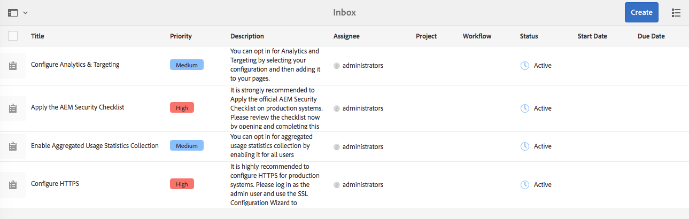
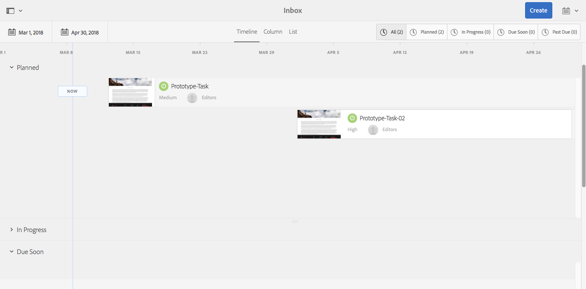
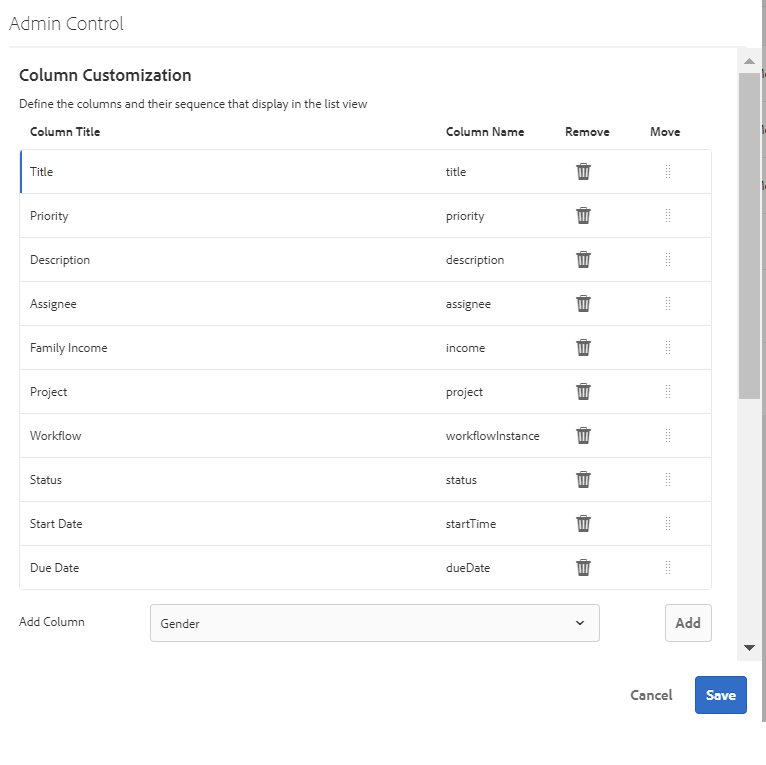

# Casella in entrata{#your-inbox}

Puoi ricevere notifiche da varie aree dell’AEM, inclusi flussi di lavoro e progetti; ad esempio, su:

* Attività:

   * possono essere create anche in vari punti nell&#39;interfaccia utente dell&#39;AEM, ad esempio in **Progetti**,
   * possono essere il prodotto di un passaggio del flusso di lavoro **Crea attività** o **Crea attività progetto**.

* Flussi di lavoro:

   * elementi di lavoro che rappresentano azioni da eseguire sul contenuto della pagina;

      * sono il prodotto dei passaggi **Partecipante** del flusso di lavoro

   * elementi con errori, per consentire agli amministratori di ripetere il passaggio non riuscito.

Queste notifiche vengono ricevute nella tua casella in entrata, dove puoi visualizzarle e interagire con loro.

>[!NOTE]
>
>L’AEM preconfigurato viene precaricato con le attività amministrative assegnate al gruppo di utenti amministratori. Per informazioni dettagliate, consulta [Attività amministrative predefinite](#out-of-the-box-administrative-tasks).

>[!NOTE]
>
>Per ulteriori informazioni sui tipi di elemento, vedi anche:
>
>* [Progetti](/help/sites-authoring/touch-ui-managing-projects.md)
>* [Progetti: lavorare con le attività](/help/sites-authoring/task-content.md)
>* [Flussi di lavoro](/help/sites-authoring/workflows.md)
>* [Forms](/help/forms/using/introduction-aem-forms.md)
>

## Casella in entrata nell’intestazione {#inbox-in-the-header}

Da una qualsiasi console, il numero corrente di elementi nella casella in entrata viene visualizzato nell’intestazione. L’indicatore può anche essere aperto per fornire un accesso rapido alle pagine che richiedono azioni o accesso alla casella in entrata:

>[!NOTE]
>
>Alcune azioni sono anche visualizzate nella [vista a schede della relativa risorsa](/help/sites-authoring/basic-handling.md#card-view).

## Attività amministrative predefinite  {#out-of-the-box-administrative-tasks}

L’AEM preconfigurato è precaricato con quattro attività assegnate al gruppo di utenti amministratore.

* [Configura Analytics e Targeting](/help/sites-administering/opt-in.md)
* [Applica elenco di controllo sicurezza AEM](/help/sites-administering/security-checklist.md)
* Abilita raccolta di dati di utilizzo aggregati
* [Configurare HTTPS](/help/sites-administering/ssl-by-default.md)

## Apertura della casella in entrata  {#opening-the-inbox}

Per aprire la casella in entrata delle notifiche AEM:

1. Fai clic sull’indicatore nella barra degli strumenti.

1. Seleziona **Visualizza tutto**. Verrà aperta la cartella Posta in arrivo **AEM**. La casella in entrata mostra gli elementi dei flussi di lavoro, delle attività e dei progetti.
1. La vista predefinita è [Vista elenco](#inbox-list-view), ma puoi anche passare alla [Vista calendario](#inbox-calendar-view). Questa operazione viene effettuata con il selettore vista (barra degli strumenti, in alto a destra).

   Per entrambe le visualizzazioni è inoltre possibile definire [Impostazioni visualizzazione](#inbox-view-settings); le opzioni disponibili dipendono dalla visualizzazione corrente.

   

>[!NOTE]
>
>La casella in entrata funziona come una console; puoi quindi utilizzare le funzioni di [Navigazione globale](/help/sites-authoring/basic-handling.md#global-navigation) o [Ricerca](/help/sites-authoring/search.md) per passare a un’altra posizione al termine dell’operazione.

### Casella in entrata - Vista a elenco {#inbox-list-view}

In questa vista sono elencati tutti gli elementi, insieme alle principali informazioni rilevanti:

### Casella in entrata - Vista calendario {#inbox-calendar-view}

Questa vista mostra gli elementi in base alla loro posizione nel calendario e alla vista precisa selezionata:

Operazioni disponibili:

* seleziona una visualizzazione specifica; **Timeline**, **Colonna**, **Elenco**

* specifica le attività da visualizzare in base a **Pianificazione**; **Tutte**, **Pianificate**, **In corso**, **In scadenza**, **Scadute**

* espandere la visualizzazione per ottenere informazioni più dettagliate su un elemento
* seleziona un intervallo di date per attivare la visualizzazione:

### Casella in entrata - Impostazioni {#inbox-view-settings}

Per entrambe le viste (Elenco e Calendario) puoi definire le impostazioni:

* **Vista calendario**

  Per **Vista calendario** puoi configurare:

   * **Raggruppa per**
   * **Pianificazione** o **Nessuna**
   * **Dimensioni scheda**

  

* **Vista a elenco**

  Per **Vista a elenco** puoi configurare il metodo di ordinamento:

   * **Campo di ordinamento**
   * **Ordinamento**

  

### Casella in entrata - Controllo amministratore {#inbox-admin-control}

L’opzione Admin Control consente agli amministratori di:

* Personalizzare le colonne della casella in entrata dell’AEM

* Personalizzare il testo e il logo dell’intestazione

* Controlla la visualizzazione dei collegamenti di navigazione disponibili nell’intestazione

L&#39;opzione Admin Control è visibile solo ai membri del gruppo `administrators` o `workflow-administrators`.

* **Personalizzazione colonna**: personalizza una casella in entrata AEM per modificare il titolo predefinito di una colonna, riordinare la posizione di una colonna e visualizzare colonne aggiuntive in base ai dati di un flusso di lavoro.
   * **Aggiungi colonna**: selezionare una colonna da aggiungere nella casella in entrata AEM.
   * **Modifica colonna**: passa il mouse sul titolo della colonna e seleziona l&#39;icona  per immettere il nome visualizzato della colonna.
   * **Elimina colonna**: selezionare l&#39;icona  per eliminare la colonna dalla casella in entrata AEM.
   * **Sposta colonna**: trascina l&#39;icona  per spostare una colonna in una nuova posizione nella casella in entrata AEM.

  

* **Personalizzazione del marchio**

   * **Personalizza testo intestazione:** Specificare il testo da visualizzare nell&#39;intestazione per sostituire il testo predefinito **Adobe Experience Manager**.

   * **Personalizza logo:** Specificare l&#39;immagine da visualizzare nell&#39;intestazione come logo. Carica un’immagine in Digital Asset Management (DAM) e fai riferimento a tale immagine nel campo.

* **Navigazione utente**
   * **Nascondi opzioni di spostamento:** Selezionare questa opzione per nascondere le opzioni di spostamento disponibili nell&#39;intestazione. Le opzioni di navigazione includono collegamenti ad altre soluzioni, collegamenti alla Guida e opzioni di authoring disponibili toccando il logo o il testo di Adobe Experience Manager.
* **Salva:** Scegliere questa opzione per salvare le impostazioni.

## Intervenire su un elemento {#taking-action-on-an-item}

>[!NOTE]
>
>Sebbene sia possibile selezionare più elementi, le azioni possono essere eseguite solo su un elemento alla volta.

1. Per intervenire su un elemento, seleziona la miniatura dell’elemento appropriato. Le icone per le azioni applicabili a tale elemento sono visualizzate nella barra degli strumenti:

   

   Le azioni dipendono dall’elemento selezionato e includono:

   * **Completa** azione; ad esempio, un&#39;attività o un elemento del flusso di lavoro.
   * **Riassegna**/**Delega** un elemento.
   * **Apri** un elemento; a seconda del tipo di elemento, questa azione può:

      * mostra le proprietà dell&#39;elemento
      * apri un dashboard o una procedura guidata appropriati per ulteriori azioni
      * apri documentazione correlata

   * **Indietro** a un passaggio precedente.
   * Visualizzare il payload di un flusso di lavoro.
   * Crea un progetto dall’elemento.

   >[!NOTE]
   >
   >Per ulteriori informazioni, consulta:
   >
   >* Elementi del flusso di lavoro - [Partecipazione ai flussi di lavoro](/help/sites-authoring/workflows-participating.md)

1. A seconda dell’elemento selezionato, verrà avviata un’azione, ad esempio:

   * verrà aperta una finestra di dialogo appropriata per l’azione.
   * verrà avviata una Action Wizard.
   * verrà aperta una pagina della documentazione.

   Ad esempio, **Riassegna** apre una finestra di dialogo:

   

   A seconda della finestra di dialogo, procedura guidata o pagina di documentazione aperta, è possibile:

   * Conferma l’azione appropriata, ad esempio Riassegna.
   * Annulla l’azione.
   * Freccia indietro; ad esempio, se è stata aperta una Action Wizard o una pagina della documentazione, puoi tornare alla Casella in entrata.

## Creazione di un’attività {#creating-a-task}

Dalla casella in entrata è possibile creare le attività:

1. Seleziona **Crea**, quindi **Attività**.
1. Compila i campi necessari nelle schede **Base** e **Avanzate**. È obbligatorio solo il **Titolo**, tutti gli altri sono facoltativi:

   * **Base**:

      * **Titolo**
      * **Progetto**
      * **Assegnatario**
      * **Contenuto**; simile al payload, è un riferimento dall&#39;attività a una posizione nell&#39;archivio
      * **Descrizione**
      * **Priorità attività**
      * **Data inizio**
      * **Data di scadenza**

   

   * **Avanzate**

      * **Nome**: utilizzato per formare l&#39;URL; se vuoto, verrà basato sul **Titolo**.

   

1. Seleziona **Invia**.

## Creazione di un progetto  {#creating-a-project}

Per alcune attività puoi creare un [Progetto](/help/sites-authoring/projects.md) in base all’attività in questione:

1. Seleziona l’attività appropriata, toccando o facendo clic sulla miniatura.

   >[!NOTE]
   >
   >Per creare un progetto, è possibile utilizzare solo le attività create con l’opzione **Crea** della **Casella in entrata**.
   >
   >Gli elementi di lavoro (da un flusso di lavoro) non possono essere utilizzati per creare un progetto.

1. Dalla barra degli strumenti, seleziona **Crea progetto** per aprire la procedura guidata.
1. Seleziona il modello appropriato, quindi **Avanti**.
1. Specifica le proprietà richieste:

   * **Base**

      * **Titolo**
      * **Descrizione**
      * **Data inizio**
      * **Data di scadenza**
      * **Utente** e ruolo

   * **Avanzate**

      * **Nome**

   >[!NOTE]
   >
   >Consulta [Creazione di un progetto](/help/sites-authoring/touch-ui-managing-projects.md#creating-a-project) per ricevere informazioni complete.

1. Seleziona **Crea** per confermare l’azione.

## Filtrare gli elementi nella Casella in entrata AEM {#filtering-items-in-the-aem-inbox}

Puoi filtrare gli elementi elencati:

1. Apri la **Casella in entrata AEM**.

1. Apri il selettore del filtro:

   

1. Puoi filtrare gli elementi elencati in base a diversi criteri, molti dei quali possono essere perfezionati, ad esempio:

   

   >[!NOTE]
   >
   >Con [Impostazioni vista](#inbox-view-settings) è anche possibile configurare l’ordinamento quando si utilizza la [Vista a elenco](#inbox-list-view).
