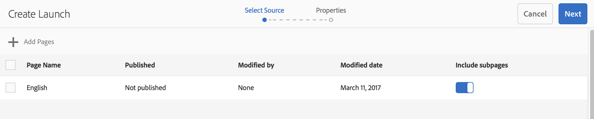

# Crea lanci{#creating-launches}

Crea un lancio per abilitare l’aggiornamento di una nuova versione delle pagine web esistenti per l’attivazione futura. Per creare un lancio, è necessario specificare un titolo e la pagina di origine:

* Il titolo viene visualizzato nella barra [Riferimenti](/help/sites-authoring/author-environment-tools.md#references), dalla quale gli autori potranno accedere per lavorarci.
* Per impostazione predefinita, le pagine secondarie della pagina sorgente sono incluse nel lancio. Se necessario, puoi utilizzare solo la pagina sorgente.
* Per impostazione predefinita, [Live Copy](/help/sites-administering/msm.md) aggiorna automaticamente le pagine del lancio durante il cambio delle pagine sorgente. È possibile specificare di creare una copia statica per impedire modifiche automatiche.

Facoltativamente, puoi specificare la **Data lancio** (e l’ora) per definire quando promuovere e attivare le pagine del lancio. Tuttavia, la **Data lancio** funziona solo in combinazione con il flag **Production Ready** (vedi la sezione [Modifica di una configurazione di lancio](/help/sites-authoring/launches-editing.md#editing-a-launch-configuration)). Affinché le azioni vengano effettivamente eseguite in automatico, è necessario impostare entrambe.

## Creazione di un lancio {#creating-a-launch}

Puoi creare un lancio dalla console Sites o Lanci:

1. Apri la console **Sites** o **Lanci**.

   >[!NOTE]
   >
   >Quando si utilizza la console **Sites** solitamente si passa alla posizione della pagina sorgente, ma questo non è obbligatorio dato che puoi navigare quando selezioni la **Sorgente del lancio** nella procedura guidata.

1. A seconda della console in uso:

   * **Lanci**:

      1. Seleziona **Crea lancio** dalla barra degli strumenti per aprire la procedura guidata.

   * **Sites**:

      1. Seleziona **Crea** nella barra degli strumenti per aprire la casella di selezione.
      1. Da questa seleziona **Crea lancio** per aprire la procedura guidata.

   >[!NOTE]
   >
   >Nella console **Sites** è inoltre possibile utilizzare la [modalità di selezione](/help/sites-authoring/basic-handling.md#viewing-and-selecting-resources) per scegliere una pagina prima di fare clic su **Crea**.
   >
   >La pagina selezionata verrà così utilizzata come pagina sorgente iniziale.

1. Nel passaggio **Seleziona origine** è necessario usare la funzione **Aggiungi pagine**. Puoi selezionare più pagine, specificando il percorso per ciascuna:

   * Passa alla posizione desiderata.
   * Seleziona le pagine sorgente e conferma (segno di spunta).

   Ripeti in base alle esigenze.  

   

   >[!NOTE]
   >
   >Per aggiungere pagine e/o rami a un lancio, questi devono essere all’interno di un sito; ovvero, in una directory comune di primo livello.
   >
   >Se un sito contiene directory principali della lingua al di sotto del livello principale, le pagine e i rami di un lancio devono trovarsi al di sotto di una directory principale della lingua comune.
   >
   >Se tenti di creare un lancio con una pagina padre o figlio nel percorso di origine, questo non riuscirà e restituirà l’errore &quot;La destinazione esiste già in :path to the page&quot;.

1. Per ogni voce è possibile specificare se:

   * **Includere le pagine secondarie**:

      * Specifica se creare il lancio con o senza pagine figlie.  Per impostazione predefinita, le pagine secondarie sono incluse.

   Procedi con **Successivo**.

   

1. Nel passaggio **Proprietà** della procedura guidata puoi specificare:

   * **Titolo lancio**: il nome del lancio. Il nome deve essere significativo per gli autori.
   * **con contenuto esistente**: il contenuto originale viene utilizzato per creare il lancio.
   * **con un nuovo modello per sostituire la pagina**: per ulteriori dettagli, vedi [Creare un lancio con un nuovo modello](#create-launch-with-new-template).
   * **Eredita i dati live della pagina di origine**: seleziona questa opzione per aggiornare automaticamente il contenuto delle pagine di lancio quando cambiano le pagine di origine. Con questa opzione il lancio diventa un [live copy](/help/sites-administering/msm.md).

     Per impostazione predefinita, questa opzione è selezionata.

   * **Data lancio**: la data e l&#39;ora in cui la copia del lancio deve essere attivata (in base alla segnalazione **Produzione pronta**; consulta [Lanci: l&#39;ordine degli eventi](/help/sites-authoring/launches.md#launches-the-order-of-events)).

   

1. Utilizza **Crea** per completare il processo e creare il nuovo lancio. La finestra di dialogo di conferma chiederà se desideri aprire immediatamente il lancio.

   Se torni alla console (con **Fine**) puoi visualizzare (e accedere) al lancio da:

   * il [**Lanci** console](/help/sites-authoring/launches.md#the-launches-console)
   * il [**Riferimenti** nel **Sites** console](/help/sites-authoring/launches.md#launches-in-references-sites-console)

### Creare un lancio con un nuovo modello {#create-launch-with-new-template}

Quando [creazione di un lancio](/help/sites-authoring/launches-creating.md#create-launch-with-new-template) puoi scegliere se utilizzare un nuovo modello con l’opzione: **utilizzo di un nuovo modello per sostituire la pagina**

>[!CAUTION]
>
>Questa opzione è disponibile solo quando crei un lancio dalla console **Sites**. Non è disponibile quando crei un lancio dalla console **Lanci**.

Quando selezioni questa opzione:

* aggiornare le altre opzioni disponibili,
* includi un nuovo passaggio in cui puoi selezionare il modello richiesto.

>[!CAUTION]
>
>Quando si utilizza un modello diverso, la nuova pagina sarà vuota. A causa della diversa struttura della pagina, nessun contenuto verrà copiato.
>
>Questo meccanismo può essere utilizzato per modificare il modello di una [pagina esistente](/help/sites-authoring/managing-pages.md#creating-a-new-page), anche se va considerata la perdita di contenuto.

### Creazione di un lancio nidificato {#creating-a-nested-launch}

La creazione di un lancio nidificato (un lancio all’interno di un lancio) ti consente di creare un lancio da un lancio esistente in modo che gli autori possano sfruttare le modifiche già apportate, anziché dover apportare le stesse modifiche più volte per ogni lancio.

>[!NOTE]
>
>Vedi anche [Promozione di un lancio nidificato](/help/sites-authoring/launches-promoting.md#promoting-a-nested-launch).

#### Creazione di un lancio nidificato: console Lanci {#creating-a-nested-launch-launches-console}

La creazione di un lancio nidificato dalla console **Lanci** è molto simile alla creazione di qualsiasi altra forma di lancio, con l’eccezione che è necessario passare al ramo dei lanci `/content/launches`:

1. Nella console **Lanci** seleziona **Crea**.
1. Fai clic su **Aggiungi pagine**, quindi specifica `/content/launches` nel filtro per individuare il ramo lanci. Scegli il lancio necessario e conferma con **Seleziona**:

   

1. Procedi con **Successivo** e completare **Proprietà** come con qualsiasi altro lancio.

   

#### Creazione di un lancio nidificato: console Sites {#creating-a-nested-launch-sites-console}

Per creare un lancio nidificato dalla console **Sites**, basato su un lancio esistente:

1. Accedi a [Lancio da Riferimenti (console Sites)](/help/sites-authoring/launches.md#launches-in-references-sites-console) per visualizzare le azioni disponibili.
1. Seleziona **Crea lancio** per aprire la procedura guidata (poiché l’origine è già stata selezionata, ignorerà il passaggio **Seleziona origine**).

1. Immetti il **Titolo lancio** e tutti gli altri dettagli richiesti (come con un normale lancio).

1. Utilizza **Crea** per completare il processo e creare il nuovo lancio. La finestra di dialogo di conferma chiederà se desideri aprire immediatamente il lancio.

   Se fai clic su **Fine**, vieni riportato alla barra **Riferimenti** della console **Sites**, se selezioni la pagina appropriata viene visualizzato il tuo nuovo lancio.

### Eliminazione di un lancio {#deleting-a-launch}

Puoi eliminare un lancio dalla [console lanci](/help/sites-authoring/launches.md#the-launches-console):

* Seleziona il lancio toccando o facendo clic sulla miniatura.
* Viene visualizzata la barra degli strumenti: seleziona Elimina.
* Conferma l’azione.

>[!CAUTION]
>
>L’eliminazione del lancio rimuove il lancio stesso e tutti i lanci nidificati discendenti.
