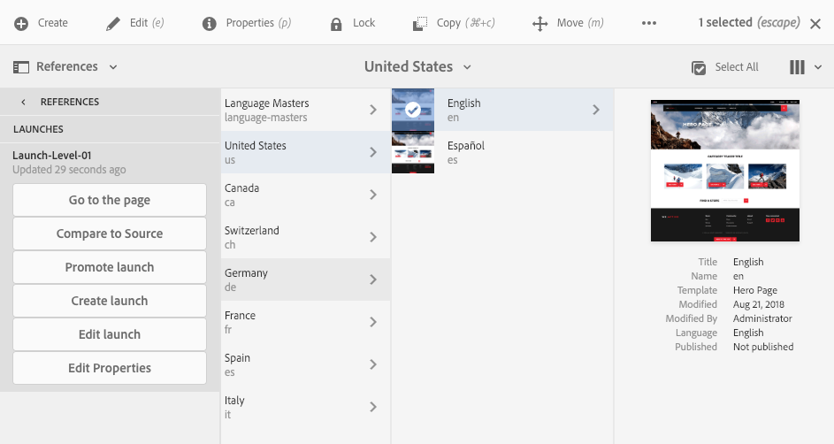

# Modifica dei lanci{#editing-launches}

## Modifica delle pagine di lancio {#editing-launch-pages}

Quando è stato creato un lancio per una pagina (o un set di pagine) puoi modificarne il contenuto nella copia di lancio delle pagine.

1. Accedi a [Lancio da Riferimenti (console Sites)](/help/sites-authoring/launches.md#launches-in-references-sites-console) per visualizzare le azioni disponibili.
1. Seleziona **Vai alla pagina** per aprire la pagina su cui effettuare la modfica.

>[!NOTE]
>
>Non puoi spostare una pagina all’interno di un lancio. Il tentativo di eseguire questa azione attiva un messaggio di avviso:
>
>* Attenzione: questa pagina è l’origine di un lancio. Lo spostamento della pagina non è consentito.

### Modifica delle pagine di lanci soggette a Live Copy {#editing-launch-pages-subject-to-a-live-copy}

Se il lancio si basa su [live copy](/help/sites-administering/msm.md) in questo modo:

* consulta bloccare i simboli (piccoli lucchetti) quando modifichi un componente (contenuto e/o proprietà).
* vedi la **Live Copy** scheda in **Proprietà pagina**

Una Live Copy viene utilizzata per sincronizzare il contenuto *dal* ramo di origine *al* ramo lancio, al fine di mantenere aggiornato il lancio con le modifiche apportate nell’origine.

Puoi apportare modifiche nello stesso modo in cui puoi modificare una Live Copy standard; ad esempio:

* Facendo clic su un lucchetto chiuso si interrompe la sincronizzazione e si apportano nuovi aggiornamenti al contenuto del lancio. Una volta sbloccato (lucchetto aperto), le modifiche non verranno sovrascritte da eventuali modifiche apportate nella stessa posizione all’interno del ramo di origine.
* **Sospendi** (e **Riprendi**) l’ereditarietà per una pagina specifica.

Consulta [Modifica del contenuto della Live Copy](/help/sites-administering/msm-livecopy.md#changing-live-copy-content) per ulteriori informazioni.

## Confronto tra una pagina di lancio e la relativa pagina sorgente {#comparing-a-launch-page-to-its-source-page}

Per tenere traccia delle modifiche apportate, puoi visualizzare il lancio in **Riferimenti** e confrontare la pagina del lancio con la relativa pagina di origine:

1. In **Sites** console, [passa alla pagina sorgente del lancio e selezionala](/help/sites-authoring/basic-handling.md#viewingandselectingyourresources).
1. Apri il pannello **[Riferimenti](/help/sites-authoring/basic-handling.md#references)** e seleziona **Lanci**.
1. Seleziona il lancio specifico, quindi **Confronta con sorgente**:

   

1. Le due pagine (lancio e origine) verranno aperte una accanto all’altra.

   Per informazioni complete sull’utilizzo di questa funzionalità, consulta [Differenze tra pagine](/help/sites-authoring/page-diff.md).

## Modifica delle pagine sorgente utilizzate {#changing-the-source-pages-used}

In qualsiasi momento è possibile aggiungere o rimuovere pagine da e verso la gamma di pagine di origine per un lancio:

1. Accedi e seleziona il lancio in uno dei seguenti modi:

   * [console Lanci](/help/sites-authoring/launches.md#the-launches-console):

      * Seleziona **Modifica**.

   * [Riferimenti (console Sites)](/help/sites-authoring/launches.md#launches-in-references-sites-console) per visualizzare le azioni disponibili:

      * Seleziona **Modifica lancio**.

   Verranno visualizzate le pagine sorgente.

1. Apporta le modifiche necessarie, quindi conferma con **Salva**.

   >[!NOTE]
   >
   >Per aggiungere pagine a un lancio, è necessario che si trovino al di sotto di una directory principale della lingua comune, ovvero all’interno di un singolo sito.

## Modifica di una configurazione di lancio {#editing-a-launch-configuration}

In qualsiasi momento è possibile modificare le proprietà per un lancio:

1. Accedi e seleziona il lancio in uno dei seguenti modi:

   * [console Lanci](/help/sites-authoring/launches.md#the-launches-console):

      * Seleziona **Proprietà**.

   * [Riferimenti (console Sites)](/help/sites-authoring/launches.md#launches-in-references-sites-console) per visualizzare le azioni disponibili:

      * Seleziona **Modifica proprietà**.

   Verranno visualizzati i dettagli.

1. Apporta le modifiche necessarie, quindi conferma con **Salva**.

   Consulta la sezione [Lanci - Ordine degli eventi](/help/sites-authoring/launches.md#launches-the-order-of-events) per informazioni sullo scopo e sull’interazione dei campi **Data lancio** e **Production Ready**.

## Esplorazione dello stato di avvio di una pagina {#discovering-the-launch-status-of-a-page}

Lo stato viene visualizzato quando selezioni un lancio specifico dalla scheda Riferimenti (consulta [Lanci in Riferimenti (console Sites)](/help/sites-authoring/launches.md#launches-in-references-sites-console)).

