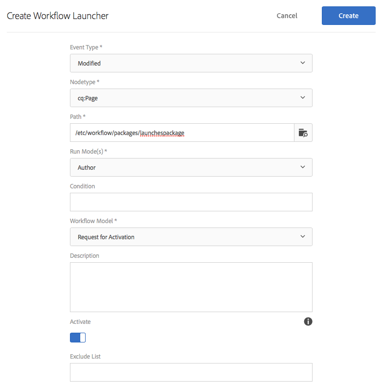

# Promozione dei lanci{#promoting-launches}

Con la promozione delle pagine di lancio si sposta il contenuto nell’origine (produzione) prima della pubblicazione. Quando una pagina di lancio viene promossa, la pagina corrispondente nelle pagine sorgente viene sostituita con il contenuto della pagina promossa. Quando promuovi una pagina di lancio sono disponibili le seguenti opzioni:

* Promuovere solo la pagina corrente o l’intero lancio.
* Promuovere le pagine figlie della pagina corrente.
* Promuovere il lancio completo o solo le pagine che sono state modificate.
* Eliminare il lancio dopo la promozione.

>[!NOTE]
>
>Dopo aver promosso le pagine di lancio nella destinazione (**Produzione**), puoi attivare le pagine di **Produzione** come entità (per velocizzare il processo). Aggiungi le pagine a un pacchetto di flusso di lavoro e utilizzalo come payload, per avere un flusso di lavoro che attiva un pacchetto di pagine. Prima di promuovere il lancio è necessario creare il pacchetto di workflow. Consulta [Elaborazione di pagine promosse tramite Flusso di lavoro AEM](#processing-promoted-pages-using-aem-workflow).

>[!CAUTION]
>
>Non è possibile promuovere contemporaneamente un singolo lancio. Due azioni di promozione sullo stesso lancio nello stesso momento possono causare un errore: `Launch could not be promoted` (con gli errori di conflitto nel registro).

>[!CAUTION]
>
>Quando promuovi i lanci per le pagine *modificate*, vengono considerate le modifiche nei rami sia di origine che del lancio.

## Promozione delle pagine di lancio {#promoting-launch-pages}

>[!NOTE]
>
>Riguarda l’azione manuale per promuovere le pagine di lancio quando esiste un solo livello di lancio. Consulta:
>
>* [Promozione di un lancio nidificato](#promoting-a-nested-launch) se nella struttura sono presenti più lanci.
>* [Lanci: ordine degli eventi](/help/sites-authoring/launches.md#launches-the-order-of-events) per ulteriori dettagli sulla promozione e la pubblicazione automatiche.
>

Puoi promuovere i lanci dalla console **Sites** o dalla console **Lanci**:

1. Apri:

   * la console **Sites**:

      1. Apri la [barra dei riferimenti](/help/sites-authoring/author-environment-tools.md#showingpagereferences) e seleziona la pagina sorgente desiderata utilizzando la [modalità di selezione](/help/sites-authoring/basic-handling.md) (oppure seleziona e apri la barra dei riferimenti, l’ordine non è importante). Vengono visualizzati tutti i riferimenti.

      1. Seleziona **Lanci** (ad esempio Lanci (1)) per visualizzare un elenco dei lanci specifici.
      1. Seleziona il lancio specifico per visualizzare le azioni disponibili.
      1. Seleziona **Promuovi lancio** per aprire la procedura guidata.

   * la console **Lanci**:

      1. Seleziona il lancio (fai clic sulla miniatura).
      1. Seleziona **Promuovi**.

1. Nel primo passaggio puoi specificare:

   * **Destinazione**

      * **Elimina lancio dopo la promozione**

   * **Ambito**

      * **Promuovi tutto il lancio**
      * **Promuovi pagine modificate**
      * **Promuovi la pagina corrente**
      * **Promuovi la pagina corrente e le sottopagine**

   Ad esempio, quando selezioni solo la promozione delle pagine modificate:

   

   >[!NOTE]
   >
   >Riguarda un singolo lancio; per lanci nidificati, vedi [Promozione di un lancio nidificato](#promoting-a-nested-launch).

1. Seleziona **Avanti** per procedere.
1. Puoi rivedere le pagine da promuovere, a seconda dell’intervallo di pagine scelto:

   

1. Seleziona **Promuovi**.

## Promozione delle pagine di lancio durante la modifica {#promoting-launch-pages-when-editing}

Quando modifichi una pagina di lancio, l’azione **Promuovi lancio** risulta disponibile anche da **Informazioni pagina**. Verrà avviata la procedura guidata per la raccolta delle informazioni necessarie.

>[!NOTE]
>
>Questo è disponibile per lanci singoli e [lanci nidificati](#promoting-a-nested-launch).

## Promozione di un lancio nidificato {#promoting-a-nested-launch}

Dopo aver creato un lancio nidificato, puoi promuoverlo nuovamente in qualsiasi origine, inclusa l’origine principale (produzione).

1. Come con [Creazione di un lancio nidificato](#creatinganestedlaunchlaunchwithinalaunch), accedi e seleziona il lancio richiesto nella console **Lanci** o nella barra **Riferimenti**.
1. Seleziona **Promuovi lancio** per aprire la procedura guidata.

1. Immetti i dettagli necessari:

   * **Destinazione**

      * **Destinazione promozione**
Puoi promuovere su qualsiasi sorgente.

      * **Elimina lancio dopo la promozione**
Dopo la promozione, il lancio selezionato e tutti i lanci nidificati al suo interno verranno eliminati.

   * **Ambito**
Qui puoi scegliere se promuovere l’intero lancio o solo le pagine che sono state modificate. Nel secondo caso, puoi scegliere di includere o escludere le pagine secondarie. La configurazione predefinita prevede di promuovere solo le modifiche alla pagina corrente:

      * **Promuovi tutto il lancio**
      * **Promuovi pagine modificate**
      * **Promuovi la pagina corrente**
      * **Promuovi la pagina corrente e le sottopagine**

   

1. Seleziona **Avanti**.
1. Rivedi i dettagli della promozione prima di selezionare **Promuovi**:

   

   >[!NOTE]
   >
   >Le pagine elencate dipendono dall’**Ambito** definito ed eventualmente dalle pagine che sono state modificate.

1. Le modifiche verranno promosse e riflesse nella console **Lanci**:

   

## Elaborazione di pagine promosse tramite Flusso di lavoro AEM {#processing-promoted-pages-using-aem-workflow}

Utilizza i modelli di flusso di lavoro per eseguire l’elaborazione in blocco delle pagine di lanci promosse:

1. Crea un pacchetto flusso di lavoro.
1. Quando gli autori promuovono le pagine di lanci, queste vengono memorizzate nel pacchetto flusso di lavoro.
1. Avvia un modello di flusso di lavoro utilizzando il pacchetto come payload.

Per avviare automaticamente un flusso di lavoro quando le pagine vengono promosse, [configura un modulo di avvio del flusso di lavoro](/help/sites-administering/workflows-starting.md#workflows-launchers) per il nodo del pacchetto.

Ad esempio, puoi generare automaticamente le richieste di attivazione pagina non appena un autore promuove una pagina di lancio. Configura un modulo di avvio del flusso di lavoro per avviare il flusso di lavoro Richiesta attivazione quando viene modificato il nodo del pacchetto.

