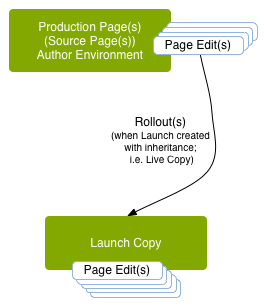

# Lanci{#launches}

I lanci consentono di creare in modo efficiente contenuti per una versione futura.

Viene creato un lancio per consentire di apportare modifiche pronte per la pubblicazione futura (mantenendo le pagine correnti). Dopo aver modificato e aggiornato le pagine di lancio, promuovile di nuovo alla sorgente, quindi attiva le pagine sorgente (livello superiore). La promozione duplica il contenuto del lancio nelle pagine sorgente e può essere eseguita manualmente o automaticamente (a seconda dei campi impostati durante la creazione e la modifica del lancio).

Ad esempio, le pagine di prodotti stagionali del tuo negozio online vengono aggiornate trimestralmente in modo che i prodotti in questione siano in linea con la stagione corrente. Per prepararti al prossimo aggiornamento trimestrale, puoi creare un lancio delle pagine web appropriate. Nel corso del trimestre, nella copia del lancio vengono accumulate le seguenti modifiche:

* Modifiche apportate alle pagine sorgenti che si verificano in seguito alle consuete attività di manutenzione. Queste modifiche vengono duplicate automaticamente nelle pagine del lancio.
* Modifiche che vengono eseguite direttamente sulle pagine di lancio in preparazione del prossimo trimestre.

Nel trimestre successivo, promuovi le pagine di lancio in modo da poter pubblicare le pagine sorgenti (mantenendo i contenuti aggiornati). Puoi promuovere tutte le pagine o solo quelle che hai modificato.

I lanci possono anche essere:

* creati per più rami principali. Nonostante sia possibile creare il lancio per l&#39;intero sito (e apportare le modifiche desiderate), questa operazione potrebbe risultare poco pratica perché l&#39;intero sito dovrà essere copiato. Quando sono coinvolte centinaia o persino migliaia di pagine, i requisiti e le prestazioni di sistema sono influenzati sia dall’azione di copia che, in un secondo momento, dai confronti richiesti per le attività di promozione.
* Nidificato (un lancio all’interno di un lancio) per consentirti di creare un lancio da uno esistente, in modo che gli autori possano sfruttare le modifiche già apportate, anziché dover apportare le stesse modifiche più volte per ogni lancio.

Questa sezione descrive come creare, modificare e promuovere (e se necessario [eliminare](/help/sites-authoring/launches-creating.md#deleting-a-launch)) pagine di lancio dall&#39;interno della console Sites o [la console Launches](#the-launches-console):

* [Creazione dei lanci](/help/sites-authoring/launches-creating.md)
* [Modifica dei lanci](/help/sites-authoring/launches-editing.md)
* [Promozione dei lanci](/help/sites-authoring/launches-promoting.md)

## Lanci: l’ordine degli eventi {#launches-the-order-of-events}

I lanci consentono di sviluppare in modo efficiente i contenuti per una versione futura di una o più pagine web attivate.

I lanci consentono di:

* Crea una copia delle pagine sorgente:

   * La copia è il lancio.
   * Le pagine sorgente di primo livello sono note come **Produzione**.

      * Le pagine sorgente possono essere ricavate da più rami (separati).

  

* Modifica la configurazione del lancio:

   * Aggiungi o rimuovi pagine e/o rami da/verso il lancio.
   * Modifica le proprietà di lancio, come **Titolo**, **Data lancio** e il flag **Production Ready**.

* Puoi promuovere e pubblicare il contenuto manualmente o automaticamente:

   * Manualmente:

      * Promuovi il contenuto del lancio fino al **Target** (pagine sorgente) quando è pronto per la pubblicazione.
      * Pubblica il contenuto dalle pagine sorgente (dopo la promozione).
      * Promuovi tutte le pagine o solo le pagine modificate.

   * Automaticamente - questo implica le seguenti attività:

      * Il campo **Data** **lancio**(**Live**): può essere impostato durante la creazione o la modifica di un lancio.

      * Il flag **Pronto per la produzione** può essere impostato solo durante la modifica di un lancio.
      * Se il **Produzione pronta** è impostato, il lancio verrà promosso automaticamente alle pagine di produzione nella **Launch**(**Live**) **data**. Dopo la promozione, le pagine di produzione vengono pubblicate automaticamente.\
        Se la data non è stata impostata, il flag non ha alcun effetto.

* Aggiorna parallelamente la pagina sorgente e la pagina di lancio:

   * Le modifiche apportate alle pagine sorgente vengono automaticamente implementate nella copia lancio (se impostate con ereditarietà; ovvero come Live Copy).
   * Le modifiche apportate alla copia di lancio possono essere effettuate senza interrompere gli aggiornamenti automatici o le pagine sorgenti.

  

* [Creare un lancio nidificato](/help/sites-authoring/launches-creating.md#creating-a-nested-launch) ovvero un lancio all’interno di un lancio:

   * L’origine è un lancio esistente.
   * È possibile [promuovere un lancio nidificato](/help/sites-authoring/launches-promoting.md#promoting-a-nested-launch) per qualsiasi target; può trattarsi di un lancio principale o delle pagine sorgente di livello superiore (Produzione).

  

  >[!CAUTION]
  >
  >L’eliminazione del lancio rimuove il lancio stesso e tutti i lanci nidificati discendenti.

>[!NOTE]
>
>La creazione e la modifica dei lanci richiede diritti di accesso a `/content/launches`- come per il gruppo predefinito `content-authors`.
>
>Per qualsiasi problema riscontrato, contatta l’amministratore del sistema.

>[!CAUTION]
>
>Il riordinamento dei componenti su una pagina Launch non è supportato.
>
>Quando la pagina viene promossa, qualsiasi modifica al contenuto viene riportata, ma le posizioni dei componenti non cambiano.

### La console Lanci {#the-launches-console}

La console Lanci fornisce una panoramica dei lanci e consente di eseguire azioni su quelli elencati. Puoi accedere alla console da:

* La console **Strumenti**: **Strumenti**, **Sites**, **Lanci**.

* Oppure direttamente con [https://localhost:4502/libs/launches/content/launches.html](https://localhost:4502/libs/launches/content/launches.html)

## Lanci nei Riferimenti (console Sites) {#launches-in-references-sites-console}

1. Nella console **Sites**, passa all’orginie dei lanci.
1. Apri la barra **Riferimenti** e seleziona la pagina sorgente.
1. Seleziona **Lanci**, verranno elencati i lanci esistenti:

   

1. Tocca o fai clic sul lancio appropriato per visualizzare l&#39;elenco delle azioni possibili:

   
