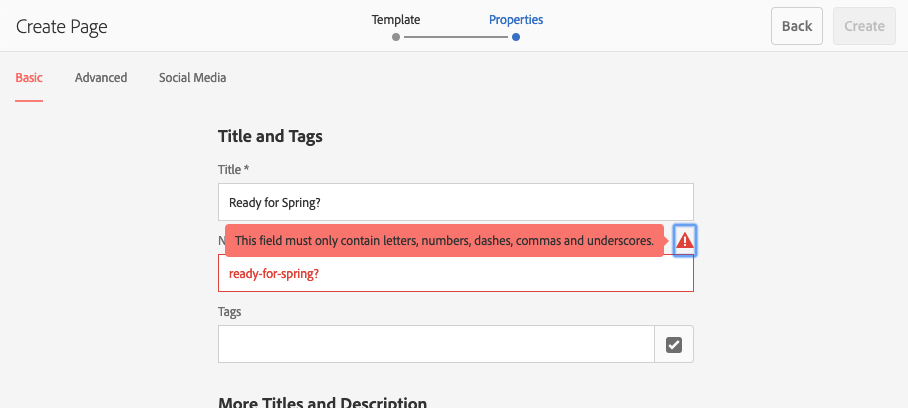

# Creazione e organizzazione delle pagine {#creating-and-organizing-pages}

Questa sezione descrive come creare e gestire le pagine con Adobe Experience Manager (AEM) in modo da poter [creare contenuti](/help/sites-authoring/editing-content.md) su tali pagine.

>[!NOTE]
>
>Il tuo account ha bisogno di [diritti di accesso appropriati](/help/sites-administering/security.md) e [autorizzazioni](/help/sites-administering/security.md#permissions) per intervenire sulle pagine, ad esempio per creare, copiare, spostare, modificare ed eliminare.
>
>Nell’eventualità di problemi, rivolgiti al tuo amministratore di sistema.

>[!NOTE]
>
>Vi sono una serie di [scelte rapide da tastiera](/help/sites-authoring/keyboard-shortcuts.md) che si possono utilizzare dalla console di siti web che consentono di organizzare le pagine con maggiore efficienza.

## Organizzazione del sito web {#organizing-your-website}

In qualità di autore, dovrai organizzare il tuo sito web all’interno di AEM. A tale scopo, dovrai creare e denominare le pagine di contenuto affinché:

* siano facilmente reperibili nell’ambiente di authoring;
* i visitatori possano facilmente sfogliare le pagine nell’ambiente di pubblicazione.

È inoltre possibile utilizzare le [cartelle](#creating-a-new-folder) per organizzare i contenuti.

La struttura di un sito web può essere considerata una struttura ad albero che racchiude le pagine dei contenuti. I nomi di queste pagine di contenuto vengono utilizzati per formare gli URL, mentre il titolo viene visualizzato quando viene visualizzato il contenuto della pagina.

Di seguito è riportato un esempio tratto dal sito We.Retail, in cui una pagina di trekking utilizza i pantaloncini ( `desert-sky-shorts`) è accessibile:

* Ambiente di authoring
  `https://localhost:4502/editor.html/content/we-retail/us/en/products/equipment/hiking/desert-sky-shorts.html`

* Ambiente di pubblicazione
  `https://localhost:4503/content/we-retail/us/en/products/equipment/hiking/desert-sky-shorts.html`

A seconda della configurazione dell’istanza, utilizza `/content` potrebbe essere facoltativo nell’ambiente di pubblicazione.

```xml
 /content
 /we-retail
  /us
   /en
    /products
     /equipment
      /hiking
       /desert-sky-shorts
       /hiking-poles
       /...
      /running...
      /surfing...
      /...
     /seasonal...
     /...
    /about-us
    /experience
    /...
   /es...
  /de...
  /fr...
  /...
 /...
```

Questa struttura può essere visualizzata dalla console **Sites**, che consente di [navigare tra le varie pagine del sito web](/help/sites-authoring/basic-handling.md#navigating) e di eseguire azioni sulle pagine. È possibile, inoltre, creare nuovi siti e [nuove pagine](#creating-a-new-page).

Da qualsiasi punto, puoi vedere il ramo verso l’alto dalle breadcrumb nella barra dell’intestazione:


### Convenzioni di denominazione delle pagine {#page-naming-conventions}

Durante la creazione di una nuova pagina sono disponibili due campi chiave:

* **[Titolo](#title)**:

   * Viene mostrato all’utente nella console ed è disponibile sopra il contenuto della pagina durante la modifica.
   * Questo campo è obbligatorio.

* **[Nome](#name)**:

   * Viene utilizzato per generare l’URI.
   * L’input dell’utente per questo campo è opzionale. Se non viene specificato, il nome viene derivato dal titolo. Per ulteriori dettagli, consulta la seguente sezione sulle [restrizioni e best practice per i nomi delle pagine](/help/sites-authoring/managing-pages.md#page-name-restrictions-and-best-practices).

#### Restrizioni e best practice per i nomi delle pagine {#page-name-restrictions-and-best-practices}

Il **Titolo** e il **Nome** della pagina possono essere creati separatamente, ma sono correlati:

* Quando crei una pagina, l’unico campo obbligatorio è quello del **Titolo**. Se non viene fornito un **Nome** al momento della creazione della pagina, AEM ne genera uno dai primi 64 caratteri del titolo (rispettando le norme di convalida descritte di seguito). Vengono utilizzati solo i primi 64 caratteri, per rispettare la best practice sui nomi di pagina brevi.

* Se un nome di una pagina è specificato manualmente dall’autore, il limite di 64 caratteri non è applicabile; tuttavia, potrebbero esserci altre limitazioni tecniche sulla lunghezza del nome della pagina.

>[!NOTE]
>
>Quando si definisce un nome di una pagina, è buona norma mantenere il nome breve, che deve comunque essere espressivo e facile da ricordare, in modo che il lettore possa facilmente comprenderlo. Per ulteriori informazioni, consulta la [guida allo stile W3C ](https://www.w3.org/Provider/Style/TITLE.html) per l’elemento `title`.
>
>Tieni presente che alcuni browser (ad esempio le versioni precedenti di IE) possono accettare solo gli URL fino a una certa lunghezza; pertanto, esistono anche delle ragioni tecniche per cui è bene mantenere brevi i nomi di pagina.

Durante la creazione di una nuova pagina, AEM ne [convalida il nome in base alle convenzioni](/help/sites-developing/naming-conventions.md) imposte da AEM e JCR.

I caratteri minimi consentiti sono:

* Da &#39;a&#39; a &#39;z&#39;
* Da &#39;A&#39; a &#39;Z&#39;
* Da &#39;0&#39; a &#39;9&#39;
* `_` (trattino basso)
* `-` (trattino/segno meno)

Per informazioni complete su tutti i caratteri consentiti, consulta le [convenzioni di denominazione](/help/sites-developing/naming-conventions.md).

>[!NOTE]
>
>Se l’AEM è in esecuzione su una [Distribuzione di MongoMK persistence Manager](/help/sites-deploying/recommended-deploys.md), i nomi delle pagine non possono superare i 150 caratteri.

#### Titolo {#title}

Se specifichi solo il **titolo** della pagina quando crei una nuova pagina, AEM ne deriva il **nome** [da questa stringa e lo convalida in base alle convenzioni imposte da AEM e JCR. ](/help/sites-developing/naming-conventions.md) Un campo **Titolo** che contiene caratteri non validi viene accettato, ma tali caratteri vengono sostituiti nel nome derivato dal titolo. Ad esempio:

| Titolo | Nome derivato |
|---|---|
| Schön | schoen.html |
| SC%&amp;&#42;ç+ | sc---c-.html |

#### Nome {#name}

Se specifichi il **nome** della pagina quando crei una nuova pagina, AEM lo [convalida in base alle convenzioni](/help/sites-developing/naming-conventions.md) imposte da AEM e JCR. Non è possibile utilizzare caratteri non validi nel campo **Nome**. Quando l’AEM rileva caratteri non validi, il campo viene evidenziato con un messaggio esplicativo.



>[!NOTE]
>
>È consigliabile evitare di utilizzare, come nome di pagina, codici di due lettere specificati dallo standard ISO-639-1, a meno che non si tratti dell’identificativo della lingua.
>
>Per ulteriori informazioni, consulta l’argomento relativo alla [preparazione dei contenuti per la traduzione](/help/sites-administering/tc-prep.md).

### Modelli {#templates}

In AEM, un modello specifica un tipo di pagina particolare. Un modello verrà utilizzato come base per qualsiasi nuova pagina creata.

Il modello definisce la struttura di una pagina, comprese una miniatura e altre proprietà. Ad esempio, puoi usare modelli distinti per pagine di prodotti, sitemap e informazioni di contatto. I modelli sono costituiti da [componenti](#components).

AEM viene fornito con diversi modelli preconfigurati. I modelli disponibili dipendono dal singolo sito web. I campi chiave sono i seguenti:

* **Titolo**
Il titolo visualizzato nella pagina web risultante.

* **Nome**
Utilizzato per la denominazione della pagina.

* **Modello**
Elenco di modelli disponibili per la generazione della nuova pagina.

>[!NOTE]
>
>Se la configurazione dell’istanza lo prevede, [gli autori di modelli possono creare modelli con l’Editor modelli](/help/sites-authoring/templates.md).

### Componenti {#components}

I componenti sono gli elementi forniti da AEM che consentono di aggiungere specifici tipi di contenuto. L&#39;AEM viene fornito con una gamma [componenti pronti all’uso](/help/sites-authoring/default-components-console.md) che offrono funzionalità complete. Comprendono:

* Testo
* Immagine
* Presentazione
* Video
* E molti altri

Dopo aver creato e aperto una pagina puoi [aggiungervi il contenuto utilizzando i componenti](/help/sites-authoring/editing-content.md#insertinganewparagraph), disponibili nel [browser componenti](/help/sites-authoring/author-environment-tools.md#componentbrowser).

>[!NOTE]
>
>La [console Componenti](/help/sites-authoring/default-components-console.md) fornisce una panoramica dei componenti utilizzati nell’istanza.

## Gestione delle pagine {#managing-pages}

### Creazione di una nuova pagina {#creating-a-new-page}

A meno che non siano state create tutte le pagine in anticipo, prima di poter iniziare a creare il contenuto devi creare una pagina:

1. Apri la console Sites (ad esempio, [https://localhost:4502/sites.html/content](https://localhost:4502/sites.html/content)).
1. Passa alla posizione in cui desideri creare la nuova pagina.
1. Apri il selettore a discesa utilizzando l’opzione **Crea** nella barra degli strumenti, quindi seleziona **Pagina** dall’elenco:

   

1. Nel primo passaggio della creazione guidata puoi effettuare le seguenti operazioni:

   * Seleziona il modello da utilizzare per creare la prima pagina, quindi tocca o fai clic su **Avanti** per proseguire.

   * Seleziona **Annulla** per interrompere la procedura.

   

1. Nell’ultimo passaggio della creazione guidata puoi effettuare le seguenti operazioni:

   * Usa le tre schede per specificare le [proprietà di pagina](/help/sites-authoring/editing-page-properties.md) da assegnare alla nuova pagina, quindi tocca o fai clic su **Crea** per creare la pagina.

   * Utilizza **Indietro** per tornare alla selezione del modello.

   I campi chiave sono:

   * **Titolo**:

      * Questo viene presentato all’utente ed è obbligatorio.

   * **Nome**:

      * Viene utilizzato per generare l’URI. Se non viene specificato, il nome viene derivato dal titolo.
      * Se specifichi il **nome** della pagina quando crei una nuova pagina, AEM lo [convalida in base alle convenzioni](/help/sites-developing/naming-conventions.md) imposte da AEM e JCR.

      * **Non è possibile utilizzare caratteri non validi** nel campo **Nome**. Quando l’AEM rileva caratteri non validi, il campo viene evidenziato e viene visualizzato un messaggio esplicativo per indicare i caratteri da rimuovere o sostituire.

   >[!NOTE]
   >
   >Consulta [Convenzioni di denominazione delle pagine](#page-naming-conventions).

   Per creare una nuova pagina è necessario specificarne almeno il **Titolo**.

   

1. Tocca o fai clic su **Crea** per completare il processo e creare la nuova pagina. Viene visualizzata una finestra di dialogo di conferma in cui viene richiesto se desideri **aprire** subito la pagina o ritornare alla console (selezionando **Fine**):

   

   >[!NOTE]
   >
   >Se per la pagina creata hai specificato un nome già esistente nello stesso percorso, viene automaticamente generata una variante del nome aggiungendo un numero. Se, ad esempio, esiste già `winter`, la nuova pagina diventa `winter0`.

1. Torna alla console per visualizzare la nuova pagina:

   

>[!CAUTION]
>
>Una volta creata una pagina, il relativo modello non può essere modificato, a meno che tu non [creare un lancio con un nuovo modello](/help/sites-authoring/launches-creating.md#create-launch-with-new-template), anche se questo determinerà la perdita di eventuali contenuti già esistenti.

### Apertura di una pagina per la modifica {#opening-a-page-for-editing}

Dopo aver creato una pagina o essere passato a una pagina esistente (nella console), puoi aprirla per la modifica:

1. Apri la console **Sites**.
1. Individua la pagina da modificare.
1. Seleziona la pagina mediante:

   * [Azioni rapide](/help/sites-authoring/basic-handling.md#quick-actions)
   * [Modalità di selezione](/help/sites-authoring/basic-handling.md#navigatingandselectionmode) e barra degli strumenti

   Quindi seleziona l’icona **Modifica**:

   

1. La pagina verrà visualizzata e potrai [modificarla](/help/sites-authoring/editing-content.md#touchoptimizedui) come necessario.

>[!NOTE]
>
>La navigazione verso altre pagine dall’Editor pagina è possibile solo in modalità Anteprima, in quanto i collegamenti non sono attivi nella modalità di modifica.

### Copiare e incollare una pagina    {#copying-and-pasting-a-page}

È possibile copiare una pagina e tutte le relative pagine secondarie in una nuova posizione:

1. Nella console **Sites**, individua la pagina da copiare.
1. Seleziona la pagina mediante:

   * [Azioni rapide](/help/sites-authoring/basic-handling.md#quick-actions)
   * [Modalità di selezione](/help/sites-authoring/basic-handling.md#navigatingandselectionmode) e barra degli strumenti

   E quindi l’icona **Copia** pagina:

   

   >[!NOTE]
   >
   >Se sei in modalità di selezione, questa viene chiusa automaticamente non appena la pagina viene copiata.

1. Passa al percorso in cui desideri inserire la nuova copia della pagina.
1. L’icona **Incolla** presenta una freccia a discesa a destra:

   

   Puoi effettuare le seguenti operazioni:
   * Selezionare direttamente l’icona **Incolla** per la pagina. Verrà creata una copia della pagina originale e delle eventuali pagine figlio in questa posizione.
   * Selezionare la freccia a discesa per visualizzare l’opzione **Incolla senza elementi secondari**. In questa posizione verrà creata una copia della pagina originale, mentre le pagine figlio non verranno copiate.

   >[!NOTE]
   >
   >Se copi la pagina in un percorso in cui esiste già una pagina con lo stesso nome dell’originale, viene automaticamente generata una variante del nome aggiungendo un numero. Ad esempio, se `winter` esiste già, `winter` diventerà `winter1`.

### Spostamento o ridenominazione di una pagina {#moving-or-renaming-a-page}

>[!NOTE]
>
>La ridenominazione di una pagina è inoltre soggetta a [Convenzioni di denominazione delle pagine](#page-naming-conventions) quando si specifica il nuovo nome della pagina.

>[!NOTE]
>
>Una pagina può essere spostata solo in una posizione in cui è consentito il modello su cui si basa la pagina. Per ulteriori informazioni consulta la sezione dedicata alla [disponibilità dei modelli](/help/sites-developing/templates.md#template-availability).

La procedura per spostare o rinominare una pagina è sostanzialmente la stessa e viene gestita dalla stessa procedura guidata. Con questa procedura guidata è possibile:

* Rinominare una pagina senza spostarla.
* Spostare la pagina senza rinominarla.
* Spostare e rinominare allo stesso tempo.

In AEM è disponibile una funzionalità che consente di aggiornare eventuali collegamenti interni che rimandano alla pagina da rinominare/spostare. Questa operazione può essere eseguita a livello di singola pagina, per assicurare la massima flessibilità.

1. Individua la pagina da spostare.
1. Seleziona la pagina mediante:

   * [Azioni rapide](/help/sites-authoring/basic-handling.md#quick-actions)
   * [Modalità di selezione](/help/sites-authoring/basic-handling.md#navigatingandselectionmode) e barra degli strumenti

   Quindi seleziona l’icona **Sposta** pagina:

   

   Viene aperta la procedura guidata per lo spostamento delle pagine.

1. Dal passaggio **Rinomina** della procedura guidata, puoi effettuare le seguenti operazioni:

   * Specifica il nome da assegnare alla pagina spostata, quindi tocca o fai clic su **Avanti**.

   * Seleziona **Annulla** per interrompere la procedura.

   

   Il nome della pagina può rimanere invariato se si sta solo spostando la pagina.

   >[!NOTE]
   >
   >Se sposti la pagina in una posizione in cui esiste già una pagina con lo stesso nome, il sistema genera automaticamente una variante del nome aggiungendo un numero. Ad esempio, se `winter` esiste già, `winter` diventerà `winter1`.

1. Nel passaggio **Seleziona destinazione** della procedura guidata, puoi effettuare le seguenti operazioni:

   * Utilizza la [vista a colonne](/help/sites-authoring/basic-handling.md#column-view) per accedere alla nuova posizione della pagina:

      * Seleziona la destinazione facendo clic sulla miniatura della destinazione.
      * Fai clic su **Avanti** per continuare.

   * Utilizza **Indietro** per specificare di nuovo il nome della pagina.

   >[!NOTE]
   >
   >Per impostazione predefinita, come destinazione viene selezionata la pagina padre della pagina da spostare/rinominare.

   

   >[!NOTE]
   >
   >Se sposti la pagina in una posizione in cui esiste già una pagina con lo stesso nome, il sistema genera automaticamente una variante del nome aggiungendo un numero. Ad esempio, se `winter` esiste già, `winter` diventerà `winter1`.

1. Se la pagina è collegata o utilizzata in un riferimento, oppure se è stata pubblicata, i dettagli saranno elencati nel passaggio **Regola/Ripubblica**.

   Puoi quindi indicare cosa deve essere regolato e/o ripubblicato in base alle necessità.

   >[!NOTE]
   >
   >Se la pagina non è collegata né è soggetta a riferimenti, questo passaggio non sarà disponibile.

   

1. Se selezioni **Sposta**, verrà completato il processo e la pagina verrà spostata/rinominata nel modo appropriato.

>[!NOTE]
>
>Se la pagina è già stata pubblicata, lo spostamento ne determina automaticamente l’annullamento della pubblicazione. Per impostazione predefinita, viene ripubblicata al termine dello spostamento, ma questo comportamento può essere modificato deselezionando la casella di controllo **Ripubblica** campo in **Regola/Ripubblica** passaggio.

>[!NOTE]
>
>Se non è presente alcun riferimento alla pagina, il passaggio **Regola/Ripubblica** non verrà visualizzato.

#### Azioni asincrone {#asynchronous-actions}

Generalmente, un’azione di spostamento o ridenominazione di una pagina viene eseguita immediatamente. Si tratta quindi di elaborazione sincrona e, finché non viene completata, ulteriori azioni risultano bloccate nell’interfaccia utente.

Tuttavia, se il numero di pagine interessate è superiore a un limite definito, l’elaborazione avviene in modo asincrono. L’utente può quindi continuare a creare contenuti nell’interfaccia utente, senza dover attendere che la pagina sia stata spostata o rinominata.

* Nel momento in cui si seleziona **Sposta** nell’ultimo passaggio precedente, AEM verifica il limite configurato.
* Se il numero di pagine interessate è inferiore al limite, l’operazione viene eseguita in modalità sincrona.
* Se il numero di pagine interessate è superiore al limite, l’operazione viene eseguita in modalità asincrona.
   * È l’utente a definire quando deve essere eseguita l’operazione asincrona.
      * **Ora** inizia subito l’esecuzione del processo asincrono.
      * **In seguito** consente di definire quando verrà avviato il processo asincrono.

        

Lo stato dei processi asincroni può essere controllato nel dashboard [**Stato processi asincroni** in](/help/sites-administering/asynchronous-jobs.md#monitor-the-status-of-asynchronous-operations) **Navigazione globale** -> **Strumenti** -> **Operazioni** -> **Processi**.

>[!NOTE]
>
>Per ulteriori informazioni sull’elaborazione asincrona dei processi e su come configurare il limite per le azioni di spostamento o ridenominazione delle pagine, consulta [Processi asincroni](/help/sites-administering/asynchronous-jobs.md) nella guida utente per l’amministrazione.

>[!NOTE]
>
>L’elaborazione asincrona dello spostamento delle pagine richiede AEM 6.5.3.0 o versione successiva.

### Eliminazione di una pagina {#deleting-a-page}

1. Spostati fino a visualizzare la pagina da eliminare.
1. Utilizza la [modalità di selezione](/help/sites-authoring/basic-handling.md#viewing-and-selecting-resources) per selezionare la pagina richiesta, quindi utilizza **Elimina** dalla barra degli strumenti:

   

   >[!NOTE]
   >
   >Come precauzione di sicurezza, l’icona **Elimina** pagina non è disponibile come azione rapida.

1. Una finestra di dialogo richiede conferma, utilizza:

   * **Annulla** per interrompere l’azione
   * **Elimina** per confermare l’azione:

      * Se la pagina non ha riferimenti, verrà eliminata.
      * Se la pagina include riferimenti, viene visualizzata una finestra con il messaggio **Si fa riferimento a una o più pagine.** È possibile selezionare **Forza eliminazione** o **Annulla**.

>[!NOTE]
>
>Se una pagina è già pubblicata, prima di eliminarla ne verrà automaticamente annullata la pubblicazione.

### Blocco di una pagina   {#locking-a-page}

È possibile [bloccare/sbloccare una pagina](/help/sites-authoring/editing-content.md#locking-a-page) da una console o durante la modifica di una singola pagina. Le informazioni sulle pagine bloccate vengono visualizzate anche in entrambe le posizioni.

 

### Creazione di una nuova cartella {#creating-a-new-folder}

Puoi creare cartelle per organizzare file e pagine.

>[!NOTE]
>
>Le cartelle sono inoltre soggette a [Convenzioni di denominazione delle pagine](#page-naming-conventions) quando si specifica il nome della nuova cartella.

>[!CAUTION]
>
>* Le cartelle possono essere create solo direttamente in **Sites** o in altre cartelle. Non possono essere create sotto una pagina.
>* Le azioni standard Sposta, Copia, Incolla, Elimina, Modifica, Pubblica, Annulla pubblicazione e Visualizza/Modifica proprietà possono essere eseguite in una cartella.
>* Le cartelle non sono disponibili per la selezione all’interno di una Live Copy.
>

1. Apri la console **Sites** e passa alla posizione desiderata.
1. Per aprire l’elenco delle opzioni, seleziona **Crea** dalla barra degli strumenti
1. Seleziona **Cartella** per aprire la finestra di dialogo. Nella finestra puoi immettere il **Nome** e il **Titolo**:

   

1. Seleziona **Crea** per creare la nuova cartella.
