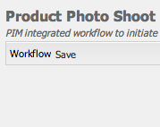

# Integrazione Progetto creativo e PIM{#creative-project-and-pim-integration}

Gli esperti di marketing o i professionisti del settore creativo possono usare gli strumenti Creative Project in Adobe Experience Manager (AEM) per gestire la fotografia dei prodotti eCommerce e i relativi processi creativi all’interno dell’organizzazione.

In particolare, puoi utilizzare la funzionalità Progetto creativo per semplificare le seguenti attività nel flusso di lavoro per il servizio fotografico:

* Generazione di una richiesta di servizio fotografico
* Caricamento di un servizio fotografico
* Collaborazione su un servizio fotografico
* Creazione di pacchetti di risorse approvate

>[!NOTE]
>
>Consulta [Ruoli utente del progetto](/help/sites-authoring/projects.md#user-roles-in-a-project) per informazioni sull’assegnazione di ruoli utenti e flussi di lavoro a determinati tipi di utenti.

## Flussi di lavoro per servizio fotografico per prodotti  {#exploring-product-photo-shoot-workflows}

La funzionalità Progetto creativo offre vari modelli di progetto per soddisfare vari requisiti di progetto. Il modello di **Progetto servizio fotografico per prodotto** è disponibile pronto all’uso. Questo modello offre flussi di lavoro per il servizio fotografico che consentono di avviare e gestire le richieste di servizio fotografico per i prodotti. Include anche una serie di attività che consentono di ottenere le immagini digitali per i prodotti tramite processi di revisione e approvazione appropriati.

Il modello include i seguenti flussi di lavoro:

* **Servizio fotografico per prodotto (integrazione Commerce)**: questo flusso di lavoro sfrutta l’integrazione Commerce con il sistema di gestione delle informazioni dei prodotti (PIM) per generare automaticamente un elenco di foto per i prodotti selezionati (gerarchia). Puoi visualizzare i dati dei prodotti come parte dei metadati della risorsa al completamento del flusso di lavoro.
* **Servizio fotografico per prodotto**: questo flusso di lavoro consente di fornire un elenco di foto invece di dipendere dall’integrazione Commerce. Associa le immagini caricate a un file CSV nella cartella delle risorse del progetto.

>[!NOTE]
>
>Il file CSV che viene caricato in Carica attività elenco di foto del flusso di lavoro Servizio fotografico per prodotto deve avere il nome shotlist.csv.

## Creare un progetto Servizio fotografico per prodotto {#create-a-product-photo-shoot-project}

1. Nella console **Progetti**, toccate o fate clic su **Crea**, quindi scegliete **Crea progetto** dall&#39;elenco.

   

1. Nella pagina **Crea progetto**, seleziona il modello del progetto di servizio fotografico e tocca o fai clic su **Avanti**.

   

1. Inserisci i dettagli del progetto, quali il titolo, la descrizione e la data di scadenza. Aggiungi utenti e assegna loro i vari ruoli. Puoi anche aggiungere una miniatura per il progetto.

   

1. Tocca o fai clic su **Crea**. La creazione del progetto è indicata da un messaggio di conferma.
1. Toccate/fate clic su **Fine** per tornare alla console **Progetti**. In alternativa, toccate o fate clic su **Apri** per visualizzare le risorse all&#39;interno del progetto fotografico.

## Avviare il lavoro di ripresa in un progetto Servizio fotografico per prodotto {#starting-work-in-a-product-photo-shoot-project}

Per avviare una richiesta di servizio fotografico, tocca o fai clic su un progetto, poi tocca o fai clic su **Aggiungi lavoro** nella pagina dei dettagli del progetto per avviare un flusso di lavoro.


Un progetto Servizio fotografico per prodotto include i seguenti flussi di lavoro preconfigurati:

* Flusso di lavoro Servizio fotografico per prodotto (integrazione Commerce)
* Flusso di lavoro Servizio fotografico per prodotto

Utilizza il flusso di lavoro Servizio fotografico per prodotto (integrazione Commerce) per associare le risorse immagini con i prodotti in AEM. Questo flusso di lavoro, sfrutta l’Integrazione Commerce per collegare le immagini approvate ai dati di prodotto esistenti in */etc/commerce*.

Il flusso di lavoro Product Photo Shoot (Integrazione Commerce) include le seguenti attività:

* Crea elenco di foto
* Carica servizio fotografico
* Ritocca servizio fotografico
* Rivedi e approva
* Sposta ad attività produzione

Se le informazioni sul prodotto non sono disponibili in AEM, utilizza il flusso di lavoro Servizio fotografico per prodotto per associare le risorse immagini ai prodotti in base ai dettagli caricati nel file CSV. Il file CSV deve contenere le informazioni di base sul prodotto, ad esempio ID, categoria e descrizione. Il flusso di lavoro recupera le risorse approvate per i prodotti.

Questo flusso di lavoro comprende le seguenti attività:

* Carica elenco di foto
* Carica servizio fotografico
* Ritocca servizio fotografico
* Rivedi e approva
* Sposta ad attività produzione

Puoi personalizzare questo flusso di lavoro utilizzando l’opzione di configurazione del flusso di lavoro.

Entrambi questi flussi di lavoro includono i passaggi per collegare i prodotti con le rispettive risorse approvate. Ogni flusso di lavoro comprende i seguenti passaggi:

* Configurazione flusso di lavoro: descrive le opzioni per personalizzare il flusso di lavoro
* Avvio di un flusso di lavoro del progetto: illustra come avviare un Servizio fotografico per prodotto
* Dettagli attività del flusso di lavoro: fornisce i dettagli delle attività disponibili nel flusso di lavoro

## Monitoraggio dello stato di avanzamento del progetto  {#tracking-project-progress}

Puoi controllare lo stato di un progetto selezionando le attività attive o completate di un progetto.

Utilizza quanto segue per controllare l’avanzamento di un progetto:

* **Scheda Attività**

* **Elenco delle attività**

La scheda Attività mostra l&#39;avanzamento generale del progetto. Viene mostrata nella pagina Dettagli del progetto solo se il progetto contiene attività correlate. La scheda Attività mostra lo stato di completamento corrente del progetto in base al numero di attività completate. Non include le attività future.

La scheda Attività offre i seguenti dettagli:

* Percentuale di attività in corso
* Percentuale di attività completate


L’elenco delle attività attualmente fornisce informazioni dettagliate sull’attività attiva del flusso di lavoro per il progetto. Per visualizzare l’elenco, tocca o fai clic sulla scheda Attività. L’elenco delle attività visualizza anche i metadati, quali data iniziale, data di scadenza, assegnatario, priorità e stato dell’attività.


## Configurazione del flusso di lavoro {#workflow-configuration}

Questa attività include l’assegnazione di passaggi del flusso di lavoro agli utenti in base ai relativi ruoli.

Per configurare il flusso di lavoro **Servizio fotografico per prodotto**:

1. Passare a **Strumenti** > **Flussi di lavoro**, quindi toccare la sezione **Modelli** per aprire la pagina **Modelli di flusso di lavoro**.
1. Selezionate il flusso di lavoro **Product Photo Shoot** e toccate l&#39;icona **Edit** dalla barra degli strumenti per aprirlo in modalità di modifica.

   

1. Nella pagina **Flusso di lavoro di scatto delle foto del prodotto**, aprire un&#39;attività del progetto. Ad esempio, apri **Carica elenco di foto**.

   

1. Fai clic sulla scheda **Attività** per configurare le seguenti opzioni:

   * Nome dell’attività
   * Utente predefinito (ruolo) che riceve l’attività
   * Priorità predefinita dell’attività, che verrà visualizzata nell’elenco delle attività dell’utente
   * Descrizione da visualizzare quando il relativo assegnatario apre l’attività
   * Data di scadenza per l’attività, calcolata dal momento in cui si avvia l’attività

1. Fai clic su **OK** per salvare le impostazioni.

   Analogamente, puoi configurare le seguenti attività per il flusso di lavoro **Servizio fotografico per prodotto**:

   * Carica servizio fotografico
   * Ritocca servizio fotografico
   * Revisiona servizio fotografico
   * Sposta a produzione

   Eseguire una procedura simile per configurare le attività nel flusso di lavoro **Product Photo Shoot (Commerce Integration)**.

Questa sezione descrive come integrare la gestione delle informazioni sul prodotto con il progetto creativo.

## Avviare un flusso di lavoro di progetto  {#starting-a-project-workflow}

1. Andate a un progetto Product Photo Shoot e toccate/fate clic sull&#39;icona **Aggiungi lavoro** nella scheda **Flussi di lavoro**.
1. Seleziona la scheda del flusso di lavoro **Servizio fotografico per prodotto (integrazione Commerce)** per avviare il flusso di lavoro Servizio fotografico per prodotto (integrazione Commerce). Se le informazioni sul prodotto non sono disponibili in /etc/commerce, selezionate il flusso di lavoro **Product Photo Shoot** e avviate il flusso di lavoro Product Photo Shoot.

   

1. Tocca o fai clic su **Avanti** per avviare il flusso di lavoro nel progetto.
1. Immetti i dettagli del flusso di lavoro nella pagina successiva.

   

   Fai clic su **Invia** per avviare il flusso di lavoro del servizio fotografico. Viene visualizzata la pagina dei dettagli per il progetto del servizio fotografico.

   

### Dettagli delle attività del flusso di lavoro {#workflow-tasks-details}

Il flusso di lavoro per il servizio fotografico include diverse attività. Ogni attività viene assegnata a un gruppo utente in base alla configurazione definita per l’attività.

#### Crea attività elenco di foto  {#create-shot-list-task}

L’attività **Crea elenco di foto** consente al proprietario del progetto di selezionare i prodotti per i quali sono necessarie le immagini. In base all’opzione selezionata dall’utente, viene generato un file CSV contenente le informazioni di base sul prodotto.

1. Nella cartella del progetto, toccate o fate clic sulle ellissi nella [scheda Attività](#tracking-project-progress) per visualizzare l&#39;elemento attività nel flusso di lavoro.

   

1. Selezionate l&#39;attività **Crea elenco di ripresa**, quindi toccate o fate clic sull&#39;icona **Apri** nella barra degli strumenti.

   

1. Esamina i dettagli dell’attività e quindi tocca o fai clic sul pulsante **Crea elenco di foto**.

   

1. Seleziona i prodotti per i quali esistono dati di prodotto senza immagini associate.

   

1. Toccate/fate clic sull&#39;icona **Aggiungi a elenco riprese** per creare un file CSV contenente un elenco di tutti questi prodotti. Un messaggio conferma che l’elenco di foto è stato creato per i prodotti selezionati. Fai clic su **Chiudi** per completare il flusso di lavoro.
1. Dopo aver creato un elenco di foto, compare il collegamento **Visualizza elenco di foto**. Per aggiungere altri prodotti all&#39;elenco di ripresa, toccate o fate clic su **Aggiungi a elenco di ripresa**. In questo caso, i dati vengono associati all’elenco di foto inizialmente creato.

   

1. Tocca o fai clic su **Visualizza elenco di foto** per visualizzare il nuovo elenco di foto.

   

   Per modificare i dati esistenti o aggiungere nuovi dati, tocca o fai clic su **Modifica** sulla barra degli strumenti. È possibile modificare solo i campi **Product **e **Description**.

   

   Dopo aver aggiornato il file, toccate o fate clic su **Salva** sulla barra degli strumenti per salvare il file.

1. Dopo aver aggiunto i prodotti, toccate/fate clic sull&#39;icona **Completa** nella pagina dei dettagli dell&#39;attività **Create Shot List **per contrassegnare l&#39;attività come completata. Puoi aggiungere un commento opzionale.

   Il completamento dell’attività introduce le seguenti modifiche all’interno del progetto:

   * Le risorse corrispondenti alla gerarchia del prodotto vengono create in una cartella con lo stesso nome del titolo del flusso di lavoro.
   * I metadati per le risorse diventano modificabili mediante la console delle risorse, anche prima che il fotografo inserisca le immagini.
   * Viene creata una cartella Servizio fotografico dove vengono memorizzate le immagini che fornisce il fotografo. La cartella Servizio fotografico contiene delle sottocartelle per ogni voce di prodotto nell’Elenco di foto.

   Per il flusso di lavoro del Servizio fotografico per prodotto (senza l’integrazione Commerce), la prima attività è Carica elenco di foto. Tocca o fai clic su **Carica elenco di foto** per caricare un file **shotlist.csv**. Il file CSV deve contenere l’ID del prodotto. Gli altri campi sono facoltativi. Puoi utilizzarli per associare le risorse ai prodotti.

### Carica attività elenco di foto  {#upload-shot-list-task}

Questa attività è parte del flusso di lavoro Servizio fotografico per prodotto. Esegui l’attività se in AEM non sono disponibili le informazioni sui prodotti. In questo caso carichi un elenco di prodotti in un file CSV per i cui sono richieste le risorse immagini. In base ai dettagli nel file CSV, potete mappare le risorse di immagine con i prodotti.

Scarica un file CSV di esempio, tramite il collegamento **Visualizza elenco di foto** sotto la scheda del progetto nella procedura precedente. Esamina il file di esempio per conoscere il contenuto tipico di un file CSV.

L’elenco dei prodotti o il file CSV possono contenere campi come **Categoria, Prodotto, ID, Descrizione** e **Percorso**. Il campo **ID** è obbligatorio e contiene l’ID del prodotto. Gli altri campi sono facoltativi.

Un prodotto può appartenere a una particolare categoria. La categoria del prodotto può essere elencata nel CSV nella colonna **Categoria**. Il campo **Prodotto** contiene il nome del prodotto. Nel campo **Descrizione** immetti la descrizione o istruzioni per il fotografo.

>[!NOTE]
>
>Il nome delle immagini da caricare deve iniziare con &quot;**&lt;ProductId>_&quot;** dove viene fatto riferimento all&#39;ID prodotto dal campo **Id** nel file *shotlist.csv*. Ad esempio, per un prodotto nell&#39;elenco di ripresa con **Id 397122**, potete caricare i file con nomi **397122_highContrasto.jpg**, **397122_lowlight.png** e così via.

1. Nella cartella del progetto, toccate/fate clic sulle ellissi nella [scheda Attività](#tracking-project-progress) per visualizzare l&#39;elenco delle attività nel flusso di lavoro.
1. Selezionate l&#39;attività **Carica elenco riprese**, quindi toccate o fate clic sull&#39;icona **Apri** nella barra degli strumenti.

   

1. Rivedete i dettagli dell&#39;attività, quindi toccate o fate clic sul pulsante **Carica elenco riprese**.

   

1. Toccate/fate clic sul pulsante **Carica elenco riprese** per caricare il file CSV con il nome file shotlist.csv. Il flusso di lavoro riconosce questo file come sorgente da utilizzare per estrarre i dati dei prodotti per l’attività successiva.
1. Carica un file CSV contenente le informazioni sui prodotti nel formato corretto. Il collegamento **Visualizza risorse caricate** viene visualizzato sotto la scheda dopo il caricamento del file CSV.

   

   Fare clic sull&#39;icona **Completa** per completare l&#39;attività.

1. Toccate/fate clic sull&#39;icona **Completa** per completare l&#39;attività.

### Attività Carica servizio fotografico {#upload-photo-shoot-task}

Se siete un editor, potete caricare le riprese per i prodotti elencati nel file **shotlist.csv** creato o caricato nell&#39;attività precedente.

Il nome delle immagini da caricare deve iniziare con **&quot;&lt;productId>_&quot;** dove viene fatto riferimento all&#39;ID prodotto dal campo **Id** nel file **shotlist.csv**. Ad esempio, per un prodotto con **ID 397122** nell’elenco di foto, puoi caricare i file **397122_highcontrast.jpg**,**397122_lowlight.png** e così via.

Puoi caricare direttamente le immagini o caricare un file zip contenente le immagini. Sulla base dei loro nomi, le immagini vengono inserite nelle rispettive cartelle dei prodotti all’interno della cartella **Servizio fotografico**.

1. Nella cartella del progetto, toccate o fate clic sulle ellissi nella [scheda attività](#tracking-project-progress) per visualizzare l&#39;elemento attività nel flusso di lavoro.
1. Selezionate l&#39;attività **Carica foto ripresa**, quindi toccate o fate clic sull&#39;icona **Apri** nella barra degli strumenti.

   

1. Toccate/fate clic su **Carica foto scatto** e caricate le immagini delle foto scattate.
1. Tocca o fai clic sull’icona **Completato** sulla barra degli strumenti per completare l’attività.

### Attività Ritocca servizio fotografico  {#retouch-photo-shoot-task}

Se disponi delle autorizzazioni di modifica, esegui l’attività Ritocca servizio fotografico per modificare le immagini caricate nella cartella Servizio fotografico.

1. Nella cartella del progetto, toccate o fate clic sulle ellissi nella [scheda attività](#tracking-project-progress) per visualizzare l&#39;elemento attività nel flusso di lavoro.
1. Selezionate l&#39;attività **Ritocca foto**, quindi toccate o fate clic sull&#39;icona **Apri** nella barra degli strumenti.

   

1. Toccate/fate clic sul collegamento **Visualizza risorse caricate** nella pagina **Ritocca foto** per scorrere le immagini caricate.

   

   Se necessario, modifica le immagini con l’ausilio di un’applicazione Adobe Creative Cloud.

   

1. Tocca o fai clic sull’icona **Completato** sulla barra degli strumenti per completare l’attività.

### Attività Rivedi e approva {#review-and-approve-task}

In questa attività, esamina le immagini del servizio fotografico caricate da un fotografo e contrassegnale come approvate per l’uso.

1. Nella cartella del progetto, toccate o fate clic sulle ellissi nella [scheda attività](#tracking-project-progress) per visualizzare l&#39;elemento attività nel flusso di lavoro.
1. Selezionare l&#39;attività **Rivedi e approva**, quindi toccare o fare clic sull&#39;icona **Apri** dalla barra degli strumenti.

   

1. Nella pagina **Rivedi e approva**, assegna l&#39;attività di revisione al ruolo, ad esempio Revisori, quindi tocca o fai clic su **Rivedi **per iniziare a rivedere le immagini del prodotto caricate.

   

1. Seleziona un’immagine del prodotto e tocca o fai clic sull’icona Approvato nella barra degli strumenti per contrassegnarlo come approvato.

   

   Una volta approvata un’immagine, viene visualizzato un banner di approvazione.

   >[!NOTE]
   È possibile omettere alcuni prodotti senza alcuna immagine. In seguito, puoi rivisitare l’attività e contrassegnarla come completata.

1. Tocca o fai clic su **Completato**. Le immagini approvate sono collegate alle risorse vuote che sono state create.

Puoi accedere alle risorse del progetto tramite l’interfaccia utente di Assets e verificare le immagini approvate.

Tocca o fai clic sul livello successivo per visualizzare i prodotti in base alla gerarchia di dati di prodotto.

I collaboratori del progetto creativo approvano le risorse con il prodotto a cui si fa riferimento. I metadati delle risorse vengono aggiornati con il riferimento del prodotto e le informazioni di base nella scheda **Dati prodotto** per le proprietà delle risorse vengono visualizzate nella sezione Metadati delle risorse di AEM.

>[!NOTE]
Nel flusso di lavoro per il servizio fotografico per prodotto (senza l’integrazione Commerce), le immagini non approvate non sono associate ai prodotti.

### Sposta ad attività produzione  {#move-to-production-task}

Questa attività consente di spostare le risorse approvate nella cartella per la produzione per renderle disponibili per l’uso.

1. Nella cartella del progetto, toccate o fate clic sulle ellissi nella [scheda attività](#tracking-project-progress) per visualizzare l&#39;elemento attività nel flusso di lavoro.
1. Selezionare l&#39;attività **Sposta in produzione**, quindi toccare o fare clic sull&#39;icona **Apri** dalla barra degli strumenti.

   

1. Per visualizzare le risorse approvate per il servizio fotografico prima di spostarle nella cartella per la produzione, fai clic sul collegamento **Visualizza risorse approvate** sotto la miniatura del progetto sulla pagina dell’attività **Sposta a produzione**.

   

1. Immettete il percorso della cartella pronta per la produzione nel campo **Sposta a**.

   

   Toccate/fate clic su **Sposta in produzione**. Chiudi il messaggio di conferma. Le risorse vengono spostate nel percorso indicato e viene creato automaticamente un Set 360 gradi per le risorse approvate per ogni prodotto in base alla gerarchia delle cartelle.

1. Tocca o fai clic sull’icona **Completato** sulla barra degli strumenti. Il flusso di lavoro è completo quando l’ultimo passaggio è indicato come “completato”.

## Visualizzazione dei metadati risorsa DAM  {#viewing-dam-asset-metadata}

Dopo che avrai approvato, le risorse vengono collegate ai prodotti corrispondenti. La [pagina delle proprietà](/help/assets/manage-assets.md#editing-properties) delle risorse approvate ora dispone di una scheda aggiuntiva, **Dati prodotto** (collegata alle informazioni sul prodotto). Questa scheda consente di visualizzare i dettagli del prodotto, il numero SKU e altri dettagli relativi ai prodotti che collegano la risorsa. Tocca o fa clic sull’icona **Modifica** per aggiornare una proprietà di risorsa. Le informazioni relative al prodotto restano di sola lettura.

Tocca o fai clic sul collegamento che appare per passare alla relativa pagina di dettagli del prodotto nella console del prodotto al quale la risorsa è associato.

## Personalizzare i flussi di lavoro Servizio fotografico di un progetto  {#customizing-the-project-photo-shoot-workflows}

Puoi personalizzare i flussi di lavoro Servizio fotografico per il progetto in base ai requisiti. È un’attività facoltativa basata sui ruoli, che consente di impostare il valore di una variabile all’interno del progetto. Successivamente, puoi utilizzare il valore configurato per arrivare a una decisione.

1. Tocca o fai clic sul logo AEM, quindi accedi a **Strumenti** > **Workflow** > **Modelli** per aprire la pagina Modelli di workflow.
1. Seleziona il flusso di lavoro **Servizio fotografico per prodotto (integrazione Commerce)** o **Servizio fotografico per prodotto** e fai clic su **Modifica** sulla barra degli strumenti per aprire il flusso di lavoro in modalità di modifica.
1. Apri le attività **Progetti** nella barra laterale e trascina il passaggio **Crea attività progetto basata su ruolo** nel flusso di lavoro.

   

1. Aprire il passaggio **Attività basata su ruolo**.
1. Nella scheda **Attività**, immetti un nome per l’attività da visualizzare nell’elenco delle **Attività**. È inoltre possibile assegnare l&#39;attività a un ruolo, impostare la priorità predefinita, fornire una descrizione e specificare l&#39;ora in cui l&#39;attività è scaduta.

   

1. Nella scheda **Indirizzamento**, specifica le azioni per l’attività. Per aggiungere più azioni, toccate o fate clic sul collegamento **Add Item **link.

   

1. Dopo aver aggiunto le opzioni, fare clic su **OK** per aggiungere le modifiche al passaggio.

   >[!NOTE]
   Toccando o facendo clic su **OK** non si salvano le modifiche nel flusso di lavoro. Per salvare le modifiche nel flusso di lavoro, toccate o fate clic su **Salva**.

1. Aprite le attività **Workflow** dalla barra laterale e aggiungete un&#39;attività **Goto**.
1. Apri l’attività **Passaggio** e tocca o fai clic sulla scheda **Processo**.
1. Specifica il codice seguente nel riquadro **Script**:

```
   function check() {

   if (workflowData.getMetaDataMap().get("lastTaskAction","") == "Reject All") {

   return true

   }

   // set copywriter user in metadata

   var previousId = workflowData.getMetaDataMap().get("lastTaskCompletedBy", "");

   workflowData.getMetaDataMap().put("copywriter", previousId);

   return false;

   }
```

>[!NOTE]
Per informazioni dettagliate sugli script nei passaggi del flusso di lavoro, vedere [Definizione di una regola per un&#39;operazione OR Split](/help/sites-developing/workflows-models.md).


1. Toccate/fate clic su **OK**.

1. Toccate/fate clic su **Salva** per salvare il flusso di lavoro.

   

1. Una nuova attività di accettazione del proprietario del progetto ora viene visualizzata dopo il completamento dell&#39;attività [Sposta in produzione](#move-to-production-task) e viene assegnata al proprietario.

   L’utente con il ruolo di Proprietario può completare l’attività e selezionare un’azione (dall’elenco delle azioni aggiunte nelle configurazioni delle fasi del flusso di lavoro) dall’elenco nel popup dei commenti.

   

   Seleziona l’opzione appropriata e fai clic su **Completato** per eseguire il **Passaggio** nel flusso di lavoro.

>[!NOTE]
Quando si avvia un server, il servlet dell&#39;elenco attività Progetto memorizza nella cache le mappature tra i tipi di attività e gli URL definiti in `/libs/cq/core/content/projects/tasktypes`. Potete quindi eseguire la sovrapposizione usuale e aggiungere tipi di attività personalizzati inserendoli in `/apps/cq/core/content/projects/tasktypes`.

