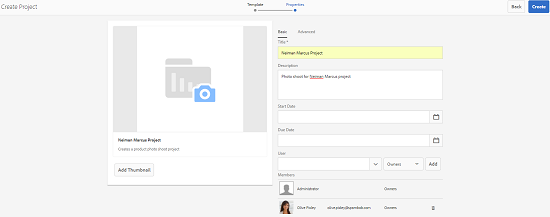

# Progetto creativo e integrazione PIM {#creative-project-and-pim-integration}

Se sei un addetto al marketing o un professionista della creatività, puoi utilizzare gli strumenti di Creative Project in Adobe Experience Manager (AEM) per gestire la fotografia di prodotti e i relativi processi creativi all’interno della tua organizzazione.

Puoi utilizzare Creative Project per semplificare le seguenti attività nel flusso di lavoro del servizio fotografico:

* Generazione di una richiesta di servizio fotografico
* Caricamento di un servizio fotografico
* Collaborazione a un servizio fotografico
* Creazione pacchetti di risorse approvate

>[!NOTE]
>
>Consulta [Ruoli utente del progetto per informazioni](/help/sites-authoring/projects.md#user-roles-in-a-project) quando si assegnano ruoli utente e flussi di lavoro a determinati tipi di utenti.

## Flussi di lavoro per servizio fotografico per prodotto  {#exploring-product-photo-shoot-workflows}

Creative Project fornisce vari modelli di progetto per soddisfare i diversi requisiti del progetto. Il **Progetto servizio fotografico per prodotto** il modello è già disponibile. Questo modello include flussi di lavoro per servizio fotografico che consentono di avviare e gestire richieste di servizio fotografico per prodotto. Include inoltre una serie di attività che consentono di ottenere immagini digitali per i prodotti attraverso appropriati processi di revisione e approvazione.

## Crea un progetto servizio fotografico per prodotto {#create-a-product-photo-shoot-project}

1. In **Progetti** console, tocca o fai clic su **Crea** e quindi scegliere **Crea progetto** dall&#39;elenco.

   

1. In **Crea progetto** , seleziona la **Progetto servizio fotografico per prodotto** modello e tocca o fai clic su **Successivo**.

   

1. Immettere i dettagli del progetto, inclusi titolo, descrizione e data di scadenza. Aggiungi utenti e assegna loro vari ruoli. Puoi anche aggiungere una miniatura per il progetto.

   

1. Tocca o fai clic su **Crea**. Un messaggio di conferma informa che il progetto è stato creato.
1. Tocca o fai clic su **Fine** per tornare al **Progetti** console. In alternativa, tocca o fai clic **Apri** per visualizzare le risorse del progetto.

## Avvio del lavoro in un progetto servizio fotografico per prodotto {#starting-work-in-a-product-photo-shoot-project}

Per avviare una richiesta di servizio fotografico, tocca o fai clic su un progetto, quindi tocca o fai clic su **Aggiungi lavoro** nella pagina dei dettagli del progetto per avviare un flusso di lavoro.


A **Progetto servizio fotografico per prodotto** include i seguenti flussi di lavoro preconfigurati:

* **Flusso di lavoro per servizio fotografico per prodotto (integrazione Commerce)**: questo flusso di lavoro sfrutta l’integrazione di commerce con il sistema di gestione delle informazioni sui prodotti (PIM) per generare automaticamente un elenco di foto per i prodotti selezionati (gerarchia). Al termine del flusso di lavoro, puoi visualizzare i dati dei prodotti come parte dei metadati della risorsa.
* **Flusso di lavoro per servizio fotografico per prodotto**: questo flusso di lavoro ti consente di fornire un elenco di foto invece di dipendere dall’integrazione con Commerce. Mappa le immagini caricate su un file CSV nella cartella delle risorse del progetto.

Utilizza il **Servizio fotografico per prodotto (integrazione Commerce)** per mappare le risorse di immagini con i prodotti dell’AEM. Questo flusso di lavoro sfrutta l’integrazione con Commerce per collegare le immagini approvate ai dati di prodotto esistenti nel percorso `/etc/commerce`.

Il **Servizio fotografico per prodotto (integrazione Commerce)** il flusso di lavoro include le seguenti attività:

* Crea elenco di foto
* Carica servizio fotografico
* Ritocca servizio fotografico
* Rivedi e approva
* Sposta ad attività produzione

Se le informazioni sul prodotto non sono disponibili nell’AEM, utilizzare il **Servizio fotografico per prodotto** flusso di lavoro per mappare le risorse immagine con i prodotti in base ai dettagli caricati in un file CSV. Il file CSV deve contenere informazioni di base sul prodotto, ad esempio ID prodotto, categoria e descrizione. Il flusso di lavoro recupera le risorse approvate per i prodotti.

Questo flusso di lavoro include le seguenti attività:

* Carica elenco di foto
* Carica servizio fotografico
* Ritocca servizio fotografico
* Rivedi e approva
* Sposta ad attività produzione

Puoi personalizzare questo flusso di lavoro utilizzando l’opzione configurazioni flusso di lavoro.

Entrambi i flussi di lavoro includono passaggi per collegare i prodotti con le relative risorse approvate. Ogni flusso di lavoro include i passaggi seguenti:

* Configurazione flusso di lavoro: descrive le opzioni per personalizzare il flusso di lavoro
* Avvio di un flusso di lavoro per un progetto: illustra come avviare un servizio fotografico per un prodotto
* Dettagli attività flusso di lavoro: fornisce dettagli sulle attività disponibili nel flusso di lavoro

## Tracciamento dell’avanzamento del progetto {#tracking-project-progress}

È possibile tenere traccia dell&#39;avanzamento di un progetto monitorando le attività attive/completate all&#39;interno di un progetto.

Utilizza quanto segue per monitorare l’avanzamento di un progetto:

* Scheda Attività
* Elenco delle attività

La scheda delle attività mostra l’avanzamento generale del progetto. Viene visualizzato nella pagina dei dettagli del progetto solo se il progetto ha attività correlate. Nella scheda delle attività viene visualizzato lo stato di completamento corrente del progetto in base al numero di attività completate. Non include le attività future.

La scheda delle attività contiene i dettagli riportati di seguito.

* Percentuale di attività attive
* Percentuale di attività completate


L&#39;elenco delle attività fornisce informazioni dettagliate sull&#39;attività del flusso di lavoro attualmente attiva per il progetto. Per visualizzare l’elenco, tocca o fai clic sulla scheda delle attività. Nell&#39;elenco delle attività vengono inoltre visualizzati metadati quali la data di inizio, la data di scadenza, l&#39;assegnatario, la priorità e lo stato dell&#39;attività.


## Configurazione flusso di lavoro {#workflow-configuration}

Questa attività comporta l’assegnazione di passaggi del flusso di lavoro agli utenti in base ai loro ruoli.

Per configurare **Servizio fotografico per prodotto** workflow:

1. Accedi a **Strumenti** > **Flussi di lavoro**, quindi tocca il **Modelli** riquadro per aprire **Modelli flusso di lavoro** pagina.
1. Seleziona la **Servizio fotografico per prodotto** e tocca il pulsante **Modifica** dalla barra degli strumenti per aprirla in modalità di modifica.

   

1. In **Flusso di lavoro per servizio fotografico per prodotto** , aprire un&#39;attività di progetto. Ad esempio, apri il **Carica elenco di foto** attività.

   

1. Tocca o fai clic su **Attività** per configurare quanto segue:

   * Nome dell’attività
   * Utente predefinito (ruolo) che riceve l&#39;attività
   * Priorità predefinita dell’attività, visualizzata nell’elenco delle attività dell’utente
   * Descrizione dell’attività da visualizzare quando l’assegnatario apre l’attività
   * Data di scadenza di un&#39;attività, calcolata in base all&#39;ora di inizio dell&#39;attività

1. Clic **OK** per salvare le impostazioni di configurazione.

Puoi configurare le attività aggiuntive per **Servizio fotografico per prodotto** flusso di lavoro in modo simile.

Eseguire gli stessi passaggi per configurare le attività in **Flusso di lavoro per servizio fotografico per prodotto (integrazione Commerce)**.

## Avvio di un flusso di lavoro per un progetto {#starting-a-project-workflow}

Questa sezione descrive come integrare la gestione delle informazioni sui prodotti con il progetto creativo.

1. Passa a un progetto di servizio fotografico per prodotto, quindi tocca o fai clic su **Aggiungi lavoro** icona sul **Flussi di lavoro** Card.
1. Seleziona la **Servizio fotografico per prodotto (integrazione Commerce)** scheda del flusso di lavoro per avviare **Servizio fotografico per prodotto (integrazione Commerce)** flusso di lavoro. Se le informazioni sul prodotto non sono disponibili in `/etc/commerce`, seleziona la **Servizio fotografico per prodotto** flusso di lavoro e avvia **Servizio fotografico per prodotto** flusso di lavoro.

   

1. Tocca o fai clic su **Successivo** per avviare il workflow nel progetto.
1. Immetti i dettagli del flusso di lavoro nella pagina successiva.

   

1. Tocca o fai clic su **Invia** per avviare il flusso di lavoro per servizio fotografico. Viene visualizzata la pagina dei dettagli del progetto del servizio fotografico.

   

### Dettagli attività flusso di lavoro {#workflow-tasks-details}

Il flusso di lavoro del servizio fotografico include diverse attività. Ogni attività viene assegnata a un gruppo di utenti in base alla configurazione definita per l&#39;attività.

#### Crea attività elenco di foto {#create-shot-list-task}

Il **Crea elenco di foto** consente al proprietario del progetto di selezionare i prodotti per i quali sono richieste immagini. In base all’opzione selezionata dall’utente, viene generato un file CSV contenente le informazioni di base sul prodotto.

1. Nella cartella del progetto, tocca o fai clic sul pulsante con i puntini di sospensione in basso a destra del [Scheda Attività](#tracking-project-progress) per visualizzare l&#39;elemento attività nel flusso di lavoro.

   

1. Seleziona la **Crea elenco di foto** , quindi tocca o fai clic sul pulsante **Apri** dalla barra degli strumenti.

   

1. Rivedi i dettagli dell’attività, quindi tocca o fai clic sul pulsante **Crea elenco di foto** pulsante.

   

1. Seleziona i prodotti per i quali esistono dati di prodotto senza immagini associate.

   

1. Tocca o fai clic su **Aggiungi all&#39;elenco di foto** per creare un file CSV contenente un elenco di tutti questi prodotti. Un messaggio conferma la creazione dell&#39;elenco di foto per i prodotti selezionati. Clic **Chiudi** per completare il workflow.

1. Dopo aver creato un elenco di foto, **Visualizza elenco di foto** viene visualizzato. Per aggiungere altri prodotti all&#39;elenco di foto, tocca o fai clic su **Aggiungi a elenco di foto**. In questo caso, i dati vengono aggiunti all&#39;elenco di foto creato inizialmente.

   

1. Tocca o fai clic su **Visualizza elenco di foto** per visualizzare il nuovo elenco di foto.

   

   Per modificare i dati esistenti o aggiungere nuovi dati, tocca o fai clic su **Modifica** dalla barra degli strumenti. Solo il **Product **e **Descrizione** I campi sono modificabili.

   

   Dopo aver aggiornato il file, tocca o fai clic su **Salva** sulla barra degli strumenti per salvare il file.

1. Dopo aver aggiunto i prodotti, tocca o fai clic su **Completa** icona sul **Crea elenco di foto** pagina dettagli attività per contrassegnare l&#39;attività come completata. È possibile aggiungere un commento facoltativo.

Il completamento dell’attività introduce le seguenti modifiche all’interno del progetto:

* Le risorse corrispondenti alla gerarchia dei prodotti vengono create in una cartella con lo stesso nome del titolo del flusso di lavoro.
* I metadati delle risorse diventano modificabili utilizzando la console Risorse, anche prima che il fotografo fornisca le immagini.
* Viene creata una cartella di servizio fotografico in cui sono memorizzate le immagini fornite dal fotografo. La cartella del servizio fotografico contiene sottocartelle per ogni voce di prodotto nell&#39;elenco di foto.

### Carica attività elenco di foto {#upload-shot-list-task}

Questa attività fa parte del flusso di lavoro del servizio fotografico per prodotto. Esegui questa attività se le informazioni sul prodotto non sono disponibili in AEM. In questo caso, carica un elenco di prodotti in un file CSV per il quale sono richieste risorse di immagini. In base ai dettagli nel file CSV, mappi le risorse immagine con i prodotti. Il file deve essere un file CSV denominato `shotlist.csv`.

Utilizza il **Visualizza elenco di foto** nella scheda del progetto della procedura precedente per scaricare un file CSV di esempio. Esamina il file di esempio per conoscere il contenuto abituale di un file CSV.

L’elenco dei prodotti o il file CSV può contenere campi come **Categoria, Prodotto, Id, Descrizione**, e **Percorso**. Il **ID** è obbligatorio e contiene l’ID prodotto. Gli altri campi sono facoltativi.

Un prodotto può appartenere a una particolare categoria. La categoria di prodotto può essere elencata nel file CSV sotto **Categoria** colonna. Il **Prodotto** contiene il nome del prodotto. In **Descrizione** immettere la descrizione o le istruzioni del prodotto per il fotografo.

1. Nella cartella del progetto, tocca o fai clic sul pulsante con i puntini di sospensione in basso a destra del [Scheda Attività](#tracking-project-progress) per visualizzare l&#39;elenco delle attività nel flusso di lavoro.
1. Seleziona la **Carica elenco di foto** , quindi tocca o fai clic sul pulsante **Apri** dalla barra degli strumenti.

   

1. Rivedi i dettagli dell’attività, quindi tocca o fai clic su **Carica elenco di foto** pulsante.

   

1. Tocca o fai clic su **Carica elenco di foto** per caricare il file CSV. Il flusso di lavoro riconosce questo file come origine da utilizzare per estrarre i dati del prodotto per l&#39;attività successiva.
1. Carica un file CSV contenente informazioni di prodotto nel formato appropriato. Il **Visualizza risorse caricate** appare sotto la scheda dopo il caricamento del file CSV.

   

   Fai clic su **Completa** per completare l&#39;attività.

1. Tocca o fai clic sul pulsante **Completa** per completare l&#39;attività.

### Carica attività servizio fotografico {#upload-photo-shoot-task}

Se sei un editor, puoi caricare foto per i prodotti elencati nella **shotlist.csv** file creato o caricato nell’attività precedente.

Il nome delle immagini da caricare deve iniziare con `<ProductId_>` dove `ProductId` è referenziato da **ID** campo in `shotlist.csv` file. Ad esempio, per un prodotto nell&#39;elenco di foto con **ID** `397122`, si caricano file con nomi `397122_highcontrast.jpg`, `397122_lowlight.png`e così via.

Puoi caricare direttamente le immagini o caricare un file ZIP contenente le immagini. In base al nome, le immagini vengono inserite nelle rispettive cartelle di prodotto all’interno della cartella del servizio fotografico.

1. Nella cartella del progetto, tocca o fai clic sul pulsante con i puntini di sospensione in basso a destra del file [Scheda Attività](#tracking-project-progress) per visualizzare l&#39;elemento attività nel flusso di lavoro.
1. Seleziona la **Carica servizio fotografico** , quindi tocca o fai clic sul pulsante **Apri** dalla barra degli strumenti.

   

1. Tocca o fai clic su **Carica servizio fotografico** e carica le immagini del servizio fotografico.
1. Tocca o fai clic su **Completa** dalla barra degli strumenti per completare l’attività.

### Ritocca l&#39;attività del servizio fotografico {#retouch-photo-shoot-task}

Se si dispone dei diritti di modifica, eseguire la **Ritocca servizio fotografico** per modificare le immagini caricate nella cartella del servizio fotografico.

1. Nella cartella del progetto, tocca o fai clic sul pulsante con i puntini di sospensione in basso a destra nella sezione [Scheda Attività](#tracking-project-progress) per visualizzare l&#39;elemento attività nel flusso di lavoro.
1. Seleziona la **Ritocca servizio fotografico** , quindi tocca o fai clic sul pulsante **Apri** dalla barra degli strumenti.

   

1. Tocca o fai clic su **Visualizza risorse caricate** collegamento in **Ritocca servizio fotografico** per sfogliare le immagini caricate.

   

   Se necessario, modificare le immagini utilizzando un&#39;applicazione Adobe Creative Cloud.

   

1. Tocca o fai clic su **Completa** dalla barra degli strumenti per completare l’attività.

### Rivedi e approva l&#39;attività {#review-and-approve-task}

In questa attività, rivedi le immagini del servizio fotografico caricate da un fotografo e contrassegna le immagini come approvate per l’uso.

1. Nella cartella del progetto, tocca o fai clic sul pulsante con i puntini di sospensione in basso a destra del file [Scheda Attività](#tracking-project-progress) per visualizzare l&#39;elemento attività nel flusso di lavoro.
1. Seleziona la **Rivedi e approva** , quindi tocca o fai clic sul pulsante **Apri** dalla barra degli strumenti.

   

1. In **Rivedi e approva** , assegna l’attività di revisione a un ruolo, quindi tocca o fai clic su **Revisione** per iniziare a rivedere le immagini del prodotto caricate.

   

1. Seleziona un’immagine di prodotto, quindi tocca o fai clic sul pulsante **Approva** dalla barra degli strumenti per contrassegnarlo come approvato. Dopo aver approvato un’immagine, viene visualizzato un banner approvato.

   

1. Tocca o fai clic su **Completa**. Le immagini approvate sono collegate alle risorse vuote create.

È possibile tralasciare alcuni prodotti senza alcuna immagine. In seguito, sarà possibile rivedere l&#39;attività e contrassegnarla come completata.

Puoi passare alle risorse del progetto utilizzando l’interfaccia utente Assets e verificare le immagini approvate.

Tocca o fai clic sul livello successivo per visualizzare i prodotti in base alla gerarchia dei dati del prodotto.

In Creative Project le risorse approvate vengono associate al prodotto di riferimento. I metadati della risorsa vengono aggiornati con il riferimento al prodotto e le informazioni di base nella **Dati prodotto** sotto le proprietà della risorsa vengono visualizzate nella sezione Metadati risorsa AEM.

>[!NOTE]
>
>In **Flusso di lavoro per servizio fotografico per prodotto** (senza integrazione con commerce), le immagini approvate non sono associate a prodotti.

### Sposta ad attività produzione {#move-to-production-task}

Questa attività sposta le risorse approvate nella cartella pronta per la produzione per renderle disponibili per l’uso.

1. Nella cartella del progetto, tocca o fai clic sul pulsante con i puntini di sospensione in basso a destra del file [Scheda Attività](#tracking-project-progress) per visualizzare l&#39;elemento attività nel flusso di lavoro.
1. Seleziona la **Sposta in produzione** , quindi tocca o fai clic sul pulsante **Apri** dalla barra degli strumenti.

   

1. Per visualizzare le risorse approvate per il servizio fotografico prima di spostarle nella cartella pronta per la produzione, fai clic su **Visualizza risorse approvate** collegamento sotto la miniatura del progetto sulla **Sposta in produzione** pagina dell&#39;attività.

   

1. Immetti il percorso della cartella pronta per la produzione in **Sposta in** campo.

   

1. Tocca o fai clic su **Sposta in produzione**. Chiudi il messaggio di conferma. Le risorse vengono spostate nel percorso indicato e viene creato automaticamente un set 360 gradi per le risorse approvate per ciascun prodotto in base alla gerarchia delle cartelle.

1. Tocca o fai clic sul pulsante **Completa** dalla barra degli strumenti. Il flusso di lavoro viene completato quando l’ultimo passaggio viene contrassegnato come completato.

## Visualizzazione dei metadati di una risorsa DAM {#viewing-dam-asset-metadata}

Dopo l’approvazione, le risorse vengono collegate ai prodotti corrispondenti. Il [Pagina delle proprietà](/help/assets/manage-assets.md#editing-properties) delle risorse approvate ora include un **Dati prodotto** (informazioni sul prodotto collegate). In questa scheda vengono visualizzati i dettagli del prodotto, il numero SKU e altri dettagli relativi al prodotto che collegano la risorsa. Tocca o fai clic su **Modifica** per aggiornare una proprietà della risorsa. Le informazioni relative al prodotto rimangono di sola lettura.

Tocca o fai clic sul collegamento che appare per passare alla rispettiva pagina dei dettagli del prodotto nella console del prodotto a cui è associata la risorsa.

## Personalizzazione dei flussi di lavoro per servizio fotografico per il progetto {#customizing-the-project-photo-shoot-workflows}

È possibile personalizzare **Servizio fotografico per progetto** in base alle tue esigenze. Si tratta di un&#39;attività facoltativa basata su ruoli eseguita per impostare il valore di una variabile all&#39;interno del progetto. Successivamente, puoi utilizzare il valore configurato per arrivare a una decisione.

1. Tocca o fai clic sul logo AEM, quindi passa a **Strumenti** > **Flusso di lavoro** > **Modelli** per aprire **Modelli flusso di lavoro** pagina.
1. Seleziona la **Servizio fotografico per prodotto (integrazione Commerce)** flusso di lavoro o **Servizio fotografico per prodotto** flusso di lavoro e tocca o fai clic **Modifica** dalla barra degli strumenti per aprire il flusso di lavoro in modalità di modifica.
1. Apri il pannello laterale e individua **Crea attività progetto basata sul ruolo** e trascinarlo nel flusso di lavoro.

   

1. Apri **Attività basata sul ruolo** passaggio.
1. Il giorno **Attività** , fornire un nome per l&#39;attività che verrà visualizzata nell&#39;elenco delle attività. È inoltre possibile assegnare l&#39;attività a un ruolo, impostare la priorità predefinita, fornire una descrizione e specificare l&#39;ora di scadenza dell&#39;attività.

   

1. Il giorno **Indirizzamento** , specificare le azioni per l&#39;attività. Per aggiungere più azioni, tocca o fai clic sul pulsante **Aggiungi elemento** collegamento.

   

1. Dopo aver aggiunto le opzioni, fai clic su **OK** per aggiungere le modifiche al passaggio.

1. Torna in **Modello flusso di lavoro** tocco o clic sulla finestra **Sincronizza** per salvare le modifiche dell&#39;intero workflow. Toccare o fare clic **OK** per il passaggio non salva le modifiche nel flusso di lavoro. Per salvare le modifiche nel flusso di lavoro, tocca o fai clic su **Sincronizza**.

1. Apri il pannello laterale e individua **Vai al passaggio** e trascinarlo nel workflow.

1. Apri **Vai a** e tocca o fai clic sul pulsante **Processo** scheda.

1. Seleziona la **Passaggio di destinazione** per passare a e specificare che **Espressione di indirizzamento** è lo script ECMA. Quindi inserisci il seguente codice nel **Script** campo:

   ```javascript
   function check() {
   
   if (workflowData.getMetaDataMap().get("lastTaskAction","") == "Reject All") {
   
   return true
   
   }
   
   // set copywriter user in metadata
   
   var previousId = workflowData.getMetaDataMap().get("lastTaskCompletedBy", "");
   
   workflowData.getMetaDataMap().put("copywriter", previousId);
   
   return false;
   
   }
   ```

   >[!TIP]
   >
   >Per informazioni dettagliate sugli script nei passaggi del flusso di lavoro, consulta [Definizione di una regola per una suddivisione OR](/help/sites-developing/workflows-models.md).

   

1. Tocca o fai clic su **OK**.

1. Tocca o fai clic su **Sincronizza** per salvare il workflow.

Ora viene visualizzata una nuova attività dopo il [Sposta all&#39;attività di produzione](#move-to-production-task) viene completato e assegnato al proprietario.

L’utente in **Proprietario** role può completare l&#39;attività e selezionare un&#39;azione (dall&#39;elenco delle azioni aggiunte nelle configurazioni dei passaggi del flusso di lavoro) dall&#39;elenco nel popup dei commenti.

>[!NOTE]
>
>Quando si avvia un server, il servlet Elenco attività di Project memorizza nella cache le mappature tra i tipi di attività e gli URL definiti in `/libs/cq/core/content/projects/tasktypes`. Puoi quindi eseguire la consueta sovrapposizione e aggiungere tipi di attività personalizzati inserendoli in `/apps/cq/core/content/projects/tasktypes`.
