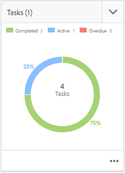
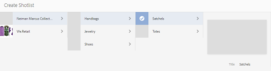

# Integrazione Progetto creativo e PIM {#creative-project-and-pim-integration}

Se sei un addetto al marketing o un professionista creativo, puoi utilizzare gli strumenti Progetto creativo in Adobe Experience Manager (AEM) per gestire la fotografia di prodotti correlata all’e-commerce e i processi creativi associati all’interno della tua organizzazione.

Puoi utilizzare Progetto creativo per semplificare le seguenti attività nel flusso di lavoro del servizio fotografico:

* Generazione di una richiesta di servizio fotografico
* Caricamento di un servizio fotografico
* Collaborazione su un servizio fotografico
* Creazione di pacchetti di risorse approvate

>[!NOTE]
>
>Consulta [Ruoli utente del progetto](/help/sites-authoring/projects.md#user-roles-in-a-project) per informazioni sull’assegnazione di ruoli utenti e flussi di lavoro a determinati tipi di utenti.

## Flussi di lavoro Servizio fotografico per prodotto  {#exploring-product-photo-shoot-workflows}

La funzionalità Progetto creativo offre vari modelli di progetto per soddisfare vari requisiti di progetto. Il modello di **Progetto servizio fotografico per prodotto** è disponibile pronto all’uso. Questo modello offre flussi di lavoro per il servizio fotografico che consentono di avviare e gestire le richieste di servizio fotografico per i prodotti. Include anche una serie di attività che consentono di ottenere le immagini digitali per i prodotti tramite processi di revisione e approvazione appropriati.

## Creare un progetto Servizio fotografico per prodotto {#create-a-product-photo-shoot-project}

1. In **Progetti** console, tocca o fai clic **Crea** e poi scegliere **Crea progetto** dall&#39;elenco.

   

1. In **Crea progetto** , seleziona la **Progetto servizio fotografico per prodotto** modello e tocca o fai clic su **Successivo**.

   

1. Inserisci i dettagli del progetto, quali il titolo, la descrizione e la data di scadenza. Aggiungi utenti e assegna loro i vari ruoli. Puoi anche aggiungere una miniatura per il progetto.

   

1. Tocca o fai clic su **Crea**. La creazione del progetto è indicata da un messaggio di conferma.
1. Tocca o fai clic su **Fine** per tornare al **Progetti** console. In alternativa, tocca o fai clic su **Apri** per visualizzare le risorse all’interno del progetto.

## Avviare il lavoro di ripresa in un progetto Servizio fotografico per prodotto {#starting-work-in-a-product-photo-shoot-project}

Per avviare una richiesta di servizio fotografico, tocca o fai clic su un progetto, quindi tocca o fai clic su **Aggiungi lavoro** nella pagina dei dettagli del progetto per avviare un flusso di lavoro.


A **Progetto servizio fotografico per prodotto** include i seguenti flussi di lavoro preconfigurati:

* **Flusso di lavoro Servizio fotografico per prodotto (integrazione Commerce)**: Questo flusso di lavoro sfrutta l’integrazione Commerce con il sistema di gestione delle informazioni sui prodotti (PIM) per generare automaticamente un elenco di foto per i prodotti selezionati (gerarchia). Puoi visualizzare i dati dei prodotti come parte dei metadati della risorsa al completamento del flusso di lavoro.
* **Flusso di lavoro Servizio fotografico per prodotto**: Questo flusso di lavoro ti consente di fornire un elenco di foto invece di dipendere dall’integrazione Commerce. Associa le immagini caricate a un file CSV nella cartella delle risorse del progetto.

Utilizza la **Servizio fotografico per prodotto (integrazione Commerce)** per mappare le risorse di immagini con i prodotti in AEM. Questo flusso di lavoro sfrutta l’integrazione Commerce per collegare le immagini approvate ai dati di prodotto esistenti nella posizione `/etc/commerce`.

La **Servizio fotografico per prodotto (integrazione Commerce)** il flusso di lavoro include le seguenti attività:

* Crea elenco di foto
* Carica servizio fotografico
* Ritocca servizio fotografico
* Rivedi e approva
* Sposta ad attività produzione

Se le informazioni sul prodotto non sono disponibili in AEM, utilizza il **Servizio fotografico per prodotto** per mappare le risorse immagine con i prodotti in base ai dettagli caricati in un file CSV. Il file CSV deve contenere le informazioni di base sul prodotto, ad esempio ID, categoria e descrizione. Il flusso di lavoro recupera le risorse approvate per i prodotti.

Questo flusso di lavoro comprende le seguenti attività:

* Carica elenco di foto
* Carica servizio fotografico
* Ritocca servizio fotografico
* Rivedi e approva
* Sposta ad attività produzione

Puoi personalizzare questo flusso di lavoro utilizzando l’opzione di configurazione del flusso di lavoro.

Entrambi questi flussi di lavoro includono i passaggi per collegare i prodotti con le rispettive risorse approvate. Ogni flusso di lavoro comprende i seguenti passaggi:

* Configurazione flusso di lavoro: descrive le opzioni per personalizzare il flusso di lavoro
* Avvio di un flusso di lavoro di progetto: Spiega come avviare un servizio fotografico per prodotto
* Dettagli attività del flusso di lavoro: fornisce i dettagli delle attività disponibili nel flusso di lavoro

## Monitoraggio dello stato di avanzamento del progetto {#tracking-project-progress}

Puoi controllare lo stato di un progetto selezionando le attività attive o completate di un progetto.

Utilizza quanto segue per controllare l’avanzamento di un progetto:

* Scheda Attività
* Elenco delle attività

La scheda attività mostra l’avanzamento generale del progetto. Viene visualizzata nella pagina dei dettagli del progetto solo se il progetto dispone di attività correlate. Nella scheda attività viene visualizzato lo stato di completamento corrente del progetto in base al numero di attività completate. Non include le attività future.

La scheda attività fornisce i seguenti dettagli:

* Percentuale di attività in corso
* Percentuale di attività completate



L’elenco delle attività fornisce informazioni dettagliate sull’attività del flusso di lavoro attualmente attiva per il progetto. Per visualizzare l’elenco, tocca o fai clic sulla scheda attività. L&#39;elenco delle attività visualizza anche metadati quali data di inizio, data di scadenza, assegnatario, priorità e stato dell&#39;attività.


## Configurazione del flusso di lavoro {#workflow-configuration}

Questa attività include l’assegnazione di passaggi del flusso di lavoro agli utenti in base ai relativi ruoli.

Per configurare il flusso di lavoro **Servizio fotografico per prodotto**:

1. Passa a **Strumenti** > **Flussi di lavoro**, quindi tocca **Modelli** riquadro per aprire **Modelli di flusso di lavoro** pagina.
1. Seleziona la **Servizio fotografico per prodotto** e tocca **Modifica** dalla barra degli strumenti per aprirla in modalità di modifica.

   

1. In **Flusso di lavoro Servizio fotografico per prodotto** aprire un&#39;attività del progetto. Ad esempio, apri **Carica elenco di foto**.

   

1. Tocca o fai clic sul pulsante **Attività** per configurare quanto segue:

   * Nome dell’attività
   * Utente predefinito (ruolo) che riceve l’attività
   * Priorità predefinita dell’attività, che verrà visualizzata nell’elenco delle attività dell’utente
   * Descrizione da visualizzare quando il relativo assegnatario apre l’attività
   * Data di scadenza per l’attività, calcolata dal momento in cui si avvia l’attività

1. Fai clic su **OK** per salvare le impostazioni.

Puoi configurare le attività aggiuntive per la **Servizio fotografico per prodotto** in modo simile.

Esegui gli stessi passaggi per configurare le attività nel **Flusso di lavoro Servizio fotografico per prodotto (integrazione Commerce)**.

## Avviare un flusso di lavoro di progetto {#starting-a-project-workflow}

Questa sezione descrive come integrare la gestione delle informazioni sul prodotto con il progetto creativo.

1. Passa a un progetto di servizio fotografico per prodotto e tocca o fai clic sul pulsante **Aggiungi lavoro** sull&#39;icona **Flussi di lavoro** il Card.
1. Seleziona la **Servizio fotografico per prodotto (integrazione Commerce)** scheda del flusso di lavoro per avviare **Servizio fotografico per prodotto (integrazione Commerce)** workflow. Se le informazioni sul prodotto non sono disponibili in `/etc/commerce`, seleziona **Servizio fotografico per prodotto** e avvia il **Servizio fotografico per prodotto** workflow.

   

1. Tocca o fai clic su **Successivo** per avviare il flusso di lavoro nel progetto.
1. Immetti i dettagli del flusso di lavoro nella pagina successiva.

   

1. Tocca o fai clic su **Invia** per avviare il flusso di lavoro del servizio fotografico. Viene visualizzata la pagina dei dettagli per il progetto del servizio fotografico.

   

### Dettagli delle attività del flusso di lavoro {#workflow-tasks-details}

Il flusso di lavoro per il servizio fotografico include diverse attività. Ogni attività viene assegnata a un gruppo utente in base alla configurazione definita per l’attività.

#### Crea attività elenco di foto {#create-shot-list-task}

L’attività **Crea elenco di foto** consente al proprietario del progetto di selezionare i prodotti per i quali sono necessarie le immagini. In base all’opzione selezionata dall’utente, viene generato un file CSV contenente le informazioni di base sul prodotto.

1. Nella cartella del progetto, tocca o fai clic sul pulsante dei puntini di sospensione in basso a destra del [Scheda Attività](#tracking-project-progress) per visualizzare l’elemento dell’attività nel flusso di lavoro.

   

1. Seleziona la **Crea elenco di foto** e quindi tocca o fai clic sul pulsante **Apri** dalla barra degli strumenti.

   

1. Esamina i dettagli dell’attività e quindi tocca o fai clic sul pulsante **Crea elenco di foto**.

   

1. Seleziona i prodotti per i quali esistono dati di prodotto senza immagini associate.

   

1. Tocca o fai clic sul pulsante **Aggiungi a elenco di foto** per creare un file CSV contenente un elenco di tutti questi prodotti. Un messaggio conferma che l’elenco di foto è stato creato per i prodotti selezionati. Fai clic su **Chiudi** per completare il flusso di lavoro.

1. Dopo aver creato un elenco di foto, compare il collegamento **Visualizza elenco di foto**. Per aggiungere altri prodotti all’elenco di foto, tocca o fai clic su **Aggiungi a elenco di foto**. In questo caso, i dati vengono associati all’elenco di foto inizialmente creato.

   

1. Tocca o fai clic su **Visualizza elenco di foto** per visualizzare il nuovo elenco di foto.

   

   Per modificare i dati esistenti o aggiungere nuovi dati, tocca o fai clic su **Modifica** sulla barra degli strumenti. Solo il **Prodotto **e **Descrizione** i campi sono modificabili.

   

   Dopo aver aggiornato il file, tocca o fai clic su **Salva** sulla barra degli strumenti per salvare il file.

1. Dopo aver aggiunto i prodotti, tocca o fai clic sul pulsante **Completa** sull&#39;icona **Crea elenco di foto** pagina dei dettagli dell’attività per contrassegnare l’attività come completata. Puoi aggiungere un commento opzionale.

Il completamento dell’attività introduce le seguenti modifiche all’interno del progetto:

* Le risorse corrispondenti alla gerarchia del prodotto vengono create in una cartella con lo stesso nome del titolo del flusso di lavoro.
* I metadati per le risorse diventano modificabili mediante la console delle risorse, anche prima che il fotografo inserisca le immagini.
* Viene creata una cartella di servizio fotografico in cui vengono memorizzate le immagini fornite dal fotografo. La cartella del servizio fotografico contiene sottocartelle per ogni voce di prodotto nell’elenco di foto.

### Carica attività elenco di foto {#upload-shot-list-task}

Questa attività è parte del flusso di lavoro Servizio fotografico per prodotto. Esegui l’attività se in AEM non sono disponibili le informazioni sui prodotti. In questo caso carichi un elenco di prodotti in un file CSV per i cui sono richieste le risorse immagini. In base ai dettagli nel file CSV, mappa le risorse immagine con i prodotti. Il file deve essere un file CSV denominato `shotlist.csv`.

Scarica un file CSV di esempio, tramite il collegamento **Visualizza elenco di foto** sotto la scheda del progetto nella procedura precedente. Esamina il file di esempio per conoscere il contenuto tipico di un file CSV.

L’elenco dei prodotti o il file CSV possono contenere campi come **Categoria, Prodotto, ID, Descrizione** e **Percorso**. Il campo **ID** è obbligatorio e contiene l’ID del prodotto. Gli altri campi sono facoltativi.

Un prodotto può appartenere a una particolare categoria. La categoria del prodotto può essere elencata nel CSV nella colonna **Categoria**. Il campo **Prodotto** contiene il nome del prodotto. Nel campo **Descrizione** immetti la descrizione o istruzioni per il fotografo.

1. Nella cartella del progetto, tocca o fai clic sul pulsante dei puntini di sospensione in basso a destra del [Scheda Attività](#tracking-project-progress) per visualizzare l’elenco delle attività nel flusso di lavoro.
1. Seleziona la **Carica elenco di foto** quindi tocca o fai clic sul pulsante **Apri** dalla barra degli strumenti.

   

1. Esamina i dettagli dell’attività, quindi tocca o fai clic sul pulsante **Carica elenco di foto** pulsante .

   

1. Tocca o fai clic sul pulsante **Carica elenco di foto** per caricare il file CSV. Il flusso di lavoro riconosce questo file come sorgente da utilizzare per estrarre i dati dei prodotti per l’attività successiva.
1. Carica un file CSV contenente le informazioni sui prodotti nel formato corretto. La **Visualizzare le risorse caricate** il collegamento viene visualizzato sotto la scheda dopo il caricamento del file CSV.

   

   Fai clic sul pulsante **Completa** per completare l’attività.

1. Tocca o fai clic sul pulsante **Completa** per completare l’attività.

### Attività Carica servizio fotografico {#upload-photo-shoot-task}

Se sei un editor, puoi caricare le foto per i prodotti elencati in **shotlist.csv** file creato o caricato nell’attività precedente.

Il nome delle immagini da caricare deve iniziare con `<ProductId_>` dove `ProductId` è referenziato dal **Id** nel campo `shotlist.csv` file. Ad esempio, per un prodotto nell’elenco di foto con **Id** `397122`, puoi caricare i file con nomi `397122_highcontrast.jpg`, `397122_lowlight.png`e così via.

Puoi caricare direttamente le immagini o caricare un file zip contenente le immagini. In base ai loro nomi, le immagini vengono posizionate all&#39;interno delle rispettive cartelle di prodotti all&#39;interno della cartella del servizio fotografico.

1. Nella cartella del progetto, tocca o fai clic sul pulsante dei puntini di sospensione in basso a destra del [Scheda attività](#tracking-project-progress) per visualizzare l’elemento dell’attività nel flusso di lavoro.
1. Seleziona la **Carica servizio fotografico** quindi tocca o fai clic sul pulsante **Apri** dalla barra degli strumenti.

   

1. Tocca o fai clic su **Carica servizio fotografico** e carica le immagini del servizio fotografico.
1. Tocca o fai clic sul pulsante **Completa** icona dalla barra degli strumenti per completare l’attività.

### Attività Ritocca servizio fotografico {#retouch-photo-shoot-task}

Se disponi dei diritti di modifica, esegui le **Ritocca servizio fotografico** per modificare le immagini caricate nella cartella del servizio fotografico.

1. Nella cartella del progetto, tocca o fai clic sul pulsante dei puntini di sospensione in basso a destra [Scheda attività](#tracking-project-progress) per visualizzare l’elemento dell’attività nel flusso di lavoro.
1. Seleziona la **Ritocca servizio fotografico** e quindi tocca o fai clic sul pulsante **Apri** dalla barra degli strumenti.

   

1. Tocca o fai clic sul pulsante **Visualizzare le risorse caricate** nel collegamento **Ritocca servizio fotografico** per sfogliare le immagini caricate.

   

   Se necessario, modifica le immagini con l’ausilio di un’applicazione Adobe Creative Cloud.

   

1. Tocca o fai clic sul pulsante **Completa** icona dalla barra degli strumenti per completare l’attività.

### Attività Rivedi e approva {#review-and-approve-task}

In questa attività, esamina le immagini del servizio fotografico caricate da un fotografo e contrassegnale come approvate per l’uso.

1. Nella cartella del progetto, tocca o fai clic sul pulsante dei puntini di sospensione in basso a destra del [Scheda attività](#tracking-project-progress) per visualizzare l’elemento dell’attività nel flusso di lavoro.
1. Seleziona la **Rivedi e approva** quindi tocca o fai clic sul pulsante **Apri** dalla barra degli strumenti.

   

1. In **Rivedi e approva** , assegna l’attività di revisione a un ruolo e quindi tocca o fai clic su **Revisione** per iniziare a rivedere le immagini del prodotto caricato.

   

1. Seleziona un’immagine di prodotto e tocca o fai clic sul pulsante **Approva** dalla barra degli strumenti per contrassegnarla come approvata. Una volta approvata un’immagine, viene visualizzato un banner di approvazione.

   

1. Tocca o fai clic su **Completa**. Le immagini approvate sono collegate alle risorse vuote che sono state create.

È possibile omettere alcuni prodotti senza alcuna immagine. In seguito, puoi rivisitare l’attività e contrassegnarla come completata.

Puoi accedere alle risorse del progetto tramite l’interfaccia utente di Assets e verificare le immagini approvate.

Tocca o fai clic sul livello successivo per visualizzare i prodotti in base alla gerarchia dei dati di prodotto.

I collaboratori del progetto creativo approvano le risorse con il prodotto a cui si fa riferimento. I metadati delle risorse vengono aggiornati con il riferimento del prodotto e le informazioni di base nella scheda **Dati prodotto** per le proprietà delle risorse vengono visualizzate nella sezione Metadati delle risorse di AEM.

>[!NOTE]
>
>In **Flusso di lavoro Servizio fotografico per prodotto** (senza integrazione Commerce), le immagini approvate non hanno alcuna associazione ai prodotti.

### Sposta ad attività produzione {#move-to-production-task}

Questa attività consente di spostare le risorse approvate nella cartella per la produzione per renderle disponibili per l’uso.

1. Nella cartella del progetto, tocca o fai clic sul pulsante dei puntini di sospensione in basso a destra del [Scheda attività](#tracking-project-progress) per visualizzare l’elemento dell’attività nel flusso di lavoro.
1. Seleziona la **Sposta a produzione** quindi tocca o fai clic sul pulsante **Apri** dalla barra degli strumenti.

   

1. Per visualizzare le risorse approvate per il servizio fotografico prima di spostarle nella cartella per la produzione, fai clic sul collegamento **Visualizza risorse approvate** sotto la miniatura del progetto sulla pagina dell’attività **Sposta a produzione**.

   

1. Immetti il percorso della cartella pronta per la produzione nel **Sposta a** campo .

   

1. Tocca o fai clic su **Sposta a produzione**. Chiudi il messaggio di conferma. Le risorse vengono spostate nel percorso indicato e viene creato automaticamente un set 360 gradi per le risorse approvate per ogni prodotto in base alla gerarchia delle cartelle.

1. Tocca o fai clic sull’icona **Completato** sulla barra degli strumenti. Il flusso di lavoro è completo quando l’ultimo passaggio è indicato come “completato”.

## Visualizzazione dei metadati risorsa DAM {#viewing-dam-asset-metadata}

Dopo che avrai approvato, le risorse vengono collegate ai prodotti corrispondenti. La [pagina delle proprietà](/help/assets/manage-assets.md#editing-properties) delle risorse approvate ora dispone di una scheda aggiuntiva, **Dati prodotto** (collegata alle informazioni sul prodotto). Questa scheda consente di visualizzare i dettagli del prodotto, il numero SKU e altri dettagli relativi ai prodotti che collegano la risorsa. Tocca o fai clic sul pulsante **Modifica** per aggiornare una proprietà di una risorsa. Le informazioni relative al prodotto restano di sola lettura.

Tocca o fai clic sul collegamento che appare per passare alla relativa pagina dei dettagli del prodotto nella console del prodotto a cui è associata la risorsa.

## Personalizzare i flussi di lavoro Servizio fotografico di un progetto {#customizing-the-project-photo-shoot-workflows}

Puoi personalizzare le **Servizio fotografico per progetto** flussi di lavoro in base alle tue esigenze. È un’attività facoltativa basata sui ruoli, che consente di impostare il valore di una variabile all’interno del progetto. Successivamente, puoi utilizzare il valore configurato per arrivare a una decisione.

1. Tocca o fai clic sul logo AEM, quindi passa a **Strumenti** > **Flusso di lavoro** > **Modelli** per aprire **Modelli di flusso di lavoro** pagina.
1. Seleziona la **Servizio fotografico per prodotto (integrazione Commerce)** o **Servizio fotografico per prodotto** flusso di lavoro e tocca o fai clic su **Modifica** dalla barra degli strumenti per aprire il flusso di lavoro in modalità di modifica.
1. Apri il pannello laterale e individua la **Crea attività progetto basata su ruolo** e trascinalo nel flusso di lavoro.

   

1. Apri **Attività basata su ruolo** passo.
1. Sulla **Attività** specificare un nome per l&#39;attività che verrà visualizzata nell&#39;elenco delle attività. È inoltre possibile assegnare l&#39;attività a un ruolo, impostare la priorità predefinita, fornire una descrizione e specificare l&#39;ora in cui l&#39;attività è in scadenza.

   

1. Sulla **Indirizzamento** Specifica le azioni per l’attività. Per aggiungere più azioni, tocca o fai clic sul pulsante **Aggiungi elemento** link.

   

1. Dopo aver aggiunto le opzioni fai clic su **OK** per aggiungere le modifiche al passaggio .

1. Indietro nel **Modello di flusso di lavoro** tocca o fai clic sulla finestra **Sincronizzazione** per salvare le modifiche dell’intero flusso di lavoro. Tocca o fai clic **OK** per il passaggio non salva le modifiche nel flusso di lavoro. Per salvare le modifiche nel flusso di lavoro, tocca o fai clic su **Sincronizzazione**.

1. Apri il pannello laterale e individua la **Passaggio Vai a** e trascinarlo nel flusso di lavoro.

1. Apri **Goto** e tocca o fai clic sul pulsante **Processo** scheda .

1. Seleziona la **Passaggio di Target** per andare a e specificare che la **Espressione di routing** è lo script ECMA. Quindi fornisci il seguente codice nella **Script** campo:

   ```javascript
   function check() {
   
   if (workflowData.getMetaDataMap().get("lastTaskAction","") == "Reject All") {
   
   return true
   
   }
   
   // set copywriter user in metadata
   
   var previousId = workflowData.getMetaDataMap().get("lastTaskCompletedBy", "");
   
   workflowData.getMetaDataMap().put("copywriter", previousId);
   
   return false;
   
   }
   ```

   >[!TIP]
   >
   >Per informazioni dettagliate sugli script nei passaggi del flusso di lavoro, consulta [Definizione di una regola per una divisione OR](/help/sites-developing/workflows-models.md).

   

1. Tocca o fai clic su **OK**.

1. Tocca o fai clic su **Sincronizzazione** per salvare il flusso di lavoro.

Dopo il [Sposta all’attività Produzione](#move-to-production-task) è completato e viene assegnato al proprietario.

L’utente nel **Proprietario** Il ruolo può completare l’attività e selezionare un’azione (dall’elenco delle azioni aggiunte nelle configurazioni delle fasi del flusso di lavoro) dall’elenco nella finestra a comparsa dei commenti.

>[!NOTE]
>
>Quando si avvia un server, il servlet di elenco delle attività del progetto memorizza in cache le mappature tra i tipi di attività e gli URL definiti in `/libs/cq/core/content/projects/tasktypes`. Puoi quindi eseguire la sovrapposizione usuale e aggiungere tipi di attività personalizzati inserendoli in `/apps/cq/core/content/projects/tasktypes`.
