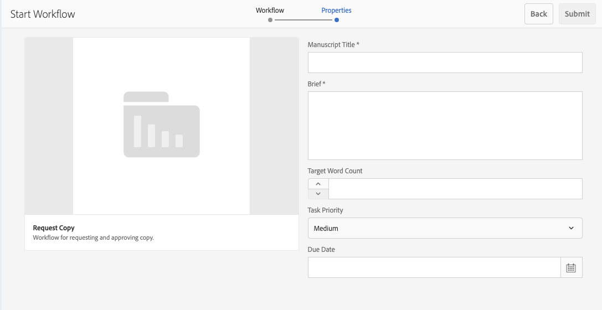

# Utilizzo dei flussi di lavoro per i progetti {#working-with-project-workflows}

I flussi di lavoro per progetti disponibili includono i seguenti:

* **Flusso di lavoro di approvazione progetto:** questo flusso di lavoro consente di assegnare dei contenuti a un utente, rivederli e approvarli.
* **Richiedi lancio**: flusso di lavoro per richiedere un lancio.
* **Richiedi pagina di destinazione**: flusso di lavoro per richiedere una pagina di destinazione.
* **Richiedi e-mail**: flusso di lavoro per la richiesta di un’e-mail.
* **Servizio fotografico prodotti e servizio fotografico prodotti (e-commerce):** consentono di associare le risorse ai prodotti.
* **Crea e traduci copia DAM e Crea copia per lingua DAM:** consentono di creare dati binari, metadati ed etichette tradotti per risorse e cartelle.

A seconda del modello di progetto selezionato, hai determinati flussi di lavoro disponibili:

|  | **Progetto semplice** | **Progetto multimediale** | **Progetto servizio fotografico per prodotto** | **Progetto di traduzione** |
|---|:-:|:-:|:-:|:-:|
| Richiedi copia |  | x |  |  |
| Servizio fotografico per prodotto |  | x | x |  |
| Servizio fotografico per prodotto (Commerce) |  |  | x |  |
| Approvazione del progetto | x |  |  |  |
| Richiedi lancio | x |  |  |  |
| Richiedi pagina di destinazione | x |  |  |  |
| Richiedi e-mail | x |  |  |  |
| Creazione DAM copia in lingua &amp;ast; |  |  |  | x |
| Creazione DAM e traduzione copia in lingua &amp;ast; |  |  |  | x |

>[!NOTE]
>
>&amp;ast Questi flussi di lavoro non si trovano nella sezione **Flusso di lavoro** in Progetti. Consulta [Creazione di copie per lingua per le risorse.](/help/sites-administering/tc-manage.md)

I passaggi per avviare e completare i flussi di lavoro sono sempre gli stessi, indipendentemente dal flusso di lavoro che scegli. Cambiano solo i passaggi intermedi.

Puoi avviare un flusso di lavoro direttamente da Progetti (eccetto Crea copia per lingua DAM e Crea e traduci copia DAM). Le informazioni relative a tutte le operazioni in sospeso di un progetto sono elencate nella sezione **Attività**. Le notifiche per le attività che devono essere completate appaiono accanto all&#39;icona utente.

Per ulteriori informazioni sulle operazioni con i flussi di lavoro in AEM, consulta i seguenti documenti:

* [Partecipare ai flussi di lavoro](/help/sites-authoring/workflows-participating.md)
* [Applicazione dei flussi di lavoro alle pagine](/help/sites-authoring/workflows-applying.md)
* [Configurare i flussi di lavoro](/help/sites-administering/workflows.md)

Questa sezione descrive i flussi di lavoro disponibili per Progetti.

## Flusso di lavoro Richiedi copia {#request-copy-workflow}

Questo flusso di lavoro consente di richiedere un manoscritto ad un utente, e poi approvarlo. Per avviare il flusso di lavoro Richiedi copia:

1. In un progetto multimediale, tocca o fai clic sulla freccia rivolta verso il basso in alto a destra nel **Flussi di lavoro** piastrelle e seleziona **Avvia flusso di lavoro**.
1. Nella procedura guidata del flusso di lavoro seleziona **Richiedi copia** e fai clic su **Successivo**.
1. Immetti il titolo del manoscritto e un breve riassunto della tua richiesta. Se necessario, puoi immettere il numro delle parole di destinazione, impostare la priorità e la scadenza.

   

1. Fai clic su **Invia**.

Il flusso di lavoro inizia. L’attività viene visualizzata nella sezione **Attività** il Card.

## Flusso di lavoro Servizio fotografico per prodotto {#product-photo-shoot-workflow}

La **Servizio fotografico per prodotto** I flussi di lavoro (sia per e-commerce che senza e-commerce) sono descritti in dettaglio nel documento [Progetti creativi](/help/sites-authoring/managing-product-information.md)

## Flusso di lavoro di approvazione progetto {#project-approval-workflow}

In **Approvazione del progetto** , assegni contenuti a un utente, rivedi e quindi approva il contenuto.

1. In un progetto semplice, tocca o fai clic sulla freccia rivolta verso il basso in alto a destra nella sezione **Flussi di lavoro** piastrelle e seleziona **Avvia flusso di lavoro**.
1. Nella procedura guidata del flusso di lavoro seleziona **Flusso di lavoro di approvazione del progetto** e fai clic su **Successivo**.
1. Inserisci un titolo e seleziona a chi assegnarlo. Se necessario, puoi aggiungere una descrizione, il percorso del contenuto, impostare la priorità e la scadenza.

   

1. Fai clic su **Invia**.

Il flusso di lavoro inizia. L’attività viene visualizzata nella sezione **Attività** il Card.

## Flusso di lavoro di richiesta Launch {#request-launch-workflow}

Questo flusso di lavoro consente di richiedere un lancio.

1. In un progetto semplice, tocca o fai clic sulla freccia rivolta verso il basso in alto a destra nella sezione **Flussi di lavoro** piastrelle e seleziona **Avvia flusso di lavoro**.
1. Nella procedura guidata del flusso di lavoro seleziona **Flusso di lavoro di richiesta Launch** e fai clic su **Successivo**.
1. Inserisci un titolo per il lancio e inserisci il percorso origine del lancio. Se necessario, puoi anche aggiungere una descrizione e una data di inizio. Seleziona Eredita i dati live della pagina sorgente o Escludi pagine secondarie, a seconda di come vuoi che si comporti il lancio.

   

1. Fai clic su **Invia**.

Il flusso di lavoro inizia. Il flusso di lavoro viene visualizzato nella **Flussi di lavoro** elenco.

## Flusso di lavoro Richiedi pagina di destinazione {#request-landing-page-workflow}

Questo flusso di lavoro consente di richiedere una pagina di destinazione.

1. In un progetto semplice, tocca o fai clic sulla freccia rivolta verso il basso in alto a destra nella sezione **Flussi di lavoro** piastrelle e seleziona **Avvia flusso di lavoro**.
1. Nella procedura guidata del flusso di lavoro seleziona **Richiedi pagina di destinazione** e fai clic su **Successivo**.
1. Inserisci un titolo per la pagina di destinazione e il percorso principale. Se necessario, immetti una data di inizio o scegli un file per la pagina di destinazione.

   

1. Fai clic su **Invia**.

Il flusso di lavoro inizia. L’attività viene visualizzata nella sezione **Attività** il Card.

## Flusso di lavoro Richiedi e-mail {#request-email-workflow}

Questo flusso di lavoro consente di richiedere una e-mail. È lo stesso flusso di lavoro che viene visualizzato nella sezione **E-mail**.

1. In un progetto semplice, tocca o fai clic sulla freccia rivolta verso il basso in alto a destra nella sezione **Flussi di lavoro** piastrelle e seleziona **Avvia flusso di lavoro**.
1. Nella procedura guidata del flusso di lavoro seleziona **Richiedi e-mail** e fai clic su **Successivo**.
1. Immetti un titolo e-mail, insieme ai percorsi della campagna e del modello. Inoltre, puoi immettere un nome, una descrizione e una data di inizio.

   

1. Fai clic su **Invia**.

Il flusso di lavoro inizia. L’attività viene visualizzata nella sezione **Attività** il Card.

## Flusso di lavoro Crea (e traduci) copia per lingua per le risorse {#create-and-translate-language-copy-workflow-for-assets}

La **Crea copia in lingua** e **Crea e traduci copia in lingua** i flussi di lavoro sono descritti in dettaglio nel documento [Creazione di copie per lingua per le risorse.](/help/assets/translation-projects.md)
