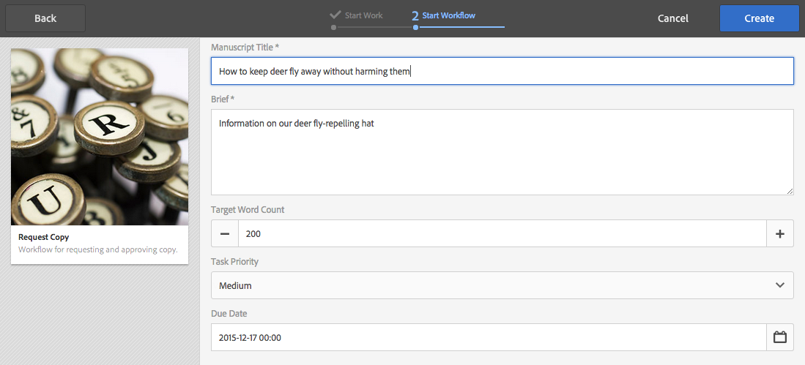
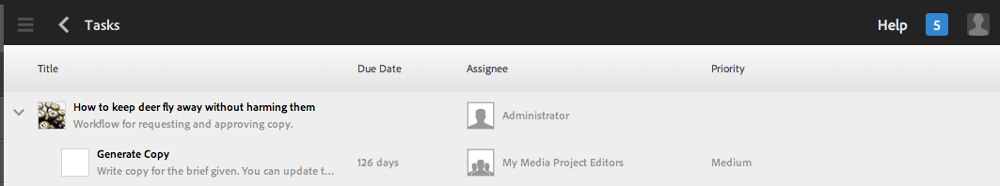
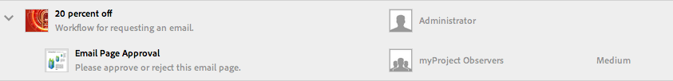

# Utilizzo dei flussi di lavoro per i progetti{#working-with-project-workflows}

I flussi di lavoro per progetti disponibili includono i seguenti:

* **Flusso**  di lavoro di approvazione del progetto: consente di assegnare contenuti a un utente, di rivederli e quindi di approvarli.
* **Richiedi lancio**  - Un flusso di lavoro per il quale viene richiesto un avvio.
* **Richiedi pagina**  di destinazione: questo flusso di lavoro richiede una pagina di destinazione.
* **Richiedi e-mail**: flusso di lavoro per la richiesta di un’e-mail.
* **Servizio fotografico prodotti e servizio fotografico prodotti (e-commerce):** consentono di associare le risorse ai prodotti.
* **Crea e traduci copia DAM e Crea copia per lingua DAM:** consentono di creare dati binari, metadati ed etichette tradotti per risorse e cartelle.

A seconda del modello di progetto selezionato, hai determinati flussi di lavoro disponibili:

|  | **Progetto semplice** | **Progetto multimediale** | **Progetto servizio fotografico per prodotto** | **Progetto di traduzione** |
|---|:-:|:-:|:-:|:-:|
| Richiedi copia |  | x |  |  |
| Servizio fotografico per prodotto |  | x | x |  |
| Foto di prodotto (Commerce) |  |  | x |  |
| Approvazione progetto | x |  |  |  |
| Richiedi lancio | x |  |  |  |
| Richiedi pagina di destinazione | x |  |  |  |
| Richiedi e-mail | x |  |  |  |
| Copia&amp;amp lingua per la creazione di DAM;ast; |  |  |  | x |
| Copia&amp;amp lingua per la creazione e la traduzione di DAM;ast; |  |  |  | x |

>[!NOTE]
>
>&amp;ast; Questi flussi di lavoro non vengono avviati dalla sezione **Flusso di lavoro** in Progetti. Consulta [Creazione di copie per lingua per le risorse.](/help/sites-administering/tc-manage.md)

I passaggi per avviare e completare i flussi di lavoro sono sempre gli stessi, indipendentemente dal flusso di lavoro che scegli. Cambiano solo i passaggi intermedi.

Puoi avviare un flusso di lavoro direttamente da Progetti (eccetto Crea copia per lingua DAM e Crea e traduci copia DAM). Le informazioni relative a tutte le operazioni in sospeso di un progetto sono elencate nella sezione **Attività**. Le notifiche per le attività che devono essere completate appaiono accanto all&#39;icona utente.

Per ulteriori informazioni sull&#39;utilizzo dei flussi di lavoro su AEM, consulta la seguente documentazione:

* [Partecipare ai flussi di lavoro](/help/sites-authoring/workflows-participating.md)
* [Applicazione dei flussi di lavoro alle pagine](/help/sites-authoring/workflows-applying.md)
* [Configurare i flussi di lavoro](/help/sites-administering/workflows.md)

Questa sezione descrive i flussi di lavoro disponibili per Progetti.

## Flusso di lavoro Richiedi copia {#request-copy-workflow}

Questo flusso di lavoro consente di richiedere un manoscritto ad un utente, e poi approvarlo. Per avviare il flusso di lavoro Richiedi copia:

1. Nel progetto Media, seleziona il segno **+** nella sezione **Flussi di lavoro** e fai clic su **Request Copy Workflow (Richiedi copia flusso di lavoro)**.
1. Immetti il titolo del manoscritto e un breve riassunto della tua richiesta. Se necessario, puoi immettere il numro delle parole di destinazione, impostare la priorità e la scadenza.

   

1. Fai clic su **Crea**. Il flusso di lavoro inizia. L’attività viene visualizzata nella sezione **Attività**.

   

## Flusso di lavoro Servizio fotografico per prodotto {#product-photo-shoot-workflow}

I flussi di lavoro Servizio fotografico per prodotto (che sia e-commerce o meno) sono descritte dettagliatamente in [Progetto creativo](/help/sites-authoring/managing-product-information.md).

## Flusso di lavoro di approvazione progetto  {#project-approval-workflow}

Nel flusso di lavoro di approvazione progetto, assegni i contenuti ad un utente, li revisioni e poi li approvi.

1. Nel progetto Semplice, seleziona il simbolo **`+`** nella sezione **Flussi di lavoro**, quindi **Flusso di lavoro approvazione progetto**.
1. Inserisci un titolo e seleziona la persona a cui affidare il compito dall&#39;elenco Team. Se necessario, puoi aggiungere una descrizione, il percorso del contenuto, impostare la priorità e la scadenza.

   

1. Fai clic su **Crea**. Il flusso di lavoro inizia. L’attività viene visualizzata nella sezione **Attività**.

   

## Flusso di lavoro Richiedi lancio {#request-launch-workflow}

Questo flusso di lavoro consente di richiedere un lancio.

1. Nel progetto Semplice, seleziona il segno **+** nella sezione **Flussi di lavoro** e fai clic su **Request Launch Workflow (Richiedi flusso di lavoro di Launch)**.
1. Inserisci un titolo per il lancio e inserisci il percorso origine del lancio. Se necessario, puoi anche aggiungere una descrizione e una data di inizio. Seleziona Eredita i dati live della pagina sorgente o Escludi pagine secondarie, a seconda di come vuoi che si comporti il lancio.

   

1. Fai clic su **Crea**. Il flusso di lavoro inizia. Il flusso di lavoro viene visualizzato nell&#39;elenco **Flussi di lavoro** (fare clic su ellissi **...** nella sezione **Flussi di lavoro** per accedere all&#39;elenco).

## Flusso di lavoro Richiedi pagina di destinazione {#request-landing-page-workflow}

Questo flusso di lavoro consente di richiedere una pagina di destinazione.

1. Vai su Progetto semplice e seleziona il simbolo **+** nella sezione **Flussi di lavoro**, poi fai clic su Flusso di lavoro Richiedi pagina di destinazione.
1. Inserisci un titolo per la pagina di destinazione e il percorso principale. Se necessario, immetti una data di inizio o scegli un file per la pagina di destinazione.

   

1. Fai clic su **Crea**. Il flusso di lavoro inizia. L’attività viene visualizzata nella sezione **Attività**.

## Flusso di lavoro Richiedi e-mail  {#request-email-workflow}

Questo flusso di lavoro consente di richiedere una e-mail. È lo stesso flusso di lavoro che viene visualizzato nella sezione **E-mail**.

1. Vai su Progetto multimediale o Progetto semplice e seleziona **+** nella sezione **Flusso di lavoro**, poi fai clic su **Flusso di lavoro Richiedi e-mail**.
1. Immetti un titolo e-mail, insieme ai percorsi della campagna e del modello. Inoltre, puoi immettere un nome, una descrizione e una data di inizio.

   

1. Fai clic su **Crea**. Il flusso di lavoro inizia. L’attività viene visualizzata nella sezione **Attività**.

   

## Flusso di lavoro Crea (e traduci) copia per lingua per le risorse {#create-and-translate-language-copy-workflow-for-assets}

I flussi di lavoro **Crea copia per lingua** e **Crea e traduci copia per lingua** sono illustrati in modo dettagliato in [Creazione di copie per lingua per le risorse.](/help/assets/translation-projects.md)
