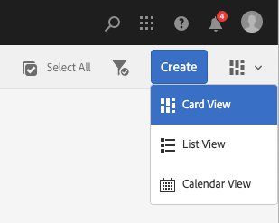

# Progetti {#projects}

La funzione Progetti consente di raggruppare le risorse in una singola entità. Si ottiene così un ambiente comune e condiviso che semplifica la gestione dei progetti. I tipi di risorse che puoi associare a un progetto in AEM vengono definiti porzioni. I riquadri possono includere informazioni sul progetto e sul team, risorse, flussi di lavoro e altro, come descritto in dettaglio in [Riquadri di progetto.](#project-tiles)

In qualità di utente, puoi:

* Creare ed eliminare progetti
* Associare contenuto e cartelle di risorse a un progetto
* Rimuovere i collegamenti contenuto dal progetto

## Requisiti di accesso {#access-requirements}

Progetta una funzione AEM standard e non richiede alcuna configurazione aggiuntiva.

Tuttavia, affinché gli utenti dei progetti possano vedere altri utenti/gruppi mentre utilizzano i progetti, ad esempio durante la creazione di progetti, la creazione di attività/flussi di lavoro o la visualizzazione e la gestione del team, tali utenti devono avere accesso in lettura a `/home/users` e `/home/groups`.

Il modo più semplice per eseguire questa operazione è concedere al gruppo **utenti-progetti** l&#39;accesso in lettura a `/home/users` e `/home/groups`.

## Console Progetti {#projects-console}

Dalla console Progetti è possibile accedere e gestire i tuoi progetti in AEM.

La console Progetti è simile ad altre console dell’AEM e consente di eseguire diverse azioni sui singoli progetti e di regolare la tua visione dei progetti.

### Attiva/disattiva modalità {#modes}

Puoi utilizzare il selettore della barra per passare da una modalità all’altra della console.

#### Solo contenuto {#content-only}

Solo contenuto è la modalità predefinita all’apertura della console. Mostrerà tutti i tuoi progetti.

#### Timeline {#timeline}

La vista timeline consente di selezionare un singolo progetto e di visualizzarne le attività. Utilizzare il selettore della barra o il tasto di scelta rapida `alt+1` per passare a questa visualizzazione.

### Attiva/Disattiva visualizzazione {#views}

È possibile utilizzare il selettore di visualizzazione per passare dalla visualizzazione dei progetti come riquadri di grandi dimensioni (impostazione predefinita) alla visualizzazione come elenco e viceversa.

### Filtra la vista {#filter}

Puoi utilizzare il filtro per alternare tra tutti i progetti e solo quelli attivi.

### Selezione e visualizzazione dei progetti {#selecting}

Per selezionare un progetto, passa il mouse sulla sezione del progetto e fai clic sul segno di spunta.

Visualizzare i dettagli di un progetto facendo clic su di esso per analizzarne i dettagli.

### Creazione di nuovi progetti {#creating}

Fai clic su **Crea** per aggiungere un nuovo progetto.

## Riquadri progetto {#project-tiles}

I progetti sono costituiti da diversi tipi di informazioni che si desidera gestire insieme. Queste informazioni sono rappresentate da **Tiles** diversi.

Al progetto possono essere associate le seguenti tessere.

* [Risorse](#assets)
* [Raccolte di risorse](#asset-collections)
* [Esperienze](#experiences)
* [Collegamenti](#links)
* [Informazioni sul progetto](#project-info)
* [Team](#team)
* [Pagine di destinazione](#landing-pages)
* [E-mail](#emails)
* [Flussi di lavoro](#workflows)
* [Lanci](#launches)
* [Attività](#tasks)

Fai clic sul menu a discesa in alto a destra di qualsiasi sezione per aggiungere altri dati alla sezione.

Fai clic sul pulsante con i puntini di sospensione in basso a destra di qualsiasi sezione per aprire i dati della sezione nella console associata.

### Assets {#assets}

Nel riquadro **Risorse**, puoi raccogliere tutte le risorse utilizzate per un particolare progetto.

Le risorse vengono caricate direttamente nel riquadro.

### Raccolte di risorse {#asset-collections}

Come per le risorse, puoi aggiungere [raccolte di risorse](/help/assets/manage-collections.md) direttamente al progetto. Puoi definire le raccolte in Risorse.

Per aggiungere una raccolta, fai clic su **Aggiungi raccolta** e seleziona la raccolta appropriata dall’elenco.

### Esperienze {#experiences}

Il riquadro **Esperienze** consente di aggiungere al progetto un&#39;app mobile, un sito Web o una pubblicazione.

Le icone indicano quale tipo di esperienza è rappresentata.

* Sito Web
* Applicazione mobile

### Collegamenti {#links}

Il riquadro **Collegamenti** consente di associare collegamenti esterni al progetto.

Puoi denominare il collegamento con un nome facile da riconoscere e modificare la miniatura.

### Informazioni sul progetto {#project-info}

Il riquadro **Informazioni progetto** fornisce informazioni generali sul progetto, tra cui una descrizione, lo stato del progetto (inattivo o attivo), una data di scadenza e i membri. Inoltre, è possibile aggiungere una miniatura del progetto, che viene visualizzata nella pagina principale Progetti.

### Processo di traduzione {#translation-job}

Nel riquadro **Processo di traduzione** è possibile avviare una traduzione e visualizzare lo stato delle traduzioni.

Per impostare la traduzione, consulta il documento [Creazione di progetti di traduzione.](/help/assets/translation-projects.md)

### Team {#team}

In questo riquadro è possibile specificare i membri del team del progetto. Durante la modifica, è possibile immettere il nome del membro del team e assegnare il ruolo utente.

Puoi aggiungere ed eliminare membri dal team. Inoltre, puoi modificare il [ruolo utente](#userroles) assegnato al membro del team.

### Pagine di destinazione {#landing-pages}

Il riquadro **Pagine di destinazione** consente di richiedere una nuova pagina di destinazione.

Questo flusso di lavoro è descritto nel documento[Creare un flusso di lavoro per la pagina di destinazione.](/help/sites-authoring/projects-with-workflows.md#request-landing-page-workflow)

### E-mail {#emails}

Il riquadro **E-mail** consente di gestire le richieste di posta elettronica. Avvia il flusso di lavoro **Richiesta e-mail**.

Ulteriori informazioni sono descritte nel flusso di lavoro [Richiedi e-mail.](/help/sites-authoring/projects-with-workflows.md#request-email-workflow)

### Flussi di lavoro {#workflows}

Puoi avviare i flussi di lavoro per il progetto. Se sono in esecuzione flussi di lavoro, il relativo stato viene visualizzato nella sezione **Flussi di lavoro**.

A seconda del progetto creato, sono disponibili diversi flussi di lavoro.

Sono descritti in [Utilizzo dei flussi di lavoro dei progetti.](/help/sites-authoring/projects-with-workflows.md)

### Lanci {#launches}

Il riquadro **Lanci** mostra tutti i lanci richiesti con un flusso di lavoro [Richiedi lancio.](/help/sites-authoring/projects-with-workflows.md)

### Attività {#tasks}

Le attività consentono di monitorare lo stato di tutte le attività correlate al progetto, inclusi i flussi di lavoro. Le attività sono trattate in dettaglio in [Lavorare con le attività](/help/sites-authoring/task-content.md).

## Modelli di progetto {#project-templates}

I modelli fungono da base per avviare il progetto. L’AEM fornisce questi modelli di progetto standard.

* **Progetto multimediale** - Questo è un progetto di riferimento per attività relative ai file multimediali. Include diversi ruoli di progetto relativi ai file multimediali e flussi di lavoro relativi ai contenuti multimediali.
* **[Progetto servizio fotografico per prodotto](/help/sites-authoring/managing-product-information.md)** - Questo è un esempio di riferimento per la gestione della fotografia di prodotto relativa a eCommerce.
* **[Progetto di traduzione](/help/sites-administering/translation.md)** - Questo è un esempio di riferimento per la gestione delle attività relative alla traduzione. Include ruoli di base e flussi di lavoro per la gestione della traduzione.
* **Progetto semplice** - Questo è un esempio di riferimento per tutti i progetti che non rientrano in altre categorie. Include tre ruoli di base e quattro flussi di lavoro generali per l’AEM.

In base al modello selezionato, all’interno del progetto sono disponibili diverse opzioni, ad esempio i ruoli utente e i flussi di lavoro forniti.

## Ruoli utente in un progetto {#user-roles-in-a-project}

I diversi ruoli utente sono definiti nel modello di progetto e vengono utilizzati per due motivi principali:

1. Autorizzazioni: i ruoli utente rientrano in una delle tre categorie elencate: osservatore, editor, proprietario. Ad esempio, un fotografo o un copywriter avrà gli stessi privilegi di un editor. Le autorizzazioni determinano cosa può fare un utente in relazione al contenuto di un progetto.
1. Flussi di lavoro: i flussi di lavoro determinano chi sono le attività assegnate in un progetto. Le attività possono essere associate a un ruolo del progetto. Ad esempio, è possibile assegnare un&#39;attività ai fotografi in modo che tutti i membri del gruppo che hanno il ruolo di fotografo ottengano l&#39;attività.

Tutti i progetti supportano i seguenti ruoli predefiniti per consentire l’amministrazione delle autorizzazioni di sicurezza e controllo.

| Ruolo | Descrizione | Autorizzazioni | Iscrizione al gruppo |
|---|---|---|---|
| Osservatore | Un utente con questo ruolo può visualizzare i dettagli del progetto, compreso lo stato. | Autorizzazioni di sola lettura per un progetto | `workflow-users` gruppo |
| Editor | Un utente con questo ruolo può caricare e modificare il contenuto di un progetto. | Accesso in lettura e scrittura a un progetto, ai metadati associati e alle risorse correlate Privilegi per caricare un elenco di foto, servizi fotografici e rivedere e approvare le risorse Autorizzazione di scrittura per `/etc/commerce` Autorizzazione di modifica per un progetto specifico | `workflow-users` gruppo |
| Proprietario | Un utente con questo ruolo può creare un progetto, avviare il lavoro in un progetto e spostare le risorse approvate nella cartella di produzione. Il proprietario può visualizzare ed eseguire anche tutte le altre attività del progetto. | Autorizzazioni di scrittura su `/etc/commerce` | `dam-users` gruppo per creare un gruppo di progetti `projects-administrators` per creare un progetto e spostare risorse |

Per i progetti creativi, vengono forniti anche ruoli aggiuntivi come fotografi. Puoi utilizzare questi ruoli per derivare ruoli personalizzati per un progetto specifico.

### Creazione automatica gruppo {#auto-group-creation}

Quando crei il progetto e aggiungi utenti ai vari ruoli, i gruppi associati al progetto vengono creati automaticamente per gestire le autorizzazioni associate.

Ad esempio, un progetto denominato Mioprogetto avrebbe tre gruppi: **Proprietari mioprogetto**, **Editor mioprogetto**, **Osservatori mioprogetto**.

Se il progetto viene eliminato, tali gruppi vengono eliminati solo se si seleziona l&#39;opzione appropriata [ durante l&#39;eliminazione del progetto.](/help/sites-authoring/touch-ui-managing-projects.md#deleting-a-project) Un amministratore può anche eliminare manualmente i gruppi in **Strumenti** > **Sicurezza** > **Gruppi**.

## Risorse aggiuntive {#additional-resources}

Per ulteriori dettagli sull’utilizzo dei progetti, consulta i seguenti documenti aggiuntivi:

* [Gestione dei progetti](/help/sites-authoring/touch-ui-managing-projects.md)
* [Utilizzo delle attività](/help/sites-authoring/task-content.md)
* [Utilizzo dei flussi di lavoro per i progetti](/help/sites-authoring/projects-with-workflows.md)
* [Progetto creativo e integrazione PIM](/help/sites-authoring/managing-product-information.md)
