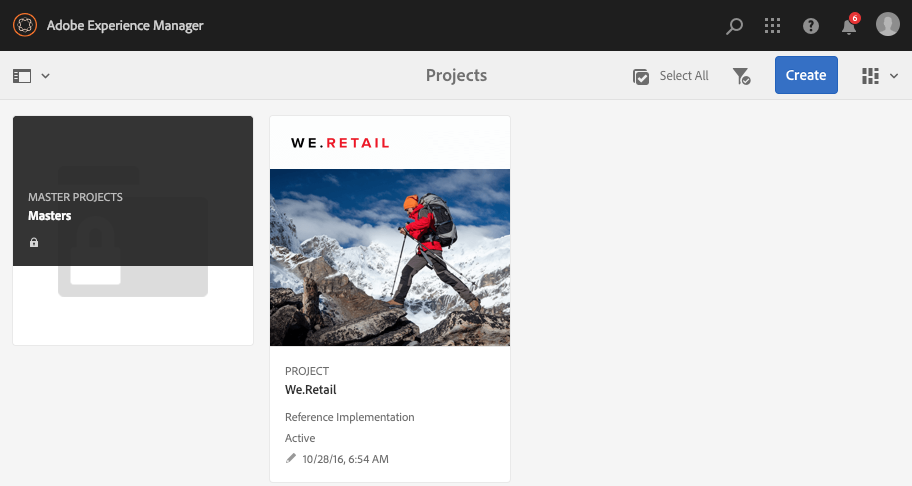
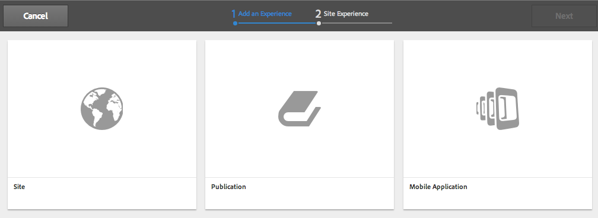
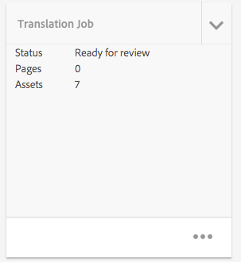

# Progetti{#projects}

La funzione Progetti consente di raggruppare le risorse in una singola entità. Si ottiene così un ambiente comune e condiviso che semplifica la gestione dei progetti. I tipi di risorse che puoi associare a un progetto in AEM vengono definiti porzioni. Tiles may include project and team information, assets, workflows, and other types of information, as described in detail in [Project Tiles.](#project-tiles)

>[!CAUTION]
>
>For users in projects to see other users/groups while using Projects functionality like creating projects, creating tasks/workflows, seeing and managing the team, those users need to have read access on **/home/users** and **/home/groups**. The easiest way to implement this is to give the **projects-users** group read access to **/home/users** and**/home/groups**.

Come utente, puoi effettuare le seguenti operazioni:

* Creare progetti
* Assegnare contenuti e cartelle di attività a un progetto
* Eliminare progetti
* Rimuovere i collegamenti a contenuti dal progetto

Consulta i seguenti argomenti aggiuntivi:

* [Gestione dei progetti](/help/sites-authoring/touch-ui-managing-projects.md)
* [Utilizzo delle attività](/help/sites-authoring/task-content.md)
* [Utilizzo dei flussi di lavoro del progetto](/help/sites-authoring/projects-with-workflows.md)
* [Integrazione di Progetto creativo e PIM](/help/sites-authoring/managing-product-information.md)

## Console Progetti {#projects-console}

Dalla console dei progetti è possibile accedere ai tuoi progetti e gestirli in AEM.

* Seleziona **Timeline** quindi un progetto per visualizzarne la relativa timeline.
* Tocca o fai clic su **Seleziona** per entrare nella modalità di selezione.
* Fai clic su **Crea** per aggiungere i progetti.
* **Mostra/Nascondi progetti attivi** consente di passare da tutti i progetti a solo quelli che sono attivi.
* **Mostra vista statistiche** consente di visualizzare le statistiche del progetto in relazione alle attività completate.

## Porzioni del progetto {#project-tiles}

Da Progetti, è possibile associare diversi tipi di informazioni ai progetti. Questi elementi vengono definiti **Porzioni**. In questa sezione, sono descritte le porzioni e il tipo di informazioni che contengono.

È possibile associare le seguenti porzioni al progetto. Le sezioni seguenti descrivono ogni porzione:

* Risorse e raccolte di risorse
* Esperienze
* Collegamenti
* Informazioni sul progetto
* Team
* Pagine di destinazione
* E-mail
* Flussi di lavoro
* Lanci
* Attività

### Assets {#assets}

Nella sezione **Risorse**, puoi raccogliere tutte le risorse usate per un particolare progetto.

Puoi caricare le risorse direttamente nella porzione. Inoltre, puoi creare set di immagini, set 360 gradi o set di file multimediali diversi se possiedi il componente aggiuntivo Elemento multimediale dinamico.

### Raccolte di risorse {#asset-collections}

Come per le risorse, puoi aggiungere [raccolte di risorse](/help/assets/managing-collections-touch-ui.md) direttamente al tuo progetto. Puoi definire le raccolte in Risorse.

Aggiungi una raccolta facendo clic su **Aggiungi raccolta** e selezionando la raccolta appropriata dall&#39;elenco.

### Esperienze {#experiences}

La sezione **Esperienze** consente di aggiungere un’applicazione per dispositivi mobili, un sito web o una pubblicazione al progetto.

Le icone indicano quale tipo di esperienza è rappresentata: sito web, app mobile o pubblicazione. Aggiungi le esperienze facendo clic sul segno + o su **Aggiungi esperienza** e selezionandone il tipo.

Seleziona il percorso per le miniature, se applicabile, modifica la miniatura per l&#39;esperienza. Experiences are grouped together in the **Experiences** tile.

### Collegamenti {#links}

La sezione Collegamenti consente di associare collegamenti esterni al progetto.

Puoi denominare il collegamento con un nome facile da riconoscere, nonché modificare la miniatura.

### Informazioni progetto {#project-info}

La porzione Informazioni progetto fornisce informazioni generali sul progetto, tra cui una descrizione, lo stato del progetto (attivo o inattivo), una scadenza e gli iscritti. Inoltre, puoi aggiungere una miniatura del progetto, che viene visualizzata nella pagina principale Progetti.

I membri del team possono essere assegnati a questa porzione ed eliminati (oppure è possibile modificare i ruoli), lo stesso vale per la porzione Team.

### Processo di traduzione {#translation-job}

Dalla porzione Processo di traduzione puoi iniziare una traduzione e visualizzare lo stato delle traduzioni. Per configurare la traduzione, consulta [Creazione di progetti di traduzione](/help/assets/translation-projects.md).

Click the ellipsis at the bottom of the **Translation Job** card to view the assets in the translation workflow. Nell’elenco dei processi di traduzione vengono visualizzate anche le voci per i metadati risorsa e i tag. Queste voci indicano che anche i metadati e i tag per le risorse vengono tradotti.

### Team {#team}

In questa porzione, è possibile specificare i membri del team del progetto. Durante la modifica, è possibile immettere il nome del membro del team e assegnare un ruolo all’utente.

Puoi aggiungere ed eliminare membri dal team. In addition, you can edit the [user role](#userroles) assigned to the team member.

### Pagine di destinazione {#landing-pages}

La porzione **Pagine di destinazione** consente di richiedere una nuova pagina di destinazione.

Il flusso di lavoro è descritto in [Creare un flusso di lavoro Pagina di destinazione](/help/sites-authoring/projects-with-workflows.md#request-landing-page-workflow).

### E-mail {#emails}

La porzione **E-mail** consente di gestire le richieste per e-mail. Avvia la richiesta per il flusso di lavoro E-mail.

Per ulteriori informazioni, consulta [Flusso di lavoro richiedi e-mail](/help/sites-authoring/projects-with-workflows.md#request-email-workflow)

### Flussi di lavoro {#workflows}

Puoi assegnare il progetto in modo da seguire alcuni flussi di lavoro. Se i flussi di lavoro sono in esecuzione, il loro stato viene visualizzato nella porzione **Flussi di lavoro** in Progetti.

Puoi assegnare il progetto in modo da seguire alcuni flussi di lavoro. A seconda del progetto scelto sono disponibili diversi flussi di lavoro.

I diversi flussi di lavoro sono descritti in [Utilizzo dei flussi di lavoro del progetto.](/help/sites-authoring/projects-with-workflows.md)

### Lanci {#launches}

La porzione Lanci mostra tutti i lanci richiesti con un [Flusso di lavoro di richiesta lancio.](/help/sites-authoring/projects-with-workflows.md) 

### Attività {#tasks}

Le attività consentono di controllare lo stato di tutte le attività relative al progetto, tra cui i flussi di lavoro. Tasks are covered in detail at [Working with Tasks](/help/sites-authoring/task-content.md).

## Modelli di progetto {#project-templates}

AEM navi con tre diversi modelli:

* Un progetto semplice: un esempio di riferimento per tutti i progetti che non rientrano in altre categorie (un catch-all). Comprende tre ruoli di base (Proprietari, Editor e Osservatori) e quattro flussi di lavoro (Approvazione progetto, Richiedi lancio, Richiedi pagina di destinazione e Richiedi e-mail).
* Un progetto multimediale - Un progetto di esempio di riferimento per le attività relative ai supporti. Include diversi ruoli di progetto relativi ai file multimediali (fotografi, editor, copywriter, designer, proprietari e osservatori). Inoltre, include due flussi di lavoro relativi al contenuto multimediale: Richiedi copia (per la richiesta e il controllo del testo) e Servizio fotografico per il prodotto (per la gestione delle fotografie del prodotto)
* [Progetto](/help/sites-authoring/managing-product-information.md) per fototessere di prodotto - Un esempio di riferimento per la gestione della fotografia di prodotti correlati a eCommerce. Include ruoli per fotografi, editor, ritoccatori foto, proprietari, direttori creativi, responsabili marketing per social media, Marketing Manager, revisori e osservatori.
* [Un progetto di traduzione:](/help/sites-administering/translation.md) un esempio di riferimento per la gestione delle attività di traduzione. Comprende tre ruoli di base (Proprietari, Editor e Osservatori). Include due flussi di lavoro a cui si accede nell’interfaccia utente Flussi di lavoro.

In base al modello selezionato, sono disponibili diverse opzioni, in particolare riguardo ai ruoli dell’utente e ai flussi di lavoro.

## Ruoli utente in un progetto {#user-roles-in-a-project}

I diversi ruoli dell’utente vengono impostati in un Modello di progetto e vengono utilizzati per due motivi principali:

1. Autorizzazioni. I ruoli dell’utente rientrano in una delle tre categorie elencate: Osservatore, Editor, Proprietario. Ad esempio, un fotografo o un copywriter avrà gli stessi privilegi di un editor. Le autorizzazioni determinano le azioni di un utente in relazione ai contenuti di un progetto.
1. Flussi di lavoro. I flussi di lavoro determinano a chi vengono assegnate le attività in un progetto. Le attività possono essere associate a un ruolo del progetto. Ad esempio, un’attività può essere assegnata ai fotografi così, tutti i membri del team che hanno il ruolo di fotografo, riceveranno l&#39;attività.

Tutti i progetti supportano i seguenti ruoli predefiniti per consentire all’utente di amministrare le autorizzazioni di controllo e protezione:

<table>
 <tbody>
  <tr>
   <td>
<strong>Ruolo</strong>
 </td>
   <td>
<strong>Descrizione</strong>
 </td>
   <td>
<strong>Autorizzazioni </strong>
 </td>
   <td>
<strong>Iscrizione al gruppo</strong>
 </td>
  </tr>
  <tr>
   <td>
Osservatore
 </td>
   <td>
Un utente con questo ruolo può visualizzare le informazioni di progetto, tra cui lo stato del progetto.
 </td>
   <td>
Autorizzazioni di sola lettura per un progetto
 </td>
   <td>
gruppo degli utenti del flusso di lavoro
 </td>
  </tr>
  <tr>
   <td>
Editor
 </td>
   <td>
Un utente con questo ruolo può caricare e modificare il contenuto di un progetto.
 
 
 </td>
   <td>
    <ul>
     <li>Acceso in lettura e scrittura a un progetto, ai metadati associati e alle relative risorse.</li>
     <li>Privilegi per caricare un elenco di foto, un servizio fotografico e per la revisione e approvazione delle risorse</li>
     <li>Autorizzazioni di scrittura su /etc/commerce</li>
     <li>Autorizzazione di modifica per un determinato progetto</li>
    </ul> </td>
   <td>
gruppo degli utenti del flusso di lavoro
 </td>
  </tr>
  <tr>
   <td>
Proprietario
 </td>
   <td>
Un utente con questo ruolo può avviare un progetto. Un proprietario può creare un progetto, avviare il lavoro in un progetto e spostare le risorse approvate nella cartella di produzione. Il proprietario può visualizzare ed eseguire anche tutte le altre attività del progetto.
 </td>
   <td>
    <ul>
     <li>Autorizzazioni di scrittura su /etc/commerce</li>
    </ul> </td>
   <td>
    <ul>
     <li>Gruppo di utenti DAM (per creare un progetto)</li>
     <li>gruppo project-Administrators (per spostare le risorse)</li>
    </ul> </td>
  </tr>
 </tbody>
</table>

Per i progetti creativi, sono disponibili altri ruoli, ad esempio fotografi. Puoi usare questi ruoli per creare ruoli personalizzati per un progetto specifico.

>[!NOTE]
>
>Quando crei il progetto e aggiungi utenti ai vari ruoli, i gruppi associati al progetto vengono creati automaticamente per gestire le autorizzazioni associate. Ad esempio, un progetto denominato Mioprogetto avrebbe tre gruppi: **Proprietari mioprogetto**, **Editor mioprogetto**, **Osservatori mioprogetto**. Tuttavia, se il progetto viene eliminato, tali gruppi non vengono rimossi automaticamente. Un amministratore deve eliminare manualmente i gruppi da **Strumenti** > **Protezione** > **Gruppi**.
