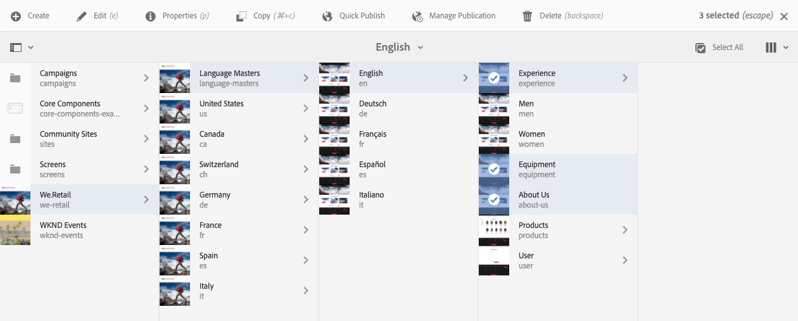
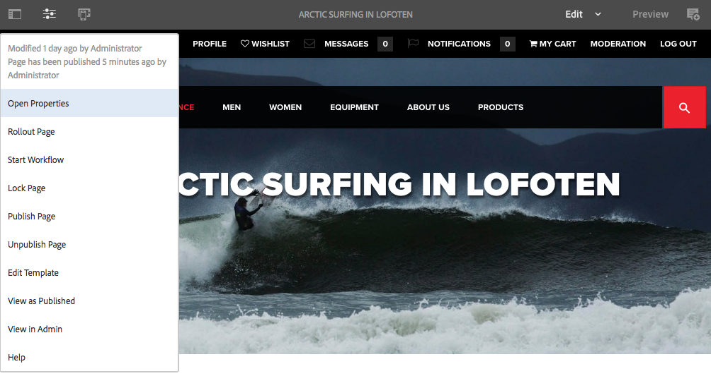

# Pubblicazione delle pagine {#publishing-pages}

Dopo aver creato e rivisto i contenuti nell&#39;ambiente di authoring, [rendili disponibili nel sito Web pubblico](/help/sites-authoring/author.md#concept-of-authoring-and-publishing) (ambiente di pubblicazione).

Questa operazione è denominata pubblicazione della pagina. Quando si rimuove una pagina dall’ambiente di pubblicazione, si parla di annullamento della pubblicazione. Durante la pubblicazione e l’annullamento della pubblicazione la pagina rimane disponibile nell’ambiente di authoring per ulteriori modifiche fino a quando non la elimini.

Puoi anche pubblicare/annullare la pubblicazione di una pagina immediatamente o in una data/ora futura predefinita.

>[!NOTE]
>
>Alcuni termini relativi alla pubblicazione possono essere confusi:
>
>* **Pubblicare/Annullare la pubblicazione**
>  Termini principali per le azioni che consentono di rendere o meno i contenuti disponibili al pubblico nell’ambiente di pubblicazione.
>
>* **Attivare/Disattivare**
>  Sinonimi di pubblicare/annullare la pubblicazione.
>
>* **Replicare/Replica**
>  Questi sono i termini tecnici che descrivono lo spostamento di dati (ad esempio contenuto di una pagina, file, codice e commenti degli utenti) da un ambiente all’altro, ad esempio durante la pubblicazione o la replica inversa di commenti degli utenti.

## Privilegi insufficienti {#insufficient-privileges}

Se non disponi dei privilegi necessari per la pubblicazione di una pagina specifica:

* Verrà attivato un flusso di lavoro per notificare alla persona appropriata la richiesta di pubblicazione.
* Il [flusso di lavoro potrebbe essere stato personalizzato](/help/sites-developing/workflows-models.md#main-pars-procedure-6fe6) dal team di sviluppo.
* Verrà visualizzato brevemente un messaggio che informa che il flusso di lavoro è stato attivato.

## Pubblicazione delle pagine {#publishing-pages-1}

A seconda della posizione, puoi pubblicare:

* [Dall’editor di pagine](/help/sites-authoring/publishing-pages.md#publishing-from-the-editor)
* [Dalla console Sites](/help/sites-authoring/publishing-pages.md#publishing-from-the-console)

### Pubblicazione dall’editor {#publishing-from-the-editor}

Se stai modificando una pagina, puoi pubblicarla direttamente dall’editor.

1. Seleziona l’icona **Informazioni pagina** per aprire il menu, quindi l’opzione **Pubblica pagina**.

   

1. A seconda che la pagina includa o meno riferimenti che devono essere pubblicati:

   * La pagina verrà pubblicata direttamente, se non sono presenti riferimenti da pubblicare.
   * Se la pagina include riferimenti da pubblicare, questi saranno elencati nella procedura guidata di **Pubblicazione**, dove è possibile:

      * Specifica le risorse o i tag da pubblicare insieme alla pagina, quindi utilizza **Pubblica** per completare il processo.

      * Seleziona **Annulla** per annullare l’azione.

   

1. Se selezioni l’opzione **Pubblica**, la pagina verrà replicata nell’ambiente di pubblicazione. Nell’editor pagina viene visualizzato un banner informativo che conferma l’azione di pubblicazione.

   

   Quando visualizzi la stessa pagina nella console, lo stato aggiornato della pubblicazione è visibile.

   

>[!NOTE]
>
>La pubblicazione dall’editor è superficiale, ovvero vengono pubblicate solo le pagine selezionate e non le relative pagine figlie.

>[!NOTE]
>
>Impossibile pubblicare le pagine a cui accedono [alias](/help/sites-authoring/editing-page-properties.md#advanced) nell&#39;editor. Le opzioni di pubblicazione nell’editor sono disponibili solo per le pagine accessibili tramite i percorsi effettivi.

### Pubblicazione dalla console {#publishing-from-the-console}

Nella console Sites sono disponibili due opzioni per la pubblicazione:

* [Pubblicazione rapida ](/help/sites-authoring/publishing-pages.md#quick-publish)
* [Gestisci pubblicazione ](/help/sites-authoring/publishing-pages.md#manage-publication)

#### Pubblicazione rapida  {#quick-publish}

**Pubblicazione rapida** si usa in casi semplici; le pagine selezionate vengono pubblicate immediatamente senza ulteriore interazione. Per questo motivo, anche eventuali riferimenti non pubblicati verranno pubblicati automaticamente.

Per pubblicare una pagina con Pubblicazione rapida:

1. Selezionare le pagine desiderate nella console Sites e fare clic sul pulsante **Pubblicazione rapida**.

   

1. Nella finestra di dialogo Pubblicazione rapida, confermare la pubblicazione facendo clic su **Pubblica** o annullare facendo clic su **Annulla**. Tieni presente che verranno pubblicati automaticamente anche eventuali riferimenti non pubblicati.

   

1. Quando la pagina viene pubblicata, viene visualizzato un avviso che ne conferma la pubblicazione.

>[!NOTE]
>
>La pubblicazione rapida è una pubblicazione “superficiale”, ovvero vengono pubblicate solo le pagine selezionate e non le relative pagine secondarie.

#### Gestisci pubblicazione  {#manage-publication}

**Gestisci pubblicazione** offre più opzioni rispetto alla Pubblicazione rapida e consente di includere pagine figlie, personalizzare i riferimenti, avviare tutti i flussi di lavoro applicabili e pubblicare la pagina in un secondo momento.

Per pubblicare una pagina o annullarne la pubblicazione tramite Gestisci pubblicazione:

1. Selezionare le pagine desiderate nella console Sites e fare clic sul pulsante **Gestisci pubblicazione**.

   

1. Viene avviata la procedura guidata **Gestisci pubblicazione**. Il primo passaggio, **Opzioni**, consente di:

   * Scegliere di pubblicare le pagine selezionate o annullarne la pubblicazione.
   * Scegli se eseguire l’azione ora o in un secondo momento.

   Con Pubblica più tardi viene avviato un flusso di lavoro per attivare le pagine selezionate alla data e all’ora specificate. Al contrario, l’annullamento della pubblicazione in un secondo momento avvia un flusso di lavoro per annullare la pubblicazione della pagina o delle pagine selezionate in un momento specifico.

   Per annullare un’attività di pubblicazione o annullamento della pubblicazione pianificata per un momento successivo, accedi alla [console Flusso di lavoro](/help/sites-administering/workflows.md) e termina il flusso di lavoro corrispondente.

   

   Fai clic su **Avanti** per continuare.

1. Nel passaggio successivo della procedura guidata Gestisci pubblicazione, **Ambito**, puoi definire l&#39;ambito della pubblicazione o dell&#39;annullamento della pubblicazione, ad esempio decidendo se includere pagine figlie e/o riferimenti.

   

   Puoi usare il pulsante **Aggiungi contenuto** per aggiungere ulteriori pagine all’elenco delle pagine da pubblicare, nel caso in cui ti sia dimenticato di selezionarne una prima di avviare la procedura guidata Gestisci pubblicazione.

   Facendo clic sul pulsante Aggiungi contenuto si avvia il [browser percorsi](/help/sites-authoring/author-environment-tools.md#path-browser), che consente di selezionare contenuti.

   Seleziona le pagine desiderate e fai clic su **Seleziona** per aggiungere contenuti alla procedura guidata o su **Annulla** per annullare la selezione e tornare alla procedura guidata.

   Nella procedura guidata, puoi selezionare un elemento nell’elenco per configurarne altre opzioni, ad esempio:

   * Includi i relativi elementi figlio.
   * Rimuovilo dalla selezione.
   * Gestisci i riferimenti pubblicati.

   

   Facendo clic su **Includi elementi secondari** viene visualizzata una finestra di dialogo che consente di includere:

   * Solo gli elementi secondari di primo livello.
   * Solo pagine modificate.
   * Solo pagine già pubblicate.

   Fai clic su **Aggiungi** per aggiungere le pagine secondarie nell’elenco delle pagine da pubblicare o di cui annullare la pubblicazione, in base alle opzioni selezionate. Fai clic su **Annulla** per annullare la selezione e tornare alla procedura guidata.

   

   Tornando alla procedura guidata vengono visualizzate le pagine aggiunte in base alle opzioni selezionate nella finestra di dialogo Includi elementi secondari.

   Puoi visualizzare e modificare i riferimenti da pubblicare o di cui annullare la pubblicazione per una pagina selezionandola e facendo clic sul pulsante **Riferimenti pubblicati**.

   

   Nella finestra di dialogo **Riferimenti pubblicati** vengono visualizzati i riferimenti per il contenuto selezionato. Per impostazione predefinita sono tutti selezionati e verranno pubblicati o ne verrà annullata la pubblicazione, ma puoi deselezionarli in modo da non includerli nell’azione.

   Fai clic su **Fine** per salvare le modifiche o su **Annulla** per annullare la selezione e tornare alla procedura guidata.

   Nella procedura guidata, la colonna **Riferimenti** verrà aggiornata per riflettere la selezione dei riferimenti da pubblicare o di cui annullare la pubblicazione.

   

1. Fai clic su **Pubblica** per completare l’azione.

   Nella console Sites, un messaggio di notifica confermerà la pubblicazione.

1. Se le pagine pubblicate sono associate a flussi di lavoro, potrebbero essere visualizzati in un passaggio finale **Flussi di lavoro** della procedura guidata di pubblicazione.

   >[!NOTE]
   >
   >Il passaggio **Flussi di lavoro** viene visualizzato in base ai diritti di cui dispone l&#39;utente.
   >
   >Per informazioni dettagliate, consulta le sezioni [Privilegi insufficienti](/help/sites-authoring/publishing-pages.md#insufficient-privileges), [Gestione dell&#39;accesso ai flussi di lavoro](/help/sites-administering/workflows-managing.md) e [Applicazione dei flussi di lavoro alle pagine](/help/sites-authoring/workflows-applying.md#main-pars-text-5-bvhbkh-refd).

   Le risorse sono raggruppate in base ai flussi di lavoro attivati e a ciascuna opzione specificata per:

   * Definire il titolo del flusso di lavoro.
   * Mantenere il pacchetto del flusso di lavoro, a condizione che il flusso di lavoro disponga di [supporto per più risorse](/help/sites-developing/workflows-models.md#configuring-a-workflow-for-multi-resource-support).
   * Definire un titolo del pacchetto del flusso di lavoro se è stata selezionata l’opzione per mantenere il pacchetto del flusso di lavoro.

   Fai clic su **Pubblica** o **Pubblica più tardi** per completare la pubblicazione.

   

>[!TIP]
>
>La pianificazione del contenuto per la pubblicazione replica il contenuto e rispetta i flussi di lavoro di pubblicazione. Se desideri nascondere temporaneamente il contenuto già pubblicato senza annullare la pubblicazione, considera [**Ora di attivazione** e **Ora di disattivazione** disponibili nelle proprietà della pagina.](/help/sites-authoring/editing-page-properties.md#on-time)

## Annullamento della pubblicazione delle pagine {#unpublishing-pages}

L’annullamento della pubblicazione di una pagina ne effettua la rimozione dall’ambiente di pubblicazione e la pagina non sarà più disponibile per i lettori.

Con una procedura [simile alla pubblicazione](/help/sites-authoring/publishing-pages.md#publishing-pages), è possibile annullare la pubblicazione di una o più pagine:

* [Dall’editor di pagine](/help/sites-authoring/publishing-pages.md#unpublishing-from-the-editor)
* [Dalla console Sites](/help/sites-authoring/publishing-pages.md#unpublishing-from-the-console)

### Annullamento della pubblicazione dall’editor  {#unpublishing-from-the-editor}

Durante la modifica di una pagina, se desideri annullarne la pubblicazione seleziona **Annulla pubblicazione pagina** nel menu **Informazioni pagina**. La procedura è simile a quella di [pubblicazione della pagina](/help/sites-authoring/publishing-pages.md#publishing-from-the-editor).

>[!NOTE]
>
>Non è possibile annullare la pubblicazione delle pagine a cui accedono [alias](/help/sites-authoring/editing-page-properties.md#advanced) nell&#39;editor. Le opzioni di pubblicazione nell’editor sono disponibili solo per le pagine accessibili tramite i percorsi effettivi.

### Annullamento della pubblicazione dalla console  {#unpublishing-from-the-console}

Puoi utilizzare [l’opzione Gestisci pubblicazione per eseguire la pubblicazione](/help/sites-authoring/publishing-pages.md#manage-publication), ma anche per annullarla.

1. Selezionare le pagine desiderate nella console Sites e fare clic sul pulsante **Gestisci pubblicazione**.
1. Viene avviata la procedura guidata **Gestisci pubblicazione**. Nel primo passaggio, **Opzioni**, seleziona **Annulla pubblicazione** anziché l’opzione predefinita **Pubblica**.

   

   Con Pubblica più tardi viene avviato un flusso di lavoro per pubblicare tale versione della pagina alla data e all’ora specificate. In modo analogo, se si sceglie di annullare la pubblicazione in un secondo momento, verrà attivato un flusso di lavoro per annullare la pubblicazione delle pagine selezionate alla data e all’ora specificate.

   Per annullare un’attività di pubblicazione o annullamento della pubblicazione pianificata per un momento successivo, accedi alla [console Flusso di lavoro](/help/sites-administering/workflows.md) e termina il flusso di lavoro corrispondente.

1. Per completare l&#39;annullamento della pubblicazione, continuare la procedura guidata come si farebbe per [pubblicare la pagina](/help/sites-authoring/publishing-pages.md#manage-publication).

## Pubblicazione e annullamento della pubblicazione di una struttura {#publishing-and-unpublishing-a-tree}

Dopo aver inserito o aggiornato un numero considerevole di pagine di contenuto, tutte memorizzate nella stessa pagina principale, può risultare più semplice pubblicare l’intera struttura in un’unica azione.

È possibile utilizzare [Gestisci pubblicazione](/help/sites-authoring/publishing-pages.md#manage-publication) nella console Sites.

1. Nella console Sites, seleziona la pagina principale della struttura da pubblicare o di cui vuoi annullare la pubblicazione e fai clic su **Gestisci pubblicazione**.
1. Viene avviata la procedura guidata **Gestisci pubblicazione**. Scegli se e quando pubblicare o annullare la pubblicazione e seleziona **Avanti** per continuare.
1. Nel passaggio **Ambito**, seleziona la pagina principale e fai clic su **Includi elementi secondari**.

   

1. Nella finestra di dialogo **Includi elementi figlio**, deseleziona le opzioni:

   * Solo gli elementi secondari di primo livello
   * Solo pagine già pubblicate

   Queste opzioni sono selezionate per impostazione predefinita, pertanto è necessario ricordarsi di deselezionarle. Fai clic su **Aggiungi** per confermare e aggiungere il contenuto alla pubblicazione o all&#39;annullamento della pubblicazione.

   

1. La procedura guidata **Gestisci pubblicazione** elenca il contenuto della struttura per la revisione. È possibile personalizzare ulteriormente la selezione aggiungendo ulteriori pagine o rimuovendo quelle selezionate.

   

   Non dimenticare che è anche possibile esaminare i riferimenti da pubblicare tramite l’opzione **Riferimenti pubblicati**.

1. [Continua a seguire normalmente la procedura guidata Gestisci pubblicazione](#manage-publication) per completare la pubblicazione o annullare la pubblicazione della struttura.

## Determinazione dello stato di pubblicazione {#determining-publication-status}

Puoi determinare lo stato di pubblicazione di una pagina:

* Nelle [informazioni generali sulla risorsa nella console Sites](/help/sites-authoring/basic-handling.md#viewing-and-selecting-resources)

  

  Lo stato di pubblicazione è indicato nelle viste [a schede](/help/sites-authoring/basic-handling.md#card-view), [a colonne](/help/sites-authoring/basic-handling.md#column-view) e [a elenco](/help/sites-authoring/basic-handling.md#list-view) nella console Sites.

* Nella [timeline](/help/sites-authoring/basic-handling.md#timeline)

  

* Nel menu [Informazioni pagina](/help/sites-authoring/author-environment-tools.md#page-information) durante la modifica di una pagina

  
