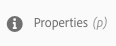
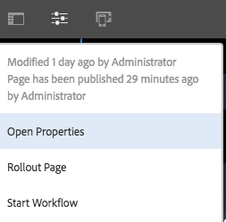
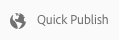

# Guida rapida all’authoring delle pagine{#quick-guide-to-authoring-pages}

Queste procedure sono intese come guida rapida (di alto livello) alle azioni chiave per creare e modificare i contenuti delle pagine in AEM.

Si occupano di:

* Non sono da intendersi come esaustive.
* Includono collegamenti alla documentazione dettagliata.

Per maggiori dettagli sull’authoring con AEM consulta:

* [Primi passi per gli autori](/help/sites-authoring/first-steps.md)
* [Authoring delle pagine](/help/sites-authoring/page-authoring.md)

## Alcuni suggerimenti rapidi {#a-few-quick-hints}

Prima di fornire la panoramica degli approfondimenti, ecco una piccola raccolta di suggerimenti e consigli generali che è bene considerare.

### Console Sites {#sites-console}

* **Crea**

   * Questo pulsante è presente in molte console; le opzioni visualizzate sono contestuali e quindi cambiano in base allo scenario specifico.

* Riordinamento delle pagine in una cartella

   * Può essere eseguito nella [vista a elenco](/help/sites-authoring/basic-handling.md#list-view). Le modifiche saranno applicate e risulteranno visibili anche nelle altre viste.

#### Authoring delle pagine {#page-authoring}

* Collegamenti di navigazione

   * ***I collegamenti non sono disponibili per la navigazione*** quando è attiva la modalità **Modifica**. Per spostarsi utilizzando i collegamenti, occorre [visualizzare l’anteprima della pagina](/help/sites-authoring/editing-content.md#previewing-pages) utilizzando:

      * [Modalità Anteprima](/help/sites-authoring/editing-content.md#preview-mode)
      * [Visualizza come pubblicato](/help/sites-authoring/editing-content.md#view-as-published)

* Le versioni non vengono avviate/create dall’editor di pagine; questa operazione è ora eseguita dalla console Sites (mediante **Crea** o [Timeline](/help/sites-authoring/basic-handling.md#timeline) per una risorsa selezionata).

>[!NOTE]
>
>Ci sono una serie di scelte rapide da tastiera che possono rendere più facile l’esperienza di authoring.
>
>* [Scelte rapide da tastiera per la modifica delle pagine](/help/sites-authoring/page-authoring-keyboard-shortcuts.md)
>* [Scelte rapide da tastiera per le console](/help/sites-authoring/keyboard-shortcuts.md)
>

### Ricerca di una pagina {#finding-your-page}

Sono disponibili vari aspetti per individuare una pagina. Puoi navigare e/o eseguire ricerche:

1. Apri la console **Sites** (mediante l’opzione **Sites** del pannello [Navigazione globale](/help/sites-authoring/basic-handling.md#global-navigation), che si apre (a discesa) quando selezioni il collegamento Adobe Experience Manager (in alto a sinistra).

1. Spostati verso il basso all’interno della struttura toccando/facendo clic sulla pagina appropriata. La modalità di rappresentazione delle risorse di pagina dipende dalla vista che stai utilizzando, [A schede, Elenco o Colonna](/help/sites-authoring/basic-handling.md#viewing-and-selecting-resources):

   

1. Per spostarti in alto nella struttura, usa le [breadcrumb nell’intestazione](/help/sites-authoring/basic-handling.md#theheaderwithbreadcrumbs), che permettono di tornare alla posizione selezionata:

   

1. Puoi anche effettuare la [Ricerca](/help/sites-authoring/search.md) di una pagina. Puoi selezionare la pagina dai risultati visualizzati.

   

### Creazione di una nuova pagina {#creating-a-new-page}

Per [creare una nuova pagina](/help/sites-authoring/managing-pages.md#creating-a-new-page):

1. [Passa alla posizione in cui desideri creare la nuova pagina.](#finding-your-page)
1. Utilizza l’icona **Crea** e seleziona **Pagina** dall’elenco:

   

1. Verrà visualizzata la procedura guidata per la raccolta delle informazioni necessarie per la [creazione della nuova pagina](/help/sites-authoring/managing-pages.md#creating-a-new-page). Segui le istruzioni sullo schermo.

### Selezione della pagina per ulteriori azioni {#selecting-your-page-for-further-action}

È possibile selezionare una pagina in modo da poter intervenire su di essa. Selezionando una pagina la barra degli strumenti si aggiornerà automaticamente mostrando le azioni pertinenti a tale risorsa.

La modalità di selezione di una pagina dipende da quale vista si sta utilizzando nella console:

1. Vista a colonne:

   * Tocca/fai clic sulla miniatura della risorsa richiesta; sulla miniatura compare un segno di spunta per indicare che è stata selezionata.

1. Vista a elenco:

   * Tocca/fai clic sulla miniatura della risorsa richiesta; sulla miniatura compare un segno di spunta per indicare che è stata selezionata.

1. Vista a schede:

   * Attiva la modalità di selezione [scegliendo la risorsa richiesta](/help/sites-authoring/basic-handling.md#viewingandselectingyourresources) con:

      * Dispositivo mobile: tieni premuto
      * Desktop: l’icona [azione rapida](/help/sites-authoring/basic-handling.md#quick-actions) a forma di segno di spunta:

   

   * Sulla scheda compare un segno di spunta per indicare che è stata selezionata la pagina.
   >[!NOTE]
   >
   >Una volta attiva la modalità di selezione l’icona **Seleziona** (un segno di spunta) verrà sostituita dall’icona **Deseleziona** (una crocetta).

### Azioni rapide (solo vista a schede/desktop) {#quick-actions-card-view-desktop-only}

Sono disponibili delle [Azioni rapide](/help/sites-authoring/basic-handling.md#quick-actions):

1. [Passa alla pagina](#finding-your-page) sulla quale desideri intervenire.
1. Passa il puntatore del mouse sulla scheda che rappresenta la risorsa desiderata; verranno visualizzate le azioni rapide:

   

### Modifica del contenuto delle pagine {#editing-your-page-content}

Per modificare la pagina:

1. [Passa alla pagina](#finding-your-page) da modificare.
1. [Apri la pagina per la modifica](/help/sites-authoring/managing-pages.md#opening-a-page-for-editing) tramite l’icona Modifica (matita):

   

   È accessibile da:

   * [Azioni rapide (vista a schede/desktop)](#quick-actions-card-view-desktop-only) per la risorsa appropriata.
   * La barra degli strumenti, se la [pagina è stata selezionata](#selectiingyourpageforfurtheraction).

1. Quando l’editor si apre è possibile:

   * [Aggiungere un nuovo componente alla pagina](/help/sites-authoring/editing-content.md#inserting-a-component):

      * Apri il pannello laterale.
      * Seleziona la scheda dei componenti (il [browser Componenti](/help/sites-authoring/author-environment-tools.md#components-browser)).
      * Trascina il componente richiesto sulla pagina.

      Il pannello laterale può essere aperto (e chiuso) con:
   

   * [Modificare il contenuto di un componente esistente](/help/sites-authoring/editing-content.md#edit-configure-copy-cut-delete-paste) sulla pagina:

      * Apri la barra degli strumenti del componente toccando o facendo clic. Utilizza l’icona **Modifica** (a forma di matita) per aprire la finestra di dialogo.
      * Apri l’Editor locale per il componente toccando e tenendo premuto o con un doppio clic lento. Verranno visualizzate le azioni disponibili (per alcuni componenti, si tratterà di una selezione limitata).
      * Per visualizzare tutte le azioni disponibili entra in modalità a schermo intero utilizzando:

   

   * [Configurare le proprietà di un componente esistente](/help/sites-authoring/editing-content.md#component-edit-dialog)

      * Apri la barra degli strumenti del componente toccando o facendo clic. Utilizza l’icona **Configura** (chiave inglese) per aprire la finestra di dialogo.
   * [Spostare un componente](/help/sites-authoring/editing-content.md#moving-a-component):

      * Trascina il componente necessario nella nuova posizione.
      * Apri la barra degli strumenti del componente toccando o facendo clic. Utilizza le icone **Taglia** e quindi **Incolla** dove richiesto.
   * [Copiare (e incollare)](/help/sites-authoring/editing-content.md#edit-configure-copy-cut-delete-paste) un componente:

      * Apri la barra degli strumenti del componente toccando o facendo clic. Utilizza le icone **Taglia** e quindi **Incolla** come richiesto.
   >[!NOTE]
   >
   >È possibile utilizzare **Incolla** per collocare i componenti sulla stessa pagina o su una pagina differente. Se si incolla un componente in una pagina che era già aperta prima dell’operazione Taglia o Copia, sarà necessario aggiornare la pagina.

   * [Eliminare](/help/sites-authoring/editing-content.md#edit-configure-copy-cut-delete-paste) un componente:

      * Apri la barra degli strumenti del componente toccando o facendo clic, quindi utilizza l’icona **Elimina**.
   * [Aggiungere annotazioni](/help/sites-authoring/annotations.md#annotations) alla pagina:

      * Seleziona la modalità **Annota** (icona a forma di fumetto). Aggiungi le annotazioni utilizzando l’icona **Aggiungi annotazione** (segno più). Esci dalla modalità di annotazione utilizzando la X in alto a destra.

   

   * [Visualizzare un’anteprima della pagina](/help/sites-authoring/editing-content.md#preview-mode) (per vedere che aspetto avrà nell’ambiente di pubblicazione)

      * Seleziona **Anteprima** sulla barra degli strumenti.
   * Ritorna alla modalità di modifica (o seleziona un’altra modalità) utilizzando il selettore a discesa **Modifica**.

   >[!NOTE]
   >
   >Per spostarsi mediante i collegamenti presenti nel contenuto, è necessario utilizzare la [modalità Anteprima](/help/sites-authoring/editing-content.md#preview-mode).

### Modifica delle proprietà pagina   {#editing-the-page-properties}

Esistono due metodi (principali) per [modificare le proprietà di pagina](/help/sites-authoring/editing-page-properties.md):

* Dalla console **Sites**:

   1. [Passa alla pagina](#finding-your-page) da pubblicare.
   1. Seleziona l’icona **Proprietà** da:

      * [Azioni rapide (vista a schede/desktop)](#quick-actions-card-view-desktop-only) per la risorsa appropriata.
      * La barra degli strumenti, se la [pagina è stata selezionata](#selectiingyourpageforfurtheraction).

   

   1. Verranno visualizzate le proprietà di pagina. È possibile apportare le modifiche desiderate e poi selezionare Salva per applicarle

* Durante la [modifica della pagina](#editing-your-page-content):

   1. Apri il menu **Informazioni pagina**.
   1. Seleziona **Apri proprietà** per aprire la finestra di dialogo per la modifica delle proprietà.

   

### Pubblicazione della pagina (o annullamento della pubblicazione) {#publishing-your-page-or-unpublishing}

Esistono due metodi principali per [pubblicare una pagina](/help/sites-authoring/publishing-pages.md) (e per annullarne la pubblicazione):

* Dalla console **Sites**:

   1. [Passa alla pagina](#finding-your-page) da pubblicare.
   1. Seleziona l’icona **Pubblicazione rapida** da:

      * [Azioni rapide (vista a schede/desktop)](#quick-actions-card-view-desktop-only) per la risorsa appropriata.
      * La barra degli strumenti, se la [pagina è stata selezionata](#selectiingyourpageforfurtheraction) (consente anche di accedere a [Pubblica più tardi](/help/sites-authoring/publishing-pages.md#main-pars-title-12)).

   

* Durante la [modifica della pagina](#editing-your-page-content):

   1. Apri il menu **Informazioni pagina**.
   1. Seleziona **Pubblica pagina**.

   

* L’annullamento della pubblicazione di una pagina dalla console può essere eseguito solo tramite l’opzione **Gestisci pubblicazione**, disponibile solamente nella barra degli strumenti (non tramite le azioni rapide).

   L’opzione **Annulla pubblicazione pagina** è ancora disponibile tramite il menu **Informazioni pagina** nell’editor.

   

   Per ulteriori informazioni, consulta [Pubblicazione di pagine](/help/sites-authoring/publishing-pages.md#unpublishing-pages).

### Spostamento, utilizzo di Copia e Incolla o eliminazione della pagina   {#move-copy-and-paste-or-delete-your-page}

Queste azioni possono essere attivate da:

1. [Passa alla pagina](#finding-your-page) da spostare, copiare e incollare o eliminare.
1. Seleziona l’icona Copia (e quindi Incolla), Sposta o Elimina, a seconda delle necessità, utilizzando:

   * [Azioni rapide (solo vista a schede/desktop)](#quick-actions-card-view-desktop-only) per la risorsa richiesta.
   * La barra degli strumenti, se la [pagina è stata selezionata](#selecting-your-page-for-further-action).

   Quindi, a seconda dell’azione:

   * Copia:

      * Sarà poi necessario passare alla nuova posizione e incollare.
   * Sposta:

      * Verrà visualizzata la procedura guidata per la raccolta delle informazioni necessarie allo spostamento della pagina. Segui le istruzioni sullo schermo.
   * Elimina:

      * Viene richiesto di confermare l’operazione.
   >[!NOTE]
   >
   >Elimina non è disponibile come azione rapida.

### Blocco della pagina (e successivo sblocco) {#locking-your-page-then-unlocking}

[Il blocco di una pagina](/help/sites-authoring/editing-content.md#locking-a-page) non consente ad altri autori di utilizzarla mentre vi lavori. L’icona o il pulsante Blocca (e Sblocca) è disponibile:

* La barra degli strumenti, se la [pagina è stata selezionata](#selecting-your-page-for-further-action).
* Il [menu a discesa Informazioni pagina](#editing-the-page-properties) durante la modifica di una pagina.
* La barra degli strumenti della pagina durante la modifica di una pagina (quando la pagina è bloccata)

Ad esempio, l’icona Blocca ha l’aspetto di un lucchetto chiuso:

### Accesso ai riferimenti di pagina {#accessing-page-references}

[L’accesso rapido ai riferimenti](/help/sites-authoring/author-environment-tools.md#references) a/da una pagina è disponibile nella barra laterale Riferimenti.

1. Seleziona l’icona **Riferimenti** dalla barra degli strumenti (prima o dopo aver [selezionato la pagina](#selecting-your-page-for-further-action)):

   

   Verrà visualizzato un elenco di tipi di riferimenti:

   

1. Tocca/fai clic sul tipo di riferimento richiesto per visualizzare maggiori dettagli e (se necessario) eseguire ulteriori azioni.

### Creazione di una versione della pagina   {#creating-a-version-of-your-page}

Per creare una [versione](/help/sites-authoring/working-with-page-versions.md) di una pagina:

1. Per aprire la barra laterale Timeline, seleziona l’icona **[Timeline](/help/sites-authoring/basic-handling.md#timeline)** dalla barra degli strumenti (prima o dopo aver [selezionato la pagina](#selecting-your-page-for-further-action)):

   

1. Tocca o fai clic sulla freccia verso alto in basso a destra della colonna Timeline per visualizzare pulsanti aggiuntivi, tra i quali **Salva come versione**.

   

1. Seleziona **Salva come versione** quindi **Crea**.

### Ripristino/confronto di una versione della pagina {#restoring-comparing-a-version-of-your-page}

Lo stesso meccanismo di base viene utilizzato per il ripristino e/o il confronto tra diverse versioni di una pagina:

1. Seleziona l’icona **[Timeline](/help/sites-authoring/basic-handling.md#timeline)** dalla barra degli strumenti (prima o dopo aver [selezionato la pagina](#selecting-your-page-for-further-action)):

   

   Se una versione della pagina è già stata salvata, sarà elencata nella Timeline.

1. Tocca/fai clic sulla versione da ripristinare per visualizzare pulsanti di azione aggiuntivi:

   * **Ripristina questa versione**

      * La versione sarà ripristinata.
   * **Mostra differenze**

      * Nella pagina visualizzata le differenze (tra le due versioni) vengono evidenziate.
