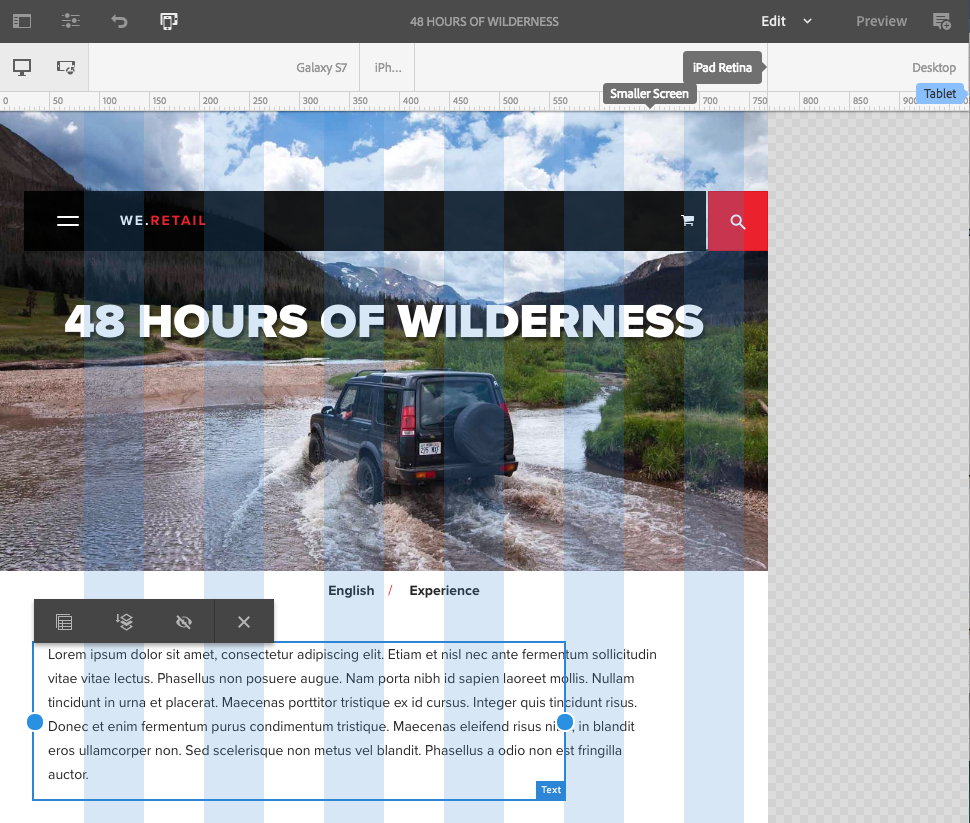

# Layout reattivo{#responsive-layout}

AEM consente di disporre di un layout dinamico per le pagine utilizzando **Contenitore di layout** componente.

Questo fornisce un sistema paragrafo che consente di posizionare i componenti all’interno di una griglia reattiva. Questa griglia può ridisporre il layout in base alle dimensioni e al formato del dispositivo o della finestra. Il componente viene utilizzato insieme al [**Layout** modalità](/help/sites-authoring/responsive-layout.md#defining-layouts-layout-mode), che consente di creare e modificare il layout dinamico a seconda del dispositivo.

Il contenitore layout:

* Consente di eseguire l’aggancio orizzontale alla griglia, oltre alla possibilità di posizionare i componenti affiancati nella griglia e di definire quando devono essere compressi o ridisposti.
* Utilizza punti di interruzione predefiniti (ad esempio, per telefono, tablet e così via) per consentirti di definire il comportamento richiesto dei contenuti per i dispositivi e l’orientamento correlati.

   * Ad esempio, puoi personalizzare la dimensione del componente o specificare se può essere visualizzato su dispositivi specifici.

* Può essere nidificato per consentire il controllo delle colonne.

L’utente può quindi vedere come verrà eseguito il rendering del contenuto per dispositivi specifici utilizzando l’emulatore.

>[!CAUTION]
>
>Anche se il componente Contenitore di layout è disponibile nell’interfaccia classica, la sua funzionalità completa è disponibile e supportata solo nell’interfaccia touch.

AEM consente di realizzare il layout dinamico per le pagine utilizzando una combinazione di meccanismi:

* Componente [**Contenitore di layout**](#adding-a-layout-container-and-its-content-edit-mode)

  Questo componente è disponibile nel [browser componenti](/help/sites-authoring/author-environment-tools.md#components-browser) e fornisce un sistema paragrafo a griglia che consente di aggiungere e posizionare i componenti all’interno di una griglia reattiva. Può essere impostato anche come sistema paragrafo predefinito sulla tua pagina.

* [**Modalità Layout**](/help/sites-authoring/responsive-layout.md#defining-layouts-layout-mode)

  Una volta che il Contenitore di layout è collocato nella pagina, è possibile utilizzare la modalità di **Layout** per posizionare i contenuti all’interno della griglia dinamica.

* [**Emulatore**](#selecting-a-device-to-emulate)
Questo consente di creare e modificare siti web dinamici il cui layout si riorganizza in base alle dimensioni del dispositivo o della finestra, ridimensionando i componenti in modo interattivo. L’utente può quindi vedere come verrà eseguito il rendering del contenuto utilizzando l’emulatore.

Con questi meccanismi basati su una griglia dinamica è possibile:

* Utilizzare i punti di interruzione per definire layout di contenuto diversi in base alla larghezza del dispositivo (a seconda del tipo e dell’orientamento del dispositivo).
* Utilizzare questi stessi punti di interruzione e layout di contenuti per assicurare che il contenuto sia dinamico rispetto alle dimensioni della finestra del browser sul desktop.
* Utilizzare l’ancoraggio orizzontale sulla griglia per posizionarvi i componenti, ridimensionarli, definire quando dovrebbero venire compressi o ridisposti in modo da risultare affiancati o sovrapposti.
* Nascondere componenti per layout di dispositivo specifici.
* Gestire il controllo delle colonne.

A seconda del progetto, il Contenitore di layout può essere usato come il sistema paragrafo predefinito per le pagine o come componente disponibile per essere aggiunto alla pagina tramite il browser Componenti (o entrambi).

>[!NOTE]
>
>Adobe fornisce [Documentazione di GitHub](https://adobe-marketing-cloud.github.io/aem-responsivegrid/) del layout reattivo come riferimento che può essere dato agli sviluppatori front-end consentendo loro di utilizzare la griglia AEM al di fuori dell’AEM, ad esempio, quando si creano modelli statici di HTML per un futuro sito AEM.

>[!NOTE]
>
>L’uso dei meccanismi di cui sopra è abilitato mediante la configurazione del modello. Consulta [Configurazione del layout reattivo](/help/sites-administering/configuring-responsive-layout.md) per ulteriori informazioni.

## Definizioni di layout, emulazione del dispositivo e punti di interruzione {#layout-definitions-device-emulation-and-breakpoints}

Quando si crea il contenuto del sito web è importante assicurarsi che venga visualizzato in modo adatto al dispositivo utilizzato.

AEM consente di definire layout dipendenti dalla larghezza del dispositivo:

* L’emulatore consente di emulare questi layout su una serie di dispositivi. Oltre al tipo di dispositivo, anche l’orientamento impostato dall’opzione **Ruota dispositivo** può influenzare il punto di interruzione che viene selezionato quando cambia la larghezza.
* I punti di interruzione sono i punti che separano le definizioni di layout.

   * Essi definiscono a tutti gli effetti la larghezza massima (in pixel) di qualsiasi dispositivo che utilizza un layout specifico.
   * I punti di interruzione sono normalmente applicabili a una gamma di dispositivi, in base alla larghezza del relativo schermo.
   * La portata di un punto di interruzione si estende a sinistra fino al punto di interruzione successivo.
   * Non è possibile selezionare specificatamente un punto di interruzione: la selezione di un dispositivo e di un orientamento comporterà la selezione automatica del punto di interruzione adeguato.

Il dispositivo **Desktop** è privo di una larghezza specifica e fa riferimento al punto di interruzione predefinito (ovvero tutto quanto si trova oltre l’ultimo punto di interruzione configurato).

>[!NOTE]
>
>È teoricamente possibile definire punti di interruzione per ogni singolo dispositivo, ma questo rende decisamente più macchinose la definizione e la manutenzione dei layout.

Quando utilizzi l’emulatore, selezioni un dispositivo specifico per l’emulazione e la definizione del layout; verrà evidenziato anche il relativo punto di interruzione. Qualsiasi modifica apportata al layout sarà applicabile ad altri dispositivi a cui si applica il punto di interruzione, ovvero qualsiasi dispositivo posizionato a sinistra del marcatore del punto di interruzione attivo, ma prima del marcatore del punto di interruzione successivo.

Ad esempio, quando si seleziona il dispositivo **iPhone 6 Plus** (definito con una larghezza di 540 pixel) per l’emulazione e il layout, il punto di interruzione **Telefono** (definiti come 768 pixel). Qualsiasi modifica apportata al layout per **IPHONE 6** sarà applicabile ad altri dispositivi nell&#39;ambito del **Telefoni** punto di interruzione, ad esempio **IPHONE 5** (definiti come 320 pixel).

## Selezione di un dispositivo da emulare {#selecting-a-device-to-emulate}

1. Apri la pagina desiderata per la modifica. Ad esempio:

   `http://localhost:4502/editor.html/content/we-retail/us/en/experience.html`

1. Seleziona l’icona **Emulatore** sulla barra degli strumenti in alto:

   

1. Viene visualizzata la barra degli strumenti dell’emulatore.

   

   La barra degli strumenti dell’emulatore mostra le seguenti opzioni di layout aggiuntive:

   * **Ruota dispositivo** - Consente di ruotare l&#39;orientamento di un dispositivo da verticale a orizzontale e viceversa.

      

   * **Seleziona il dispositivo**: consente di definire un dispositivo specifico da emulare da un elenco (ved. il passaggio successivo).

     

1. Per selezionare un dispositivo specifico da emulare è possibile effettuare le seguenti operazioni:

   * Utilizza l’icona Seleziona dispositivo e scegli da un selettore a discesa.
   * Fai clic sull’indicatore del dispositivo nella barra degli strumenti dell’emulatore.

   

1. Una volta che un dispositivo specifico è stato selezionato è possibile:

   * Visualizzare il marcatore attivo per il dispositivo selezionato, ad esempio **iPad.**
   * Visualizzare il marcatore attivo per il [punto di interruzione](/help/sites-authoring/responsive-layout.md#layout-definitions-device-emulation-and-breakpoints) adeguato, ad esempio **Tablet**.

   

   * La linea punteggiata blu rappresenta *piegare* per il dispositivo selezionato (qui e **IPHONE 6**).

   

   * La piega può anche essere considerata l’interruzione di riga della pagina (da non confondere con i [punti di interruzione](/help/sites-authoring/responsive-layout.md#layout-definitions-device-emulation-and-breakpoints)) per il contenuto. Viene visualizzata per comodità, per mostrare quale parte del contenuto sarà visibile all’utente sul dispositivo prima di scorrere in basso.
   * La linea per la piega non verrà mostrata se l’altezza del dispositivo emulato è superiore alle dimensioni dello schermo.
   * La piega è indicata per comodità dell’autore e non viene visualizzata nella pagina pubblicata.

## Aggiunta di un contenitore di layout e del relativo contenuto (modalità di modifica) {#adding-a-layout-container-and-its-content-edit-mode}

Un **Contenitore di layout** è un sistema paragrafo che:

* Include altri componenti.
* Definisce il layout.
* Risponde alle modifiche.

>[!NOTE]
>
>Se non è già disponibile, il **Contenitore di layout** deve essere esplicitamente [attivato per un sistema paragrafo/pagina](/help/sites-administering/configuring-responsive-layout.md) (ad esempio utilizzando [**Progettazione** modalità](/help/sites-authoring/default-components-designmode.md)).

1. Il **Contenitore di layout** è disponibile come componente standard nel [browser componenti](/help/sites-authoring/author-environment-tools.md#components-browser). Da qui è possibile trascinarlo nella posizione desiderata sulla pagina, dopodiché verrà visualizzato il segnaposto **Trascina qui i componenti**.
1. È quindi possibile aggiungere componenti al Contenitore di layout. Questi componenti includeranno il contenuto vero e proprio:

   

## Selezione e intervento su un Contenitore di layout (modalità di modifica) {#selecting-and-taking-action-on-a-layout-container-edit-mode}

Come con altri componenti, puoi selezionare e quindi intervenire (opzioni Copia, Taglia, Elimina) su un Contenitore di layout (in modalità di **modifica**):

>[!CAUTION]
>
>Poiché un contenitore di layout è un sistema paragrafo, l’eliminazione del componente comporta l’eliminazione sia della griglia di layout che di tutti i componenti (e del relativo contenuto) presenti all’interno del contenitore.

1. Se si passa il puntatore del mouse o si seleziona il segnaposto della griglia, viene visualizzato il menu Azioni.

   

   È necessario selezionare l’opzione **Elemento padre**.

   

1. Se il componente layout è nidificato, seleziona la **Elemento padre** Questa opzione presenta una selezione a discesa che consente di selezionare il contenitore di layout nidificato o i relativi elementi principali.

   Quando passi il cursore del mouse sui nomi dei contenitori nel menu a discesa, i relativi profili vengono visualizzati nella pagina.

   * Il contenitore di layout nidificato più basso verrà evidenziato in nero.
   * Il contenitore di layout nidificato immediatamente successivo è in grigio scuro.
   * Ogni contenitore successivo viene visualizzato in una tonalità di grigio più chiara.

   

1. In questo modo viene messa evidenziata l’intera griglia con il relativo contenuto. Viene visualizzata la barra degli strumenti delle azioni, da cui è possibile selezionare un’azione, ad esempio **Elimina.**

   

## Definire un layout (modalità Layout) {#defining-layouts-layout-mode}

>[!NOTE]
>
>È possibile definire un layout distinto per ogni [punto di interruzione](#layout-definitions-device-emulation-and-breakpoints) (come determinato dal tipo di dispositivo e dall’orientamento emulati).

Per configurare il layout di una griglia dinamica implementato con il contenitore di layout è necessario utilizzare la modalità **Layout**.

La modalità **Layout** può essere avviata in due modi.

* Utilizzando il menu [modalità nella barra degli strumenti](/help/sites-authoring/author-environment-tools.md#page-modes) e selezionando la modalità **Layout**

   * Seleziona la modalità **Layout** esattamente come si fa per passare alla modalità **Modifica** o **Impostazione destinazione**.
   * La modalità **Layout** rimane persistente; si esce dalla modalità **Layout** solo quando si seleziona un’altra modalità mediante il selettore di modalità.

* Quando [modifica di un singolo componente.](/help/sites-authoring/editing-content.md#edit-component-layout)

   * Utilizzando l’opzione **Layout** nel menu azione rapida del componente, puoi passare alla modalità **Layout**.
   * La modalità **Layout** persiste quando si modifica il componente e torna alla modalità **Modifica** quando è attivo un altro componente.

In modalità layout è possibile eseguire varie azioni su una griglia:

* Ridimensiona i componenti di contenuto utilizzando i punti blu. Il ridimensionamento viene sempre eseguito con la funzione Aggancia alla griglia. Durante il ridimensionamento, viene visualizzata la griglia di sfondo per facilitare l’allineamento:

  

  >[!NOTE]
  >
  >Proporzioni e rapporti relativi saranno mantenuti al ridimensionamento di componenti come le **immagini**.

* Facendo clic su un componente di contenuto, la barra degli strumenti consente di:

   * **Elemento padre**

     Consente di selezionare l’intero componente Contenitore di layout per intervenire su di esso nel complesso.

   * **Mobile in nuova riga**

     Il componente verrà spostato su una nuova riga, a seconda dello spazio disponibile all’interno della griglia.

   * **Nascondi componente**

     Il componente verrà reso invisibile (può essere ripristinato dalla barra degli strumenti del Contenitore di layout).

  

* In entrata **Layout** modalità di accesso è possibile fare clic su **Trascina qui i componenti** per selezionare l&#39;intero componente. Verrà visualizzata la barra degli strumenti per questa modalità.

  La barra degli strumenti presenta opzioni diverse a seconda dello stato del componente layout e dei componenti ad esso appartenenti. Esempio:

   * **Elemento padre:** consente di selezionare il componente principale.

     

   * **Mostra componenti nascosti** - Mostra tutti i componenti o singoli componenti. Il numero indica quanti componenti nascosti sono attualmente presenti. Il contatore indica quanti componenti sono nascosti.

     

   * **Ripristina layout punto di interruzione**: ripristina il layout predefinito. Ciò significa che non verrà imposto alcun layout personalizzato.

     

   * **Mobile in nuova riga:** consente di alzare il componente di una posizione, se lo spazio è sufficiente.

     

   * **Nascondi componente:** consente di nascondere il componente corrente.

     

     >[!NOTE]
     >
     >Nell’esempio in alto le azioni Mobile e Nascondi sono disponibili, perché questo Contenitore di layout è nidificato all’interno di un Contenitore di layout principale.

   * **Mostra componenti**
Seleziona i componenti principali per visualizzare la barra degli strumenti delle azioni con l’opzione **Mostra componenti nascosti**. In questo esempio, due componenti sono nascosti.

     

  Selezionando l’opzione **Mostra componenti nascosti**, i componenti che sono attualmente nascosti nelle posizioni originali vengono visualizzati in blu.

  

  Selezionando **Ripristina tutto**, tutti i componenti nascosti diventano visibili.
