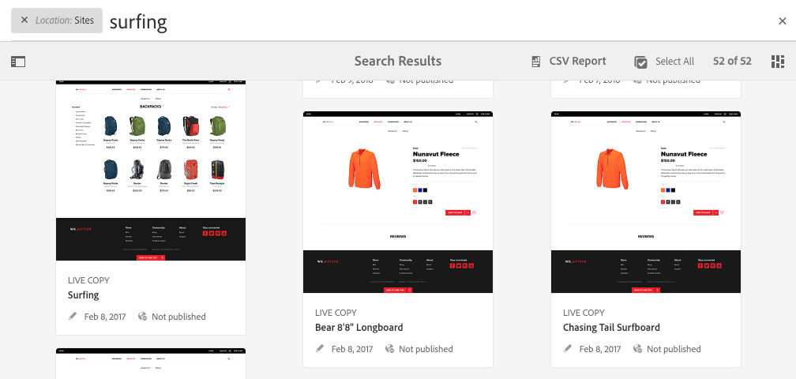
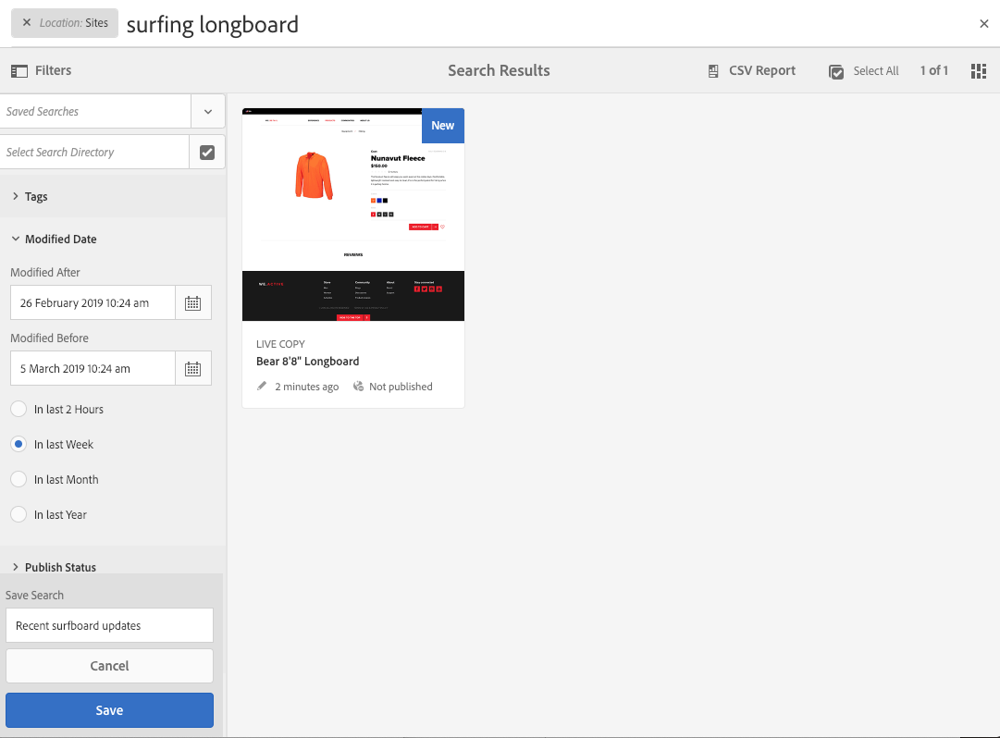
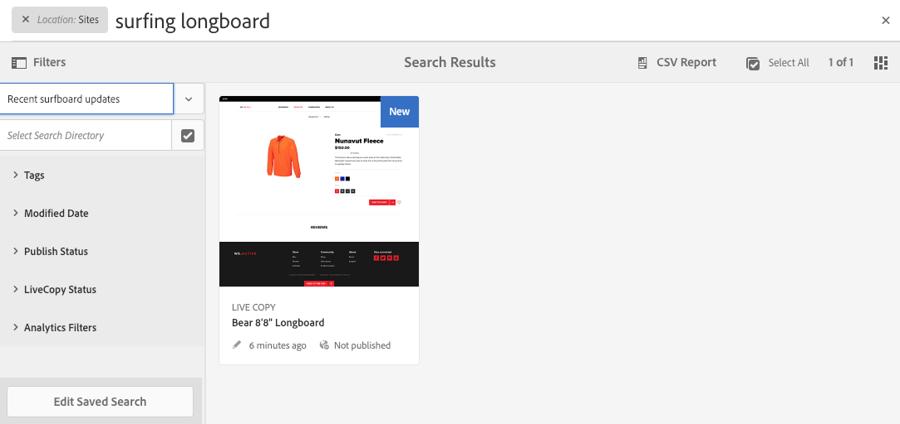

# Ricerca{#searching}

L’ambiente di authoring di AEM offre vari metodi per la ricerca dei contenuti, a seconda del tipo di risorsa.

>[!NOTE]
>
>Al di fuori dell’ambiente di authoring sono disponibili anche altri meccanismi per la ricerca, come [Query Builder](/help/sites-developing/querybuilder-api.md) e [CRXDE Lite](/help/sites-developing/developing-with-crxde-lite.md).

## Informazioni di base sulla ricerca {#search-basics}

La funzione Ricerca è disponibile nella barra degli strumenti superiore:

La barra di ricerca consente di effettuare le seguenti operazioni:

* Cercare una parola chiave, un percorso o un tag specifico.
* Filtrare in base a criteri specifici per le risorse come date di modifica, stato della pagina, dimensione del file e così via
* Definire e utilizzare una [ricerca salvata](#saved-searches) in base ai criteri impostati.

>[!NOTE]
>
>La ricerca può anche essere avviata mediante il tasto di scelta rapida `/` (barra) ogni volta che la barra di ricerca è visibile.

## Ricerca e filtro {#search-and-filter}

Per cercare e filtrare le risorse:

1. Apri **Ricerca** (con la lente di ingrandimento nella barra degli strumenti) e inserisci il termine da cercare. Vengono visualizzati dei suggerimenti che possono essere selezionati:

   

   Per impostazione predefinita, i risultati della ricerca sono limitati alla posizione corrente (ovvero alla console e al tipo di risorsa corrispondente):

   

1. Se necessario, è possibile rimuovere il filtro posizione (selezionare **X** sul filtro da rimuovere) per eseguire ricerche in tutte le console o i tipi di risorse.
1. I risultati verranno visualizzati, raggruppati in base alla console e al tipo di risorsa corrispondente.

   Puoi selezionare una risorsa specifica (sulla quale eseguire ulteriori azioni) oppure approfondire la ricerca selezionando il tipo di risorsa richiesto, ad esempio **Visualizza tutti i siti**:

   

1. Per approfondire la ricerca, seleziona il simbolo della barra laterale (in alto a sinistra) per aprire il pannello laterale **Filtri e opzioni**.

   

   A seconda del tipo di risorsa, in Ricerca viene visualizzata una selezione predefinita di criteri di ricerca/filtro.

   Il pannello laterale consente di selezionare:

   * Ricerche salvate
   * Directory di ricerca
   * Tag
   * Criteri di ricerca; ad esempio Data di modifica, Stato pubblicazione, Stato LiveCopy.

   >[!NOTE]
   >
   >I criteri di ricerca possono variare:
   >
   >
   >
   >    * A seconda del tipo di risorsa selezionato; ad esempio, i criteri di Assets and Communities sono comprensibilmente specializzati.
   >    * La tua istanza come [Ricerca Forms](/help/sites-administering/search-forms.md) può essere personalizzato (in base alla posizione all’interno di AEM).

   

1. Puoi anche aggiungere altri termini di ricerca:

   

1. Per chiudere la **Ricerca**, utilizza la **X** in alto a destra.

>[!NOTE]
>
>I criteri di ricerca vengono mantenuti quando si seleziona un elemento nei risultati della ricerca.
>
>Quando selezioni un elemento nella pagina dei risultati, e quindi torni alla pagina di ricerca dopo avere utilizzato il pulsante indietro del browser, i criteri di ricerca rimangono.

## Ricerche salvate {#saved-searches}

Oltre a eseguire ricerche per una vasta gamma di facet, è possibile salvare una particolare configurazione di ricerca da recuperare e utilizzare in un secondo momento:

1. Definisci i criteri di ricerca e seleziona **Salva**.

   

1. Assegna un nome e seleziona **Salva** per confermare:

   

1. La ricerca salvata sarà disponibile nel selettore alla successiva apertura del pannello di ricerca:

   

1. Una volta salvato, puoi:

   * Utilizzo **x** (rispetto al nome della ricerca salvata) per avviare una nuova query (la ricerca salvata non verrà eliminata).
   * **Modifica ricerca salvata**, modifica le condizioni di ricerca, quindi **Salva** di nuovo.

Per modificare le ricerche salvate, seleziona una ricerca e fai clic sull’opzione **Modifica ricerca salvata** nella parte inferiore del pannello di ricerca.

