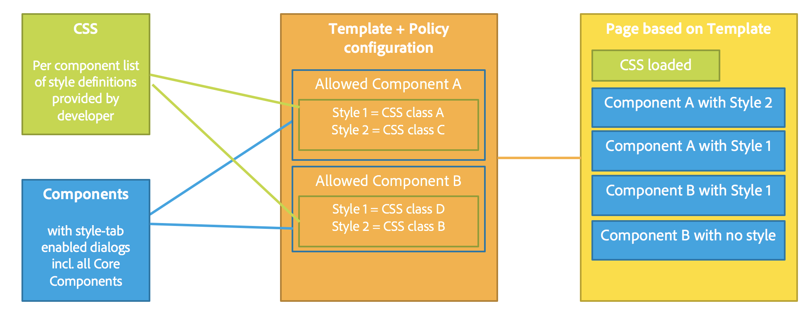

# Sistema di stili{#style-system}

Il sistema di stili consente all’autore del modello di definire le classi di stile nel criterio del contenuto di un componente, in modo che un autore di contenuti possa sceglierli quando modifica un componente in una pagina. Gli stili possono essere varianti visive alternative di un componente, per renderlo più flessibile.

In questo modo si elimina la necessità di creare un componente personalizzato per ogni stile o di personalizzare la finestra di dialogo del componente per attivare questa funzionalità. Il risultato sono componenti che possono essere riutilizzati più rapidamente e adattati in modo semplice e veloce alle esigenze degli autori di contenuti, senza ricorrere allo sviluppo back-end in AEM.

## Caso d’uso {#use-case}

Gli autori di modelli non solo hanno bisogno della possibilità di configurare il funzionamento dei componenti per gli autori di contenuti, ma devono anche poter configurare una serie di varianti visive alternative di un componente.

Allo stesso modo, gli autori di contenuti non solo devono poter strutturare e organizzare i contenuti, ma anche selezionare come presentarlo visivamente.

Il sistema di stili offre una soluzione unificata alle esigenze degli autori di modelli e di contenuti:

* Gli autori di modelli possono definire le classi di stile nel criterio dei contenuti dei componenti.
* Gli autori di contenuti possono quindi selezionare tali classi da un menu a discesa quando modificano il componente su una pagina, per applicarvi gli stili corrispondenti.

La classe di stile viene quindi inserita nell’elemento wrapper decorativo del componente, in modo che lo sviluppatore di componenti non debba preoccuparsi della gestione degli stili una volta fornite le regole CSS.

## Panoramica {#overview}

L’uso del sistema di stili generalmente assume la forma seguente.

1. Il web designer crea diverse varianti grafiche di un componente.

1. Allo sviluppatore HTML viene fornito l’output HTML dei componenti e le varianti visive desiderate da implementare.

1. Lo sviluppatore HTML definisce le classi CSS che corrispondono a ogni variazione visiva e che devono essere inserite nell&#39;elemento che racchiude i componenti.

1. Lo sviluppatore HTML implementa il codice CSS corrispondente (e facoltativamente il codice JS) per ciascuna delle variazioni visive in modo che siano definite.

1. Lo sviluppatore AEM inserisce il CSS fornito (e l’eventuale JS) in una [Libreria client](/help/sites-developing/clientlibs.md) e la distribuisce.

1. Lo sviluppatore o l’autore di modelli AEM configura i modelli di pagina e modifica il criterio di ciascun componente con stile, aggiungendo le classi CSS definite, fornendo nomi di facile utilizzo a ogni stile e indicando quali stili possono essere combinati.

1. L’autore della pagina AEM può quindi scegliere gli stili progettati nell’editor di pagine tramite il menu degli stili, nella barra degli strumenti del componente.

Solo gli ultimi tre passaggi vengono effettivamente effettuati in AEM. Tutte le operazioni di sviluppo CSS e Javascript necessarie possono essere eseguite senza AEM.

L’implementazione degli stili richiede infatti solo la distribuzione in AEM e la selezione all’interno dei componenti dei modelli desiderati.

Il diagramma seguente illustra l’architettura del sistema di stili.

## Utilizzo {#use}

Per dimostrare questa funzione, è necessario creare degli stili per un componente. Per esplorare le funzionalità della funzione di stili, utilizza l’implementazione di [We.Retail](/help/sites-developing/we-retail.md) dell’[elenco dei componenti](https://helpx.adobe.com/experience-manager/core-components/using/list.html) principali come base e installa il pacchetto allegato che contiene gli stili.

Download del pacchetto dimostrativo [del sistema di stile](assets/package_-_style_systemdemo.zip)

>[!NOTE]
>
>Il pacchetto dimostrativo ha unicamente lo scopo di illustrare il modo in cui il sistema di stili può essere utilizzato dagli autori; non deve essere considerato come riferimento di implementazione ottimale.
>
>Questo pacchetto sarà necessario solo finché We.Retail non fornirà un esempio integrato e un’implementazione da usare come best practice.

Le sezioni seguenti, [Autore di contenuti](/help/sites-authoring/style-system.md#as-a-content-author) e [Autore di modelli](/help/sites-authoring/style-system.md#as-a-template-author) descrivono come verificare la funzionalità del sistema di stili utilizzando il pacchetto dimostrativo del sistema di stili con We.Retail.

Se desideri utilizzare il sistema di stili per i tuoi componenti, effettua le seguenti operazioni:

1. Installa il CSS come librerie client come illustrato nella sezione [Panoramica](/help/sites-authoring/style-system.md#overview).
1. Configura le classi CSS da rendere disponibili agli autori di contenuti come descritto nella sezione [Autore di modelli](/help/sites-authoring/style-system.md#as-a-template-author).
1. Gli autori di contenuti possono quindi utilizzare gli stili come descritto nella sezione [Autori di contenuti](/help/sites-authoring/style-system.md#as-a-content-author).

### Autori di contenuti {#as-a-content-author}

1. After installing the style system demo package, navigate to We.Retail&#39;s English language master home page at `http://localhost:4502/sites.html/content/we-retail/language-masters/en` and edit the page.
1. Seleziona il componente **Elenco** in fondo o in alto nel parsys. Do not confuse it with the **Articles List** component.

   

1. Tocca o fai clic sul pulsante **Stili** nella barra degli strumenti del componente **Elenco** per aprire il menu degli stili e modificare l’aspetto del componente.

   

   >[!NOTE]
   >
   >In this example, the **Layout** styles (**Block** and **Grid**) are mutually exclusive, while the **Display** options (**Image** or **Date**) can be combined. Questo può essere [configurato nel modello dall’autore dei modelli](/help/sites-authoring/style-system.md#as-a-template-author).

### Autori di modelli {#as-a-template-author}

1. While editing We.Retail&#39;s English language master home page at `http://localhost:4502/sites.html/content/we-retail/language-masters/en`, edit the template of the page via **Page Information -> Edit Template**.

   

1. Modifica il criterio del componente **Elenco** toccando o facendo clic sul pulsante **Criterio** del componente. Attenzione a non confonderlo con il componente **Elenco articoli**.

   

1. Nella scheda Stili delle proprietà puoi vedere come sono stati configurati gli stili.

   

   * **Nome gruppo:** gli stili possono essere raggruppati all’interno del menu stile che l’autore del contenuto visualizza durante la configurazione dello stile del componente.
   * **Gli stili possono essere combinati:** consente di selezionare diversi stili all’interno del gruppo in una sola volta.
   * **Nome stile:** descrizione dello stile che verrà visualizzata dall’autore del contenuto durante la configurazione dello stile del componente.
   * **Classi CSS:** nome effettivo della classe CSS associata allo stile.
   Utilizza le maniglie di trascinamento per definire l’ordine dei gruppi e degli stili all’interno dei gruppi. Utilizza le icone Aggiungi o Elimina per aggiungere o rimuovere gruppi o stili all’interno dei gruppi.

>[!CAUTION]
>
>The CSS classes (as well as any necessary Javascript) configured as style properties of a component&#39;s policy must be deployed as [Client Libraries](/help/sites-developing/clientlibs.md) in order to work.

## Configurazione {#setup}

>[!NOTE]
>
>La versione 2 dei componenti di base è completamente abilitata a sfruttare il sistema di stili e non richiede configurazioni aggiuntive.
>
>Segui i passaggi successivi per abilitare i tuoi componenti personalizzati nel sistema di stili o per estendere l’uso della funzione ai componenti di base della versione 1.

Affinché un componente possa funzionare con il sistema di stili di AEM e visualizzare la scheda Stili nella finestra di dialogo di progettazione, lo sviluppatore del componente deve includere la scheda del prodotto con le seguenti impostazioni sul componente:

* `path = "/mnt/overlay/cq/gui/components/authoring/dialog/style/tab_design/styletab"`
* `sling:resourceType = "granite/ui/components/coral/foundation/include"`

Con il componente configurato, gli stili configurati dall’autore della pagina vengono automaticamente inseriti da AEM sull’elemento decorativo in cui AEM racchiude in automatico ciascun componente modificabile. Il componente in sé non deve fare altro affinché questo accada.

### Stili con nomi di elementi {#styles-with-element-names}

Uno sviluppatore può anche configurare un elenco di nomi di elementi consentiti per gli stili sul componente con la proprietà string array `cq:styleElements`. Quindi, nella scheda Stili del criterio nella finestra di dialogo della progettazione, l’autore del modello può anche scegliere un nome di elemento da impostare per ogni stile. In questo modo verrà impostato il nome dell’elemento wrapper.

This property is set on the `cq:Component` node. Esempio:

* `/apps/weretail/components/content/list@cq:styleElements=[div,section,span]`

>[!CAUTION]
>
>Evita di definire i nomi di elementi per stili che possono essere combinati. Quando sono definiti più nomi di elementi, l’ordine di priorità è:
>
>1. HTL ha la precedenza su tutto: `data-sly-resource="${'path/to/resource' @ decorationTagName='span'}`
>1. Poi, tra più stili attivi, viene preso il primo nell’elenco degli stili configurati nel criterio del componente.
>1. Finally, the component&#39;s `cq:htmlTag`/ `cq:tagName` will be considered as a fallback value.
>

Questa capacità di definire i nomi degli stili è utile per i componenti molto generici, come il Contenitore di layout o il componente Frammento di contenuto, al fine di attribuire un significato aggiuntivo.

For instance it allows a Layout Container to be given semantics like `<main>`, `<aside>`, `<nav>`, etc.
