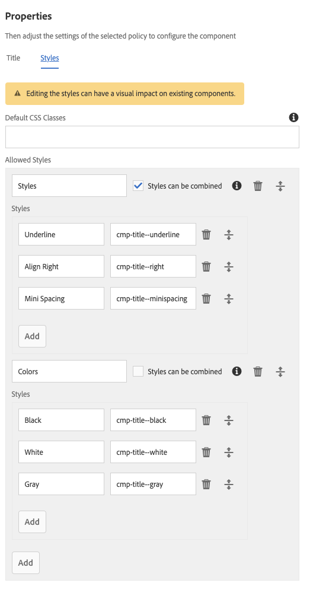

# Sistema di stili{#style-system}

Il sistema di stili consente all’autore del modello di definire le classi di stile nel criterio del contenuto di un componente, in modo che un autore di contenuti possa sceglierli quando modifica un componente in una pagina. Gli stili possono essere varianti visive alternative di un componente, allo scopo di renderlo più flessibile.

In questo modo si elimina la necessità di sviluppare un componente personalizzato per ogni stile o di personalizzare la finestra di dialogo del componente per abilitare tale funzionalità di stile. Il risultato sono componenti riutilizzabili che possono essere adattati in modo rapido e semplice alle esigenze degli autori di contenuti, senza necessità di alcuno sviluppo back-end di AEM.

## Caso d’uso  {#use-case}

Gli autori di modelli devono poter configurare non solo il funzionamento dei componenti per gli autori di contenuto, ma anche diverse varianti visive alternative di un componente.

Allo stesso modo, gli autori dei contenuti non solo devono poter strutturare e organizzare i contenuti, ma anche selezionare come presentarli visivamente.

Il sistema di stili offre una soluzione unificata alle esigenze degli autori di modelli e di contenuti:

* Gli autori dei modelli possono definire le classi di stile nel criterio del contenuto dei componenti.
* Gli autori dei contenuti possono quindi selezionare queste classi da un elenco a discesa quando modificano il componente in una pagina per applicare gli stili corrispondenti.

La classe di stile viene quindi inserita nell’elemento wrapper di decorazione del componente, in modo che lo sviluppatore del componente non debba preoccuparsi di gestire gli stili oltre a fornire le relative regole CSS.

## Panoramica {#overview}

La procedura per l’uso del sistema di stili è simile alla seguente.

1. Il web designer crea diverse varianti grafiche di un componente.

1. Allo sviluppatore HTML viene fornito l’output HTML dei componenti e le varianti visive desiderate da implementare.

1. Lo sviluppatore HTML definisce le classi CSS corrispondenti a ciascuna variante visiva da inserire nell’elemento che racchiude i componenti.

1. Lo sviluppatore HTML implementa il codice CSS (ed eventualmente il codice JS) corrispondente per ciascuna delle varianti visive in modo che risultino definite.

1. Lo sviluppatore AEM inserisce il CSS fornito (e l’eventuale JS) in una [Libreria client](/help/sites-developing/clientlibs.md) e la distribuisce.

1. Lo sviluppatore AEM o l’autore di modelli configura i modelli di pagina e modifica il criterio di ciascun componente con stili, aggiungendo le classi CSS definite, assegnando nomi descrittivi a ogni stile e indicando quali stili possono essere combinati.

1. L’autore della pagina AEM può quindi scegliere gli stili progettati nell’editor di pagine tramite il menu degli stili, nella barra degli strumenti del componente.

Solo gli ultimi tre passaggi vengono effettivamente eseguiti in AEM. Ciò significa che tutte le operazioni di sviluppo dei CSS e JavaScript necessari possono essere eseguite senza AEM.

L’implementazione degli stili richiede infatti solo la distribuzione in AEM e la selezione all’interno dei componenti dei modelli desiderati.

Il diagramma seguente illustra l’architettura del sistema di stili.

## Utilizzare {#use}

Per illustrare questa funzione, come esempio verrà utilizzata l’implementazione [WKND](https://experienceleague.adobe.com/docs/experience-manager-learn/getting-started-wknd-tutorial-develop/overview.html?lang=it) del [componente titolo](https://www.adobe.com/go/aem_cmp_title_v2_it) del componente core.

Le sezioni seguenti, [Autore di contenuti](#as-a-content-author) e [Autore di modelli](#as-a-template-author) descrivono come verificare la funzionalità del sistema di stili utilizzando il sistema di stili di WKND.

Se desideri utilizzare il sistema di stili per i tuoi componenti, effettua le seguenti operazioni:

1. Installa il CSS come librerie client, come descritto nella sezione [Panoramica](#overview).
1. Configura le classi CSS da rendere disponibili agli autori di contenuti, come descritto nella sezione [Autore di modelli](#as-a-template-author).
1. Gli autori di contenuti possono quindi utilizzare gli stili come descritto nella sezione [Autore di contenuti](#as-a-content-author).

### Autore di contenuti  {#as-a-content-author}

1. Dopo aver installato il progetto WKND, visita la pagina principale in lingua inglese di WKND all’indirizzo `http://<host>:<port>/sites.html/content/wknd/language-masters/en` e modifica la pagina.
1. Seleziona un componente **Titolo** più in basso nella pagina.

   

1. Fai clic su **Stili** sulla barra degli strumenti del **Elenco** per aprire il menu degli stili e modificare l&#39;aspetto del componente.

   

   >[!NOTE]
   >
   >In questo esempio, gli stili **Colori** (**Nero**, **Bianco** e **Grigio**) si escludono a vicenda, mentre le opzioni di **Stile** (**Sottolineato**, **Allinea a destra** e **Spaziatura minima**) possono essere combinate. Tutto questo può essere [configurato nel modello se si è l’autore del modello](#as-a-template-author).

### Autore di modelli  {#as-a-template-author}

1. Durante la modifica della pagina mastro in lingua inglese di WKND all’indirizzo `http://<host>:<port>/sites.html/content/wknd/language-masters/en`, modifica il modello della pagina tramite **Informazioni pagina > Modifica modello**.

   

1. Modifica il criterio del componente **Titolo** toccando o facendo clic sul pulsante **Criterio** del componente.

   

1. Nella scheda Stili delle proprietà puoi vedere come sono stati configurati gli stili.

   

   * **Nome gruppo:** gli stili possono essere raggruppati nel menu di stile, che verrà visualizzato dall’autore del contenuto durante la configurazione dello stile del componente.
   * **Combinazione degli stili:** consente di selezionare più stili in contemporanea all’interno del gruppo.
   * **Nome stile:** la descrizione dello stile che verrà visualizzata dall’autore del contenuto durante la configurazione dello stile del componente.
   * **Classi CSS:** il nome effettivo della classe CSS associata allo stile.

   Utilizza le maniglie di trascinamento per definire l’ordine dei gruppi e gli stili all’interno dei gruppi. Utilizza le icone Aggiungi o Elimina per aggiungere o rimuovere gruppi o stili all’interno dei gruppi.

>[!CAUTION]
>
>Le classi CSS (e l’eventuale JavaScript necessario) configurate come proprietà di stile di un criterio di un componente devono essere distribuite come [Librerie client](/help/sites-developing/clientlibs.md) al lavoro.

## Configurazione {#setup}

I componenti core versione 2 e successive sono già configurati in modo da sfruttare il sistema di stili e non richiedono alcuna configurazione aggiuntiva.

I passaggi seguenti sono necessari solo per abilitare il sistema di stile per i componenti personalizzati o per [abilitare la scheda Stili opzionale nella finestra di dialogo Modifica](#enable-styles-tab-edit).

### Abilitare la scheda Stili nella finestra di dialogo di progettazione {#enable-styles-tab-design}

Affinché un componente possa funzionare con il sistema di stili di AEM e visualizzare la scheda Stili nella finestra di dialogo di progettazione, lo sviluppatore del componente deve includere tale scheda con le seguenti impostazioni sul componente:

* `path = "/mnt/overlay/cq/gui/components/authoring/dialog/style/tab_design/styletab"`
* `sling:resourceType = "granite/ui/components/coral/foundation/include"`

Con il componente configurato, gli stili configurati dagli autori della pagina verranno automaticamente inseriti dall’AEM sull’elemento decorativo che l’AEM racchiude automaticamente in ogni componente modificabile. Il componente in sé non deve fare altro affinché questo accada.

### Abilitare la scheda Stili nella finestra di dialogo Modifica {#enable-styles-tab-edit}

A partire dalla versione 6.5.3.0 dell’AEM è ora disponibile una scheda Stili opzionale nella finestra di dialogo Modifica. A differenza della scheda della finestra di progettazione, la scheda presente nella finestra di dialogo Modifica non è essenziale per il funzionamento del sistema di stili, ma offre all’autore di contenuti un’interfaccia alternativa opzionale per l’impostazione degli stili.

La scheda della finestra di dialogo Modifica può essere inclusa in modo analogo a quella della finestra di dialogo di progettazione:

* `path = "/mnt/overlay/cq/gui/components/authoring/dialog/style/tab_edit/styletab"`
* `sling:resourceType = "granite/ui/components/coral/foundation/include"`

>[!NOTE]
>
>Per impostazione predefinita, la scheda Stili nella finestra di dialogo Modifica non è abilitata.

### Stili con nomi di elementi  {#styles-with-element-names}

Uno sviluppatore può anche configurare un elenco di nomi di elementi consentiti per gli stili sul componente con la proprietà string array `cq:styleElements`. Quindi, nella scheda Stili del criterio all’interno della finestra di dialogo per progettazione, l’autore del modello può anche scegliere un nome di elemento da impostare per ogni stile. In questo modo verrà impostato il nome dell’elemento wrapper.

Questa proprietà è impostata sul nodo `cq:Component`. Esempio:

* `/apps/<yoursite>/components/content/list@cq:styleElements=[div,section,span]`

>[!CAUTION]
>
>Evita di definire i nomi di elementi per gli stili che possono essere combinati. Quando sono definiti più nomi di elementi, l’ordine di priorità è:
>
>1. HTL ha la precedenza su tutto: `data-sly-resource="${'path/to/resource' @ decorationTagName='span'}`
>1. Poi, tra più stili attivi, viene considerato il primo nell’elenco degli stili configurati nel criterio del componente.
>1. Infine, il `cq:tagName`/ `cq:htmlTag` del componente sarà considerato un valore di fallback.
>

Questa capacità di definire i nomi degli stili è utile per i componenti molto generici, come Contenitore di layout, o il componente Frammento di contenuto, per attribuire loro un significato aggiuntivo.

Ad esempio, consente di attribuire a un Contenitore di layout semantiche come `<main>`, `<aside>`, `<nav>`e così via.
