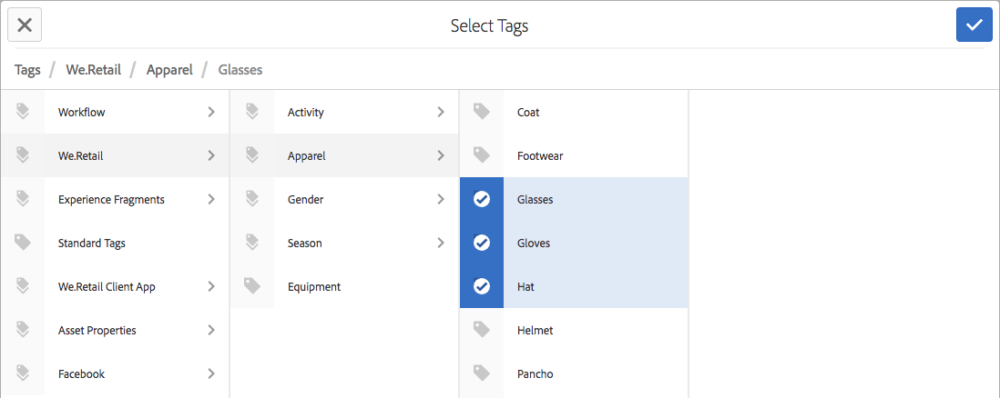

# Utilizzo dei tag{#using-tags}

I tag sono un metodo semplice e veloce per classificare i contenuti di un sito web. I tag possono essere paragonati a parole chiave o etichette assegnate a una pagina, una risorsa o ad altro contenuto per consentire la ricerca di contenuti specifici e correlati.

* See [Administering Tags](/help/sites-administering/tags.md) for information about creating and managing tags, as well as to which content tags have been applied.
* See [Tagging for Developers](/help/sites-developing/tags.md) for information about the tagging framework as well as including and extending tags in custom applications.

## Dieci motivi per utilizzare i tag {#ten-reasons-to-use-tagging}

1. **Organizzazione dei contenuti** - L’assegnazione di tag semplifica l’attività degli autori che possono organizzare rapidamente i contenuti con pochi sforzi.
1. **Organizzazione dei tag** - Mentre i tag organizzano il contenuto, le tassonomie gerarchiche/spazi dei nomi organizzano i tag.
1. **Tag** profondamente organizzati: grazie alla possibilità di creare tag e tag secondari, è possibile esprimere tutti i sistemi tassonomici, che comprendono termini, termini secondari e le loro relazioni. Questo permette di creare una seconda (o terza) gerarchia di contenuti parallela a quella ufficiale.
1. **Assegnazione tag** controllata: per controllare i tag è possibile applicare autorizzazioni a tag e/o spazi di nomi per controllare la creazione e l’applicazione dei tag.
1. **Assegnazione di tag** flessibile: i tag hanno molti nomi e volti: tag, termini tassonomici, categorie, etichette e molto altro. Sono flessibili dal punto di vista di modello di contenuto e modalità di utilizzo. Possono essere ad esempio utilizzati per sintetizzare le caratteristiche demografiche del target, suddividere in categorie e classificare i contenuti o creare una gerarchia di contenuti secondaria.
1. **Ricerca** migliorata - Il componente di ricerca predefinito in AEM include in genere tag creati e tag applicati ai quali è possibile applicare dei filtri per limitare i risultati a quelli rilevanti.
1. **Abilitazione** SEO: i tag applicati come proprietà della pagina vengono visualizzati automaticamente nei metatag della pagina, rendendola visibile ai motori di ricerca.
1. **Semplice Sofisticazione** : i tag possono essere creati semplicemente da una parola e con il tocco di un pulsante. In seguito, è possibile aggiungere un titolo, una descrizione ed etichette illimitate per fornire ulteriore semantica al tag.
1. **Coerenza** di base: il sistema di tag è un componente fondamentale di AEM e viene utilizzato da tutte le funzionalità di AEM per classificare i contenuti. Inoltre, l’API di tagging è disponibile agli sviluppatori per creare applicazioni abilitate ai tag con accesso alle stesse tassonomie.
1. **Combinazione struttura e flessibilità** : AEM è ideale per l’utilizzo di informazioni strutturate, a causa della nidificazione di pagine e percorsi. È molto efficace anche per la gestione delle informazioni non strutturate, grazie alla funzione integrata di ricerca testuale. L’assegnazione di tag offre i vantaggi delle struttura e della flessibilità.

Quando progetti la struttura dei contenuti di un sito e lo schema di metadati per le risorse, considera l’approccio leggero e accessibile fornito dai tag.

## Applicazione dei tag {#applying-tags}

In the author environment, authors may apply tags by accessing the page properties and entering one or more tags in the **Tags/Keywords** field.

To apply [pre-defined tags](/help/sites-administering/tags.md), in the **Page Properties** window use the **Tags** field and the **Select Tags** window. The **Standard Tags** tab is the default namespace, which means there is no `namespace-string:` prefixed to the taxonomy.

### Pubblicazione dei tag {#publishing-tags}

Come avviene per le pagine, su tag e namespace è possibile effettuare le operazioni descritte di seguito.

**Attiva**

* Consente di attivare singoli tag.

   Come per le pagine, i nuovi tag creati devono essere attivati per poter essere disponibili nell’ambiente di pubblicazione.

>[!NOTE]
>
>Quando si attiva una pagina, si apre automaticamente una finestra di dialogo che consente di attivare i tag non attivati appartenenti alla pagina.

**Disattiva**

* È possibile disattivare i tag selezionati.
