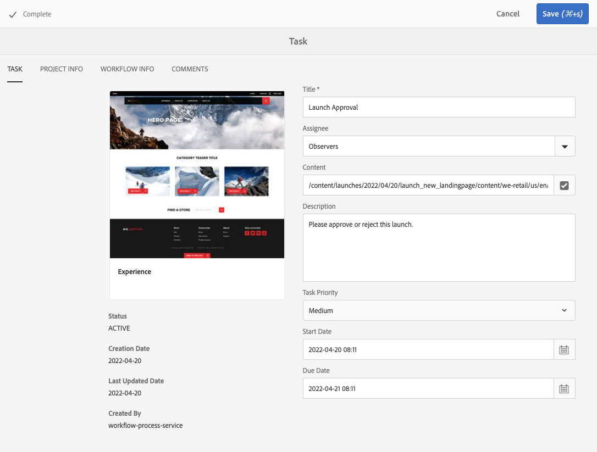

# Utilizzo delle attività {#working-with-tasks}

Le attività rappresentano elementi di lavoro da eseguire relativamente al contenuto. Quando ti viene assegnata un’attività, questa viene visualizzata nella casella in entrata del flusso di lavoro. Gli elementi attività possono essere distinti dagli elementi del flusso di lavoro in base al valore della colonna **Type**.

Le attività vengono utilizzate anche nei progetti per determinare il livello di completezza del progetto.

## Tracciamento dello stato di avanzamento del progetto {#tracking-project-progress}

Puoi tenere traccia dell’avanzamento del progetto osservando le attività completate/attive all’interno di un progetto, rappresentato dal riquadro **Attività**. L’avanzamento del progetto può essere determinato da:

* **Titolo attività:** L&#39;avanzamento generale del progetto è rappresentato nel riquadro attività, disponibile nella pagina dei dettagli del progetto.

* **Elenco attività:** Quando si fa clic sul riquadro attività, viene visualizzato un elenco di attività. L’elenco contiene informazioni dettagliate su tutte le attività correlate al progetto.

Entrambe le opzioni elencano le attività del flusso di lavoro e le attività create direttamente nel riquadro attività.

### Riquadro Attività {#task-tile}

Se un progetto include attività correlate, all’interno del progetto viene visualizzata una sezione attività. Il riquadro attività mostra lo stato corrente del progetto. Si basa sulle attività esistenti all’interno del flusso di lavoro e non include le attività che verranno generate in futuro al procedere del flusso di lavoro. Nel Riquadro attività sono visibili le seguenti informazioni:

* Percentuale di attività completate
* Percentuale di attività in corso
* Percentuale di attività in ritardo

### Visualizzazione o modifica delle attività in un progetto {#viewing-or-modifying-the-tasks-in-a-project}

Oltre a tenere traccia dell’avanzamento, è anche possibile visualizzare ulteriori informazioni sul progetto o modificarlo.

#### Elenco attività {#task-list}

Fai clic sul pulsante con i puntini di sospensione in basso a destra del riquadro attività per visualizzare la casella in entrata filtrata sulle attività correlate al progetto. I dettagli dell’attività vengono visualizzati insieme a metadati, quali la data di scadenza, l’assegnatario, la priorità e lo stato.

#### Dettagli attività {#task-details}

Per ulteriori informazioni su una particolare attività, nella casella in entrata fare clic sull&#39;attività per selezionarla, quindi fare clic su **Apri** nella barra degli strumenti.

Puoi visualizzare, modificare o aggiungere dettagli all’attività tramite schede diverse.

* **Attività** - Informazioni generali sull&#39;attività
* **Informazioni progetto** - Riepilogo del progetto a cui è associata l&#39;attività
* **Ino** flusso di lavoro - Riepilogo del flusso di lavoro a cui è associata l&#39;attività (se applicabile)
* **Commenti** - Commenti generali sull&#39;attività stessa

### Aggiunta di attività {#adding-tasks}

Puoi aggiungere nuove attività ai progetti. Queste attività vengono quindi visualizzate nel riquadro attività e sono disponibili nella casella in entrata delle notifiche, in modo da essere consapevoli delle attività in sospeso.

Per aggiungere un’attività:

1. Nel progetto, individua il riquadro **Attività**
1. Fai clic sulla freccia rivolta verso il basso in alto a destra del riquadro e seleziona **Crea attività**.
1. Nella finestra **Aggiungi attività**, fornisci i dettagli dell&#39;attività come priorità, assegnatario e data di scadenza.

   

1. Fai clic su **Invia**.

## Utilizzo delle attività nella casella in entrata {#working-with-tasks-in-the-inbox}

Invece di accedere alle attività del progetto dal progetto stesso, puoi accedervi direttamente dalla casella in entrata. La casella in entrata offre una panoramica delle attività in più progetti, per consentirti di comprendere l’intero flusso di lavoro.

Dalla casella in entrata è possibile aprire le attività e impostarne lo stato. Le attività vengono visualizzate anche nella casella in entrata quando sono assegnate a un gruppo utenti di cui fai parte. In questo caso, qualsiasi membro del gruppo può eseguire le operazioni necessarie e completare l’attività.

Per completare un&#39;attività, selezionarla e fare clic su **Completa** nella barra degli strumenti. Aggiungi informazioni all’attività e quindi fai clic su **Fine**. Per ulteriori informazioni, consulta [Casella in entrata](/help/sites-authoring/inbox.md).
