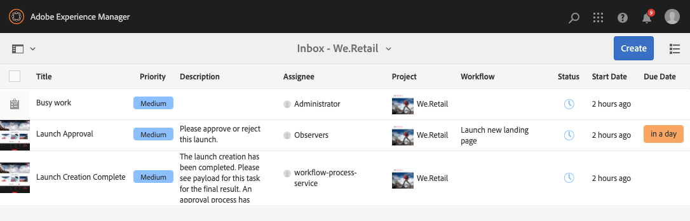

# Gestione dei progetti {#managing-projects}

In **Progetti** , accedi e gestisci i progetti.

Utilizzando la console, puoi creare un progetto, associare risorse al progetto ed eliminare anche un progetto o collegamenti di risorse.

## Requisiti di accesso {#access-requirements}

Progetta una funzione AEM standard e non richiede alcuna configurazione aggiuntiva.

Tuttavia, affinché gli utenti dei progetti possano vedere altri utenti/gruppi mentre utilizzano i progetti, ad esempio durante la creazione di progetti, la creazione di attività/flussi di lavoro o la visualizzazione e la gestione del team, è necessario che tali utenti abbiano accesso in lettura a `/home/users` e `/home/groups`.

Il modo più semplice per eseguire questa operazione è quello di **projects-users** accesso in lettura gruppo a `/home/users` e `/home/groups`.

## Creazione di un progetto {#creating-a-project}

Segui questi passaggi per creare un progetto.

1. In **Progetti** console, fai clic su **Crea** per aprire **Crea progetto** procedura guidata.
1. Seleziona un modello e fai clic su **Successivo**. Ulteriori informazioni sui modelli di progetto standard [qui.](/help/sites-authoring/projects.md#project-templates)

   

1. Definisci il **Titolo** e **Descrizione** e aggiungi **Miniatura** immagine, se necessario. Puoi anche aggiungere o eliminare utenti e il gruppo a cui appartengono.

   

1. Fai clic su **Crea**. Nella finestra di conferma ti viene richiesto se desideri aprire il nuovo progetto o tornare alla console.

La procedura per la creazione di un progetto è la stessa per tutti i modelli di progetto. La differenza tra i tipi di progetti si riferisce ai progetti disponibili [ruoli utente](/help/sites-authoring/projects.md) e [flussi di lavoro.](/help/sites-authoring/projects-with-workflows.md)

### Associazione delle risorse al progetto {#associating-resources-with-your-project}

I progetti consentono di raggruppare le risorse in un’unica entità per gestirle nel loro insieme. Pertanto devi associare le risorse al progetto. Queste risorse sono raggruppate nel progetto come **Riquadri**. I tipi di risorse che è possibile aggiungere sono descritti nella sezione [Riquadri progetto](/help/sites-authoring/projects.md#project-tiles).

Per associare le risorse a un progetto:

1. Apri il progetto dalla console **Progetti**.
1. Clic **Aggiungi sezione** e seleziona il riquadro da collegare al progetto. È possibile selezionare tra più tipi di riquadri.

   

1. Fai clic su **Crea**. La risorsa è ora collegata al progetto e accessibile da questo.

### Aggiunta di elementi a un riquadro {#adding-items-to-a-tile}

Per alcuni riquadri, è possibile aggiungere più di un oggetto. Ad esempio, è possibile avere più flussi di lavoro o esperienze in esecuzione allo stesso tempo.

Per aggiungere elementi a un riquadro:

1. In entrata **Progetti**, accedi al progetto e fai clic sull’icona della freccia verso il basso in alto a destra del riquadro a cui desideri aggiungere un elemento, quindi seleziona l’opzione appropriata.

   * L’opzione dipende dal tipo di sezione. Ad esempio, potrebbe essere **Crea attività** per **Attività** affiancare o **Avvia flusso di lavoro** per **Flussi di lavoro** affiancare.

   

1. Aggiungi l’elemento alla sezione come faresti quando crei una sezione. Sono descritte le tessere del progetto [qui.](/help/sites-authoring/projects.md#project-tiles)

## Visualizzazione delle informazioni sul progetto {#viewing-project-info}

Lo scopo principale dei progetti è quello di raggruppare le informazioni associate in un unico luogo per renderle più accessibili e fruibili. Puoi accedere a queste informazioni in diversi modi.

### Apertura di un riquadro {#opening-a-tile}

È possibile visualizzare gli elementi inclusi nel riquadro selezionato, modificarli o eliminarli.

Per aprire un riquadro e visualizzare o modificare gli elementi:

1. Fai clic sull’icona dei puntini di sospensione in basso a destra della sezione.

   

1. AEM apre la console per i tipi di elementi associati al riquadro e i filtri basati sul progetto selezionato.

   

### Visualizzazione della timeline di un progetto {#viewing-a-project-timeline}

La timeline di un progetto fornisce informazioni sull’ultimo utilizzo delle risorse del progetto. Per visualizzare la sequenza temporale del progetto, segui la procedura riportata di seguito.

1. In **Progetti** console, fai clic su **Timeline** nel selettore della barra in alto a sinistra nella console.
   
2. Nella console seleziona il progetto per il quale desideri visualizzarne la timeline.
   

Le risorse vengono visualizzate nella barra. Al termine, utilizza il selettore della barra per tornare alla vista normale.

### Visualizzazione di progetti inattivi {#viewing-active-inactive-projects}

Per passare da un&#39;impostazione attiva all&#39;altra [progetti inattivi,](#making-projects-inactive-or-active) nel **Progetti** , fai clic su **Mostra/Nascondi progetti attivi** nella barra degli strumenti.

Per impostazione predefinita, la console mostra i progetti attivi. Fai clic su **Mostra/Nascondi progetti attivi** per passare alla visualizzazione dei progetti inattivi. Fai di nuovo clic per tornare ai progetti attivi.

## Organizzazione dei progetti {#organizing-projects}

Sono disponibili diverse opzioni per organizzare i progetti e mantenere **Progetti** gestibile da console.

### Cartelle di progetto {#project-folders}

Puoi creare cartelle in **Progetti** per raggruppare e organizzare progetti simili.

1. In **Progetti** clic sulla console **Crea** e poi **Crea cartella**.

   

1. Assegna un titolo alla cartella e fai clic su **Crea**.

1. La cartella viene aggiunta alla console.

Ora puoi creare progetti all’interno della cartella. Puoi creare più cartelle e nidificarle.

### Disattivazione dei progetti {#making-projects-inactive-or-active}

È possibile contrassegnare un progetto come inattivo se è stato completato, ma si desidera comunque mantenere le informazioni relative al progetto. [I progetti inattivi ora non vengono visualizzati](#viewing-active-inactive-projects) per impostazione predefinita, in **Progetti** console.

Per disattivare un progetto, effettua le seguenti operazioni.

1. Apri **Proprietà progetto** finestra del progetto.
   * Puoi farlo dalla console selezionando il progetto o dall’interno del progetto tramite **Informazioni progetto** affiancare.
1. In **Proprietà progetto** finestra, modifica il **Stato progetto** cursore da **Attivo** a **Inattivo**.

   

1. Clic **Salva e chiudi** per salvare le modifiche.

### Eliminazione di progetti {#deleting-a-project}

Per eliminare un progetto, segui la procedura riportata di seguito.

1. Passa al livello superiore della sezione **Progetti** console.
1. Seleziona il progetto nella console.
1. Clic **Elimina** nella barra degli strumenti.
1. L’AEM può rimuovere/modificare i dati del progetto associato in seguito all’eliminazione del progetto. Seleziona le opzioni necessarie nella **Elimina progetto** .
   * Rimuovi gruppi e ruoli del progetto
   * Elimina cartella risorse progetto
   * Termina flussi di lavoro per progetto

   
1. Clic **Elimina** per eliminare il progetto con le opzioni selezionate.

Per ulteriori informazioni sui gruppi creati automaticamente dai progetti, consulta [Creazione automatica gruppo](/help/sites-authoring/projects.md#auto-group-creation) per i dettagli.
