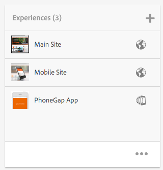
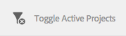
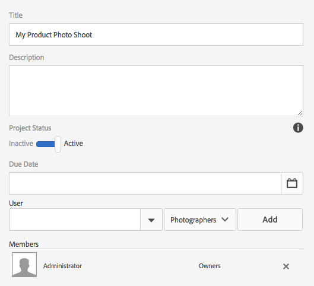

# Gestione di progetti{#managing-projects}

La funzione Progetti consente di organizzare un progetto raggruppando le risorse in un’unica entità.

La console **Progetti** consente di accedere ai progetti e di eseguire azioni su di essi:

Tramite Progetti è possibile creare un progetto e associarvi risorse, ma anche eliminarlo o eliminare i collegamenti alle risorse. È possibile aprire una porzione per visualizzarne il contenuto e aggiungere elementi. In questo argomento vengono descritte le procedure.

>[!NOTE]
>
>Con la versione 6.2 è stata introdotta la possibilità di organizzare i progetti in cartelle. È possibile creare un progetto o una cartella dalla pagina Progetti.
>
>Se si crea una cartella, l’utente può creare al suo interno un’ulteriore cartella o un progetto. Questo consente di organizzare i progetti in cartelle divise per categorie, quali campagne di prodotto, posizione, lingue per la traduzione e così via.
>
>È possibile visualizzare progetti e cartelle in una vista elenco così come eseguirne la ricerca.

>[!CAUTION]
>
>For users in projects to see other users/groups while using Projects functionality like creating projects, creating tasks/workflows, seeing and managing the team, those users need to have read access on **/home/users** and **/home/groups**. The easiest way to implement this is to give the **projects-users** group read access to **/home/users** and **/home/groups**.

## Creazione di un progetto {#creating-a-project}

Con AEM vengono forniti i seguenti modelli tra cui scegliere alla creazione di un progetto:

* Progetto semplice
* Progetto multimediale
* Progetto servizio fotografico per prodotto
* Progetto di traduzione

La procedura di creazione di un progetto è sempre la stessa. La differenza tra i tipi di progetti include i [ruoli utente](/help/sites-authoring/projects.md) e i [flussi di lavoro](/help/sites-authoring/projects-with-workflows.md) disponibili.  Per creare un nuovo progetto:

1. Da **Progetti**, tocca o fai clic su **Crea** per aprire la creazione guidata **Crea progetto**:
1. Seleziona un modello Out of the box, Simple Project, Media Project, [Translation Project](/help/sites-administering/tc-manage.md), and [Product Photo Shoot Product](/help/sites-authoring/managing-product-information.md) are available and click **Next**.

   

1. Define the **Title** and **Description** and add a **Thumbnail** image if required. Puoi anche aggiungere o eliminare gli utenti e il gruppo a cui appartengono, o fare clic su **Avanzate** per aggiungere un nome da usare nell’URL.

   

1. Tocca o fai clic su **Crea**. Ti viene richiesto se desideri aprire il nuovo progetto o tornare alla console.

### Associazione di risorse a un progetto {#associating-resources-with-your-project}

Poiché i progetti consentono di raggruppare risorse in un’unica entità, è possibile associare delle risorse a un progetto. Tali risorse sono denominate **porzioni**. I tipi di risorse che è possibile aggiungere sono descritti nella sezione [Porzioni di progetto](/help/sites-authoring/projects.md#project-tiles).

Per associare risorse a un progetto:

1. Apri il progetto dalla console **Progetti**.
1. Tocca o fai clic su **Aggiungi sezione**, quindi seleziona la porzione che desideri collegare al progetto. È possibile selezionare tra più tipi di porzioni.

   

   >[!NOTE]
   >
   >Le porzioni associabili a un progetto sono descritte dettagliatamente nella sezione [Porzioni di progetto](/help/sites-authoring/projects.md#project-tiles).

1. Tocca o fai clic su **Crea**. La risorsa è ora collegata al progetto e accessibile da questo.

### Eliminazione di un progetto o di un collegamento di risorsa {#deleting-a-project-or-resource-link}

Per eliminare un progetto dalla console o una risorsa collegata dal progetto si applica lo stesso metodo:

1. Passa alla posizione appropriata:

   * Per eliminare un progetto, spostati nella parte superiore della console **Progetti**.
   * Per eliminare un collegamento di risorsa all’interno di un progetto, apri il progetto nella console **Progetti**.

1. Entra nella modalità di selezione facendo clic su **Seleziona** e scegli il progetto o collegamento di risorsa.
1. Tocca o fai clic su **Elimina**.

1. È necessario confermare l’eliminazione in una finestra di dialogo. Se procedi, il progetto o collegamento di risorsa viene eliminato. Per uscire dalla modalità di selezione, tocca o fai clic su **Deseleziona**.

>[!NOTE]
>
>Quando crei il progetto e aggiungi utenti ai vari ruoli, vengono creati automaticamente dei gruppi associati al progetto per gestire le relative autorizzazioni. Ad esempio, un progetto denominato Myproject avrebbe tre gruppi **Proprietari di Myproject**, **Editor di Myproject**, **Osservatori di Myproject**. la sua eliminazione non comporta tuttavia l’eliminazione automatica dei gruppi presenti. I gruppi devono essere eliminati manualmente da un amministratore in **Strumenti** > **Protezione** > **Gruppi**.

### Aggiungere elementi a una porzione {#adding-items-to-a-tile}

Per alcune porzioni è possibile aggiungere più di un oggetto. Ad esempio, è possibile avere più flussi di lavoro o esperienze in esecuzione allo stesso tempo.

Per aggiungere elementi a una porzione:

1. In **Projects**, navigate to the project and click the Add + icon on the tile you want to add an item to.

   

1. Aggiungi un elemento alla porzione con la stessa procedura che usi quando crei una nuova porzione. Le porzioni di progetto sono descritte [qui](/help/sites-authoring/projects.md#project-tiles). In questo esempio è stato aggiunto un altro flusso di lavoro.

   

### Aprire una porzione {#opening-a-tile}

È possibile visualizzare gli elementi inclusi nella porzione selezionata, modificarli o eliminarli.

Per aprire una porzione e visualizzare o modificare gli elementi:

1. Dalla console Progetti, tocca o fai clic sui puntini di sospensione (...)

   

1. AEM mostra l’elenco degli elementi inclusi nella porzione. Per modificarli o eliminarli, entra nella modalità di selezione.

   

## Visualizzazione delle statistiche di un progetto {#viewing-project-statistics}

Per visualizzare le statistiche di un progetto, dalla console **Progetti** fai clic su **Mostra vista statistiche**. Viene visualizzato il livello di completamento di ciascun progetto. Click **Show Statistics View** again to go to the **Projects** console.

### Visualizzazione della cronologia di un progetto {#viewing-a-project-timeline}

La cronologia di un progetto fornisce informazioni sull’ultimo utilizzo delle risorse associate. To view the project timeline, click/tap **Timeline**, then enter selection mode and select the project. Le risorse vengono visualizzate nel riquadro a sinistra. Click/tap **Timeline** to return to the **Projects** console.

### Visualizzazione di progetti attivi e inattivi {#viewing-active-inactive-projects}

To toggle between your active and inactive projects, in the **Projects** console, click **Toggle Active Projects**. Se l’icona è affiancata da un segno di spunta, stai visualizzando i progetti attivi.

Se l’icona è affiancata da una x, stai visualizzando i progetti inattivi.

## Rendere un progetto attivo o inattivo {#making-projects-inactive-or-active}

Se hai completato un progetto ma desideri mantenere le informazioni ad esso associate, puoi renderlo inattivo.

Per rendere un progetto attivo o inattivo:

1. Dalla console **Progetti**, apri il progetto e seleziona la porzione **Informazioni progetto**.

   >[!NOTE]
   È necessario aggiungere questa porzione nel caso in cui non sia già presente nel progetto. Consulta [Aggiunta di una porzione](#adding-items-to-a-tile).

1. Tap/click **Edit**.
1. Modifica il selettore passando da **Attivo** a **Inattivo** (o viceversa).

   

1. Tocca o fai clic su **Fine** per salvare le modifiche apportate.

