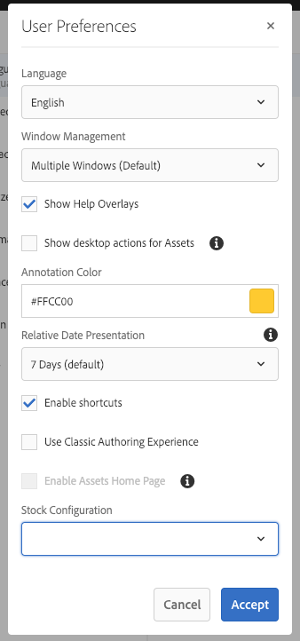

# Configurazione dell’ambiente dell’account  {#configuring-your-account-environment}

Con AEM è possibile configurare il proprio account e alcuni aspetti dell’ambiente di authoring.

Utilizza l’opzione [Utente](/help/sites-authoring/user-properties.md#user-settings) nell’[intestazione](/help/sites-authoring/basic-handling.md#the-header) e la relativa finestra di dialogo [Preferenze](#userpreferences) per modificare le opzioni utente.

Per iniziare, accedi a [Utente](/help/sites-authoring/user-properties.md#user-settings) nell’intestazione.

## Impostazioni utente {#user-settings}

Il **Utente** La finestra di dialogo delle impostazioni consente di accedere a:

* Impersona

   * Con il [Impersona](/help/sites-administering/security.md#impersonating-another-user) un utente può lavorare per conto di un altro utente.

* Profilo

   * Offre un collegamento semplice al [impostazioni utente](/help/sites-administering/security.md))

* [Preferenze](/help/sites-authoring/user-properties.md#my-preferences)

   * Consente di specificare varie preferenze di impostazione specifiche dell’utente.

### Preferenze {#my-preferences}

Puoi accedere alla finestra di dialogo **Preferenze** tramite l’opzione [Utente](/help/sites-authoring/user-properties.md#user-settings) nell’intestazione.

Ogni utente può impostare autonomamente determinate proprietà.

* **Lingua**

  Consente di definire la lingua da usare nell’interfaccia dell’ambiente di authoring. Seleziona la lingua desiderata dall’elenco disponibile.

  Questa configurazione viene utilizzata anche per l’interfaccia classica.

* **Gestione finestre**

  Definisce il comportamento o l&#39;apertura delle finestre. Puoi selezionare:

   * **Finestre multiple** (Predefinito)

      * Le pagine verranno aperte in una nuova finestra.

   * **Finestra singola**

      * Le pagine verranno aperte nella finestra corrente.

* **Mostra azioni desktop per Assets**

  Questa opzione richiede l’utilizzo dell’app desktop AEM.

* **Colore annotazione**

  Definisce il colore predefinito utilizzato per le annotazioni.

   * Fai clic sul blocco di colori per aprire il selettore di campioni e selezionare un colore.
   * In alternativa, immetti nel campo il codice esadecimale del colore desiderato.

* **Presentazione data relativa**

  Per migliorare la leggibilità, AEM presenterà le date degli ultimi sette giorni come date relative (ad esempio, tre giorni fa) e le date più lontane come date esatte (ad esempio, il 20 marzo 2017).

  Questa opzione definisce il modo in cui il sistema visualizza le date. Sono disponibili le seguenti opzioni:

   * **Mostra sempre data esatta**: viene sempre visualizzata la data esatta e non una data relativa.
   * **1 giorno**: viene visualizzata la data relativa per le date entro un giorno; in caso contrario viene visualizzata una data esatta.

   * **7 giorni (impostazione predefinita)**: viene visualizzata la data relativa per date entro sette giorni; in caso contrario viene visualizzata una data esatta.

   * **1 mese**: viene visualizzata la data relativa per le date entro un mese; in caso contrario viene visualizzata una data esatta.

   * **1 anno**: viene visualizzata la data relativa per le date entro un anno; in caso contrario viene visualizzata una data esatta.

   * **Mostra sempre data relativa**: non vengono mai visualizzate date esatte, ma solo date relative.

* **Abilita scelte rapide**

  AEM supporta una serie di scelte rapide da tastiera per ottimizzare l’authoring.

   * [Scelte rapide da tastiera per la modifica delle pagine](/help/sites-authoring/page-authoring-keyboard-shortcuts.md)
   * [Scelte rapide da tastiera per le console](/help/sites-authoring/keyboard-shortcuts.md)

  Questa opzione abilita le scelte rapide da tastiera. Per impostazione predefinita sono abilitate, ma possono essere disabilitate, ad esempio se un utente ha determinati requisiti di accessibilità.

* **Usa esperienza di authoring classica**

  Questa opzione abilita [interfaccia classica](/help/sites-classic-ui-authoring/home.md)authoring delle pagine basato su. Per impostazione predefinita viene utilizzata l’interfaccia utente standard.

* **Abilita pagina iniziale di Assets**

  Questa opzione è disponibile solo se l’amministratore di sistema ha abilitato l’esperienza Pagina iniziale di Assets per l’intera organizzazione.

* **Configurazione Stock**

  Questa opzione consente di specificare la configurazione di Adobe Stock preferita ed è disponibile solo se l’amministratore di sistema ha abilitato [Integrazione con Adobe Stock](/help/assets/aem-assets-adobe-stock.md).
