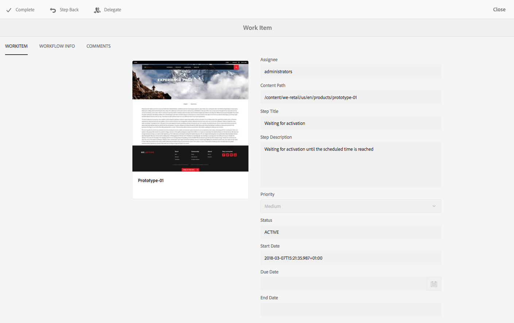

# Partecipazione ai flussi di lavoro{#participating-in-workflows}

I flussi di lavoro in genere includono passaggi che richiedono a una persona di eseguire un’attività su una pagina o una risorsa. Il flusso di lavoro seleziona un utente o un gruppo per eseguire l’attività e assegna un elemento di lavoro a tale persona o gruppo. L’utente riceve la notifica e può quindi intraprendere l’azione appropriata:

* [Visualizzazione delle notifiche](#notifications-of-available-workflow-actions)
* [Completa un Passaggio Partecipante](#completing-a-participant-step)
* [Delega un Passaggio Partecipante](#delegating-a-participant-step)
* [Esegui un passo indietro su un Passaggio Partecipante](#performing-step-back-on-a-participant-step)
* [Apri un elemento del flusso di lavoro per visualizzare i dettagli (e Intraprendere Azioni)](#opening-a-workflow-item-to-view-details-and-take-actions)
* [Visualizza il Payload flusso di lavoro (Risorse Multiple)](#viewing-the-workflow-payload-multiple-resources)

## Notifiche delle azioni disponibili per i flussi di lavoro {#notifications-of-available-workflow-actions}

Quando ti viene assegnato un elemento di lavoro (ad esempio, **Approva contenuto**) vengono visualizzati diversi avvisi e/o notifiche:

* Le [notifica](/help/sites-authoring/inbox.md) indicatore (barra degli strumenti) verrà incrementato:

   

* L&#39;oggetto viene inserito nelle notifiche della [Casella in entrata](/help/sites-authoring/inbox.md):

   

* Quando utilizzi l’editor di pagine, la barra di stato mostra:

   * Nome dei flussi di lavoro applicati alla pagina; ad esempio Richiesta di attivazione.
   * Tutte le azioni disponibili per l’utente corrente per il passaggio corrente del flusso di lavoro; ad esempio, Completa, Delega, Visualizza dettagli.
   * Il numero di flussi di lavoro a cui è soggetta la pagina. Operazioni disponibili:

      * utilizza le frecce sinistra/destra per navigare tra le informazioni di stato dei vari flussi di lavoro.
      * tocca o fai clic sul numero effettivo per aprire un elenco a discesa di tutti i flussi di lavoro applicabili, quindi seleziona il flusso di lavoro da visualizzare nella barra di stato.

   

   >[!NOTE]
   >
   >La barra di stato è visibile solo agli utenti con i privilegi del flusso di lavoro, per esempio, i membri del gruppo `workflow-users`.
   >
   >
   >Le azioni vengono visualizzate quando l’utente corrente è direttamente coinvolto nel passaggio corrente del flusso di lavoro.

* Quando **Timeline** è aperto per la risorsa; viene visualizzato il passaggio del flusso di lavoro . Quando tocchi o fai clic sul banner di avviso, vengono visualizzate anche le azioni disponibili:

   

### Completamento di un Passaggio Partecipante {#completing-a-participant-step}

Puoi completare un elemento per consentire al flusso di lavoro di passare al passaggio successivo.

Per questa azione puoi indicare:

* **Passaggio successivo**: il passo successivo da compiere; è possibile selezionare da un elenco
* **Commento**: se richiesto

Puoi completare un passaggio partecipante da:

* [Casella in entrata](#completing-a-participant-step-inbox)
* [Editor pagina](#completing-a-participant-step-page-editor)
* [Timeline ](#completing-a-participant-step-timeline)
* quando [apertura di un elemento del flusso di lavoro per visualizzare i dettagli](#opening-a-workflow-item-to-view-details-and-take-actions).

#### Completamento di un Passaggio partecipante: Casella in entrata {#completing-a-participant-step-inbox}

Per completare l&#39;elemento di lavoro, attenersi alla seguente procedura:

1. Apri la **[Casella in entrata AEM](/help/sites-authoring/inbox.md)**.
1. Seleziona l’elemento del flusso di lavoro su cui desideri intervenire (tocca o fai clic sulla miniatura).
1. Seleziona **Completa** dalla barra degli strumenti.
1. Si apre la finestra di dialogo **Completa elemento di lavoro**. Seleziona il **Passaggio successivo** dal menu a discesa e aggiungi un **Commento** se richiesto.
1. Utilizza il tasto **OK** per completare il passaggio (o il tasto **Annulla** per interrompere l’azione).

#### Completamento di un Passaggio partecipante: Editor pagina {#completing-a-participant-step-page-editor}

Per completare l&#39;elemento di lavoro, attenersi alla seguente procedura:

1. Apri [pagina per la modifica](/help/sites-authoring/managing-pages.md#opening-a-page-for-editing).
1. Seleziona **Completa** dalla barra di stato in alto.
1. Si apre la finestra di dialogo **Completa elemento di lavoro**. Seleziona il **Passaggio successivo** dal menu a discesa e aggiungi un **Commento** se richiesto.
1. Utilizza il tasto **OK** per completare il passaggio (o il tasto **Cancel** per interrompere l’azione).

#### Completamento di un Passaggio partecipante: Timeline {#completing-a-participant-step-timeline}

È inoltre possibile utilizzare la timeline per completare e far avanzare un passaggio:

1. Seleziona la pagina richiesta e apri la **Timeline** (oppure, apri la **Timeline** e seleziona la pagina):

   

1. Tocca o fai clic sul banner di avviso per visualizzare le azioni disponibili. Seleziona **Avanzamento**:

   

1. A seconda del flusso di lavoro, è possibile selezionare la fase successiva:

   

1. Seleziona **Avanzamento** per confermare l’azione.

### Delega di un Passaggio Partecipante {#delegating-a-participant-step}

Se ti è stato assegnato un passaggio, ma per qualsiasi motivo non riesci a eseguire un&#39;azione, puoi delegarlo a un altro utente o gruppo.

Gli utenti disponibili per la delega dipendono da chi è stato assegnato l’elemento di lavoro:

* Se l&#39;elemento di lavoro è stato assegnato a un gruppo, i membri del gruppo sono disponibili.
* Se l’elemento di lavoro è stato assegnato a un gruppo e poi è stato delegato a un utente, sono disponibili i membri del gruppo e il gruppo.
* Se l&#39;elemento di lavoro è stato assegnato a un singolo utente, non è possibile delegare l&#39;elemento di lavoro.

Per questa azione puoi indicare:

* **Utente**: l’utente a cui si desidera delegare; è possibile selezionare da un elenco
* **Commento**: se richiesto

Puoi delegare un passaggio partecipante da:

* [Casella in entrata](#delegating-a-participant-step-inbox)
* [Editor pagina](#delegating-a-participant-step-page-editor)
* [Timeline ](#delegating-a-participant-step-timeline)
* quando [apertura di un elemento del flusso di lavoro per visualizzare i dettagli](#opening-a-workflow-item-to-view-details-and-take-actions).

#### Delega di un Passaggio partecipante - Casella in entrata {#delegating-a-participant-step-inbox}

Utilizzare la procedura seguente per delegare un elemento di lavoro:

1. Apri la **[Casella in entrata AEM](/help/sites-authoring/inbox.md)**.
1. Seleziona l’elemento del flusso di lavoro su cui desideri intervenire (tocca o fai clic sulla miniatura).
1. Seleziona **Delega** dalla barra degli strumenti.
1. Viene aperta una finestra di dialogo. Specifica l’**Utente** dal menu a discesa (può anche essere un gruppo) e aggiungi un **Commento** se necessario. 
1. Utilizza il tasto **OK** per completare il passaggio (o il tasto **Annulla** per interrompere l’azione).

#### Delega di un Passaggio partecipante: Editor pagina {#delegating-a-participant-step-page-editor}

Utilizzare la procedura seguente per delegare un elemento di lavoro:

1. Apri [pagina per la modifica](/help/sites-authoring/managing-pages.md#opening-a-page-for-editing).
1. Seleziona **Delega** dalla barra di stato in alto.
1. Viene aperta una finestra di dialogo. Specifica l’**Utente** dal menu a discesa (può anche essere un gruppo) e aggiungi un **Commento** se necessario. 
1. Utilizza il tasto **OK** per completare il passaggio (o il tasto **Annulla** per interrompere l’azione).

#### Delega di un Passaggio partecipante: Timeline {#delegating-a-participant-step-timeline}

Puoi anche utilizzare la timeline per delegare e/o assegnare un passaggio:

1. Seleziona la pagina richiesta e apri la **Timeline** (oppure, apri la **Timeline** e seleziona la pagina).
1. Tocca o fai clic sul banner di avviso per visualizzare le azioni disponibili. Seleziona **Cambia assegnatario**:

   

1. Specifica un nuovo assegnatario:

   

1. Seleziona **Assegna** per confermare l’azione.

### Eseguire un passo indietro su un Passaggio partecipante {#performing-step-back-on-a-participant-step}

Se scopri che è necessario ripetere un passaggio o una serie di passaggi, puoi tornare indietro. Ciò ti consente di selezionare un passaggio precedente del flusso di lavoro per la rielaborazione. Il flusso di lavoro torna al passaggio specificato, quindi procede da tale passaggio.

Per questa azione puoi indicare:

* **Passaggio precedente**: la fase da restituire; è possibile selezionare da un elenco
* **Commento**: se richiesto

Puoi eseguire un passo indietro su un passaggio partecipante da:

* [Casella in entrata](#performing-step-back-on-a-participant-step-inbox)
* [Editor pagina](#performing-step-back-on-a-participant-step-page-editor)
* [Timeline ](#performing-step-back-on-a-participant-step-timeline)
* quando [apertura di un elemento del flusso di lavoro per visualizzare i dettagli](#opening-a-workflow-item-to-view-details-and-take-actions).

#### Eseguire un passo indietro su un Passaggio partecipante - Casella in entrata {#performing-step-back-on-a-participant-step-inbox}

Segui la procedura seguente per tornare indietro:

1. Apri la **[Casella in entrata AEM](/help/sites-authoring/inbox.md)**.
1. Seleziona l’elemento del flusso di lavoro su cui desideri intervenire (tocca o fai clic sulla miniatura).
1. Seleziona **Passo indietro** per aprire la finestra di dialogo.

1. Specifica il **Passaggio precedente** e aggiungi un **Commento** se necessario.
1. Utilizza il tasto **OK** per completare il passaggio (o il tasto **Annulla** per interrompere l’azione).

#### Eseguire un passo indietro su un Passaggio partecipante - Editor pagina {#performing-step-back-on-a-participant-step-page-editor}

Segui la procedura seguente per tornare indietro:

1. Apri [pagina per la modifica](/help/sites-authoring/managing-pages.md#opening-a-page-for-editing).
1. Seleziona **Passo indietro** dalla barra di stato in alto.
1. Specifica il **Passaggio precedente** e aggiungi un **Commento** se necessario.
1. Utilizza il tasto **OK** per completare il passaggio (o il tasto **Annulla** per interrompere l’azione).

#### Eseguire un passo indietro su un Passaggio partecipante: Timeline {#performing-step-back-on-a-participant-step-timeline}

È inoltre possibile utilizzare la timeline per tornare a un passaggio precedente:

1. Seleziona la pagina richiesta e apri la **Timeline** (oppure, apri la **Timeline** e seleziona la pagina).
1. Tocca o fai clic sul banner di avviso per visualizzare le azioni disponibili. Seleziona **Ritorno indietro**:

   

1. Specifica il passaggio precedente a cui il flusso di lavoro deve tornare:

   

1. Seleziona **Ripristina versione precedente** per confermare l’azione.

### Apertura di un elemento del flusso di lavoro per visualizzare i dettagli (e intraprendere azioni) {#opening-a-workflow-item-to-view-details-and-take-actions}

Visualizzare i dettagli dell’elemento di lavoro del flusso di lavoro e intraprendere le azioni appropriate.

I dettagli del flusso di lavoro sono visualizzati in schede e le azioni appropriate sono disponibili nella barra degli strumenti:

* Scheda **ELEMENTO DI LAVORO:**

   

* Scheda **INFORMAZIONI SUL FLUSSO DI LAVORO**:

   

   Se [Fasi del flusso di lavoro](/help/sites-developing/workflows.md#workflow-stages) sono stati configurati per il modello, è possibile visualizzare l&#39;avanzamento in base a quanto segue:

   

* Scheda **COMMENTI**:

   

È possibile aprire i dettagli dell&#39;elemento di lavoro in uno a partire da:

* [Casella in entrata](#performing-step-back-on-a-participant-step-inbox)
* [Editor pagina](#performing-step-back-on-a-participant-step-page-editor)

#### Apertura dei dettagli del flusso di lavoro - Casella in entrata {#opening-workflow-details-inbox}

Per aprire un elemento del flusso di lavoro e visualizzare i dettagli:

1. Apri la **[Casella in entrata AEM](/help/sites-authoring/inbox.md)**.
1. Seleziona l’elemento del flusso di lavoro su cui desideri intervenire (tocca o fai clic sulla miniatura).
1. Seleziona **Apri** per aprire le schede informative.

1. Se necessario, seleziona l’azione appropriata, inserisci tutte le informazioni richieste e conferma con **OK** (o **Annulla**).
1. Usa il comando **Salva** o **Annulla** per uscire.

#### Apertura dei dettagli del flusso di lavoro - Editor pagina {#opening-workflow-details-page-editor}

Per aprire un elemento del flusso di lavoro e visualizzare i dettagli:

1. Apri [pagina per la modifica](/help/sites-authoring/managing-pages.md#opening-a-page-for-editing).
1. Seleziona **Visualizza dettagli** dalla barra di stato per aprire le schede informative.

1. Se necessario, seleziona l’azione appropriata, inserisci tutte le informazioni richieste e conferma con **OK** (o **Annulla**).
1. Usa il comando **Salva** o **Annulla** per uscire.

### Visualizzazione del Payload flusso di lavoro (risorse multiple) {#viewing-the-workflow-payload-multiple-resources}

Puoi visualizzare i dettagli del payload associato all’istanza del flusso di lavoro. Inizialmente vengono visualizzate le risorse del pacchetto, quindi puoi espandere per visualizzare le singole pagine.

Per visualizzare il payload e le risorse dell’istanza del flusso di lavoro:

1. Apri la **[Casella in entrata AEM](/help/sites-authoring/inbox.md)**.
1. Seleziona l’elemento del flusso di lavoro su cui desideri intervenire (tocca o fai clic sulla miniatura).
1. Seleziona **Visualizza payload** dalla barra degli strumenti per aprire la finestra di dialogo.

   Poiché un pacchetto di flusso di lavoro è semplicemente una raccolta di puntatori ai percorsi all&#39;interno dell&#39;archivio, puoi aggiungere/rimuovere/modificare le voci qui per regolare ciò a cui fa riferimento il pacchetto di flusso di lavoro. Utilizza la **Definizione risorsa** per aggiungere nuove voci.

   

1. I collegamenti possono essere utilizzati per aprire le singole pagine.
