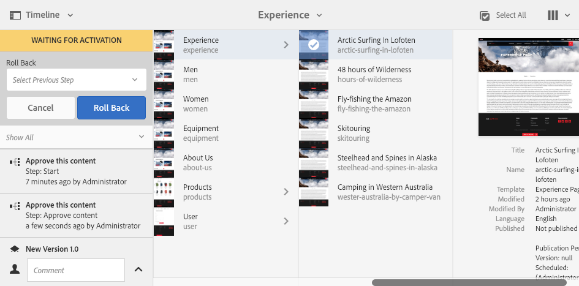

# Partecipazione ai flussi di lavoro{#participating-in-workflows}

In genere i flussi di lavoro includono passaggi che richiedono di eseguire un’attività su una pagina o una risorsa. Il flusso di lavoro seleziona un utente o un gruppo per eseguire l’attività e assegna un elemento di lavoro a tale persona o gruppo. L’utente riceve una notifica e può quindi intraprendere le azioni appropriate:

* [Visualizzazione delle notifiche](#notifications-of-available-workflow-actions)
* [Completa un Passaggio Partecipante](#completing-a-participant-step)
* [Delega un Passaggio Partecipante](#delegating-a-participant-step)
* [Esegui un passo indietro su un Passaggio Partecipante](#performing-step-back-on-a-participant-step)
* [Apri un elemento del flusso di lavoro per visualizzare i dettagli (e Intraprendere Azioni)](#opening-a-workflow-item-to-view-details-and-take-actions)
* [Visualizza il Payload flusso di lavoro (Risorse Multiple)](#viewing-the-workflow-payload-multiple-resources)

## Notifiche delle azioni del flusso di lavoro disponibili {#notifications-of-available-workflow-actions}

Quando ti viene assegnato un elemento di lavoro (ad esempio, **Approva contenuto**) vengono visualizzati diversi avvisi e/o notifiche:

* Il tuo [notifica](/help/sites-authoring/inbox.md) (barra degli strumenti) verrà incrementato:

  

* L&#39;oggetto viene inserito nelle notifiche della [Casella in entrata](/help/sites-authoring/inbox.md):

  

* Quando utilizzi l’editor pagina, la barra di stato mostra quanto segue:

   * Il nome dei flussi di lavoro applicati alla pagina, ad esempio Richiesta di attivazione.
   * Qualsiasi azione disponibile per l’utente nella fase corrente del flusso di lavoro, per esempio: Completa, Delega, Visualizza dettagli.
   * Il numero di flussi di lavoro a cui è soggetta la pagina. Operazioni disponibili:

      * utilizzare la freccia sinistra/destra per navigare tra le informazioni di stato dei vari flussi di lavoro.
      * fare clic/toccare il numero totale per aprire un elenco a discesa di tutti i flussi di lavoro applicabili e quindi selezionare il flusso di lavoro che si desidera visualizzare nella barra di stato.

  

  >[!NOTE]
  >
  >La barra di stato è visibile solo agli utenti con i privilegi del flusso di lavoro, per esempio, i membri del gruppo `workflow-users`.
  >
  >
  >Le azioni vengono visualizzate quando l&#39;utente è direttamente coinvolto nella fase corrente del flusso di lavoro.

* Quando la **Timeline** è aperta per la risorsa, viene mostrato il passaggio del flusso di lavoro. Quando si fa clic o si tocca il banner di avviso, vengono mostrate anche le azioni disponibili:

  

### Completamento di un passaggio partecipante {#completing-a-participant-step}

Quando si completa un elemento di lavoro, il flusso di lavoro procede al passaggio successivo.

Per questa azione è possibile indicare:

* **Passaggio successivo**: il passaggio successivo da compiere; è possibile selezionarlo da un elenco.
* **Commento**: se necessario

È possibile completare un passaggio partecipante a partire da:

* [Casella in entrata](#completing-a-participant-step-inbox)
* [Editor pagina](#completing-a-participant-step-page-editor)
* [Timeline](#completing-a-participant-step-timeline)
* quando [apertura di un elemento del flusso di lavoro per visualizzare i dettagli](#opening-a-workflow-item-to-view-details-and-take-actions).

#### Completamento di un passaggio partecipante: casella in entrata {#completing-a-participant-step-inbox}

Utilizza la seguente procedura per completare l’elemento di lavoro:

1. Apri la **[Casella in entrata AEM](/help/sites-authoring/inbox.md)**.
1. Seleziona l’elemento del flusso di lavoro sul cui desideri intervenire (tocca o fai clic sulla miniatura).
1. Seleziona **Completa** dalla barra degli strumenti.
1. Il **Completa elemento di lavoro** viene visualizzata. Seleziona il **Passaggio successivo** dal menu a discesa e aggiungi un **Commento**, se richiesto.
1. Utilizza il tasto **OK** per completare il passaggio (o il tasto **Annulla** per interrompere l’azione).

#### Completamento di un passaggio partecipante: editor pagina {#completing-a-participant-step-page-editor}

Utilizza la seguente procedura per completare l’elemento di lavoro:

1. Apri la [pagina per la modifica](/help/sites-authoring/managing-pages.md#opening-a-page-for-editing).
1. Seleziona **Completa** dalla barra di stato in alto.
1. Il **Completa elemento di lavoro** viene visualizzata. Seleziona il **Passaggio successivo** dal menu a discesa e aggiungi un **Commento**, se richiesto.
1. Utilizza il tasto **OK** per completare il passaggio (o il tasto **Cancel** per interrompere l’azione).

#### Completamento di un passaggio partecipante - Timeline {#completing-a-participant-step-timeline}

Puoi anche utilizzare la timeline per completare un passaggio e avanzare:

1. Seleziona la pagina richiesta e apri la **Timeline** (oppure, apri la **Timeline** e seleziona la pagina):

   

1. Tocca o fai clic sul banner di avviso per visualizzare le azioni disponibili. Seleziona **Avanti**:

   

1. A seconda del flusso di lavoro, è possibile selezionare la fase successiva:

   

1. Seleziona **Avanti** per confermare l’azione.

### Delega di un passaggio partecipante {#delegating-a-participant-step}

Se ti è stato assegnato un passaggio, ma per qualche motivo non ti è possibile intervenire, puoi delegarlo a un altro utente o gruppo.

Gli utenti disponibili per la delega dipendono dal tipo di assegnatario dell’elemento di lavoro:

* Se l’elemento di lavoro è stato assegnato a un gruppo, sono disponibili i membri del gruppo.
* Se l’elemento di lavoro è stato assegnato a un gruppo e poi è stato delegato a un utente, sono disponibili i membri del gruppo e il gruppo.
* Se l’elemento di lavoro è stato assegnato a un singolo utente, l’elemento di lavoro non può essere delegato.

Per questa azione è possibile indicare:

* **Utente**: l’utente a cui desideri delegare; è possibile selezionarlo da un elenco
* **Commento**: se necessario

È possibile delegare un passaggio partecipante da:

* [Casella in entrata](#delegating-a-participant-step-inbox)
* [Editor pagina](#delegating-a-participant-step-page-editor)
* [Timeline](#delegating-a-participant-step-timeline)
* quando [apertura di un elemento del flusso di lavoro per visualizzare i dettagli](#opening-a-workflow-item-to-view-details-and-take-actions).

#### Delega di un passaggio partecipante: casella in entrata {#delegating-a-participant-step-inbox}

Segui la procedura seguente per delegare un elemento di lavoro:

1. Apri la **[Casella in entrata AEM](/help/sites-authoring/inbox.md)**.
1. Seleziona l’elemento del flusso di lavoro sul cui desideri intervenire (tocca o fai clic sulla miniatura).
1. Seleziona **Delega** dalla barra degli strumenti.
1. Viene visualizzata la finestra di dialogo. Specifica l’**Utente** dal menu a discesa (può anche essere un gruppo) e aggiungi un **Commento** se richiesto.
1. Utilizza il tasto **OK** per completare il passaggio (o il tasto **Annulla** per interrompere l’azione).

#### Delega di un passaggio partecipante: editor pagina {#delegating-a-participant-step-page-editor}

Segui la procedura seguente per delegare un elemento di lavoro:

1. Apri la [pagina per la modifica](/help/sites-authoring/managing-pages.md#opening-a-page-for-editing).
1. Seleziona **Delega** dalla barra di stato in alto.
1. Viene visualizzata la finestra di dialogo. Specifica l’**Utente** dal menu a discesa (può anche essere un gruppo) e aggiungi un **Commento** se richiesto.
1. Utilizza il tasto **OK** per completare il passaggio (o il tasto **Annulla** per interrompere l’azione).

#### Delega di un passaggio partecipante: Timeline {#delegating-a-participant-step-timeline}

Puoi anche utilizzare la timeline per delegare e/o assegnare un passaggio:

1. Seleziona la pagina richiesta e apri la **Timeline** (oppure, apri la **Timeline** e seleziona la pagina).
1. Tocca o fai clic sul banner di avviso per visualizzare le azioni disponibili. Seleziona **Cambia assegnatario**:

   

1. Specifica un nuovo assegnatario:

   

1. Seleziona **Assegna** per confermare l’azione.

### Esecuzione di un passo indietro su un Passaggio Partecipante {#performing-step-back-on-a-participant-step}

Se scopri che un passaggio, o una serie di passaggi, deve essere ripetuto, puoi fare un passo indietro. Questo consente di selezionare un passaggio, precedente nel flusso di lavoro, per la rielaborazione. Il flusso di lavoro ritorna al passaggio specificato, quindi procede da lì.

Per questa azione è possibile indicare:

* **Passaggio precedente**: il passaggio a cui tornare; puoi effettuare una selezione da un elenco fornito
* **Commento**: se necessario

È possibile eseguire un passo indietro su un passaggio partecipante da:

* [Casella in entrata](#performing-step-back-on-a-participant-step-inbox)
* [Editor pagina](#performing-step-back-on-a-participant-step-page-editor)
* [Timeline](#performing-step-back-on-a-participant-step-timeline)
* quando [apertura di un elemento del flusso di lavoro per visualizzare i dettagli](#opening-a-workflow-item-to-view-details-and-take-actions).

#### Esecuzione di un passo indietro su un Passaggio Partecipante - Casella in entrata {#performing-step-back-on-a-participant-step-inbox}

Per tornare indietro, attenersi alla procedura descritta di seguito.

1. Apri la **[Casella in entrata AEM](/help/sites-authoring/inbox.md)**.
1. Seleziona l’elemento del flusso di lavoro sul cui desideri intervenire (tocca o fai clic sulla miniatura).
1. Seleziona **Passo indietro** per aprire la finestra di dialogo.

1. Specifica il **Passaggio precedente** e aggiungi un **Commento** se necessario.
1. Utilizza il tasto **OK** per completare il passaggio (o il tasto **Annulla** per interrompere l’azione).

#### Esecuzione di un passo indietro su un Passaggio Partecipante - Editor pagina {#performing-step-back-on-a-participant-step-page-editor}

Per tornare indietro, attenersi alla procedura descritta di seguito.

1. Apri la [pagina per la modifica](/help/sites-authoring/managing-pages.md#opening-a-page-for-editing).
1. Seleziona **Passo indietro** dalla barra di stato in alto.
1. Specifica il **Passaggio precedente** e aggiungi un **Commento** se necessario.
1. Utilizza il tasto **OK** per completare il passaggio (o il tasto **Annulla** per interrompere l’azione).

#### Esecuzione di un passo indietro su un Passo Partecipante - Timeline {#performing-step-back-on-a-participant-step-timeline}

Puoi anche utilizzare la timeline per tornare indietro a un passaggio precedente:

1. Seleziona la pagina richiesta e apri la **Timeline** (oppure, apri la **Timeline** e seleziona la pagina).
1. Tocca o fai clic sul banner di avviso per visualizzare le azioni disponibili. Seleziona **Ripristina versione precedente**:

   

1. Specifica il passaggio precedente a cui il flusso di lavoro deve tornare:

   

1. Seleziona **Ripristina versione precedente** per confermare l’azione.

### Apri un elemento del flusso di lavoro per visualizzare i dettagli (e intraprendere azioni) {#opening-a-workflow-item-to-view-details-and-take-actions}

Visualizza i dettagli dell’elemento di lavoro del flusso di lavoro e intraprendi le azioni appropriate.

I dettagli del flusso di lavoro sono visualizzati in schede e le azioni appropriate sono disponibili nella barra degli strumenti:

* Scheda **ELEMENTO DI LAVORO:**

  

* Scheda **INFORMAZIONI SUL FLUSSO DI LAVORO**:

  

  Se [Fasi flusso di lavoro](/help/sites-developing/workflows.md#workflow-stages) sono stati configurati per il modello, è possibile visualizzare lo stato di avanzamento in base a questi:

  

* Scheda **COMMENTI**:

  

È possibile aprire i dettagli dell&#39;elemento di lavoro in uno a partire da:

* [Casella in entrata](#performing-step-back-on-a-participant-step-inbox)
* [Editor pagina](#performing-step-back-on-a-participant-step-page-editor)

#### Apertura dei dettagli del flusso di lavoro - Casella in entrata {#opening-workflow-details-inbox}

Per aprire un elemento del flusso di lavoro e visualizzare i dettagli:

1. Apri la **[Casella in entrata AEM](/help/sites-authoring/inbox.md)**.
1. Seleziona l’elemento del flusso di lavoro sul cui desideri intervenire (tocca o fai clic sulla miniatura).
1. Seleziona **Apri** per aprire le schede informative.

1. Se necessario, seleziona l’azione appropriata, inserisci tutte le informazioni richieste e conferma con **OK** (o **Annulla**).
1. Usa il comando **Salva** o **Annulla** per uscire.

#### Apertura dei dettagli del flusso di lavoro - Editor pagina {#opening-workflow-details-page-editor}

Per aprire un elemento del flusso di lavoro e visualizzare i dettagli:

1. Apri la [pagina per la modifica](/help/sites-authoring/managing-pages.md#opening-a-page-for-editing).
1. Seleziona **Visualizza dettagli** dalla barra di stato per aprire le schede informative.

1. Se necessario, seleziona l’azione appropriata, inserisci tutte le informazioni richieste e conferma con **OK** (o **Annulla**).
1. Usa il comando **Salva** o **Annulla** per uscire.

### Visualizzazione del Payload flusso di lavoro (più risorse) {#viewing-the-workflow-payload-multiple-resources}

Puoi visualizzare i dettagli del payload associato all’istanza del flusso di lavoro. Inizialmente vengono visualizzate le risorse nel pacchetto, quindi puoi espandere la visualizzazione per visualizzare le singole pagine.

Per visualizzare il payload e le risorse dell’istanza di flusso di lavoro:

1. Apri la **[Casella in entrata AEM](/help/sites-authoring/inbox.md)**.
1. Seleziona l’elemento del flusso di lavoro sul cui desideri intervenire (tocca o fai clic sulla miniatura).
1. Seleziona **Visualizza payload** dalla barra degli strumenti per aprire la finestra di dialogo.

   Poiché un pacchetto del flusso di lavoro è semplicemente una raccolta di puntatori ai percorsi all’interno dell’archivio, è possibile aggiungere, rimuovere o modificare le voci qui per regolare ciò a cui fa riferimento il pacchetto del flusso di lavoro. Utilizza il componente **Definizione risorsa** per aggiungere nuove voci.

   

1. I collegamenti possono essere utilizzati per aprire le singole pagine.
