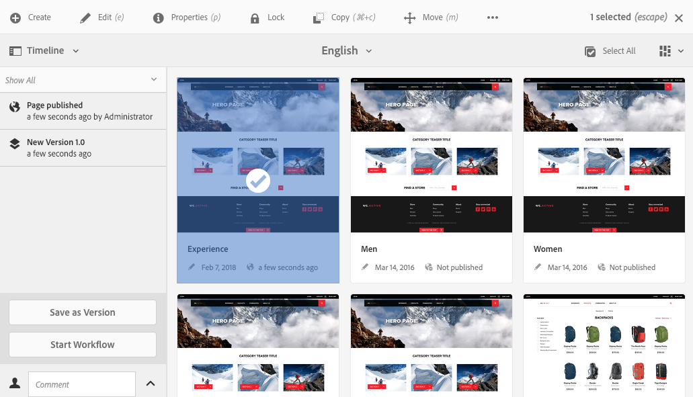

# Utilizzo delle versioni di una pagina  {#working-with-page-versions}

Il controllo delle versioni crea un&#39;istantanea di una pagina in un determinato momento. Con il controllo delle versioni è possibile eseguire le azioni seguenti:

* Crea una versione di una pagina.
* Ripristina una pagina a una versione precedente, ad esempio:
   * per annullare una modifica apportata alla pagina.
* Confrontare la versione corrente della pagina con una versione precedente:
   * per evidenziare le differenze nel testo e nelle immagini.

## Creazione di una nuova versione   {#creating-a-new-version}

Puoi creare una versione della risorsa da:

* il [Barra Timeline](#creating-a-new-version-timeline)
* il [Crea](#creating-a-new-version-create-with-a-selected-resource) opzione (quando è selezionata una risorsa)

### Creazione di una nuova versione - Timeline {#creating-a-new-version-timeline}

1. Passa alla pagina per la quale desideri creare una versione.
1. Seleziona la pagina in [modalità di selezione](/help/sites-authoring/basic-handling.md#viewing-and-selecting-resources).
1. Apri **Timeline** colonna.
1. Tocca o fai clic sulla freccia accanto al campo del commento per visualizzare le opzioni:

   

1. Seleziona **Salva come versione**.
1. Immetti un **Etichetta** e **Commento** se necessario.

   

1. Conferma la nuova versione selezionando **Crea**.

   Le informazioni nella timeline vengono aggiornate per indicare che si tratta di una nuova versione.

### Creazione di una nuova versione - Con una risorsa selezionata {#creating-a-new-version-create-with-a-selected-resource}

1. Passa alla pagina per la quale desideri creare una versione.
1. Seleziona la pagina in [modalità di selezione](/help/sites-authoring/basic-handling.md#viewing-and-selecting-resources).
1. Seleziona la **Crea** nella barra degli strumenti per aprire la finestra di dialogo.
1. Nella finestra di dialogo, puoi immettere un **Etichetta** e un **Commento** se necessario:

   

1. Conferma la nuova versione selezionando **Crea**.

   La timeline viene aperta con le informazioni aggiornate per indicare che si tratta di una nuova versione.

## Ripristino delle versioni {#reinstating-versions}

Dopo aver creato una versione della pagina, esistono diversi metodi per ripristinare una versione precedente:

* L&#39;opzione **Ripristina questa versione** dalla barra [Timeline](/help/sites-authoring/basic-handling.md#timeline)

  Ripristinare una versione precedente di una pagina selezionata.

* L&#39;opzione **Ripristina** dalla [barra delle azioni](/help/sites-authoring/basic-handling.md#actions-toolbar) in alto

   * **Ripristina versione**

     Ripristina le versioni delle pagine specificate nella cartella attualmente selezionata; questo può anche includere il ripristino di pagine precedentemente eliminate.

   * **Ripristina albero**

     Ripristinare la versione dell&#39;intera struttura così come appariva a una data e un&#39;ora specificate può includere pagine precedentemente eliminate.

>[!NOTE]
>
>Durante il ripristino di una pagina, la versione creata sarà parte di un nuovo ramo.
>
>Per maggiore chiarezza:
>
>1. Crea versioni di qualsiasi pagina.
>1. Le etichette iniziali e i nomi dei nodi di versione saranno 1.0, 1.1, 1.2 e così via.
>1. Ripristina la prima versione; in questo caso, 1.0.
>1. Crea di nuovo le versioni.
>1. Le etichette e i nomi dei nodi generati saranno ora 1.0.0, 1.0.1, 1.0.2 e così via.

### Ripristina una versione {#revert-to-a-version}

Per **ripristinare** la pagina selezionata in una versione precedente:

1. Passa alla pagina in cui desideri ripristinare una versione precedente.
1. Seleziona la pagina in [modalità di selezione](/help/sites-authoring/basic-handling.md#viewing-and-selecting-resources).
1. Apri la colonna **Timeline** e seleziona **Mostra tutti** o **Versioni**. Vengono elencate le versioni della pagina selezionata.
1. Seleziona la versione da ripristinare. Vengono visualizzate le opzioni possibili:

   

1. Seleziona **Ripristina questa versione**. La versione selezionata viene ripristinata e le informazioni nella timeline aggiornate.

### Ripristina versione {#restore-version}

Questo metodo può essere utilizzato per ripristinare versioni di pagine specifiche all&#39;interno della cartella corrente; questo può anche includere il ripristino di pagine eliminate precedentemente:

1. Vai alla cartella richiesta e [selezionala](/help/sites-authoring/basic-handling.md#viewing-and-selecting-resources).

1. Seleziona **Ripristina**, quindi **Ripristina versione** dalla [barra delle azioni](/help/sites-authoring/basic-handling.md#actions-toolbar) in alto.

   >[!NOTE]
   >
   >Se:
   >
   >* hai selezionato una singola pagina che non ha mai avuto pagine figlie,
   >* o nessuna delle pagine della cartella dispone di versioni,
   >
   >Il display è quindi vuoto in quanto non sono disponibili versioni applicabili.

1. Sono elencate le versioni disponibili:

   

1. Per una pagina specifica, utilizza il selettore a discesa in **RIPRISTINA VERSIONE** per selezionare la versione richiesta per la pagina.

   

1. Nella visualizzazione principale, seleziona la pagina da ripristinare:

   

1. Seleziona **Ripristina** per la versione della pagina selezionata da ripristinare come versione corrente.

>[!NOTE]
>
>L’ordine in cui selezioni una pagina richiesta e la relativa versione è intercambiabile.

### Ripristina albero {#restore-tree}

Questo metodo può essere utilizzato per ripristinare una versione di una struttura in una data e in un&#39;ora specificate; possono essere incluse le pagine precedentemente eliminate:

1. Vai alla cartella richiesta e [selezionala](/help/sites-authoring/basic-handling.md#viewing-and-selecting-resources).

1. Seleziona **Ripristina**, quindi **Ripristina struttura** dalla [barra delle azioni](/help/sites-authoring/basic-handling.md#actions-toolbar) in alto. Viene visualizzata la versione più recente della struttura:

   

1. Utilizza il selettore data e ora in **Versioni più recenti alla data** per selezionare un&#39;altra versione della struttura, quella da ripristinare.

1. Imposta il contrassegno **Pagine non versionate salvate** se necessario:

   * Se è attiva (selezionata), tutte le pagine senza versione vengono mantenute e non sono interessate dal ripristino.

   * Se non è attiva (deselezionata), tutte le pagine senza versione vengono rimosse in quanto non esistevano nella struttura con versione.

1. Seleziona **Ripristina** per la versione selezionata della struttura da ripristinare come versione *attuale*.

## Anteprima di una versione   {#previewing-a-version}

Puoi visualizzare in anteprima una versione specifica:

1. Passare alla pagina che si desidera confrontare.
1. Seleziona la pagina in [modalità di selezione](/help/sites-authoring/basic-handling.md#viewing-and-selecting-resources).
1. Apri la colonna **Timeline** e seleziona **Mostra tutti** o **Versioni**.
1. Vengono elencate le versioni della pagina. Seleziona la versione da visualizzare in anteprima:

   

1. Seleziona **Anteprima**. La pagina viene visualizzata in una nuova scheda.

   >[!CAUTION]
   >
   >Se una pagina è stata spostata, non è più possibile eseguire un&#39;anteprima sulle versioni create prima dello spostamento.
   >
   >* Se riscontri problemi con un’anteprima, controlla [Timeline](/help/sites-authoring/basic-handling.md#timeline) affinché la pagina possa vedere se è stata spostata.

## Confronto di una versione con la pagina corrente {#comparing-a-version-with-current-page}

Per confrontare una versione precedente con la pagina corrente:

1. Passare alla pagina che si desidera confrontare.
1. Seleziona la pagina in [modalità di selezione](/help/sites-authoring/basic-handling.md#viewing-and-selecting-resources).
1. Apri la colonna **Timeline** e seleziona **Mostra tutti** o **Versioni**.
1. Vengono elencate le versioni della pagina. Seleziona la versione da confrontare:

   

1. Seleziona **Confronta con corrente**. Il [differenze di pagina](/help/sites-authoring/page-diff.md) viene visualizzato per visualizzare le differenze.

## Timewarp   {#timewarp}

Timewarp è una funzione progettata per simulare lo stato *di pubblicazione* di una pagina in specifici momenti nel passato.

>[!TIP]
>
>[Timewarp può essere utilizzato anche con Launches per visualizzare anteprime](/help/sites-authoring/launches.md) con AEM 6.5.10.0 o versione successiva.

La creazione dei contenuti è un processo continuo e collaborativo. Lo scopo di Timewarp è quello di consentire agli autori di tenere traccia del sito web pubblicato nel tempo, per aiutarli a comprendere come è cambiato il contenuto. Questa funzione utilizza le versioni delle pagine per determinare lo stato dell’ambiente di pubblicazione:

* Il sistema cerca la versione della pagina che era attiva al momento selezionato.
   * Questa versione della pagina è stata creata/attivata *prima di* il momento selezionato in Timewarp.
* Quando si passa a una pagina che è stata eliminata, questa viene riprodotta purché nell’archivio siano ancora disponibili le versioni precedenti della pagina.
* Se non viene trovata alcuna versione pubblicata, Timewarp ripristina lo stato corrente della pagina nell’ambiente di authoring (per evitare un errore 404 di pagina non trovata, che impedirebbe la navigazione).

### Utilizzo di Timewarp {#using-timewarp}

Timewarp è un [modalità](/help/sites-authoring/author-environment-tools.md#page-modes) dell’editor pagina. Per avviarlo, è sufficiente cambiarlo come si farebbe con qualsiasi altra modalità.

1. Avvia l’editor per la pagina in cui desideri avviare Timewarp, quindi seleziona **Timewarp** nella selezione della modalità.

   

1. Nella finestra di dialogo, imposta una data e un’ora di destinazione e tocca o fai clic su **Imposta data**. Se non si seleziona un&#39;ora, viene utilizzata come impostazione predefinita l&#39;ora corrente.

   

1. La pagina viene visualizzata in base al set di date. La modalità Timewarp è indicata dalla barra di stato blu nella parte superiore della finestra. Utilizza i collegamenti nella barra di stato per selezionare una nuova data di destinazione o uscire dalla modalità Timewarp.

   

### Limitazioni di Timewarp {#timewarp-limitations}

Timewarp semplifica al massimo la riproduzione di una pagina in un determinato momento. Tuttavia, a causa delle complessità dell’authoring continuo dei contenuti in AEM, questo non è sempre possibile. Tieni presenti queste limitazioni quando utilizzi Timewarp.

* **Timewarp funziona in base alle pagine pubblicate** - Timewarp funziona correttamente solo se la pagina è stata già pubblicata. In caso contrario, timewarp mostra la pagina corrente nell’ambiente di authoring.
* **Timewarp utilizza le versioni di pagina** - Se passi a una pagina che è stata rimossa o eliminata dall’archivio, questa viene riprodotta correttamente se nell’archivio sono ancora disponibili versioni precedenti della pagina.
* **Le versioni rimosse influiscono su Timewarp**: se dalla directory archivio sono state rimosse delle versioni, Timewarp non può mostrare la visualizzazione corretta.

* **Timewarp è di sola lettura**: non è possibile modificare la versione precedente della pagina, ma solo visualizzarla. Se desideri ripristinare la versione precedente, devi farlo manualmente utilizzando [ripristinare](#reverting-to-a-page-version).

* **Timewarp si basa solo sul contenuto della pagina** - Se sono stati modificati alcuni elementi per il rendering del sito web, la visualizzazione sarà diversa da come era all’origine, poiché per tali elementi non vengono conservate versioni nell’archivio. Tali elementi includono, tra gli altri, codice, css, risorse/immagini.

>[!CAUTION]
>
>Timewarp è uno strumento appositamente pensato per aiutare gli autori a comprendere e creare i propri contenuti. Non deve essere utilizzato come registro di controllo o per fini legali.
