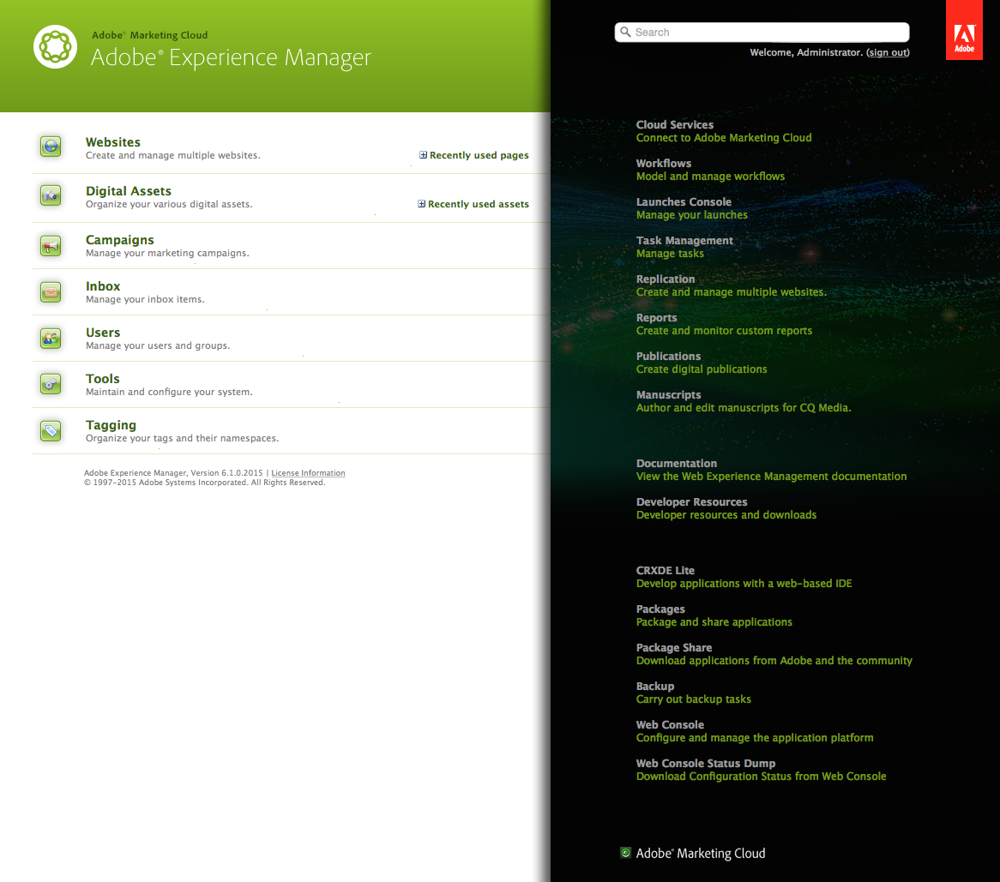

# Operazioni di base{#basic-handling}

>[!NOTE]
>
>* Questa pagina offre una panoramica delle operazioni di base nell’ambiente di authoring di AEM. Usa la console **Sites** come base.
>
>* Alcune funzionalità non sono disponibili in tutte le console e/o in alcune console sono disponibili funzionalità aggiuntive. Informazioni specifiche sulle singole console e sulle relative funzionalità verranno trattate più dettagliatamente in altre pagine.
>* AEM supporta l’utilizzo di scelte rapide da tastiera in numerose aree, in particolare per l’[utilizzo delle console](/help/sites-classic-ui-authoring/author-env-keyboard-shortcuts.md) e la [modifica delle pagine](/help/sites-classic-ui-authoring/classic-page-author-keyboard-shortcuts.md).
>

## Schermata iniziale {#the-welcome-screen}

Nell’interfaccia classica, sono disponibili diverse console in cui è possibile navigare e avviare azioni con i consueti metodi di clic, doppio clic e [menu di scelta rapida](#context-menus).

Al momento dell’accesso verrà visualizzata la schermata introduttiva, che fornisce un elenco di collegamenti alle console e ai servizi:

## Console {#consoles}

Le console principali sono:

<table>
 <tbody>
  <tr>
   <td><strong>Console</strong></td>
   <td><strong>Scopo</strong></td>
  </tr>
  <tr>
   <td><strong>Benvenuto</strong></td>
   <td>Offre una panoramica e un accesso diretto (tramite collegamenti) alla funzionalità principale di AEM.</td>
  </tr>
  <tr>
   <td><strong>Risorse digitali</strong>  </td>
   <td>Queste console consentono di importare e <a href="/help/sites-classic-ui-authoring/classicui-assets.md">gestire le risorse digitali</a> come immagini, video, documenti e file audio. Queste risorse possono quindi essere utilizzate da qualsiasi sito web in esecuzione sulla stessa istanza AEM. </td>
  </tr>
  <tr>
   <td><strong>Lanci</strong></td>
   <td>Questo consente di gestire le <a href="/help/sites-classic-ui-authoring/classic-launches.md">lanci</a>; questi consentono di sviluppare contenuti per una versione futura di una o più pagine web attivate.  <i>Nota: Nell’interfaccia touch molte delle funzionalità sono disponibili nella console Sites e nella barra laterale Riferimenti.</i> <i>Se necessario, questa console è disponibile dalla console Strumenti; selezionare Operazioni, quindi Lanci.</i></td>
  </tr>
  <tr>
   <td><strong>Casella in entrata </strong></td>
   <td>In molti casi, le attività secondarie di un flusso di lavoro coinvolgono più persone, ognuna delle quali deve completare un passaggio prima di passare il lavoro alla persona successiva. La casella in entrata consente di visualizzare le notifiche relative a tali attività. Vedi <a href="/help/sites-administering/workflows.md">Utilizzo dei flussi di lavoro</a>.   </td>
  </tr>
  <tr>
   <td><strong>Assegnazione dei tag</strong></td>
   <td>Le console Assegnazione tag consentono di gestire i tag. I tag sono parole o nomi brevi che è possibile utilizzare per classificare e annotare i contenuti per facilitarne la ricerca e l’organizzazione. Per ulteriori informazioni consulta <a href="/help/sites-classic-ui-authoring/classic-feature-tags.md">Utilizzo e gestione dei tag</a>.</td>
  </tr>
  <tr>
   <td><strong>Strumenti</strong></td>
   <td>La <a href="/help/sites-administering/tools-consoles.md">Console strumenti</a> accedi a console e strumenti specifici per la gestione di siti web, risorse digitali e altri aspetti dell’archivio dei contenuti.</td>
  </tr>
  <tr>
   <td><strong>Utenti</strong></td>
   <td>Queste console consentono di gestire i diritti di accesso di utenti e gruppi. Per maggiori dettagli vedi <a href="/help/sites-administering/security.md">Amministrazione degli utenti e sicurezza</a>.  </td>
  </tr>
  <tr>
   <td><strong>Siti Web</strong></td>
   <td>Le console Siti e Siti Web consentono di: <a href="/help/sites-classic-ui-authoring/classic-page-author.md">creare, visualizzare e gestire siti web</a> in esecuzione sull'istanza AEM. Da queste console puoi creare, copiare, spostare ed eliminare pagine di siti web, avviare flussi di lavoro e attivare (pubblicare) le pagine. È inoltre possibile aprire una pagina per la modifica.  </td>
  </tr>
  <tr>
   <td><strong>Flussi di lavoro</strong></td>
   <td>Un flusso di lavoro è una serie definita di passaggi che descrive il processo di completamento di alcune attività. In molti casi, un’attività coinvolge più persone e ciascuna persona deve completare il proprio passaggio prima di passare il lavoro alla persona successiva. La console Flusso di lavoro consente di generare modelli di flusso di lavoro e di gestire le istanze del flusso di lavoro in esecuzione. Vedi <a href="/help/sites-administering/workflows.md">Utilizzo dei flussi di lavoro</a>.  </td>
  </tr>
 </tbody>
</table>

La **Siti Web** console consente di navigare tra le pagine e gestirle tramite due riquadri:

* Riquadro a sinistra

   Mostra la struttura ad albero dei siti web e le relative pagine.

   Contiene inoltre informazioni su altri aspetti o AEM, compresi progetti, blueprint e risorse.

* Riquadro a destra

   Mostra le pagine (nella posizione selezionata nel riquadro a sinistra) e può essere utilizzato per eseguire azioni.

Da qui puoi [gestire le pagine](/help/sites-authoring/managing-pages.md) utilizzando la barra degli strumenti, un menu di scelta rapida o aprendo una pagina per ulteriori azioni.

>[!NOTE]
>
>Tutte le console condividono le stesse operazioni di base. Questa sezione si concentra sul **Siti Web** console come console primaria per l’authoring.

## Accedere all’Aiuto   {#accessing-help}

In diverse console (ad esempio Siti web) è disponibile anche **Aiuto** Questo pulsante è disponibile per aprire Condivisione pacchetti o il sito della documentazione.

Durante la modifica di una pagina il [La barra laterale dispone anche di un pulsante per accedere all’Aiuto](/help/sites-classic-ui-authoring/classic-page-author-env-tools.md#accessing-help).

## Navigazione con la console Siti Web {#navigating-with-the-websites-console}

La **Siti Web** la console elenca le pagine di contenuto in una struttura ad albero (riquadro a sinistra). Per semplificare la navigazione, le sezioni della struttura ad albero possono essere espanse (+) o compresse (-) come richiesto:

* Fai clic sul nome della pagina nel riquadro a sinistra per:

   * Elencare le pagine figlie nel riquadro a destra
   * Espandere la struttura nel riquadro a sinistra.

      Per motivi di prestazioni questa azione dipende dal numero di nodi figlio. Con un&#39;installazione standard questo metodo di espansione funziona quando ci sono `30` o meno nodi figlio.

* Anche un doppio clic sul nome della pagina (riquadro a sinistra) espanderà la struttura, anche se poiché la pagina viene aperta contemporaneamente questo effetto non è così ovvio.

>[!NOTE]
>
>Questo valore predefinito ( `30`) può essere modificato per console nelle configurazioni specifiche dell&#39;applicazione del widget siteadmin :
>
>Sul nodo siteadmin :
>
>Imposta il valore della proprietà:
>`treeAutoExpandMax`
>il:
>`/apps/wcm/core/content/siteadmin`
>
>O globalmente nel tema:
>Imposta il valore di:
>`TREE_AUTOEXPAND_MAX`
>in:
>`/apps/cq/ui/widgets/themes/default/widgets/wcm/SiteAdmin.js`
>
>Vedi [SiteAdmin nell’API dei widget CQ](https://helpx.adobe.com/experience-manager/6-5/sites/developing/using/reference-materials/widgets-api/index.html?class=CQ.wcm.SiteAdmin) per ulteriori dettagli.

## Informazioni sulle pagine nella console Siti Web {#page-information-on-the-websites-console}

Il riquadro a destra del **Siti Web** la console fornisce una vista a elenco con informazioni sulle pagine:

sono disponibili le seguenti informazioni: un sottoinsieme di questi campi viene visualizzato come predefinito:

<table>
 <tbody>
  <tr>
   <td><strong>Colonna</strong></td>
   <td><strong>Descrizione</strong></td>
  </tr>
  <tr>
   <td>Miniatura </td>
   <td>Mostra una miniatura della pagina.</td>
  </tr>
  <tr>
   <td>Titolo</td>
   <td>Titolo visualizzato sulla pagina</td>
  </tr>
  <tr>
   <td>Nome</td>
   <td>Il nome AEM fa riferimento alla pagina</td>
  </tr>
  <tr>
   <td>Pubblicato</td>
   <td>Indica se la pagina è stata pubblicata e specifica la data e l’ora di pubblicazione.</td>
  </tr>
  <tr>
   <td>Modificato</td>
   <td>Indica se la pagina è stata modificata e specifica la data e l’ora di modifica. Per salvare eventuali modifiche, è necessario attivare la pagina.</td>
  </tr>
  <tr>
   <td>Pubblicazione Scene7</td>
   <td>Indica se la pagina è stata pubblicata su Scene7.  </td>
  </tr>
  <tr>
   <td>Stato</td>
   <td>Indica lo stato corrente della pagina, specificando ad esempio se la pagina fa parte di un flusso di lavoro o Live Copy o se al momento è bloccata.</td>
  </tr>
  <tr>
   <td>Impression</td>
   <td>Mostra l’attività su una pagina in termini di numero di hit.</td>
  </tr>
  <tr>
   <td>Modello</td>
   <td>Indica il modello su cui si basa una pagina.</td>
  </tr>
  <tr>
   <td>Nel flusso di lavoro</td>
   <td>Indica quando la pagina si trova in un flusso di lavoro.</td>
  </tr>
  <tr>
   <td>Bloccato da</td>
   <td>Indica se una pagina è stata bloccata e l’account utente che l’ha bloccata.</td>
  </tr>
  <tr>
   <td>Live Copy </td>
   <td>Indica se la pagina fa parte di una Live Copy.</td>
  </tr>
 </tbody>
</table>

>[!NOTE]
>
>Per selezionare le colonne visibili, passate il puntatore del mouse sul titolo di una colonna. Verrà visualizzato un menu a discesa, da qui è possibile utilizzare il **Colonne** opzione .

I colori accanto alle pagine nel **Pubblicato** e **Modificato** le colonne indicano lo stato di pubblicazione:

| **Colonna** | **Colore** | **Descrizione** |
|---|---|---|
| Pubblicato | Verde | La pubblicazione ha avuto successo. Il contenuto viene pubblicato. |
| Pubblicato | Giallo | La pubblicazione è in sospeso. Il sistema non ha ancora ricevuto la conferma della pubblicazione. |
| Pubblicato | Rosso | Pubblicazione non riuscita. Non esiste alcuna connessione con l’istanza di pubblicazione. Questo può anche indicare che il contenuto è stato disattivato. |
| Pubblicato | *blank* | Questa pagina non è mai stata pubblicata. |
| Modificato | Blu | La pagina è stata modificata dopo l’ultima pubblicazione. |
| Modificato | *blank* | La pagina non è mai stata modificata o non è stata modificata dopo l’ultima pubblicazione. |

## Menu di scelta rapida {#context-menus}

Nell’interfaccia classica, la navigazione e le azioni vengono eseguite mediante operazioni consuete, quali clic e doppio clic. A seconda della situazione attuale, sono disponibili anche una serie di menu di scelta rapida (solitamente aperti con il pulsante destro del mouse):

