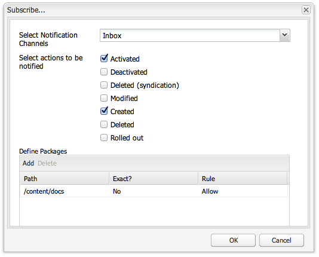

# Casella in entrata{#your-inbox}

Puoi ricevere notifiche da varie aree di AEM, ad esempio notifiche relative a elementi di lavoro o attività che rappresentano azioni da eseguire sul contenuto della pagina.

Tali notifiche vengono recapitate in due caselle in entrata, a seconda del tipo di notifica:

* Una casella in entrata per le notifiche ricevute in seguito alla sottoscrizione di un abbonamento, descritta nella sezione successiva.
* Una casella in entrata specializzata per gli elementi del flusso di lavoro è descritta in [Partecipazione ai flussi di lavoro](/help/sites-classic-ui-authoring/classic-workflows-participating.md) documento.

## Visualizzazione delle notifiche {#viewing-your-notifications}

Per visualizzare le notifiche:

1. Apri la casella in entrata notifica. Nella console **Siti Web** fai clic sul pulsante dell’utente in alto a destra e seleziona **Casella in entrata notifica**.

   

   >[!NOTE]
   >
   >È inoltre possibile accedere alla console direttamente nel browser; per esempio:
   >
   >
   >` https://<host>:<port>/libs/wcm/core/content/inbox.html`

1. Vengono elencate le notifiche disponibili e puoi intervenire in base alle necessità mediante:

   * [Iscrizione alle notifiche](#subscribing-to-notifications)
   * [Elaborazione delle notifiche](#processing-your-notifications)

   

## Iscrizione alle notifiche {#subscribing-to-notifications}

Per effettuare la sottoscrizione alle notifiche:

1. Apri la casella in entrata notifica. Nella console **Siti Web** fai clic sul pulsante dell’utente in alto a destra e seleziona **Casella in entrata notifica**.

   

   >[!NOTE]
   >
   >È inoltre possibile accedere alla console direttamente nel browser; per esempio:
   >
   >
   >`https://<host>:<port>/libs/wcm/core/content/inbox.html`

1. Fai clic su **Configura** nell’angolo in alto a sinistra per aprire la finestra di dialogo di configurazione.

   

1. Seleziona il canale di notifica:

   * **Casella in entrata notifica**: le notifiche vengono visualizzate nella casella in entrata AEM dell’utente.
   * **E-mail**: le notifiche vengono inviate all’indirizzo e-mail definito nel profilo dell’utente.

   >[!NOTE]
   >
   >Per ricevere la notifica tramite e-mail è necessario configurare alcune impostazioni. È inoltre possibile personalizzare il modello e-mail o aggiungere un modello e-mail per una nuova lingua. Per configurare la notifica tramite e-mail in AEM, consulta [Configurazione notifica e-mail](/help/sites-administering/notification.md#configuringemailnotification).

1. Selezionare le azioni della pagina per le quali si desidera ricevere la notifica:

   * Attivato: evento di attivazione di una pagina.
   * Disattivato: evento di disattivazione di una pagina.
   * Eliminato (sindacazione): evento di eliminazione di una pagina seguito dalla replica dell’eliminazione.
Quando una pagina viene eliminata o spostata, l’azione di eliminazione viene replicata automaticamente: la pagina viene eliminata nell’istanza di origine, in cui è stata eseguita l’azione, e nell’istanza di destinazione definita dagli agenti di replica.

   * Modificato: evento di modifica di una pagina.
   * Creato: evento di creazione di una pagina.
   * Eliminato: evento di eliminazione di una pagina tramite un’operazione di eliminazione di pagine.
   * Rollout eseguito: evento di rollout di una pagina.

1. Specificate i percorsi delle pagine per cui desiderate ricevere le notifiche:

   * Fai clic su **Aggiungi** per aggiungere una nuova riga alla tabella.
   * Fai clic sul pulsante **Percorso** e inserire il percorso, ad esempio `/content/docs`.

   * Per ricevere le notifiche per tutte le pagine appartenenti al sottoalbero, imposta **Esatto?** su **No**.
Per ricevere le notifiche solo per la pagina definita dal percorso, impostate **Esatto?** su **Sì**.

   * Per abilitare la regola, imposta **Regola** su **Consenti**. Se specifichi **Rifiuta**, la regola viene disabilitata ma non viene rimossa e può essere abilitata in seguito.

   Per rimuovere una definizione, seleziona la riga facendo clic su una cella della tabella e quindi fai clic su **Elimina**.

1. Fai clic su **OK** per salvare la configurazione.

## Elaborazione delle notifiche {#processing-your-notifications}

Se è stato scelto di ricevere le notifiche nella casella in entrata di AEM, queste vengono inserite nella casella in entrata. Puoi [visualizzare le notifiche](#viewing-your-notifications) e quindi selezionare le notifiche richieste per effettuare le seguenti operazioni:

* Approvare la notifica facendo clic su **Approva**. Il valore nella colonna **Leggi** viene impostato su **true**.

* Per eliminare la notifica, fate clic su **Elimina**.

