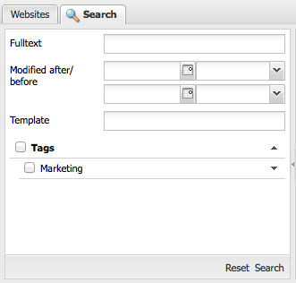

# Ricerca{#searching}

L’ambiente di authoring di AEM offre vari metodi per la ricerca dei contenuti, a seconda del tipo di risorsa.

>[!NOTE]
>
>All&#39;esterno dell&#39;ambiente di authoring sono disponibili altri meccanismi di ricerca, ad esempio [Query Builder](/help/sites-developing/querybuilder-api.md) e [CRXDE Liti](/help/sites-developing/developing-with-crxde-lite.md).

## Informazioni di base sulla ricerca {#search-basics}

Per accedere al pannello di ricerca, fare clic sulla scheda **Cerca** nella parte superiore del riquadro a sinistra della console appropriata.

Il pannello di ricerca consente di eseguire ricerche in tutte le pagine del sito web. Contiene campi e widget per:

* **Testo completo**: cerca il testo specificato
* **Modificato dopo/prima**: eseguire la ricerca solo nelle pagine modificate tra le date specifiche
* **Modello**: cerca solo le pagine basate sul modello specificato
* **Tag**: cerca solo le pagine con i tag specificati

>[!NOTE]
>
>Quando l&#39;istanza è configurata per la [ricerca Lucene](/help/sites-deploying/queries-and-indexing.md) puoi utilizzare quanto segue in **Testo completo**:
>
>* [Caratteri jolly](https://lucene.apache.org/core/5_3_1/queryparser/org/apache/lucene/queryparser/classic/package-summary.html#Wildcard_Searches)
>* [Operatori booleani](https://lucene.apache.org/core/5_3_1/queryparser/org/apache/lucene/queryparser/classic/package-summary.html#Boolean_operators)
>
>* [Espressioni regolari](https://lucene.apache.org/core/5_3_1/queryparser/org/apache/lucene/queryparser/classic/package-summary.html#Regexp_Searches)
>* [Raggruppamento campi](https://lucene.apache.org/core/5_3_1/queryparser/org/apache/lucene/queryparser/classic/package-summary.html#Field_Grouping)
>* [Aumento](https://lucene.apache.org/core/5_3_1/queryparser/org/apache/lucene/queryparser/classic/package-summary.html#Boosting_a_Term)
>

Eseguire la ricerca facendo clic su **Cerca** nella parte inferiore del riquadro. Fare clic su **Reimposta** per cancellare i criteri di ricerca.

## Filtro {#filter}

In varie posizioni è possibile impostare (e cancellare) un filtro per approfondire e perfezionare la visualizzazione:

## Trova e sostituisci {#find-and-replace}

Nella console **Siti Web** un&#39;opzione di menu **Trova e sostituisci** consente di cercare e sostituire più istanze di una stringa all&#39;interno di una sezione del sito Web.

1. Selezionare la pagina principale, o cartella, in cui si desidera eseguire l&#39;azione di ricerca e sostituzione.
1. Seleziona **Strumenti**, quindi **Trova e sostituisci**:

   

1. La finestra di dialogo **Trova e sostituisci** esegue le operazioni seguenti:

   * conferma il percorso della directory principale da cui deve iniziare l&#39;azione di ricerca
   * definisce il termine da trovare
   * definisce il termine che deve sostituirlo
   * indica se la ricerca deve fare distinzione tra maiuscole e minuscole
   * indica se devono essere trovate solo parole intere (altrimenti vengono trovate anche sottostringhe)

   Facendo clic su **Anteprima** viene visualizzato l&#39;elenco in cui è stato trovato il termine. È possibile selezionare/cancellare istanze specifiche da sostituire:

   

1. Fare clic su **Sostituisci** per sostituire tutte le istanze. Viene richiesto di confermare l’operazione.

L&#39;ambito predefinito per il servlet find e replace include le seguenti proprietà:

* `jcr:title`
* `jcr:description`
* `jcr:text`
* `text`

È possibile modificare l&#39;ambito utilizzando Apache Felix Web Management Console (ad esempio, in `https://localhost:4502/system/console/configMgr`). Selezionare `CQ WCM Find Replace Servlet (com.day.cq.wcm.core.impl.servlets.FindReplaceServlet)` e configurare l&#39;ambito in base alle esigenze.

>[!NOTE]
>
>In un’installazione standard di AEM, Find and Replace utilizza Lucene per la funzionalità di ricerca.
>
>Lucene indicizza proprietà di stringa fino a 16 KB di lunghezza. Le stringhe che superano questo valore non verranno cercate.
