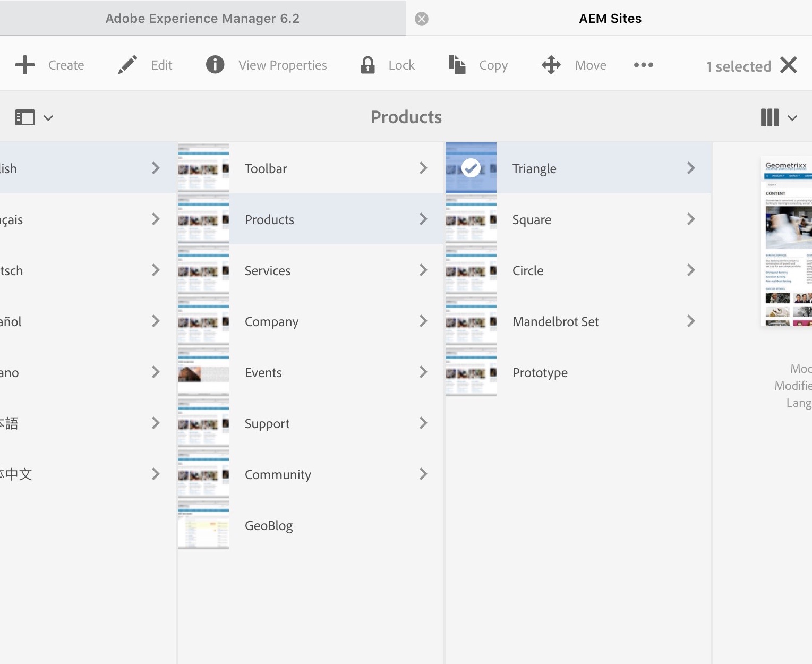

# Utilizzo dell’ambiente di authoring{#working-with-the-author-environment}

>[!NOTE]
>
>La documentazione seguente si concentra sull’interfaccia utente classica. Per informazioni sull’authoring nella moderna interfaccia utente touch, consulta la sezione [Documentazione di authoring standard](/help/assets/assets.md).

L’ambiente di authoring consente di eseguire attività relative a:

* [Authoring](/help/sites-authoring/author.md) (incluso [authoring delle pagine](/help/sites-authoring/qg-page-authoring.md) e [gestione delle risorse](/help/assets/assets.md))

* [Amministrazione](/help/sites-administering/administer-best-practices.md) attività necessarie per la generazione e la manutenzione del contenuto del sito web

Per ottenere questo risultato, sono disponibili due interfacce utente grafiche, accessibili tramite qualsiasi browser moderno:

1. Interfaccia classica

   * Questa interfaccia utente è sempre stata disponibile in AEM per molti anni.
   * È prevalentemente verde.
   * È stato progettato per essere utilizzato su dispositivi desktop.
   * Non viene più mantenuto.
   * La documentazione seguente si concentra su questa interfaccia classica. Per informazioni sull’authoring nell’interfaccia utente moderna basata su touch, consulta la sezione [Documentazione di authoring standard](/help/sites-authoring/author.md).

   

1. Interfaccia touch

   * Questa è la moderna interfaccia utente AEM standard.
   * È prevalentemente grigia, con un&#39;interfaccia pulita e piatta.
   * È progettato per essere utilizzato sia su dispositivi touch che desktop (ottimizzati per il touch). Il look and feel è lo stesso su tutti i dispositivi, tuttavia [visualizzazione e selezione delle risorse](/help/sites-authoring/basic-handling.md) differisce leggermente (tocchi rispetto a clic).
   * Consulta la [Documentazione di authoring standard](/help/sites-authoring/author.md) per ulteriori dettagli su come effettuare l’authoring utilizzando l’interfaccia utente touch. La documentazione seguente si concentra sull’interfaccia utente classica.

   * Desktop:

   

   * Dispositivi tablet (o desktop con larghezza inferiore a 1024 pixel):

   
