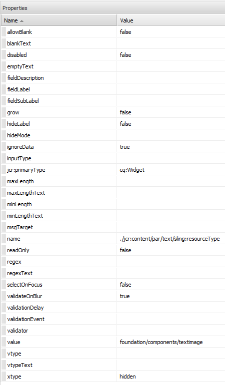

# Scaffolding{#scaffolding}

A volte può essere necessario creare un set di pagine di grandi dimensioni con una struttura comune ma contenuti diversi. Tramite l’interfaccia standard di Adobe Experience Manager (AEM), è necessario creare ogni pagina, trascinare i componenti appropriati nella pagina e compilarli singolarmente.

Con lo scaffolding è possibile creare un modulo (uno scaffold) con campi che riflettono la struttura desiderata per le pagine e quindi utilizzare questo modulo per creare facilmente pagine basate su questa struttura.

>[!NOTE]
>
>Lo scaffolding (nell&#39;interfaccia classica) [rispetta l&#39;ereditarietà MSM](#scaffolding-with-msm-inheritance).

## Come funziona lo scaffolding {#how-scaffolding-works}

Gli scaffold sono archiviati nella console **Strumenti** dell&#39;amministratore del sito.

* Apri la console **Strumenti** e fai clic su **Scaffolding pagine predefinito**.
* Fare clic su **Geometrixx**.
* In **Geometrixx** è presente una *pagina di scaffolding* denominata **Notizie**. Fare doppio clic per aprire la pagina.

Lo scaffold è costituito da un modulo con un campo per ogni elemento di contenuto che costituirà la pagina da creare e quattro parametri importanti a cui si accede tramite le **Proprietà pagina** della pagina scaffold.

Le proprietà della pagina di scaffolding sono:

* **Testo titolo**: questo è il nome della pagina di scaffolding. In questo esempio, si chiama &quot;News&quot;.
* **Descrizione**: appare sotto il titolo della pagina di scaffolding.
* **Modello di destinazione**: questo è il modello che verrà utilizzato da questo scaffold per creare una pagina. In questo esempio è un modello di *Pagina contenuto Geometrixx*.
* **Percorso di destinazione**: è il percorso della pagina padre in cui verranno create le pagine da questo scaffold. In questo esempio, il percorso è */content/geometrixx/en/news*.

Il corpo dell&#39;impalcatura è la forma. Quando un utente desidera creare una pagina utilizzando lo scaffold compila il modulo e fa clic su *Crea*, in basso. Nell&#39;esempio **News** precedente il modulo include i campi seguenti:

* **Titolo**: questo è il nome della pagina da creare. Questo campo è sempre presente su ogni scaffold.
* **Testo**: questo campo corrisponde a un componente testo nella pagina risultante.
* **Immagine**: questo campo corrisponde a un componente Immagine nella pagina risultante.
* **Immagine/Avanzate**: **Titolo**: titolo dell&#39;immagine.
* **Immagine/Avanzato**: **Testo alternativo**: Testo alternativo per l&#39;immagine.
* **Immagine/Avanzato**: **Descrizione**: descrizione dell&#39;immagine.
* **Immagine/Avanzato**: **Dimensione**: dimensione dell&#39;immagine.
* **Tag/Parole chiave**: metadati da assegnare a questa pagina. Questo campo è sempre presente su ogni scaffold.

### Creazione di uno scaffold {#creating-a-scaffold}

Per creare uno scaffolding, vai alla console **Strumenti**, quindi **Scaffolding pagine predefinito** e crea una pagina. È disponibile un tipo di modello a pagina singola, il *modello di scaffolding.*

Vai a **Proprietà pagina** della nuova pagina e imposta *Testo titolo*, *Descrizione*, *Modello destinazione* e *Percorso destinazione*, come descritto in precedenza.

Successivamente, devi definire la struttura della pagina che verrà creata da questo scaffold. A tale scopo, passare alla **[modalità progettazione](/help/sites-authoring/page-authoring.md#sidekick)** nella pagina di scaffold. Viene visualizzato un collegamento che consente di modificare lo scaffold nell&#39;**editor di finestre di dialogo**.

Utilizzando l’editor delle finestre di dialogo, puoi specificare le proprietà che verranno create ogni volta che viene creata una nuova pagina utilizzando questo scaffold.

La definizione della finestra di dialogo per uno scaffold funziona in modo simile a quella di un componente (vedi [Componenti](/help/sites-developing/components.md)). Tuttavia, si applicano alcune importanti differenze:

* Le definizioni delle finestre di dialogo dei componenti vengono visualizzate come normali finestre di dialogo (come mostrato nel riquadro centrale dell&#39;editor delle finestre di dialogo, ad esempio) mentre le definizioni delle finestre di dialogo dello scaffold, sebbene vengano visualizzate come normali finestre di dialogo nell&#39;editor delle finestre di dialogo, vengono visualizzate nella pagina di scaffold come un modulo di scaffold (come mostrato nello scaffold **News** sopra).
* Le finestre di dialogo dei componenti forniscono campi solo per i valori necessari per definire il contenuto di un singolo componente specifico. Una finestra di dialogo di scaffold deve fornire campi per ogni proprietà in ogni paragrafo della pagina da creare.
* Se sono presenti finestre di dialogo di componenti, il componente utilizzato per il rendering del contenuto specificato è implicito e pertanto la proprietà `sling:resourceType` del paragrafo viene compilata automaticamente al momento della creazione del paragrafo. Con uno scaffold tutte le informazioni che definiscono sia il contenuto che il componente assegnato per un dato paragrafo devono essere fornite dalla finestra di dialogo stessa. Nelle finestre di dialogo dello scaffold è necessario fornire queste informazioni utilizzando i campi *Nascosto* per inviare tali informazioni durante la creazione della pagina.

Osservando la finestra di dialogo di scaffolding **News** nell&#39;editor di finestre di dialogo è possibile spiegare il funzionamento di questa funzione. Passa alla modalità progettazione nella pagina scaffold e fai clic sul collegamento dell’editor delle finestre di dialogo.

Ora fai clic sul campo **Finestra di dialogo > Pannello schede > Testo > Testo**, come segue:

L’elenco delle proprietà per questo campo viene visualizzato sul lato destro dell’editor di finestre di dialogo, come segue:

Osserva la proprietà name per questo campo. Ha il valore

`./jcr:content/par/text/text`

Questo è il nome della proprietà in cui verrà scritto il contenuto del campo quando lo scaffold viene utilizzato per creare una pagina. La proprietà viene indicata come percorso relativo dal nodo che rappresenta la pagina da creare. Specifica il testo della proprietà, sotto il testo del nodo, che si trova sotto la parte del nodo, a sua volta figlio del nodo jcr:content sotto il nodo della pagina.

Consente di definire la posizione di archiviazione del contenuto per il testo che verrà immesso in questo campo. Tuttavia, è necessario specificare anche altre due caratteristiche per questo contenuto:

* Il fatto che la stringa memorizzata qui debba essere interpretata come *testo RTF* e
* quale componente deve essere utilizzato per eseguire il rendering di questo contenuto nella pagina risultante.

In una normale finestra di dialogo di un componente non è necessario specificare queste informazioni perché sono implicite nel fatto che la finestra di dialogo è già associata a un componente specifico.

Per specificare queste due informazioni, utilizzare i campi nascosti. Fai clic sul primo campo nascosto **Finestra di dialogo > Pannello a schede > Testo > Nascosto**, come segue:

Le proprietà di questo campo nascosto sono le seguenti:

La proprietà name di questo campo nascosto è

`./jcr:content/par/text/textIsRich`

Proprietà booleana utilizzata per interpretare la stringa di testo archiviata in `./jcr:content/par/text/text`.

Poiché il testo deve essere interpretato come testo RTF, specificare la proprietà `value` di questo campo come `true`.

>[!CAUTION]
>
>L&#39;editor di finestre di dialogo consente all&#39;utente di modificare i valori delle proprietà *esistenti* nella definizione della finestra di dialogo. Per aggiungere una nuova proprietà, è necessario utilizzare [CRXDE Liti](/help/sites-developing/developing-with-crxde-lite.md). Ad esempio, quando un nuovo campo nascosto viene aggiunto a una definizione di finestra di dialogo con l&#39;editor di finestre di dialogo, non dispone di una proprietà *value* (ovvero, una proprietà con il nome &quot;value&quot;). Se il campo nascosto in questione richiede l&#39;impostazione di una proprietà di valore predefinita, questa proprietà deve essere aggiunta manualmente con uno degli strumenti di CRX. Impossibile aggiungere il valore con l’editor di finestre di dialogo stesso. Tuttavia, una volta presente la proprietà, il relativo valore può essere modificato con l’editor di finestre di dialogo.

Per visualizzare il secondo campo nascosto, fai clic su di esso in questo modo:

Le proprietà di questo campo nascosto sono le seguenti:

La proprietà name di questo campo nascosto è

`./jcr:content/par/text/sling:resourceType`

Il valore fisso specificato per questa proprietà è

`foundation/components/textimage`

Questo specifica che il componente da utilizzare per il rendering del contenuto di testo di questo paragrafo è il componente *Immagine di testo*. Utilizzando con il valore booleano `isRichText` specificato nell&#39;altro campo nascosto, il componente può eseguire il rendering della stringa di testo effettiva memorizzata in `./jcr:content/par/text/text` nel modo desiderato.

### Scaffolding con ereditarietà MSM {#scaffolding-with-msm-inheritance}

Nell’interfaccia classica, lo scaffolding è completamente integrato con l’ereditarietà MSM (se applicabile).

Quando apri una pagina in modalità **Scaffolding** (utilizzando l&#39;icona nella parte inferiore della barra laterale), tutti i componenti soggetti a ereditarietà saranno indicati da:

* un simbolo di blocco (per la maggior parte dei componenti, ad esempio Testo e Titolo)
* una maschera con il testo **Fare clic per annullare l&#39;ereditarietà** (per i componenti Immagine)

Questi mostrano che il componente non può essere modificato fino a quando l’ereditarietà non viene annullata.

>[!NOTE]
>
>È paragonabile a [componenti ereditati durante la modifica del contenuto della pagina](/help/sites-authoring/editing-content.md#inheritedcomponentsclassicui).

Facendo clic sul simbolo del lucchetto o sull’icona dell’immagine è possibile interrompere l’ereditarietà:

* il simbolo diventa un lucchetto aperto.
* una volta sbloccato, puoi modificare il contenuto.

Dopo aver sbloccato, puoi ripristinare l’ereditarietà facendo clic sul simbolo del lucchetto sbloccato: tutte le modifiche apportate andranno perse.

>[!NOTE]
>
>Se l&#39;ereditarietà viene annullata a livello di pagina (dalla scheda Live Copy di Proprietà pagina), tutti i componenti sono modificabili in modalità **Scaffolding** (vengono visualizzati in stato sbloccato).
