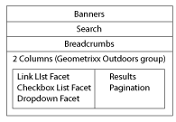

# Aggiungere funzionalità di Search&amp;Promote alla pagina{#adding-search-promote-features-to-your-page}

Per integrare le funzionalità di Search&amp;Promote nel sito web, utilizza i componenti di Search&amp;Promote per aggiungere alle pagine le seguenti funzioni:

* Ricerca per parola chiave
* Pagina dei risultati di ricerca
* Ottimizzazione della ricerca
* Banner

Puoi utilizzare le funzionalità di Search&amp;Promote solo se sono state attivate dall’amministratore Adobe Experience Manager. Consulta [Integrare con Adobe Search&amp;Promote](/help/sites-administering/search-and-promote.md).

Sul server Search&amp;Promote sono configurati i facet, così come le informazioni fornite da ogni componente. La tabella seguente fornisce una breve descrizione di ciascun componente. Le sezioni successive forniscono informazioni dettagliate sul loro utilizzo.

<table>
 <tbody>
  <tr>
   <th>Componente Search&amp;Promote</th>
   <th>Descrizione</th>
  </tr>
  <tr>
   <td>Banner</td>
   <td>Visualizza annunci banner. I banner sono selezionati in base ai dati raccolti tramite Search&amp;Promote.  </td>
  </tr>
  <tr>
   <td>Breadcrumb</td>
   <td>Visualizza la parola chiave di ricerca e la sequenza di filtri applicati dall’utente ai risultati della ricerca.</td>
  </tr>
  <tr>
   <td>Facet elenco casella di selezione</td>
   <td>Elenco di caselle di controllo per la selezione dei facet per filtrare i risultati della ricerca.</td>
  </tr>
  <tr>
   <td>Facet a discesa</td>
   <td>Elenco a discesa di facet per filtrare i risultati della ricerca.</td>
  </tr>
  <tr>
   <td>Facet elenco collegamenti</td>
   <td>Elenco di collegamenti facet per filtrare i risultati della ricerca.</td>
  </tr>
  <tr>
   <td>Paginazione</td>
   <td>Controlli per la navigazione tra le pagine dei risultati della ricerca.</td>
  </tr>
  <tr>
   <td>Risultati</td>
   <td>Visualizza i risultati di una ricerca per parola chiave.</td>
  </tr>
  <tr>
   <td>Ricerca</td>
   <td>Aggiunge un campo di ricerca alla pagina.</td>
  </tr>
 </tbody>
</table>

## Creare la pagina dei risultati di ricerca {#creating-the-search-results-page}

Utilizza la console Siti web WCM per creare una pagina per visualizzare i risultati della ricerca. I risultati di una ricerca da qualsiasi componente Ricerca possono essere visualizzati in questa pagina se si utilizza lo stesso servizio di Search&amp;Promote.

I componenti che consentono agli utenti di rivedere i risultati della ricerca sono Risultati e Paginazione. Il componente **[!UICONTROL Risultati]** non ha proprietà configurabili in modalità Modifica o Progettazione. Il componente Risultati elenca semplicemente i risultati della ricerca, che forniscono collegamenti ad altre pagine, e visualizza il numero di risultati per la parola chiave di ricerca.

Il componente **[!UICONTROL Paginazione]** consente agli utenti di navigare tra più pagine dei risultati di ricerca. L&#39;utente può vedere il numero di pagine, passare alla pagina successiva o precedente, selezionare una pagina da aprire o unificare tutti i risultati in una pagina.

Puoi configurare le seguenti proprietà dei componenti in modalità Modifica per controllare il comportamento del runtime:

* Nascondi pagina risultato singolo: Selezionare questa opzione se si desidera nascondere i controlli di navigazione della pagina quando la ricerca restituisce una singola pagina di risultati.
* Nascondi primo/ultimo: Seleziona questa opzione se vuoi impedire agli utenti di saltare alla prima o all’ultima pagina dei risultati.
* Nascondi precedente/successivo: determina se gli utenti possono navigare nelle pagine dei risultati rispetto alla pagina corrente.
* Nascondi visualizza tutto: determina se l&#39;utente può unificare tutti i risultati della ricerca in una singola pagina. In genere, la fornitura di dati impaginati rende più efficiente l&#39;uso delle risorse del server. Selezionare questa opzione se si desidera impedire il trasferimento di set di dati di grandi dimensioni in un messaggio di risposta.

### Abilita il filtraggio dei risultati per facet {#enabling-the-filtering-of-results-by-facets}

Puoi consentire agli utenti di filtrare i risultati della ricerca per facet. I componenti **[!UICONTROL Facet elenco casella di selezione]**, **[!UICONTROL Facet a discesa]** e **[!UICONTROL Facet elenco collegamenti]** consentono agli utenti di selezionare uno o più facet da filtrare. Quando si utilizzano questi componenti, è necessario includere anche il componente **Breadcrumb**. Le Breadcrumb indicano i filtri attuali utilizzati.

I componenti **[!UICONTROL Facet elenco casella di selezione]**, **[!UICONTROL Facet a discesa]** e **[!UICONTROL Facet elenco collegamenti]** dispongono ciascuno delle seguenti proprietà configurate nella modalità **Modifica** :

* **Nome facet:** il nome del facet che viene utilizzato per i filtri.

Il componente **[!UICONTROL Facet elenco casella di selezione]** mostra un elenco di facet accompagnati da una casella di selezione. Utilizza un **[!UICONTROL Facet elenco casella di selezione]** in modo che gli utenti possano visualizzare un sottoinsieme di risultati che includono elementi da più facet. Ad esempio, il **facet Marchio è appropriato poiché vari marchi forniscono lo stesso tipo di prodotto.**

Viene visualizzata una casella di selezione per ogni facet a cui è associato un risultato della ricerca. Quando un utente seleziona una casella, la pagina viene ricaricata con un set di risultati aggiornato. Tutte le caselle di controllo rimangono sulla pagina in modo che i clienti possano aggiungere o rimuovere i facet al filtro in qualsiasi momento:

Il componente **[!UICONTROL Facet a discesa]** consente ai clienti di selezionare un elemento facet da un elenco a discesa. Questo componente è utile quando desideri che i clienti si concentrino su un singolo elemento facet per volta. Ad esempio, il facet Reparto è appropriato per consentire ai clienti di restringere la ricerca dei prodotti in base al genere. John cerca *jeans* e poi filtra sul reparto Uomini.

L&#39;elenco a discesa contiene i facet che sono associati a tutti i risultati di ricerca. Selezionando una voce nell&#39;elenco a discesa, la pagina viene ricaricata con un set di risultati aggiornato. Le voci dell&#39;elenco a discesa non cambiano, in modo che i clienti possano passare in qualsiasi momento da un facet all&#39;altro.

Il componente **[!UICONTROL Facet elenco collegamenti]** consente ai clienti di limitare progressivamente la loro attenzione agli elementi che sono categorizzati con molteplici membri di facet o facet.

I membri dei facet vengono visualizzati come un elenco di collegamenti. Il testo di ogni collegamento è il nome di un membro dei facet che è associato ai risultati di ricerca correnti. Quando un cliente fa clic su un collegamento di un facet, la pagina viene ricaricata e viene visualizzato un sottoinsieme dei risultati della ricerca. L&#39;elenco dei collegamenti viene aggiornato di conseguenza, consentendo una ricerca ancora più ristretta.

I collegamenti nell’elenco cambiano anche quando un filtro viene applicato da un diverso tipo di componente Search&amp;Promote. L&#39;uso di componenti filtranti di tipo multiplo può fornire combinazioni di filtri efficaci.

Il componente **[!UICONTROL Breadcrumb]** consente ai clienti di vedere i filtri attualmente applicati ai risultati di ricerca, nell&#39;ordine in cui sono stati applicati. I clienti possono selezionare gli elementi nella breadcrumb per tornare a quella combinazione di filtri.

Puoi configurare le seguenti proprietà per Breadcrumb in modalità Modifica per personalizzare l&#39;aspetto del componente:

* Delimitatore: definisci il carattere o la stringa di caratteri che agiscono come delimitatore tra ogni breadcrumb. Il campo **[!UICONTROL Delimiter]** accetta qualsiasi stringa di caratteri come input. L&#39;impostazione predefinita è: &quot;>&quot; (senza virgolette)
* Delimitatore trailing: definire un carattere o una stringa di caratteri da visualizzare alla fine delle breadcrumb. Il campo **[!UICONTROL Delimitatore finale]** accetta qualsiasi stringa di caratteri come input. L&#39;impostazione predefinita per questo campo è *vuoto* (cioè, non viene visualizzato nulla alla fine della linea di breadcrumb)

### Aggiungi caselle di ricerca {#adding-search-boxes}

Il componente **[!UICONTROL Ricerca]** consente ai clienti di eseguire ricerche per parola chiave. Aggiungi i componenti **[!UICONTROL Ricerca]** a ogni pagina in cui desideri fornire l&#39;accesso alla ricerca.

Configura le seguenti proprietà in modalità Modifica per controllare il comportamento del runtime:

* Percorso pagina risultati: il percorso della pagina che mostra i risultati della ricerca. 
* Abilita completamento automatico: seleziona per far apparire le parole chiave di ricerca suggerite quando il cliente inizia a digitare nella casella di ricerca.

### Aggiungi banner {#adding-banners}

Il componente **[!UICONTROL Banner]** visualizza banner pubblicitari in base alle ricerche del cliente. La logica sul server Search&amp;Replace determina quale banner mostrare. Ad esempio, una ricerca sui jeans potrebbe far apparire un banner legato alla moda. Il filtro sul reparto Uomini potrebbe affinare ulteriormente la scelta del banner.

Il componente **[!UICONTROL Banner]** fornisce una proprietà configurabile denominata Area banner. In modalità Modifica, seleziona uno dei valori delle proprietà per specificare la modalità di visualizzazione del banner. Il servizio di Search&amp;Promote determina l&#39;elenco di valori selezionabili.

### Esempio di pagina di ricerca Search&amp;Promote {#example-search-promote-search-page}

Il diagramma seguente mostra i componenti aggiunti a una pagina per creare la pagina dei risultati di Search&amp;Promote completamente funzionale qui sotto.

 
