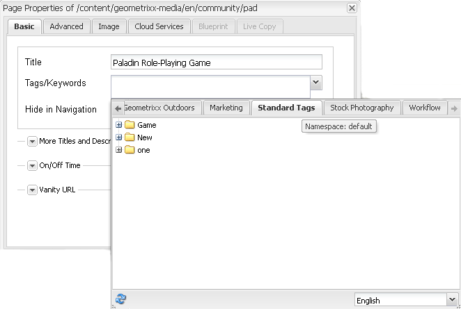
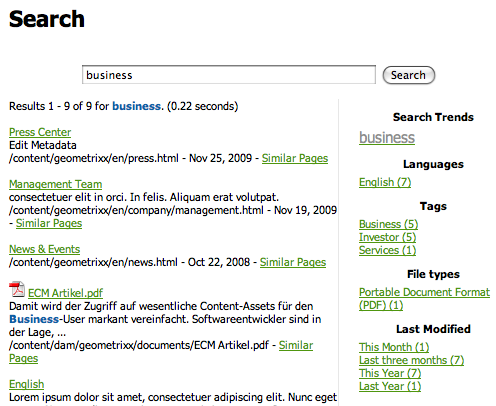

# Utilizzo dei tag{#using-tags}

I tag sono un metodo semplice e veloce per classificare i contenuti di un sito web. I tag possono essere considerati come parole chiave o etichette da allegare a una pagina, una risorsa o altro contenuto, per consentire la ricerca di contenuti specifici o correlati.

* Consulta [Amministrazione dei tag](/help/sites-administering/tags.md) per informazioni sulla creazione e la gestione dei tag e sui tag di contenuto applicati.
* Per informazioni sul framework dei tag e sull’inclusione e l’estensione dei tag in applicazioni personalizzate, consulta [Assegnazione tag per sviluppatori](/help/sites-developing/tags.md).

## Dieci motivi per utilizzare l’assegnazione tag {#ten-reasons-to-use-tagging}

1. Organizzazione del contenuto : l’assegnazione tag semplifica il lavoro degli autori, che possono organizzare rapidamente i contenuti con il minimo sforzo.
1. Organizzazione dei tag : i tag consentono di organizzare contenuti, mentre le tassonomie o i namespace gerarchici consentono di organizzare i tag.
1. Tag estremamente organizzati : grazie alla possibilità di creare tag principali e secondari, è possibile creare tassonomie complete che includono termini, termini derivati e relazioni che li collegano. In questo modo è possibile creare una seconda (o terza) gerarchia di contenuti parallela a quella ufficiale.
1. Assegnazione tag controllata: per gestire l’assegnazione tag, è possibile applicare autorizzazioni ai tag e/o ai namespace e controllare la creazione e l’applicazione di tag.
1. Assegnazione tag flessibile: i tag possono avere nomi diversi, come tag, termini di tassonomia, categorie, etichette e molto altro ancora. Sono flessibili dal punto di vista del modello di contenuto e della modalità di utilizzo. Possono essere ad esempio utilizzati per sintetizzare le caratteristiche demografiche del target, suddividere in categorie e classificare i contenuti o creare una gerarchia di contenuti secondaria.
1. Ricerca migliorata : il componente di ricerca predefinito in AEM include i tag creati e applicati ai quali è possibile applicare filtri per restringere i risultati solo a quelli pertinenti.
1. Abilitazione SEO: i tag applicati come proprietà della pagina vengono visualizzati automaticamente nei metatag della pagina, rendendola visibile ai motori di ricerca.
1. Funzionalità sofisticate e al contempo semplici: per creare i tag, basta selezionare una parola e fare clic su un pulsante. In seguito, è possibile aggiungere un titolo, una descrizione ed etichette illimitate per fornire ulteriore semantica al tag.
1. Coerenza di base : il sistema di assegnazione tag è un componente di base dell’AEM ed è utilizzato da tutte le funzionalità dell’AEM per la classificazione dei contenuti. Inoltre, per gli sviluppatori è disponibile l’API di assegnazione tag che consente di creare applicazioni abilitate per l’assegnazione tag con accesso alle stesse tassonomie.
1. Struttura e flessibilità: l’AEM è ideale per lavorare con informazioni strutturate, grazie alla nidificazione di pagine e percorsi. È molto efficace anche per la gestione delle informazioni non strutturate, grazie alla funzione integrata di ricerca testuale. L’assegnazione tag offre i vantaggi delle struttura e della flessibilità.

Quando progetti la struttura dei contenuti di un sito e lo schema di metadati per le risorse, considera l’approccio leggero e accessibile fornito dall’assegnazione tag.

## Applicazione dei tag   {#applying-tags}

Nell’ambiente di authoring gli autori possono applicare i tag accedendo alle proprietà della pagina e immettendo uno o più tag nel campo **Tag/Parole chiave**.

Da applicare [tag predefiniti](/help/sites-administering/tags.md), nella **Proprietà pagina** finestra utilizza `Tags/Keywords` a discesa del campo per selezionare dall’elenco di tag consentiti per la pagina. Tthe **Tag standard** è lo spazio dei nomi predefinito, ovvero non `namespace-string:` anteposto alla tassonomia.

### Pubblicazione dei tag {#publishing-tags}

Come per le pagine, è possibile eseguire le operazioni seguenti su tag e spazi dei nomi:

**Attiva**

* Consente di attivare singoli tag.

  Come per le pagine, i nuovi tag creati devono essere attivati prima di diventare disponibili nell’ambiente di pubblicazione.

>[!NOTE]
>
>Quando si attiva una pagina, viene automaticamente aperta una finestra di dialogo che consente di attivare i tag non attivati appartenenti alla pagina.

**Disattiva**

* Consente di disattivare i tag selezionati.

## Tag cloud {#tag-clouds}

Le nuvole di tag mostrano un insieme di tag, sia per la pagina corrente, l’intero sito web o per quelli a cui si accede più comunemente. Le nuvole di tag sono un mezzo per evidenziare i problemi che sono (sono stati) di interesse per l’utente. Le dimensioni del testo utilizzato per visualizzare il tag variano in relazione al suo utilizzo.

Il [Tag cloud](/help/sites-classic-ui-authoring/classic-page-author-edit-mode.md#tag-cloud) Componente (gruppo di componenti Generale) utilizzato per aggiungere un tag cloud a una pagina.

## Ricerca nei tag {#searching-on-tags}

Puoi cercare i tag sia nell’ambiente di authoring che in quello di pubblicazione.

### Utilizzo del componente Ricerca {#using-search-component}

Aggiunta di un [Componente di ricerca](/help/sites-classic-ui-authoring/classic-page-author-edit-mode.md#search) In una pagina offre una funzionalità di ricerca che include tag e può essere utilizzata sia nell’ambiente di authoring che in quello di pubblicazione.

