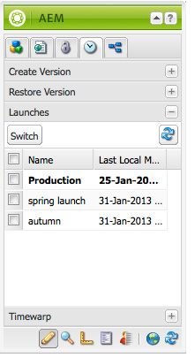

# Modifica dei lanci{#editing-launches}

## Modifica delle pagine di lancio {#editing-launch-pages}

Quando è stato creato un lancio per una pagina (o un set di pagine) puoi modificare il contenuto nella copia di lancio delle pagine.

1. Apri la pagina per la modifica.
1. In Sidekick, seleziona la **Controllo delle versioni** , quindi espandere **Lanci** gruppo. Il titolo del lancio attualmente in fase di modifica utilizza un font in grassetto.

   

1. Seleziona il lancio su cui vuoi lavorare e fai clic su **Switch**.
1. Inizia a modificare.

   >[!NOTE]
   >
   >È possibile utilizzare **Pagina** scheda della barra laterale per eseguire azioni quali **Crea pagina figlia**, tra gli altri.

## Modifica di una configurazione di lancio {#editing-a-launch-configuration}

Dopo aver creato un lancio, puoi modificare il nome del lancio e la data del lancio. Puoi anche specificare un’immagine da associare al lancio.

1. Apri la pagina di amministrazione dei lanci ([http://localhost:4502/libs/launches/content/admin.html](http://localhost:4502/libs/launches/content/admin.html)).

1. Seleziona il lancio richiesto e fai clic su **Modifica** per aprire la finestra di dialogo:

   * In **Generale** , è possibile modificare:

      * **Titolo**
      * **Data attivazione**: equivalente alla data di lancio
      * **Produzione pronta**

     Consulta [Lanci: l’ordine degli eventi](/help/sites-authoring/launches.md#launches-the-order-of-events) per informazioni sullo scopo e sull’interazione di questi campi.

   * In **Immagine** , puoi caricare un file di immagine.

1. Fai clic su **Salva**.

## Esplorazione dello stato di avvio di una pagina {#discovering-the-launch-status-of-a-page}

Quando modifichi un lancio di una pagina, le informazioni su tale lancio vengono visualizzate nella parte inferiore della sezione **Controllo delle versioni** scheda del Sidekick:

* Nome del lancio.
* L’ora dall’ultima modifica.
* Utente che ha eseguito l&#39;ultima modifica.
* Stato del **Produzione pronta** flag (arancione=non impostato; verde=impostato).

