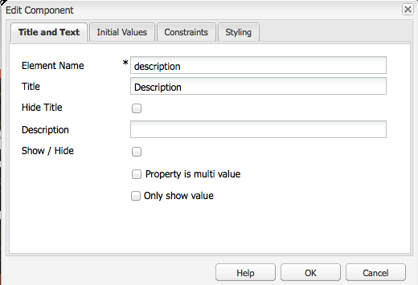

# Creazione di contenuto accessibile (conformità WCAG 2.0){#creating-accessible-content-wcag-conformance}

>[!CAUTION]
>
>Poiché l’interfaccia classica è stata dichiarata obsoleta in AEM 6.4, il contenuto di questa pagina non è stato aggiornato per WCAG 2.1.
>
>Per informazioni dettagliate su AEM e WCAG 2.1, consulta le pagine seguenti:
>
>* [Linee guida sull’accessibilità di AEM per il Web](/help/managing/web-accessibility.md)
>* [Guida rapida alle linee guida WCAG 2.1](/help/managing/qg-wcag.md)
>* [Creazione di contenuto accessibile (conformità WCAG 2.1)](/help/sites-authoring/creating-accessible-content.md)


Le linee guida WCAG 2.0 sono costituite da un insieme di criteri di successo e linee guida che non dipendono dalla tecnologia in uso e hanno l’obiettivo di rendere i contenuti web accessibili e utilizzabili da persone con disabilità.

>[!NOTE]
>
>Consulta anche:
>
>* la nostra [Guida rapida a WCAG 2.0](/help/managing/qg-wcag.md) per ulteriori dettagli
>* [Configurazione dell’editor Rich Text per generare contenuto accessibile](/help/sites-administering/rte-accessible-content.md)
>


Il contenuto viene classificato in base a tre livelli di conformità: A (il più basso), AA e AAA (il più alto). Brevemente, i livelli sono definiti come segue:

* **Livello A**: il sito ha raggiunto un livello minimo di accessibilità di base. Per arrivare a questo livello sono stati soddisfatti tutti i criteri di successo di livello A.
* **Livello AA**: si tratta di un livello di accessibilità ideale, in cui il sito presenta un livello massimo di accessibilità che lo rende fruibile dal maggior numero di persone nella maggioranza delle situazioni utilizzando la maggior parte delle tecnologie. Per ottenere questo livello, devono essere soddisfatti tutti i criteri di successo dei livelli A e AA.
* **Livello AAA**: il sito ha raggiunto un livello molto alto di accessibilità. Per arrivare a questo livello sono stati soddisfatti tutti i criteri di successo di livello A, AA e AAA.

Quando si crea un sito, è necessario determinare il livello complessivo che si desidera ottenere.

Nella sezione seguente sono incluse le [linee guida WCAG 2.0](https://www.w3.org/TR/WCAG20/#guidelines) e i criteri di successo per i [livelli di conformità](https://www.w3.org/TR/UNDERSTANDING-WCAG20/conformance.html) A e AA.

>[!NOTE]
>
>Poiché non è possibile soddisfare tutti i criteri di successo di livello AAA per alcuni tipi di contenuti, non è consigliabile prevedere questo livello di conformità come politica generale.

>[!NOTE]
>
>In questo documento vengono utilizzati:
>
>* i nomi brevi per le [linee guida WCAG 2.0](https://www.w3.org/TR/WCAG20/#guidelines).
>* la numerazione utilizzata nelle [linee guida WCAG 2.0](https://www.w3.org/TR/WCAG20/#guidelines) per facilitare i riferimenti incrociati al sito web WCAG.
>


## Principio 1: Percepibilità  {#principle-perceivable}

[Principio 1: Percepibile - Informazioni e componenti dell’interfaccia utente devono essere presentati agli utenti con modalità da loro percepibili.](https://www.w3.org/TR/WCAG20/#perceivable)

### Alternative testuali (1.1)  {#text-alternatives}

[Linea guida 1.1 - Alternative testuali: fornire alternative testuali per qualsiasi contenuto non testuale in modo che possa essere convertito in altri formati richiesti, come la stampa a caratteri grandi, il Braille, la sintesi vocale, i simboli o un linguaggio più semplice.](https://www.w3.org/TR/WCAG20/#text-equiv)

### Contenuto non testuale (1.1.1)  {#non-text-content}

* Criterio di successo 1.1.1
* Livello A
* Contenuto non testuale: tutto il contenuto non testuale presentato all’utente dispone di un’alternativa testuale che svolge la finalità equivalente, fatta eccezione per le situazioni elencate di seguito.

#### Finalità: contenuto non testuale (1.1.1) {#purpose-non-text-content}

Le informazioni su una pagina web possono essere fornite in diversi formati non testuali, ad esempio immagini, video, animazioni, tabelle e grafici. Le persone non vedenti o con gravi problemi visivi non sono in grado di vedere il contenuto non testuale, ma possono accedere ai contenuti testuali letti mediante un’utilità per la lettura dello schermo o presentati in forma tattile da un dispositivo Braille. Così, grazie alla disponibilità di alternative testuali al contenuto in formato grafico, i non vedenti possono accedere a una versione equivalente delle informazioni veicolate.

Un ulteriore vantaggio è rappresentato dal fatto che le alternative testuali consentono l’indicizzazione dei contenuti non testuali da parte dei motori di ricerca.

#### Come soddisfare il criterio - Contenuto non testuale (1.1.1)  {#how-to-meet-non-text-content}

Per gli elementi grafici statici, il requisito fondamentale consiste nel fornire un’alternativa testuale equivalente. Questo può essere fatto nel campo **Testo Alt**:

>[!NOTE]
>
>Alcuni componenti pronti per l’uso, come **Carosello** e **Presentazione**, non consentono di aggiungere descrizioni di testo alternativo alle immagini. Quando implementi le versioni di questi componenti per l’istanza AEM, il team di sviluppo dovrà configurarli per supportare l’attributo `alt`, affinché gli autori possano aggiungerlo al contenuto (consulta [Aggiunta di supporto per elementi e attributi HTML aggiuntivi](/help/sites-administering/rte-accessible-content.md#add-support-for-more-html-elements-and-attributes)).

Il campo **Testo Alt** è disponibile nella scheda delle proprietà dell’immagine **Avanzate** della finestra di dialogo del componente **Immagine**:


AEM aggiunge un **Testo Alt** alle immagini per impostazione predefinita. Per l’interfaccia classica sono disponibili due scenari diversi per la creazione dell’attributo predefinito (anche se il valore predefinito potrebbe non essere sufficiente come alternativa e molto probabilmente dovrà essere modificato nel **Avanzate** scheda proprietà immagine):

* File:

   Un’immagine viene caricata dal disco rigido dell’utente. Se si aggiunge un componente immagine a una pagina e si sceglie un&#39;immagine dal disco rigido o da un&#39;altra origine, il valore predefinito per **Testo Alt** è `file`. Questa deve essere modificata nella **Avanzate** scheda delle proprietà dell’immagine. Anche in questo caso, questo valore non viene visualizzato nel **Testo Alt** ma quando il valore viene modificato, il nuovo valore viene visualizzato nel campo .

* Risorsa:

   Un’immagine viene aggiunta dall’archivio delle risorse digitali. Se trascini un’immagine dall’archivio delle risorse digitali in una pagina web, la **Titolo** e **Testo Alt** i valori per quell&#39;immagine saranno ricavati dai metadati per quell&#39;immagine.

>[!NOTE]
>
>In entrambi gli scenari di cui sopra, il valore predefinito **Testo Alt** il valore non è visibile nel **Proprietà immagine avanzate** scheda . Per modificare il valore predefinito, è sufficiente immettere un nuovo valore nel **Testo Alt** campo .

>[!NOTE]
>
>Se l’immagine è puramente decorativa (consulta [Creazione di buone alternative testuali](#creating-good-text-alternatives)), puoi immettere uno spazio nel **Testo Alt** campo utilizzando la barra spaziatrice. Verrà creato un `alt` , che richiede a un assistente vocale di ignorare l&#39;immagine.

#### Creazione di buone alternative di testo {#creating-good-text-alternatives}

Esistono varie forme di contenuti non testuali, di conseguenza il valore del testo alternativo dipende dal ruolo dell’elemento grafico all’interno della pagina web. Alcune regole generali da seguire:

* Le alternative testuali dovrebbero essere sintetiche ma veicolare chiaramente le informazioni essenziali fornite dal contenuto non testuale.
* È bene evitare descrizioni eccessivamente lunghe (oltre 100 caratteri). Se un testo alternativo richiede una descrizione più dettagliata:

   * fornisci una breve descrizione nel testo alternativo
   * e includi una descrizione più lunga in un altro elemento di testo, nella stessa pagina o in una pagina web separata. Inserisci un collegamento a questa descrizione separata rendendo l’immagine un collegamento o inserendo un collegamento di testo accanto all’immagine.

* Il testo alternativo non dovrebbe replicare il contenuto fornito sotto forma di testo nella stessa pagina. Ricorda che molte immagini sono illustrazioni di punti già trattati nel testo di una pagina, di conseguenza un’alternativa testuale dettagliata potrebbe già esistere.
* Se il contenuto non testuale è un collegamento a un’altra pagina o un altro documento e non esiste altro testo che faccia parte dello stesso collegamento, il testo alternativo per l’immagine non dovrà descrivere l’immagine ma dovrà invece indicare la destinazione del collegamento.
* Se il contenuto non testuale è incluso in un elemento pulsante e non esiste testo che faccia parte dello stesso pulsante, il testo alternativo per l’immagine non dovrà descrivere l’immagine, ma piuttosto indicare la funzionalità del pulsante.
* È perfettamente accettabile associare a un’immagine un testo alternativo vuoto (null), ma solo se l’immagine non prevede testo alternativo (ad esempio, se si tratta di un elemento grafico puramente decorativo) o se il testo equivalente è già incluso nel testo della pagina.

Il documento [Bozza W3C: Tecniche di HTML5 per fornire alternative testuali utili](https://dev.w3.org/html5/alt-techniques/) include maggiori dettagli ed esempi di testi alternativi adeguati ai diversi tipi di immagini.

Tipi specifici di contenuto non testuale che richiedono alternative testuali potrebbero includere:

* Foto illustrative:

   Queste sono immagini di persone, oggetti o luoghi. Pensa al ruolo della foto nella pagina; è probabile che un equivalente testuale adeguato sia *Foto di [oggetto]*, ma potrebbe dipendere dal testo circostante.

* Icone:

   Si tratta di piccoli pittogrammi (grafici) che veicolano informazioni specifiche. Devono essere utilizzati in modo coerente in una pagina e in un sito. Tutte le istanze dell’icona in una pagina o in un sito devono avere lo stesso testo alternativo, breve e sintetico, a meno che ciò non comporti inutili duplicazioni del testo adiacente.

* Grafici e diagrammi:

   In genere rappresentano dati numerici. Quindi un&#39;opzione per fornire un testo alternativo potrebbe essere quella di includere un breve riepilogo delle principali tendenze mostrate nel grafico o grafico. Se necessario, fornisci anche una descrizione più dettagliata nel testo utilizzando **Descrizione** nel campo **Avanzate** scheda delle proprietà dell’immagine. Inoltre, puoi fornire i dati di origine in formato tabella altrove nella pagina o nel sito.

   

   Per fornire un’alternativa per questo grafico di esempio, aggiungi all’immagine un testo `alt` sintetico e inserisci un testo alternativo completo dopo l’immagine stessa.

   ```xml
   <p></p>
   <p> Figure 1. Distribution of Articles by Journal Category.
   Pie chart: Language=68%, Education=14% and Science=18%.</p>
   ```

   >[!NOTE]
   >
   >Lo snippet di cui sopra viene utilizzato solo per illustrare l’ordine. Si consiglia di utilizzare il **Immagine** (anziché il `img src` riferimento utilizzato sopra.

   In AEM questo è possibile effettuare questa operazione utilizzando una combinazione dei campi **Testo Alt** e **Descrizione** nella finestra di dialogo di configurazione dell’immagine, come in [Come soddisfare il criterio: contenuto non testuale (1.1.1)](#how-to-meet-non-text-content).

* Mappe, diagrammi, diagrammi di flusso:

   Per gli elementi grafici che forniscono dati spaziali (ad esempio, per descrivere le relazioni tra gli oggetti o un processo), assicurati che il messaggio chiave sia fornito in formato testo.  Per le mappe, potrebbe non risultare pratico fornire un equivalente di testo completo. Se la mappa ha lo scopo di aiutare le persone a individuare una posizione particolare, il testo alternativo dell’immagine della mappa può indicare brevemente *Mappa di X*, fornendo poi le indicazioni per tale posizione in un altro testo della pagina o attraverso il campo **Descrizione**, disponibile nella scheda **Avanzate** del componente **Immagine**.

* CAPTCHA:

   Un CAPTCHA è un *Test di Turing Pubblico Completamente Automatizzato per dire computer e umani a parte*. Si tratta di un controllo di sicurezza utilizzato sulle pagine web per distinguere gli esseri umani da software dannoso, ma che può causare barriere di accessibilità. Si tratta di immagini che richiedono agli utenti di descrivere ciò che visualizzano per poter superare un test di sicurezza. Fornire un&#39;alternativa testuale per l&#39;immagine ovviamente non è possibile, quindi sarà necessario considerare soluzioni non grafiche alternative.

   Il W3C fornisce una serie di suggerimenti, come ad esempio:Ognuno di questi approcci ha i propri meriti e svantaggi.

   * Puzzle logici
   * L’impiego di output audio anziché di immagini
   * Account a utilizzo limitato e filtri anti-spam.

* Immagini di sfondo:

   Questi risultati vengono ottenuti utilizzando i CSS (Cascading Style Sheets, fogli di stile a cascata) anziché in HTML. Ciò significa che non è possibile specificare un valore di testo alternativo. Pertanto, le immagini di sfondo non devono fornire informazioni testuali importanti, se lo fanno, devono essere fornite anche nel testo della pagina.

   Tuttavia, è importante che venga visualizzato uno sfondo alternativo quando l&#39;immagine non può essere visualizzata.

   >[!NOTE]
   >
   >Dovrebbe essere previsto un livello adeguato di contrasto tra lo sfondo e il testo in primo piano; questo elemento viene discusso più dettagliatamente in [Contrasto (minimo) (1.4.3)](#contrast-minimum).

#### Ulteriori informazioni - Contenuto non testuale (1.1.1)  {#more-information-non-text-content}

* [Comprendere i criteri di successo 1.1.1](https://www.w3.org/TR/UNDERSTANDING-WCAG20/text-equiv-all.html)
* [Come soddisfare i criteri di successo 1.1.1](https://www.w3.org/WAI/WCAG20/quickref/#text-equiv)
* [W3C: tecniche HTML5 per fornire alternative testuali utili (bozza)](https://dev.w3.org/html5/alt-techniques/)
* [Spiegazione W3C dei CAPTCHA e relative alternative](https://www.w3.org/TR/turingtest/)

### Media temporizzati (1.2)  {#time-based-media}

[Linea guida 1.2 - Media temporizzati: fornire alternative per gli elementi multimediali temporizzati.](https://www.w3.org/TR/WCAG20/#text-equiv)

L’argomento riguarda i contenuti web *temporizzati*. Questi comprendono i contenuti che l’utente può riprodurre (come video, audio e contenuti animati) e che possono essere preregistrati o in streaming.

### Solo audio e solo video (preregistrato) (1.2.1)  {#audio-only-and-video-only-pre-recorded}

* Criterio di successo 1.2.1
* Livello A
* Solo audio e solo video (preregistrati): per gli elementi solo video e solo audio preregistrati vale quanto segue, tranne quando l’audio o il video sia un elemento alternativo per il testo, chiaramente indicato come tale:

   * Solo audio preregistrato: viene fornita un’alternativa per gli elementi multimediali temporizzati che presenti le informazioni equivalenti ai contenuti solo audio preregistrati.
   * Solo video preregistrato: viene fornita un’alternativa per gli elementi multimediali temporizzati o una traccia audio che presenti le informazioni equivalenti ai contenuti solo video preregistrati.

#### Finalità - Solo audio e solo video (preregistrato) (1.2.1)  {#purpose-audio-only-and-video-only-pre-recorded}

Problemi di accessibilità per video e audio possono essere riscontrati da:

* Persone con problemi visivi in assenza di audio o quando l’audio non è sufficiente a informarli di ciò che sta accadendo nel video o nell’animazione;
* Persone con disabilità uditive o non udenti, non in grado di sentire l’audio;
* Persone che possono sentire l’audio, ma non comprendono i dialoghi (ad esempio, perché si svolgono in una lingua che non conoscono).

Video o audio possono anche essere non disponibili per chi utilizza browser o dispositivi che non supportano la riproduzione di contenuti in formati multimediali specifici, come Adobe Flash.

Fornire queste informazioni in un formato diverso, ad esempio testo (o audio per i video senza audio) può renderle accessibili alle persone impossibilitate ad accedere al contenuto originale.

#### Come soddisfare il criterio - Solo audio e solo video (preregistrato) (1.2.1)  {#how-to-meet-audio-only-and-video-only-pre-recorded}

* Se il contenuto è una traccia audio preregistrata senza video (come un podcast):

   * Fornisci un collegamento immediatamente prima o dopo il contenuto, a una trascrizione testuale del contenuto audio.

      La trascrizione deve essere una pagina HTML con un equivalente testuale di tutti i contenuti parlati e non parlati importanti, oltre all’indicazione di chi sta parlando, una descrizione dell’ambientazione, le espressioni vocali e una descrizione di qualsiasi altro elemento sonoro significativo.

* Se il contenuto è un’animazione o un video preregistrato senza audio:

   * Fornisci un collegamento immediatamente prima o dopo il contenuto, che rimandi a una descrizione testuale equivalente delle informazioni fornite nel video.
   * Oppure fornisci una descrizione audio equivalente in un formato audio comunemente utilizzato, come MP3.

>[!NOTE]
>
>Se il contenuto audio o video è fornito come alternativa a contenuto già esistente in un altro formato in una pagina web, non è necessario soddisfare i requisiti di cui sopra. Ad esempio, se un video illustra un elenco di istruzioni testuali, non richiede un’alternativa in quanto le istruzioni testuali già fungono da alternativa al video.

L’inserimento di elementi multimediali nelle pagine web AEM, in particolare contenuti Flash, è simile a quello di un’immagine. Tuttavia, dato che i contenuti multimediali sono molto più di un fermo immagine, esistono differenti impostazioni e opzioni per controllarne la riproduzione.

>[!NOTE]
>
>Quando si utilizzano elementi multimediali con contenuti informativi, è necessario creare anche collegamenti a contenuti alternativi. Ad esempio, per includere una trascrizione testuale, crea una pagina HTML per visualizzare la trascrizione e quindi aggiungi un collegamento accanto o sotto al contenuto audio.

#### Ulteriori informazioni - Solo audio e solo video (preregistrato) (1.2.1) {#more-information-audio-only-and-video-only-pre-recorded}

* [Comprendere i criteri di successo 1.2.1](https://www.w3.org/TR/UNDERSTANDING-WCAG20/media-equiv-av-only-alt.html)
* [Come soddisfare i criteri di successo 1.2.1](https://www.w3.org/WAI/WCAG20/quickref/#media-equiv)

### Sottotitoli (preregistrati) (1.2.2)  {#captions-pre-recorded}

* Criterio di successo 1.2.2
* Livello A
* Sottotitoli (preregistrati): i sottotitoli vengono forniti per tutti i contenuti audio preregistrati negli elementi multimediali sincronizzati, fatta eccezione per il caso in cui l’elemento multimediale sia alternativo al testo e chiaramente indicato come tale.

#### Finalità - Sottotitoli (preregistrati) (1.2.2)  {#purpose-captions-pre-recorded}

Le persone non udenti o ipoudenti non saranno in grado di accedere ai contenuti audio, o avranno gravi difficoltà di accesso. I sottotitoli sono equivalenti testuali dell’audio, parlato e non, visualizzati sullo schermo al momento opportuno nel corso del video. Consentono a chi non può udire l’audio di comprendere cosa sta succedendo.

>[!NOTE]
>
>I sottotitoli non sono richiesti quando testo o equivalenti non testuali adeguati (che forniscano informazioni direttamente equivalenti) sono disponibili sulla stessa pagina del video o delle animazioni.

#### Come soddisfare il criterio - Sottotitoli (preregistrati) (1.2.2)  {#how-to-meet-captions-pre-recorded}

I sottotitoli possono essere:

* Sottotitoli non codificati: sempre visibili durante la riproduzione del video)
* Sottotitoli codificati: possono essere attivati o disattivati dall’utente

Se possibile, utilizza i sottotitoli codificati in modo da consentire agli utenti di scegliere se visualizzarli o meno.

Per i sottotitoli codificati è necessario creare e fornire, unitamente al file video, un file di sottotitoli sincronizzati in un formato appropriato, ad esempio [SMIL](https://www.w3.org/AudioVideo/) (i dettagli su come effettuare questa operazione vanno oltre lo scopo di questa guida, ma abbiamo incluso collegamenti ad alcune esercitazioni nella sezione [Ulteriori informazioni - Sottotitoli (preregistrati) (1.2.2)](#more-information-captions-pre-recorded)). Assicurati di includere una nota per indicare agli utenti che per il video sono disponibili sottotitoli.

Se è necessario utilizzare sottotitoli non codificati, inserisci il testo nella traccia video. A questo scopo è possibile utilizzare applicazioni di editing video che consentono di sovrapporre i sottotitoli al video.

#### Ulteriori informazioni - Sottotitoli (preregistrati) (1.2.2)  {#more-information-captions-pre-recorded}

* [Comprendere i criteri di successo 1.2.2](https://www.w3.org/TR/UNDERSTANDING-WCAG20/media-equiv-captions.html):
* [Come soddisfare i criteri di successo 1.2.2](https://www.w3.org/WAI/WCAG20/quickref/#media-equiv)
* [W3C: File multimediali sincronizzati](https://www.w3.org/AudioVideo/)
* [Sottotitoli, trascrizioni e descrizioni audio, di WebAIM](https://webaim.org/techniques/captions/)

### Descrizione audio o elemento multimediale alternativo (preregistrato) (1.2.3)  {#audio-description-or-media-alternative-pre-recorded}

* Criterio di successo 1.2.3
* Livello A
* Audiodescrizione o tipo di media alternativo (preregistrato): viene fornita un’alternativa per gli elementi multimediali temporizzati o una descrizione audio del contenuto video preregistrato per gli elementi multimediali sincronizzati, fatta eccezione per il caso in cui l’elemento multimediale sia alternativo al testo, e chiaramente indicato come tale.

#### Finalità - Descrizione audio o file multimediale alternativo (preregistrato) (1.2.3)  {#purpose-audio-description-or-media-alternative-pre-recorded}

Le persone non vedenti o ipovedenti avranno problemi di accessibilità se le informazioni in un video o in un’animazione vengono fornite solo visivamente, o se l’audio non fornisce informazioni sufficienti per consentire la comprensione di ciò che sta accadendo.

#### Come soddisfare il criterio: descrizione audio o elemento multimediale alternativo (preregistrato) (1.2.3) {#how-to-meet-audio-description-or-media-alternative-pre-recorded}

Gli approcci che è possibile adottare per soddisfare questo criterio di successo sono due. È possibile:

1. Includere una descrizione audio aggiuntiva per il contenuto video. Questo può essere ottenuto in tre modi:

   * In corrispondenza delle pause nella finestra di dialogo, fornisci informazioni sui cambiamenti della scena che non sono inclusi nella traccia audio esistente;
   * Includi una nuova traccia audio, aggiuntiva e facoltativa, contenente l’audio originale, ma anche informazioni audio ulteriori sui cambiamenti della scena.

      * Questo consente agli utenti di passare dalla traccia audio esistente (che *non* contiene una descrizione audio) alla nuova traccia audio (che *contiene* una descrizione audio), e viceversa.
      * In questo modo si evitano interruzioni per gli utenti che non necessitano della descrizione aggiuntiva.
   * Crea una seconda versione del contenuto video per consentire descrizioni audio estese. Questo riduce le difficoltà connesse con la fornitura di descrizioni audio dettagliate all’interno delle pause nella finestra di dialogo esistente, interrompendo temporaneamente audio e video nei momenti adeguati. Come risultato, è possibile fornire una descrizione audio molto più lunga prima che l’azione riprenda. Come nell’esempio precedente, l’ideale, in questo caso, è includere una traccia audio facoltativa per evitare interruzioni agli utenti che non necessitano della descrizione aggiuntiva.


1. Fornisci una trascrizione testuale che rappresenti un equivalente testuale adatto degli elementi sonori e visivi del video o animazione. Questi dovrebbero includere, a seconda del caso, l’indicazione di chi sta parlando, una descrizione dell’ambientazione, espressioni vocali. A seconda della lunghezza, è possibile inserire la trascrizione nella stessa pagina del video o dell’animazione oppure in una pagina separata. Se scegli la seconda opzione, includi un collegamento alla trascrizione accanto al video o all’animazione.

I dettagli precisi sulle modalità di creazione di video con descrizione audio vanno oltre lo scopo di questa guida. La creazione di video e descrizioni audio può richiedere parecchio tempo, ma puoi ricorrere ad altri prodotti Adobe per facilitare l’esecuzione di tali attività. Se crei contenuto in Adobe Flash Professional, devi anche creare uno script per richiedere all’utente di scaricare il plug-in appropriato e fornire un testo alternativo attraverso l’elemento `<noscript>`.

#### Ulteriori informazioni - Descrizione audio o elemento multimediale alternativo (preregistrato) (1.2.3) {#more-information-audio-description-or-media-alternative-pre-recorded}

* [Comprendere i criteri di successo 1.2.3](https://www.w3.org/TR/UNDERSTANDING-WCAG20/media-equiv-audio-desc.html):
* [Come soddisfare i criteri di successo 1.2.3](https://www.w3.org/WAI/WCAG20/quickref/#qr-media-equiv-audio-desc)
* [Adobe Encore CS5](https://www.adobe.com/products/premiere/encore/)

### Sottotitoli (dal vivo) (1.2.4)    {#captions-live}

* Criterio di successo 1.2.4
* Livello AA
* Sottotitoli (in tempo reale): i sottotitoli vengono forniti per tutti i contenuti audio dal vivo negli elementi multimediali sincronizzati.

#### Finalità - Sottotitoli (in tempo reale) (1.2.4)  {#purpose-captions-live}

Questo criterio di successo è identico a [Sottotitoli (preregistrati)](#captions-pre-recorded), in quanto riguarda la rimozione degli ostacoli di accessibilità per persone non udenti o ipoudenti, tranne per il fatto che questo criterio di successo è relativo a presentazioni in tempo reale, come i webcast.

#### Come soddisfare il criterio - Sottotitoli (in tempo reale) (1.2.4) {#how-to-meet-captions-live}

Segui le indicazioni fornite sopra per [Sottotitoli (preregistrati)](#captions-pre-recorded). Dato che l’elemento multimediale è in tempo reale, tuttavia, i sottotitoli dovranno essere creati il più rapidamente possibile e in modo dinamico. Pertanto, dovresti considerare l’utilizzo di strumenti per la creazione di sottotitoli in tempo reale o di speech-to-text.

Istruzioni dettagliate al riguardo vanno oltre lo scopo di questo documento, ma informazioni utili sono reperibili tramite le risorse seguenti:

* [WebAIM: aggiunta di sottotitoli in tempo reale](https://www.webaim.org/techniques/captions/realtime.php)
* [AccessIT (University of Washington): i sottotitoli possono essere generati automaticamente utilizzando il riconoscimento vocale?](https://www.washington.edu/accessit/articles?1209)

#### Ulteriori informazioni - Sottotitoli (dal vivo) (1.2.4)  {#more-information-captions-live}

* [Comprendere i criteri di successo 1.2.4](https://www.w3.org/TR/UNDERSTANDING-WCAG20/media-equiv-real-time-captions.html)
* [Come soddisfare i criteri di successo 1.2.4](https://www.w3.org/WAI/WCAG20/quickref/#qr-media-equiv-real-time-captions)

### Descrizione audio (preregistrato) (1.2.5)    {#audio-description-pre-recorded}

* Criterio di successo 1.2.5
* Livello AA
* Descrizione audio (preregistrato): una descrizione audio viene fornita per tutti i contenuti video preregistrati negli elementi multimediali sincronizzati.

#### Finalità - Descrizione audio (preregistrato) (1.2.5)  {#purpose-audio-description-pre-recorded}

Questo criterio di successo è identico a [Descrizione audio o elemento multimediale alternativo (preregistrato)](#audio-description-or-media-alternative-pre-recorded), tranne per il fatto che gli autori devono fornire una descrizione audio molto più dettagliata per adeguarsi al livello AA.

#### Come soddisfare il criterio - Descrizione audio (preregistrato) (1.2.5)  {#how-to-meet-audio-description-pre-recorded}

Segui le indicazioni fornite per [Descrizione audio o elemento multimediale alternativo (preregistrato)](#audio-description-or-media-alternative-pre-recorded).

#### Ulteriori informazioni - Descrizione audio (preregistrato) (1.2.5)  {#more-information-audio-description-pre-recorded}

* [Comprendere i criteri di successo 1.2.5](https://www.w3.org/TR/UNDERSTANDING-WCAG20/media-equiv-audio-desc-only.html)
* [Come soddisfare i criteri di successo 1.2.5](https://www.w3.org/WAI/WCAG20/quickref/#qr-media-equiv-audio-desc-only)

### Adattabile (1.3)  {#adaptable}

[Linea guida 1.3 - Adattabile: creare contenuti che possano essere rappresentati in modalità differenti (ad esempio con un layout più semplice), senza perdere informazioni o struttura.](https://www.w3.org/TR/WCAG20/#content-structure-separation)

Questa linea guida riguarda i requisiti necessari per supportare le persone che:

* potrebbero non essere in grado di accedere alle informazioni come presentate da un autore in un layout *standard* di pagina web colorato, bidimensionale, a più colonne;

* potrebbero utilizzare una visualizzazione solo audio o una alternativa, ad esempio testo di grandi dimensioni e a contrasto elevato.

### Informazioni e correlazioni (1.3.1)    {#info-and-relationships}

* Criterio di successo 1.3.1
* Livello A
* Informazioni e correlazioni: informazioni, struttura e relazioni veicolate attraverso la presentazione possono essere determinate a livello di programmazione o sono disponibili in formato testo.

#### Finalità: informazioni e correlazioni (1.3.1) {#purpose-info-and-relationships}

Molte tecnologie per l’accessibilità utilizzate da persone con disabilità si basano su informazioni strutturali per visualizzare o rappresentare i contenuti in modo efficace. Queste possono assumere la forma di titoli, intestazioni di righe e colonne di tabella, e tipi di elenchi. Ad esempio, un’utilità di lettura dello schermo potrebbe consentire a un utente di spostarsi all’interno di una pagina passando da un’intestazione a un’altra. Tuttavia, quando la struttura del contenuto della pagina dipende esclusivamente da uno stile visivo, anziché dal codice HTML sottostante, non sono presenti informazioni strutturali utilizzabili dalle tecnologie per l’accessibilità, il che ne limita la capacità di supportare la navigazione facilitata.

Questo criterio di successo esiste per fare in modo che tali informazioni strutturali vengano fornite tramite HTML, in modo che i browser e le tecnologie per l’accessibilità possano accedere e sfruttare le informazioni.

#### Come soddisfare il criterio - Informazioni e correlazioni (1.3.1) {#how-to-meet-info-and-relationships}

AEM facilita la creazione di pagine Web mediante gli elementi HTML adeguati. Apri il contenuto della pagina nell’editor Rich Text (un componente di testo), e utilizza il menu **Formato** per specificare l’elemento strutturale adeguato (ad esempio il paragrafo, l’intestazione e così via).

L’immagine seguente mostra il testo che è stato formattato come testo di paragrafo; la vista codice sorgente utilizzata indica che sono presenti i tag di apertura e chiusura &lt;p> e &lt;/p> corretti.


È possibile assicurarsi che alle pagine web sia associata la struttura corretta:

* **Utilizzando i titoli:**

   Se le funzioni di accessibilità dell’editor Rich Text sono abilitate (consulta [AEM e accessibilità](/help/sites-administering/rte-accessible-content.md)), AEM offre 3 livelli di intestazione di pagina. Puoi utilizzarli per identificare sezioni e sottosezioni di contenuto. Titolo 1 è il livello di intestazione più alto, Titolo 3 quello più basso. L’amministratore di sistema può configurare il sistema per consentire l’utilizzo di più livelli di intestazione.

   L’immagine seguente illustra un esempio dei diversi tipi di titolo.

   

* **Testo con enfasi**:

   Utilizza l’elemento &lt;strong> o &lt;em> per indicare l’enfasi. Non utilizzare i titoli per evidenziare il testo all’interno di paragrafi.

   * Evidenzia il testo che desideri mettere in evidenza.
   * Fai clic sul pulsante **B** (per &lt;strong>) o **I** (per &lt;em>) all&#39;interno della **Proprietà** pannello (accertati che HTML sia selezionato).

   >[!NOTE]
   >
   >L’editor Rich Text in un’installazione standard di AEM è configurato per utilizzare:
   >
   >* &lt;b> per &lt;strong>
   * &lt;i> per &lt;em>

   Si tratta a tutti gli effetti della stessa cosa, ma &lt;strong> e &lt;em> sono preferibili in quanto tag HTML semanticamente corretti. Il team di sviluppo può configurare l’editor Rich Text per utilizzare &lt;strong> e &lt;em> anziché &lt;b> e &lt;i> nello sviluppo dell’istanza di progetto.

* **Utilizzare gli elenchi**: è possibile utilizzare l’HTML per specificare tre diversi tipi di elenchi:

   * La `<ul>` viene utilizzato per *non ordinato* elenchi (puntati). Le singole voci dell’elenco sono identificate dall’elemento `<li>`. 

      nell’editor Rich Text, utilizza **Elenco puntato** icona.

   * L’elemento `<ol>`viene utilizzato per gli elenchi *numerati*. Le singole voci dell’elenco sono identificate dall’elemento `<li>`. 

      Nell’editor Rich Text, utilizza l’icona **Elenco numerato**.
   Se desideri convertire contenuti esistenti in un determinato tipo di elenco, evidenzia il testo desiderato e seleziona il tipo di elenco. Come nel precedente esempio, che mostra come inserire un testo di paragrafo, gli elementi elenco adeguati verranno aggiunti automaticamente al codice HTML; è tuttavia possibile visualizzarli nella vista modifica sorgente.

   >[!NOTE]
   `<dl>` non è supportato dall’editor Rich Text.

* **Utilizzare le tabelle**:

   Le tabelle di dati devono essere identificate utilizzando gli elementi di tabella HTML:

   * un elemento `<table>`
   * un elemento `<tr>` per ogni riga della tabella
   * un elemento `<th>` per ogni intestazione di riga e colonna
   * un elemento `<td>` per ogni cella di dati

   >[!NOTE]
   Per creare le tabelle è consigliabile utilizzare il componente **Tabella**. Le tabelle possono essere create anche nel componente Testo, ma non è consigliabile.

   In aggiunta, le tabelle accessibili fanno uso dei seguenti elementi e attributi:

   * L’elemento `<caption>` viene utilizzato per fornire una didascalia visibile per la tabella. Per impostazione predefinita, le didascalie vengono visualizzate centrate sopra la tabella, ma possono essere posizionate in modo appropriato utilizzando gli stili CSS. La didascalia è associata alla tabella a livello di programmazione, pertanto è un metodo utile per fornire un’introduzione al contenuto.
   * L’elemento `<h3 class="summary">` aiuta gli utenti non vedenti a comprendere più facilmente le informazioni presentate all’interno di una tabella, fornendo una sintesi di ciò che un utente vedente può vedere. Risulta particolarmente utile quando si utilizzano layout di tabella complessi o non convenzionali (l’attributo non viene visualizzato nel browser, ma viene letto solo alle tecnologie per l’accessibilità).
   * L’attributo `scope` dell’elemento `<th>` viene utilizzato per indicare se una cella rappresenta un’intestazione per una particolare riga o colonna. Un approccio simile consiste nell’utilizzare gli attributi header e id in tabelle complesse, dove le celle di dati possono essere associate a una o più intestazioni.

   >[!NOTE]
   Per impostazione predefinita questi elementi e attributi non sono direttamente disponibili, anche se l’amministratore di sistema può aggiungere supporto per questi valori nella finestra di dialogo **Proprietà tabella** (consulta [Aggiunta di supporto per elementi e attributi HTML aggiuntivi](/help/sites-administering/rte-accessible-content.md#add-support-for-more-html-elements-and-attributes)).

   Quando si aggiunge una **Tabella**, è possibile configurarne le **proprietà** utilizzando l’apposita finestra di dialogo.

   * Specifica una **Didascalia** adeguata.
   * È consigliabile rimuovere eventuali valori predefiniti per **Larghezza**, **Altezza**, **Bordo**, **Margine celle**, **Spaziatura celle**. dato che queste proprietà possono essere impostate in un foglio di stile globale.

   

   È quindi possibile utilizzare la **Proprietà cella** per scegliere se la cella è una cella di dati o di intestazione e, se si tratta di una cella di intestazione, se si tratta di una riga o di una colonna o entrambe:

   

* **Tabelle di dati complesse:**

   In alcuni casi, in presenza di tabelle complesse con due o più livelli di intestazioni, le proprietà della tabella di base potrebbero non essere sufficienti a fornire tutte le informazioni strutturali necessarie. Per questo tipo di tabelle complesse, è necessario creare relazioni dirette tra le intestazioni e le celle correlate utilizzando **header** e **id** attributi. Ad esempio, nella tabella seguente le intestazioni e gli ID vengono associati per creare un’associazione programmatica per gli utenti di tecnologie per l’accessibilità.

   >[!NOTE]
   L’attributo id non è disponibile in un’installazione standard. Può essere attivato configurando regole HTML e il serializzatore nell’editor Rich Text.

   >[!NOTE]
   Per creare le tabelle è consigliabile utilizzare il componente **Tabella**. Le tabelle possono essere create anche nel componente Testo, ma non è consigliabile.

   ```xml
   <table>
      <tr>
        <th rowspan="2" id="h">Homework</th>
        <th colspan="3" id="e">Exams</th>
        <th colspan="3" id="p">Projects</th>
      </tr>
      <tr>
        <th id="e1" headers="e">1</th>
        <th id="e2" headers="e">2</th>
        <th id="ef" headers="e">Final</th>
        <th id="p1" headers="p">1</th>
        <th id="p2" headers="p">2</th>
        <th id="pf" headers="p">Final</th>
      </tr>
      <tr>
       <td headers="h">15%</td>
       <td headers="e e1">15%</td>
       <td headers="e e2">15%</td>
       <td headers="e ef">20%</td>
       <td headers="p p1">10%</td>
       <td headers="p p2">10%</td>
       <td headers="p pf">15%</td>
      </tr>
     </table>
   ```

   A questo scopo, in AEM è necessario aggiungere il codice direttamente utilizzando la modalità di modifica sorgente.

   >[!NOTE]
   Questa funzionalità non è immediatamente disponibile in un’installazione standard. Essa richiede la configurazione dell’editor Rich Text, di regole HTML e del serializzatore.

#### Ulteriori informazioni - Informazioni e correlazioni (1.3.1)  {#more-information-info-and-relationships}

* [Comprendere i criteri di successo 1.3.1](https://www.w3.org/TR/UNDERSTANDING-WCAG20/content-structure-separation-programmatic.html)
* [Come soddisfare i criteri di successo 1.3.1](https://www.w3.org/WAI/WCAG20/quickref/#qr-content-structure-separation-programmatic)

### Caratteristiche sensoriali (1.3.3)    {#sensory-characteristics}

* Criterio di successo 1.3.3
* Livello A
* Caratteristiche sensoriali: le istruzioni fornite per comprendere e intervenire sui contenuti non si basano unicamente su caratteristiche sensoriali dei componenti quali forma, dimensione, ubicazione visiva, orientamento o audio.

#### Finalità: caratteristiche sensoriali (1.3.3) {#purpose-sensory-characteristics}

Nel presentare le informazioni, i designer spesso si concentrano sulle caratteristiche di progettazione visiva come il colore, la forma, lo stile del testo o la posizione assoluta o relativa di un elemento di contenuto. Anche se queste possono essere tecniche di progettazione molto potenti per veicolare le informazioni, le persone non vedenti o ipovedenti potrebbero non essere in grado di accedere alle informazioni che richiedono l’identificazione visiva di attributi come la posizione, il colore o la forma.

Allo stesso modo, le informazioni che richiedono di distinguere tra suoni diversi (ad esempio, contenuti parlati da voci di sesso maschile o femminile) presenteranno problemi di accessibilità per le persone con disabilità uditive, se non vengono incluse in un testo alternativo per il contenuto audio.

>[!NOTE]
Per i requisiti collegati alle alternative ai colori, consulta [Utilizzo del colore](#use-of-color).

#### Come soddisfare il criterio - Caratteristiche sensoriali (1.3.3)  {#how-to-meet-sensory-characteristics}

Assicurati che tutte le informazioni che si basano su caratteristiche visive del contenuto di pagina siano presentate anche in un formato alternativo.

* Non fare affidamento sulla posizione visiva per fornire informazioni. Ad esempio, se desideri indirizzare gli utenti a un menu sul lato destro della pagina per l’accesso alle informazioni, non fare riferimento al *menu a destra*, ma denomina il menu (ad esempio attraverso un’intestazione) e fai riferimento al nome nel testo.
* Non fare affidamento sullo stile del testo (ad esempio, testo in grassetto o in corsivo) come unico modo per trasmettere le informazioni.

>[!NOTE]
L’utilizzo di termini descrittivi sarà accettabile se questi hanno un significato in un contesto non visivo. Ad esempio, l’utilizzo dei termini *sopra* e *sotto* sarà generalmente accettabile, in quanto si riferiscono rispettivamente al contenuto prima e dopo un particolare elemento di contenuto; questa indicazione continuerà ad avere senso quando il contenuto è parlato.

#### Ulteriori informazioni - Caratteristiche sensoriali (1.3.3)  {#more-information-sensory-characteristics}

* [Comprendere i criteri di successo 1.3.3](https://www.w3.org/TR/UNDERSTANDING-WCAG20/content-structure-separation-understanding.html)
* [Come soddisfare i criteri di successo 1.3.3](https://www.w3.org/WAI/WCAG20/quickref/#qr-content-structure-separation-understanding)

### Distinguibile (1.4)  {#distinguishable}

[Linea guida 1.4 - Distinguibile: facilitare agli utenti la visione e l’ascolto dei contenuti, separando gli elementi in primo piano dallo sfondo.](https://www.w3.org/TR/WCAG20/#visual-audio-contrast)

### Uso del colore (1.4.1)    {#use-of-color}

* Criterio di successo 1.4.1
* Livello A
* Utilizzo del colore: il colore non è utilizzato come unica modalità visiva per rappresentare le informazioni, indicare un’azione, richiedere una risposta o distinguere un elemento visivo.

>[!NOTE]
Questo criterio di successo riguarda in particolare la percezione del colore. Altre forme di percezione sono illustrate in [Adattabilità (1.3)](#adaptable); compreso l’accesso programmatico al colore e ad altre codifiche presentazione visiva.

#### Finalità: utilizzo del colore (1.4.1) {#purpose-use-of-color}

Il colore è un modo efficace per valorizzare l’estetica delle pagine web ed è anche utile per trasmettere informazioni. Tuttavia, esistono una serie di problemi visivi, dalla cecità al daltonismo, che rendono alcune persone incapaci di distinguere tra alcuni colori. Questo rende la codifica tramite colori un modo inaffidabile per fornire informazioni.

Ad esempio, un soggetto con un deficit della visione dei colori rosso-verde non sarà in grado di distinguere tra sfumature di verde e di rosso. Potrà percepire entrambi i colori come un terzo (ad esempio, marrone), nel qual caso non sarà in grado di distinguere tra rosso, verde e marrone.

Inoltre, il colore non può essere percepito da persone che utilizzano browser di solo testo, dispositivi di visualizzazione in bianco e nero o una stampa in bianco e nero della pagina.

#### Come soddisfare il criterio - Uso del colore (1.4.1)  {#how-to-meet-use-of-color}

Qualunque colore sia utilizzato per trasmettere le informazioni, accertati che queste siano disponibili senza che sia necessario vedere il colore stesso.

Ad esempio, assicurati che le informazioni fornite in base al colore siano anche comunicate esplicitamente nel testo. L’illustrazione seguente mostra in che modo colore e testo indicano entrambi la disponibilità di posti a sedere per uno spettacolo:

<table>
 <tbody>
  <tr>
   <td><p><strong>Spettacolo</strong></p> </td>
   <td><p><strong>Disponibilità</strong></p> </td>
  </tr>
  <tr>
   <td><p>Martedì 16<sup></sup> marzo</p> </td>
   <td><p>POSTI DISPONIBILI</p> </td>
  </tr>
  <tr>
   <td><p>Mercoledì 17 marzo</p> </td>
   <td><p>POSTI DISPONIBILI</p> </td>
  </tr>
  <tr>
   <td><p>Giovedì 18<sup></sup> marzo</p> </td>
   <td><p>ESAURITI</p> </td>
  </tr>
 </tbody>
</table>

Se il colore è usato come mezzo per fornire informazioni, è necessario includere un&#39;indicazione visiva aggiuntiva, ad esempio la modifica dello stile (grassetto, corsivo) o del carattere. Questo aiuta le persone con problemi di vista o daltonismo a identificare le informazioni. Non è un metodo completamente affidabile, tuttavia, in quanto non aiuterà chi non può visualizzare del tutto la pagina.

#### Ulteriori informazioni - Uso del colore (1.4.1) {#more-information-use-of-color}

* [Comprendere i criteri di successo 1.4.1](https://www.w3.org/TR/2008/NOTE-WCAG20-TECHS-20081211/working-examples/G183/link-contrast.html)
* [Come soddisfare i criteri di successo 1.4.1](https://www.w3.org/TR/2008/NOTE-WCAG20-TECHS-20081211/working-examples/G183/link-contrast.html)
* [Indicazioni per ottenere un rapporto di contrasto 3:1, contenente un elenco di colori &quot;web safe&quot;](https://www.w3.org/TR/2008/NOTE-WCAG20-TECHS-20081211/working-examples/G183/link-contrast.html)

### Contrasto (minimo) (1.4.3)  {#contrast-minimum}

* Criterio di successo 1.4.3
* Livello AA
* Contrasto (minimo): la rappresentazione visiva di testo e immagini di testo ha un rapporto di contrasto pari ad almeno 4,5:1, fatta eccezione per i seguenti elementi:

   * Testo di grandi dimensioni: testo di grandi dimensioni e immagini di testo di grandi dimensioni hanno un rapporto di contrasto di almeno 3:1.
   * Incidentale: per il testo o per le immagini di testo che fanno parte di un componente dell’interfaccia inattivo, che sono puramente decorative, non visibili o che fanno parte di un’immagine che contiene altri contenuti visuali significativi, non è previsto alcun requisito di contrasto.
   * Logotipi: per il testo che fa parte di un logo o di un marchio non è previsto alcun requisito minimo di contrasto.

#### Finalità - Contrasto (minimo) (1.4.3)  {#purpose-contrast-minimum}

Le persone con determinate disabilità visive possono non essere in grado di distinguere tra alcune coppie di colori a basso contrasto. Queste persone possono riscontrare problemi di accessibilità se:

* Il testo contrasta poco con il relativo colore di sfondo.
* La codifica di colore del testo (come testo di collegamento e testo non di collegamento) è importante per distinguere le informazioni.

>[!NOTE]
Il testo utilizzato esclusivamente per scopi decorativi è escluso da questo criterio di successo.

#### Come soddisfare il criterio - Contrasto (minimo) (1.4.3)  {#how-to-meet-contrast-minimum}

Assicurati che il testo contrasti a sufficienza con il relativo sfondo. I rapporti di contrasto dipendono dalle dimensioni e dallo stile del testo:

* Per testi con dimensioni inferiori a 18 punti (o 14 se in grassetto), il rapporto di contrasto tra testo/immagini di testo e sfondo deve essere pari ad almeno 4,5:1.
* Per testi con dimensioni almeno pari a 18 punti (o 14 se in grassetto), il rapporto di contrasto deve essere pari ad almeno 3:1.
* Se lo sfondo include un motivo, lo sfondo intorno al testo dovrà essere ombreggiato in modo da mantenere il rapporto di 4,5:1 o 3:1.

Per controllare i rapporti di contrasto, utilizza uno strumento di contrasto del colore, come ad esempio [Paciello Group Color Contrast Analyser](https://www.paciellogroup.com/resources/contrast-analyser.html) o [l’utilità di controllo del contrasto di colore di WebAIM](https://www.webaim.org/resources/contrastchecker/). Questi strumenti consentono di controllare le coppie di colori ed evidenziano eventuali problemi di contrasto.

In alternativa, se la specificazione dell’aspetto della pagina non è un problema, è possibile scegliere di non specificare colori di sfondo e del testo in primo piano. In questo caso non sarà necessario alcun controllo del contrasto, in quanto sarà il browser dell’utente a determinare i colori del testo e dello sfondo.

Se non è possibile rispettare i livelli di contrasto raccomandati, sarà necessario fornire un collegamento a una versione alternativa ed equivalente della pagina (senza problemi di contrasto di colore) o consentire all’utente di regolare il contrasto dello schema di colore della pagina in base alle proprie esigenze.

#### Ulteriori informazioni - Contrasto (minimo) (1.4.3)  {#more-information-contrast-minimum}

* [Comprendere i criteri di successo 1.4.3](https://www.w3.org/TR/UNDERSTANDING-WCAG20/visual-audio-contrast-contrast.html)
* [Come soddisfare i criteri di successo 1.4.3](https://www.w3.org/WAI/WCAG20/quickref/#qr-visual-audio-contrast-contrast)

### Immagini di testo (1.4.5)  {#images-of-text}

* Criterio di successo 1.4.5
* Livello AA
* Immagini di testo: se le tecnologie utilizzate consentono la presentazione visiva, per trasmettere informazioni viene utilizzato il testo, anziché le immagini di testo, con le seguenti eccezioni:

   * Personalizzabile: l’immagine di testo può essere personalizzata visivamente in base alle esigenze dell’utente;
   * Essenziale: una particolare presentazione del testo è essenziale per il tipo di informazioni veicolate.

>[!NOTE]
I logotipi (testo che fa parte di un logo o di un marchio) sono considerati essenziali.

#### Finalità - Immagini di testo (1.4.5)  {#purpose-images-of-text}

Le immagini di testo vengono spesso utilizzate quando un particolare stile di testo è quello preferenziale (ad esempio un logo) o se il testo è stato generato da un’altra sorgente (ad esempio la scansione di un documento cartaceo). Tuttavia, rispetto al testo presentato in HTML e formattato mediante i CSS, le immagini di testo non hanno la flessibilità necessaria per modificarsi in dimensioni o aspetto nel modo che potrebbe essere necessario per le persone con disabilità visive o difficoltà di lettura.

#### Come soddisfare il criterio: immagini di testo (1.4.5) {#how-to-meet-images-of-text}

Se è necessario utilizzare le immagini di testo, utilizza i CSS per sostituire le immagini di testo con testo equivalente in HTML, in modo che il testo sia disponibile in un modo personalizzabile. Per un esempio su come ottenere questo risultato, fai riferimento a [C30: Utilizzo di CSS per sostituire testo con immagini di testo e fornitura di controlli di interfaccia per eseguire il passaggio](https://www.w3.org/TR/2008/NOTE-WCAG20-TECHS-20081211/C30).

#### Ulteriori informazioni - Immagini di testo (1.4.5) {#more-information-images-of-text}

* [Comprendere i criteri di successo 1.4.5](https://www.w3.org/TR/UNDERSTANDING-WCAG20/visual-audio-contrast-text-presentation.html)
* [Come soddisfare i criteri di successo 1.4.5](https://www.w3.org/WAI/WCAG20/quickref/#qr-visual-audio-contrast-text-presentation)

## Principio 2: Utilizzabile  {#principle-operable}

[Principio 2: Utilizzabile - I componenti dell’interfaccia e la navigazione devono essere operabili.](https://www.w3.org/TR/WCAG20/#operable)

### Sospendi, Arresta, Nascondi (2.2.2)    {#pause-stop-hide}

* Criterio di successo 2.2.2
* Livello A
* Pausa, stop, nascondi: per le informazioni in movimento, lampeggianti, scorrevoli o con aggiornamento automatico, vale quanto segue:

   * Spostamento, lampeggiamento, scorrimento: per qualsiasi informazione in movimento, lampeggiante o scorrevole che (a) parta automaticamente, (b) duri più di cinque secondi, e (c) sia rappresentata in parallelo con altro contenuto, esiste un meccanismo che consente all’utente di mettere in pausa, interrompere o nascondere l’effetto, a meno che questo non sia parte di un’attività per la quale è essenziale;
   * Aggiornamento automatico: per qualsiasi informazione con aggiornamento automatico che (a) parta automaticamente e (b) sia rappresentata in parallelo con altro contenuto, esiste un meccanismo che consente all’utente di mettere in pausa, interrompere o nascondere il contenuto, oppure controllare la frequenza dell’aggiornamento, a meno che questo non sia parte di un’attività per la quale è essenziale;

Elementi da sottolineare:

1. Per i requisiti relativi a contenuti che sfarfallano o lampeggiano, consulta [Non progettare contenuti con modalità che possano causare attacchi epilettici (2.3)](#seizures).
1. Dal momento che qualsiasi contenuto che non soddisfi questo criterio di successo può interferire con la capacità di un utente di utilizzare l’intera pagina, tutto il contenuto della pagina web (utilizzato per soddisfare altri criteri di successo o meno) deve rispondere a questo criterio. Consulta [Requisito di conformità 5: Non interferenza](https://www.w3.org/TR/WCAG20/#cc5).
1. I contenuti aggiornati periodicamente dal software o trasmessi in streaming all’agente dell’utente non sono tenuti a conservare o presentare le informazioni generate o ricevute tra l’inizio della pausa e la ripresa della presentazione, in quanto questo potrebbe non essere tecnicamente possibile e, in molte situazioni, potrebbe essere fuorviante.
1. Un’animazione che si verifica come parte di una fase di precaricamento, o situazione similare, può essere considerata essenziale se l’interazione non può verificarsi durante quella fase per tutti gli utenti e se la mancata indicazione dell’avanzamento potrebbe confondere gli utenti o far loro pensare che il contenuto sia bloccato o guasto.

#### Finalità - Pausa, stop, nascondi (2.2.2)  {#purpose-pause-stop-hide}

Per alcuni utenti i contenuti in movimento potrebbero essere fonte di distrazione e impedire di concentrarsi su altre parti della pagina. Inoltre, tali contenuti possono risultare di difficile lettura per chi abbia difficoltà a tenere il passo con il testo in movimento.

#### Come soddisfare il criterio - Pausa, stop, nascondi (2.2.2)  {#how-to-meet-pause-stop-hide}

In base alla natura del contenuto, è possibile applicare uno o più dei seguenti suggerimenti durante la creazione di pagine web che includono contenuti in movimento, con effetti di sfarfallio o lampeggiamento:

* Fornisci un mezzo per mettere in pausa lo scorrimento dei contenuti, in modo che gli utenti abbiano il tempo di leggerli. Ad esempio, un componente tipo telescrivente o un testo con aggiornamento automatico.
* Assicurati che il contenuto smetta di lampeggiare dopo cinque secondi.
* Utilizza tecnologie appropriate per visualizzare contenuto lampeggiante che possa essere disabilitato dal browser. Ad esempio, file Graphics Interchange Format (GIF) o Animated Portable Network Graphics (APNG).
* Includi un controllo di modulo nella pagina web per consentire all’utente di disattivare tutti i contenuti lampeggianti nella pagina.
* Se nessuno degli accorgimenti di cui sopra è praticabile, fornisci un collegamento a una pagina contenente tutti i contenuti, ma senza effetti di lampeggiamento.

#### Ulteriori informazioni - Pausa, stop, nascondi (2.2.2)  {#more-information-pause-stop-hide}

* [Comprendere il criterio di successo 2.2.2](https://www.w3.org/TR/UNDERSTANDING-WCAG20/time-limits-pause.html)
* [Come soddisfare il criterio di successo 2.2.2](https://www.w3.org/WAI/WCAG20/quickref/#qr-time-limits-pause)

### Attacchi epilettici (2.3)  {#seizures}

[Linea guida 2.3 - Attacchi epilettici: non progettare contenuti con modalità che possano causare attacchi epilettici.](https://www.w3.org/TR/WCAG20/#seizure)

### Tre lampeggiamenti o inferiore alla soglia (2.3.1)  {#three-flashes-or-below-threshold}

* Criterio di successo 2.3.1
* Livello A
* Tre lampeggiamenti o inferiore alla soglia: le pagine web non devono contenere alcun elemento che lampeggi per più di tre volte al secondo, oppure il lampeggiamento deve essere inferiore alle soglie di lampeggiamento generale e rosso.

>[!NOTE]
Dal momento che qualsiasi contenuto che non soddisfi questo criterio di successo può interferire con la capacità di un utente di utilizzare l’intera pagina, tutto il contenuto della pagina web (utilizzato per soddisfare altri criteri di successo o meno) deve rispondere a questo criterio. Consulta [Requisito di conformità 5: Non interferenza](https://www.w3.org/TR/WCAG20/#cc5).

#### Finalità - Tre lampeggiamenti o inferiore alla soglia (2.3.1) {#purpose-three-flashes-or-below-threshold}

In alcuni casi i contenuti lampeggianti possono causare crisi epilettiche dovute a fotosensibilità. Questo criterio di successo consente agli utenti a rischio di accedere e utilizzare tutti i contenuti, senza preoccuparsi di eventuali contenuti lampeggianti.

#### Come soddisfare il criterio - Tre lampeggiamenti o inferiore alla soglia (2.3.1)  {#how-to-meet-three-flashes-or-below-threshold}

È consigliabile adottare misure per assicurare che siano applicate le seguenti tecniche:

* Assicurati che i componenti non lampeggino per più di tre volte al secondo.
* Se la condizione di cui sopra non può essere soddisfatta, visualizza il contenuto lampeggiante all’interno di *una piccola area di sicurezza* in pixel sullo schermo. Quest’area è calcolata utilizzando una formula complessa, illustrata in [G176: Mantenere l’area lampeggiante sufficientemente piccola](https://www.w3.org/TR/2008/NOTE-WCAG20-TECHS-20081211/G176), di conseguenza questa tecnica dovrebbe essere applicata solo se il contenuto lampeggiante è *assolutamente* necessario.

#### Ulteriori informazioni - Tre lampeggiamenti o inferiore alla soglia (2.3.1) {#more-information-three-flashes-or-below-threshold}

* [Comprendere il criterio di successo 2.3.1](https://www.w3.org/TR/UNDERSTANDING-WCAG20/seizure-does-not-violate.html)
* [Come soddisfare il criterio di successo 2.3.1](https://www.w3.org/WAI/WCAG20/quickref/#seizure)

### Pagina con titolo (2.4.2)    {#page-titled}

* Criterio di successo 2.4.2
* Livello A
* Titolazione della pagina: alle pagine web sono associati titoli che ne descrivono argomento o finalità.

#### Finalità - Titolazione della pagina (2.4.2)  {#purpose-page-titled}

Questo criterio di successo consente a tutti gli utenti, indipendentemente da eventuali particolari disabilità, di identificare rapidamente il contenuto di una pagina web senza leggere la pagina completa. Questo è particolarmente utile quando più pagine web vengono aperte in altrettante schede del browser, in quanto il titolo della pagina è indicato nella scheda e quindi può essere individuato rapidamente.

#### Come soddisfare il criterio - Titolazione della pagina (2.4.2)  {#how-to-meet-page-titled}

Quando si crea una nuova pagina HTML in AEM, è possibile specificare il titolo della pagina. Assicurati che il titolo descriva adeguatamente il contenuto della pagina, in modo che i visitatori possano verificare velocemente se è effettivamente pertinente alle loro esigenze.

È inoltre possibile modificare il titolo della pagina quando la si modifica, attraverso **Barra laterale** - **Pagina** scheda - **Proprietà pagina..**

#### Ulteriori informazioni - Titolazione della pagina (2.4.2) {#more-information-page-titled}

* [Comprendere il criterio di successo 2.4.2](https://www.w3.org/TR/UNDERSTANDING-WCAG20/navigation-mechanisms-title.html)
* [Come soddisfare il criterio di successo 2.4.2](https://www.w3.org/WAI/WCAG20/quickref/#qr-navigation-mechanisms-title)

### Scopo del collegamento (nel contesto) (2.4.4)    {#link-purpose-in-context}

* Criterio di successo 2.4.4
* Livello A
* Scopo del collegamento (nel contesto): lo scopo di ogni collegamento può essere determinato esclusivamente dal testo di collegamento, oppure dal testo di collegamento insieme al suo contesto, determinato a livello di programmazione, a meno che lo scopo del collegamento possa risultare ambiguo per gli utenti in generale.

#### Finalità - Scopo del collegamento (nel contesto) (2.4.4)  {#purpose-link-purpose-in-context}

Per tutti gli utenti, indipendentemente da un’eventuale disabilità, indicare chiaramente la direzione di un collegamento tramite apposito testo è di vitale importanza. Questo aiuta gli utenti a decidere se vogliono effettivamente seguire un collegamento. Per i normovedenti, un testo di collegamento significativo è estremamente utile laddove in una pagina siano presenti più collegamenti (in particolare se la pagina è molto ricca di testo), in quanto fornisce un’indicazione più chiara delle funzionalità della pagina di destinazione. Gli utenti di tecnologie per l’accessibilità, in grado di generare un elenco di tutti i collegamenti su una sola pagina, dal canto loro potranno comprendere più facilmente il testo di collegamento fuori dal contesto.

#### Come soddisfare il criterio - Scopo del collegamento (nel contesto) (2.4.4)  {#how-to-meet-link-purpose-in-context}

Soprattutto, fai in modo che lo scopo di un collegamento sia chiaramente descritto all’interno del testo di collegamento.

* Esempio di utilizzo non corretto:

   * Testo: per i dettagli sui nostri corsi serali per l’autunno 2010, fai clic qui.
   * Motivo: non indica in modo chiaro e senza ambiguità la destinazione.

* Esempio di utilizzo corretto:

   * Testo: I nostri corsi serali per l’autunno 2010 - Dettagli.
   * Motivo: modificando leggermente il testo e la posizione dell’elemento di collegamento è possibile migliorare il testo di collegamento:

I collegamenti dovrebbero essere formulati in modo coerente tra le pagine, in particolare per le barre di navigazione. Ad esempio, se un collegamento a una pagina specifica è denominato **Pubblicazioni** in una pagina, utilizza lo stesso testo anche nelle altre pagine per garantire la coerenza.

Al momento in cui scriviamo, tuttavia, l’uso dei titoli pone alcuni problemi:

* Il testo contenuto all’interno dell’attributo title è generalmente disponibile solo a chi utilizza un mouse, sotto forma di pop-up con la descrizione comando, e non è accessibile utilizzando la tastiera.
* Le utilità di lettura dello schermo possono leggere gli attributi title, ma questa funzionalità potrebbe non essere abilitata per impostazione predefinita; è quindi possibile che gli utenti non siano a conoscenza dell’esistenza di un attributo title.
* È difficile modificare l’aspetto del testo del titolo, il che significa che leggerlo può risultare difficile o impossibile per alcuni utenti.

Così, mentre l’attributo title può essere utilizzato per fornire contesto aggiuntivo per un collegamento, è importante essere consapevoli dei suoi limiti e non utilizzarlo come alternativa a un testo collegamento adeguato.

Se il collegamento è costituito da un’immagine, accertati che il testo alternativo per l’immagine descriva la destinazione del collegamento. Ad esempio, se come collegamento alle pubblicazioni di un autore è impostata l’immagine di una libreria, il testo alternativo dovrebbe riportare **Pubblicazioni di John Smith** e non **Libreria**.

In alternativa, se nell’ancoraggio del collegamento è incluso testo che descrive lo scopo del collegamento in aggiunta all’elemento immagine (e, quindi, il testo viene visualizzato a fianco dell’immagine), utilizza un attributo alt vuoto per l’immagine:

```xml
<a href="publications.html">

John Smith’s publications
</a>
```

>[!NOTE]
Il frammento di codice sopra ha esclusivamente scopo illustrativo; si consiglia di utilizzare il componente **Immagine**.

Mentre è opportuno fornire un testo di collegamento che identifichi lo scopo del collegamento senza necessità di ulteriore contesto, questo effettivamente non è sempre possibile. I collegamenti senza contesto possono essere utilizzati nei casi seguenti, esempi HTML dei quali sono reperibili in [Come soddisfare il criterio di successo 2.4.4](https://www.w3.org/WAI/WCAG20/quickref/#qr-navigation-mechanisms-refs).

* Qualora il testo di collegamento sia parte di un elenco di collegamenti strettamente correlati, e la voce di elenco che racchiude il collegamento fornisca contesto sufficiente.
* Laddove lo scopo di un collegamento possa essere chiaramente identificato dal testo di paragrafo *che lo precede* (non che lo segue).
* Se il collegamento è contenuto all’interno di una tabella di dati, e quindi la finalità può essere chiaramente identificata a partire dalle intestazioni associate.
* Se un elenco di collegamenti è contenuto all’interno di un insieme di intestazioni e l’intestazione fornisce il contesto adatto.
* Se un elenco di collegamenti è contenuto all’interno di un collegamento nidificato e la voce dell’elenco principale rispetto al collegamento nidificato fornisce il contesto adatto.

In alcuni casi, laddove in una pagina siano presenti diversi collegamenti (ciascuno dei quali fornisca la direzione di un collegamento con dettagli complessi ma necessari), può essere opportuno prevedere una versione alternativa della pagina web che mostri lo stesso contenuto, ma in cui il testo dei collegamenti non sia così dettagliato.

In alternativa, puoi utilizzare script in modo da fornire una quantità minima di testo nel collegamento, ma consentendo, all’attivazione di un controllo adeguato posizionato nella parte superiore della pagina, *l’espansione* del testo di collegamento per specificare maggiori dettagli. Un approccio simile consiste nell’utilizzare i CSS per *nascondere* il collegamento completo agli utenti normovedenti, ma mostrarlo agli utenti di utilità di lettura dello schermo. Questo esula dallo scopo di questo documento, ma ulteriori informazioni su come ottenere questo risultato sono reperibili nella sezione [Ulteriori informazioni - Scopo del collegamento (nel contesto) (2.4.4)](#more-information-link-purpose-in-context).

#### Ulteriori informazioni - Scopo del collegamento (nel contesto) (2.4.4) {#more-information-link-purpose-in-context}

* [Comprendere il criterio di successo 2.4.4](https://www.w3.org/TR/UNDERSTANDING-WCAG20/navigation-mechanisms-refs.html)
* [Come soddisfare il criterio di successo 2.4.4](https://www.w3.org/WAI/WCAG20/quickref/#qr-navigation-mechanisms-refs)
* [C7: Utilizzo dei CSS per nascondere una parte del testo di collegamento](https://www.w3.org/TR/2008/NOTE-WCAG20-TECHS-20081211/C7)

## Principio 3: Comprensibilità  {#principle-understandable}

[Principio 3: Comprensibile - Le informazioni e le operazioni dell’interfaccia devono essere comprensibili.](https://www.w3.org/TR/WCAG20/#understandable)

### Rendere il testo leggibile e comprensibile (3.1)  {#make-text-content-readable-and-understandable}

[Linea guida 3.1 - Leggibile: rendere il testo leggibile e comprensibile.](https://www.w3.org/TR/WCAG20/#meaning)

### Lingua della pagina (3.1.1)  {#language-of-page}

* Criterio di successo 3.1.1
* Livello A
* Lingua della pagina: la lingua predefinita di ogni pagina web può essere determinata a livello di programmazione.

#### Finalità - Lingua della pagina (3.1.1)  {#purpose-language-of-page}

Lo scopo di questo criterio è fare in modo che il testo e gli altri contenuti linguistici siano resi correttamente. Per gli utenti di utilità di lettura dello schermo, questo garantisce che la pronuncia sia corretta, mentre i browser visivi saranno più propensi a visualizzare certi set di caratteri correttamente.

#### Come soddisfare il criterio - Lingua della pagina (3.1.1)  {#how-to-meet-language-of-page}

Per soddisfare questo criterio di successo, la lingua predefinita di una pagina web può essere identificata mediante l’attributo `lang` all’interno dell’elemento `<html>` nella parte superiore della pagina. Esempio:

* Se una pagina è scritta in inglese britannico, l’elemento `<html>` dovrebbe riportare:

   `<html lang = "en-gb">`

* Una pagina che deve essere resa in inglese americano dovrebbe invece adottare il seguente standard:

   `<html lang = "en-us">`

In AEM, la lingua predefinita della pagina è impostata durante la creazione, ma può anche essere modificata quando apporti cambiamenti alla pagina. Questa funzione è accessibile dal percorso **barra laterale** > scheda **Pagina** > **Proprietà pagina** > scheda **Avanzate**.

#### Ulteriori informazioni - Lingua della pagina (3.1.1) {#more-information-language-of-page}

* [Comprendere il criterio di successo 3.1.1](https://www.w3.org/TR/UNDERSTANDING-WCAG20/meaning-doc-lang-id.html)
* [Come soddisfare il criterio di successo 3.1.1](https://www.w3.org/WAI/WCAG20/quickref/#qr-meaning-doc-lang-id)
* I codici sono basati su ISO 639-1. Un elenco più completo dei codici per ogni lingua è reperibile sul [sito W3 Schools](https://www.w3schools.com/tags/ref_language_codes.asp).

### Parti in lingua (3.1.2)    {#language-of-parts}

* Criterio di successo 3.1.2
* Livello AA
* Parti in lingua: la lingua di ogni passaggio o frase nel contenuto può essere determinata a livello di programmazione, fatta eccezione per nomi propri, termini tecnici, parole in lingue indeterminate e parole o frasi che sono diventate parte del gergo del testo immediatamente circostante.

#### Finalità - Parti in lingua (3.1.2)  {#purpose-language-of-parts}

Lo scopo di questo criterio di successo è simile a quello del criterio [Lingua della pagina](#language-of-page), ma si applica a pagine web con contenuti multilingue all’interno di una singola pagina (ad esempio, a causa di citazioni o prestiti lessicali non comuni).

Le pagine che applicano questo criterio di successo consentono:

* Inserimento di caratteri accentati da parte di software di transizione Braille.
* Pronuncia corretta da parte dell’utilità di lettura dello schermo di quelle parole che non siano nella lingua predefinita.
* Traduzione corretta del contenuto da una lingua all’altra da parte di strumenti di traduzione come Google Traduttore.

#### Come soddisfare il criterio - Parti in lingua (3.1.2)  {#how-to-meet-language-of-parts}

L’attributo `lang` può essere utilizzato per identificare le modifiche nella lingua del contenuto. Ad esempio, una citazione in tedesco (codice ISO 639-1 &quot;de&quot;) può essere mostrata come segue:

```xml
<blockquote cite = "John F. Kennedy" lang = "de">
     <p>Ich bin ein Berliner</p>
 </blockquote>
```

>[!NOTE]
Gli elementi blockquote non sono supportati in un’istanza standard. Un componente personalizzato può essere sviluppato per supportare la funzione.

Analogamente, il browser può rappresentare correttamente un prestito lessicale non comune o una frase se l’elemento `span` viene utilizzato come segue:

```xml
<p>The only French phrase I know is <span lang = "fr">je ne sais quoi</span>.</p>
```

>[!NOTE]
Non è necessario seguire questo criterio di successo per nomi o città in lingue diverse, o quando si utilizzano prestiti lessicali o frasi diventati comuni nella lingua predefinita (come *schadenfreude* in inglese).

Per aggiungere l’elemento span con una lingua appropriata, è possibile modificare manualmente il codice HTML nella modalità di modifica sorgente dell’editor Rich Text, affinché venga letto come sopra indicato. In alternativa, l’attributo `lang` può essere incluso nell’editor Rich Text da un amministratore di sistema (consulta [ Aggiunta di supporto per elementi e attributi HTML aggiuntivi](/help/sites-administering/rte-accessible-content.md#add-support-for-more-html-elements-and-attributes)).

#### Ulteriori informazioni - Parti in lingua (3.1.2) {#more-information-language-of-parts}

* [Comprendere il criterio di successo 3.1.2](https://www.w3.org/TR/UNDERSTANDING-WCAG20/meaning-other-lang-id.html)
* [Come soddisfare il criterio di successo 3.1.2](https://www.w3.org/WAI/WCAG20/quickref/#qr-meaning-other-lang-id)

### Aiutare gli utenti a evitare e correggere gli errori (3.3)  {#help-users-avoid-and-correct-mistakes}

[Linea guida 3.3 - Assistenza nell’inserimento: aiutare gli utenti a evitare e correggere gli errori.](https://www.w3.org/TR/WCAG20/#minimize-error)

### Etichette o istruzioni (3.3.2)  {#labels-or-instructions}

* Criterio di successo 3.3.2
* Livello A
* Etichette o istruzioni: etichette o istruzioni vengono fornite quando il contenuto richiede l’input dell’utente.

#### Finalità - Etichette o istruzioni (3.3.2)  {#purpose-labels-or-instructions}

Fornire istruzioni per facilitare la compilazione dei moduli è una parte fondamentale delle buone pratiche nell’ambito dell’usabilità dell’interfaccia. Questo è particolarmente utile per le persone con disabilità visive o cognitive, che altrimenti potrebbero avere difficoltà nel comprendere il layout di un modulo e il tipo di dati da fornire in un particolare campo.

In AEM un’etichetta predefinita viene aggiunta quando si aggiunge alla pagina un componente di modulo, come ad esempio un **Campo testo**. Questo titolo predefinito dipende dal tipo di componente; è possibile aggiungere un titolo personalizzato nella scheda **Titolo e testo** della finestra di dialogo di modifica per quel campo. È importante fare in modo che le etichette consentano agli utenti di comprendere i dati associati a ciascun componente del modulo.



Il campo **Titolo** deve essere utilizzato per gli elementi di campo in quanto fornisce un’etichetta che è disponibile per la tecnologia per l’accessibilità. Scrivere semplicemente un’etichetta di testo accanto al campo non è sufficiente.

Per alcuni componenti di modulo è anche possibile nascondere visivamente le etichette utilizzando la casella di selezione **Nascondi titolo**. Le etichette nascoste in questo modo sono ancora disponibili per le tecnologie per l’accessibilità, ma non vengono visualizzate sullo schermo. Questo può essere un buon approccio in alcune situazioni, ma solitamente è meglio includere un’etichetta visiva ove possibile, in quanto alcuni utenti potrebbero stare guardando una sezione molto piccola dello schermo (un campo alla volta) e necessitare delle etichette per identificare il campo in modo corretto.

#### Pulsanti immagine {#image-buttons}

Se utilizzi i pulsanti immagine (ad esempio, il componente **Pulsante immagine**), il campo **Titolo** nella scheda **Titolo e testo** della finestra di dialogo di modifica fornisce effettivamente il testo alt per l’immagine, anziché l’etichetta. Nell’esempio seguente, l’immagine con il testo `Submit` presenta il testo alt `Submit`, aggiunto dal campo **Titolo** della finestra di dialogo di modifica.


#### Gruppi di campi modulo {#groups-of-form-fields}

Dove è presente un gruppo di controlli correlati, come un **Gruppo pulsanti di scelta**, per il gruppo così come per i singoli controlli può essere necessario un titolo. Quando si aggiunge una serie di pulsanti di scelta in AEM, il campo **Titolo** fornisce questo titolo per il gruppo, mentre i singoli titoli sono specificati alla creazione dei pulsanti di scelta (**Elementi**).


Tuttavia, non esiste alcuna associazione programmatica tra il titolo del gruppo e i pulsanti di scelta. Per creare tale associazione, gli editor di modelli dovranno eseguire il wrapping del titolo tra i tag necessari `fieldset` e `legend`, semplicemente modificando il codice sorgente della pagina. In alternativa, un amministratore di sistema può aggiungere il supporto di questi elementi affinché vengano visualizzati nella finestra di dialogo **Proprietà campo** (consulta [Aggiunta di supporto per elementi e attributi HTML aggiuntivi](/help/sites-administering/rte-accessible-content.md#add-support-for-more-html-elements-and-attributes)).

#### Considerazioni aggiuntive relative ai moduli {#additional-considerations-for-forms}

Se i dati devono essere immessi in un formato specifico, specificalo chiaramente nel testo dell’etichetta. Ad esempio, se una data deve essere inserita nel formato `DD-MM-YYYY`, indicala chiaramente come parte dell’etichetta. Ciò significa che, quando chi usa un’utilità di lettura dello schermo arriva al campo, l’etichetta viene annunciata automaticamente, insieme alle informazioni aggiuntive relative al formato.

Se l’input di un campo modulo è obbligatorio, specificalo integrando la parola “obbligatorio” nell’etichetta. AEM aggiunge un asterisco quando un campo è obbligatorio, ma sarebbe ideale includere la parola `required` nell’etichetta stessa (nel campo **Titolo** della finestra di dialogo di modifica).


Il posizionamento delle etichette è importante anche in quanto aiuta a individuare campi appropriati. Questo è di particolare importanza quando l’utente si trova di fronte a un modulo complesso. Segui la convenzione qui di seguito:

* Caselle di selezione o pulsanti di scelta:

   Le etichette sono posizionate immediatamente a destra del campo .

* Tutti gli altri componenti del modulo (ad esempio caselle di testo, caselle combinate):

   Le etichette sono posizionate immediatamente sopra o a sinistra del campo.

Nei moduli semplici con funzionalità molto limitata, l’etichettatura appropriata di un pulsante `Submit` può fungere da etichetta per il campo adiacente (ad esempio `Search`). Ciò è utile in situazioni in cui potrebbe risultare difficile trovare spazio per il testo dell’etichetta.

#### Ulteriori informazioni - Etichette o istruzioni (3.3.2) {#more-information-labels-or-instructions}

* [Comprendere il criterio di successo 3.3.2](https://www.w3.org/TR/UNDERSTANDING-WCAG20/minimize-error-cues.html)
* [Come soddisfare il criterio di successo 3.3.2](https://www.w3.org/WAI/WCAG20/quickref/#qr-minimize-error-cues)
